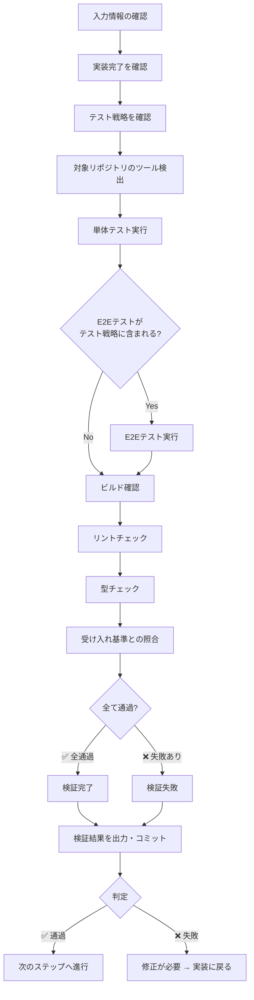

# 検証スキル（verification）

実装完了後の客観検証ステップ。テスト・ビルド・リント・型チェックを実行し結果を出力する。

## 概要

1. **テスト戦略・受け入れ基準・実装内容** を入力として受け取る
2. **テスト戦略に基づくテスト実行**: 定義されたテスト種別（単体/結合/E2E）を全て実行
3. **E2Eテスト実行**: テスト戦略に含まれる場合は必ず実行
4. **ビルド確認** / **リントチェック** / **型チェック**
5. **受け入れ基準との照合**: 各基準を検証結果と照合
6. **検証結果を出力**（レポート生成・コミット）

## 入力（全て必須）

| 入力 | 説明 |
|------|------|
| テスト戦略 | テスト種別スコープ（unit / integration / e2e） |
| 受け入れ基準 | 検証すべき基準一覧と検証手段の対応 |
| 対象コードベース | 対象ディレクトリのパス |
| 実装状況 | 実装完了の確認（未完了なら検証を開始しない） |

## 処理フロー

```mermaid
flowchart TD
    A[入力情報の確認] --> B[実装完了を確認]
    B --> B2[テスト戦略を確認]
    B2 --> C[対象リポジトリのツール検出]
    C --> D[単体テスト実行]
    D --> D2{E2Eテストが<br/>テスト戦略に含まれる?}
    D2 -->|Yes| D3[E2Eテスト実行]
    D2 -->|No| E[ビルド確認]
    D3 --> E[ビルド確認]
    E --> F[リントチェック]
    F --> G[型チェック]
    G --> G2[受け入れ基準との照合]
    G2 --> H{全て通過?}
    H -->|✅ 全通過| I[検証完了]
    H -->|❌ 失敗あり| J[検証失敗]
    I --> K[検証結果を出力・コミット]
    J --> K
    K --> L{判定}
    L -->|✅ 通過| M[次のステップへ進行]
    L -->|❌ 失敗| N[修正が必要 → 実装に戻る]
```

## 検証項目

テスト戦略で定義されたテスト種別を全て実行する：
- **unit**: 単体テスト / **integration**: 結合テスト / **e2e**: E2Eテスト

⚠️ **E2Eテストがスコープに含まれる場合は必ず実行すること。** スキップして検証完了にしてはならない。

📖 ツール検出・実行コマンドの詳細は [references/tool-detection-commands.md](references/tool-detection-commands.md) を参照

## 受け入れ基準との照合

各基準について検証した証拠を記録する。E2Eでしか検証できない項目が未実施なら `NOT_VERIFIED` として記録。

📖 照合の例・制約の詳細は [references/acceptance-criteria-guide.md](references/acceptance-criteria-guide.md) を参照

## 出力

検証結果をレポート（Markdown）と構造化サマリーで出力し、コミットする。

📖 レポートテンプレート・サマリー構造は [references/verification-report-template.md](references/verification-report-template.md) を参照

📖 コミット手順・エラーメッセージは [references/commit-and-error-handling.md](references/commit-and-error-handling.md) を参照

## 関連スキル

- 前提: 実装スキル（検証対象を生成）
- 後続: コードレビュースキル（検証通過後に進行）
- 品質ルール: `verification-before-completion` — 完了前検証の汎用ルール
- 品質ルール: `test-driven-development` — TDDサイクル
