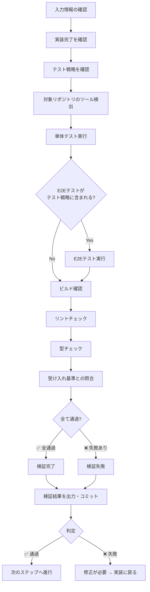

# 検証スキル（verification）

実装完了後に実施する自動化可能な客観検証ステップです。テスト・ビルド・リント・型チェックを実行し、その結果を出力します。

## 概要

このスキルは以下を実現します：

1. **テスト戦略・受け入れ基準・実装内容** を入力として受け取る
2. **テスト戦略に基づくテスト実行**: 定義されたテスト種別（単体/結合/E2E）を全て実行
3. **E2Eテスト実行**: テスト戦略に E2E が含まれる場合は必ず実行
4. **ビルド確認**: ビルドが成功するか確認
5. **リントチェック**: リンターを実行しエラーがないか確認
6. **型チェック**: 型チェッカーを実行し型エラーがないか確認
7. **受け入れ基準との照合**: 各基準を検証結果と照合
8. **検証結果を出力**（レポート生成・コミット）

## 入力

このスキルは以下の情報を受け取って動作します。呼び出し元が適切な手段で提供してください。

### 1. テスト戦略（必須）

検証対象のテスト種別スコープ。以下のいずれかを含む：
- **unit** — 単体テスト
- **integration** — 結合テスト
- **e2e** — E2Eテスト（含まれる場合は実行方法・対象環境も必要）

### 2. 受け入れ基準（必須）

検証すべき受け入れ基準の一覧。各基準について、どの検証手段（テスト/ビルド/手動確認）で検証するかを照合する。

### 3. 対象コードベース（必須）

テスト・ビルド・リントの対象となる実装済みコード。対象ディレクトリのパスを指定する。

### 4. 実装状況（必須）

実装が完了していることの確認。実装未完了の場合は検証を開始しない。

## 処理フロー


```mermaid
flowchart TD
    A[入力情報の確認] --> B[実装完了を確認]
    B --> B2[テスト戦略を確認]
    B2 --> C[対象リポジトリのツール検出]
    C --> D[単体テスト実行]
    D --> D2{E2Eテストが<br/>テスト戦略に含まれる?}
    D2 -->|Yes| D3[E2Eテスト実行]
    D2 -->|No| E[ビルド確認]
    D3 --> E[ビルド確認]
    E --> F[リントチェック]
    F --> G[型チェック]
    G --> G2[受け入れ基準との照合]
    G2 --> H{全て通過?}
    H -->|✅ 全通過| I[検証完了]
    H -->|❌ 失敗あり| J[検証失敗]
    I --> K[検証結果を出力・コミット]
    J --> K
    K --> L{判定}
    L -->|✅ 通過| M[次のステップへ進行]
    L -->|❌ 失敗| N[修正が必要 → 実装に戻る]
```

## 検証項目

### テスト戦略に基づくテスト実行（必須）

テスト戦略で定義されたテスト種別を全て実行する。

- **unit**: 単体テストを実行（下記のツール検出と実行を使用）
- **integration**: 結合テストを実行（プロジェクト固有のコマンドを使用）
- **e2e**: E2Eテストを実行（テスト戦略で定義された実行方法に基づく）

⚠️ **E2Eテストがスコープに含まれる場合は必ず実行すること。** E2Eテストをスキップして検証を完了にしてはならない。

### ツール検出と実行

プロジェクト内で利用可能なツールを検出し実行します。

```bash
# テスト実行
test -f package.json && npm test
test -f pytest.ini && python -m pytest
test -f go.mod && go test ./...
test -f Cargo.toml && cargo test
test -f *.csproj && dotnet test
test -f Makefile && make test

# ビルド確認
test -f package.json && npm run build
test -f go.mod && go build ./...
test -f Cargo.toml && cargo build
test -f *.csproj && dotnet build

# リントチェック
test -f .eslintrc* && npx eslint .
test -f .flake8 && python -m flake8
test -f .golangci.yml && golangci-lint run
test -f Cargo.toml && cargo clippy

# 型チェック
test -f tsconfig.json && npx tsc --noEmit
test -f mypy.ini && python -m mypy .
```

## 受け入れ基準との照合（必須）

検証の最後に、受け入れ基準の各項目について、実際に検証した証拠を記録する。

例:
- 「ILoggerでログ出力するとCloudWatch Logsに振り分けられる」→ E2Eテストで検証済み
- 「xUnit 単体テストが通過する」→ 単体テスト28件全通過

⚠️ **重要**: 受け入れ基準の中に E2E テストでしか検証できない項目があるにも関わらず、E2E テストが未実施の場合は、検証を完了にしてはならない。該当項目を `NOT_VERIFIED` として記録し、ユーザーに報告すること。

## 出力

### 検証結果レポート

検証結果を以下のフォーマットでレポートとして出力する。

```markdown
# 検証結果

## 検証情報
- プロジェクト: {project_name}
- 検証日時: {timestamp}
- テスト戦略スコープ: {test_scope}

## 単体テスト実行結果
- **ステータス**: ✅ PASS / ❌ FAIL
- **詳細**: {passed} passed, {failed} failed
- **カバレッジ**: {coverage}%

## E2Eテスト実行結果（テスト戦略に含まれる場合）
- **ステータス**: ✅ PASS / ❌ FAIL / ⚠️ NOT_EXECUTED
- **実行方法**: {e2e_method}
- **対象環境**: {e2e_environment}
- **詳細**: {detail}

## ビルド確認
- **ステータス**: ✅ PASS / ❌ FAIL
- **詳細**: {detail}

## リントチェック
- **ステータス**: ✅ PASS / ❌ FAIL
- **詳細**: {detail}

## 型チェック
- **ステータス**: ✅ PASS / ❌ FAIL
- **詳細**: {detail}

## 受け入れ基準 照合結果

| 基準 | 検証方法 | 結果 |
|------|----------|------|
| {criteria_1} | {unit_test/e2e_test/manual} | ✅ PASS / ❌ FAIL / ⚠️ NOT_VERIFIED |
| {criteria_2} | {unit_test/e2e_test/manual} | ✅ PASS / ❌ FAIL / ⚠️ NOT_VERIFIED |

## 総合結果
- **判定**: ✅ 全通過 / ❌ 失敗あり / ⚠️ 未検証項目あり
```

### 検証結果サマリー

以下の情報を構造化データとして出力する：

| フィールド | 説明 |
|---|---|
| `status` | `completed` または `failed` |
| `results.test` | テスト結果（status, detail, coverage） |
| `results.build` | ビルド結果（status, detail） |
| `results.lint` | リント結果（status, detail） |
| `results.typecheck` | 型チェック結果（status, detail） |
| `acceptance_criteria_check` | 各受け入れ基準の照合結果 |
| `summary` | 検証結果の要約テキスト |

## コミット

```bash
git add docs/
git commit -m "docs: 検証結果を記録

- テスト: {test_status}
- ビルド: {build_status}
- リント: {lint_status}
- 型チェック: {typecheck_status}"
```

## エラーハンドリング

### 実装が完了していない

```
エラー: 実装が完了していません。
実装を完了してから検証を実行してください。
```

### テスト失敗時

```
検証失敗: テスト {failed_count}件 失敗
修正が必要です。実装に戻って修正してください。
```

## 関連スキル

- 前提: 実装スキル（検証対象を生成）
- 後続: コードレビュースキル（検証通過後に進行）
- 品質ルール: `verification-before-completion` — 完了前検証の汎用ルール
- 品質ルール: `test-driven-development` — TDDサイクル
