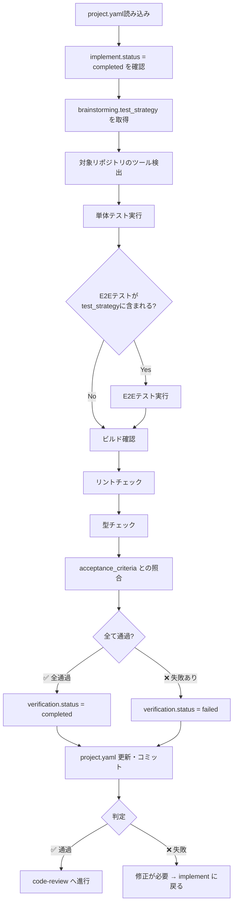

# 検証スキル（verification）

implement 完了後、code-review 前に実施する自動化可能な客観検証ステップです。テスト・ビルド・リント・型チェックを実行し、その結果を記録します。

> **SSOT**: `project.yaml` を全プロセスの Single Source of Truth として使用します。
> - 実装状況の参照: `implement` セクション
> - 検証結果の出力: `verification` セクション

## 概要

このスキルは以下を実現します：

1. **project.yaml** から対象リポジトリ・実装状況を取得
2. **project.yaml の `brainstorming.test_strategy`** からテスト範囲を取得し、定義された全テスト種別を実行
3. **テスト実行**: プロジェクトのテストスイートを実行（単体テスト）
4. **E2Eテスト実行**: test_strategy に E2E が含まれる場合は必ず実行
5. **ビルド確認**: ビルドが成功するか確認
6. **リントチェック**: リンターを実行しエラーがないか確認
7. **型チェック**: 型チェッカーを実行し型エラーがないか確認
8. **acceptance_criteria との照合**: `setup.description.acceptance_criteria` の各項目を検証結果と照合
9. **project.yaml の verification セクション** を更新してコミット

## 入力

### 1. project.yaml（必須・SSOT）

```bash
# 前提条件の確認（yq 使用）
IMPL_STATUS=$(yq '.implement.status' project.yaml)
if [ "$IMPL_STATUS" != "completed" ]; then
    echo "Error: implement.status が completed ではありません（現在: $IMPL_STATUS）"
    exit 1
fi

# メタ情報の取得
TICKET_ID=$(yq '.meta.ticket_id' project.yaml)
TARGET_REPO=$(yq '.meta.target_repo' project.yaml)

# テスト戦略の取得（必須）
TEST_SCOPE=$(yq '.brainstorming.test_strategy.scope[]' project.yaml)
echo "テスト戦略スコープ: $TEST_SCOPE"

# acceptance_criteria の取得
ACCEPTANCE_CRITERIA=$(yq '.setup.description.acceptance_criteria[]' project.yaml)
echo "受け入れ基準: $ACCEPTANCE_CRITERIA"
```

### 2. submodules/{target_repo}/（実装済みコード）

テスト・ビルド・リントの対象となるコードベース。

## 処理フロー



## 検証項目

### テスト戦略に基づくテスト実行（必須）

`brainstorming.test_strategy.scope` に定義されたテスト種別を全て実行する。

```bash
# テスト戦略スコープの確認
TEST_SCOPE=$(yq '.brainstorming.test_strategy.scope[]' project.yaml 2>/dev/null)

# スコープに応じたテスト実行
for scope in $TEST_SCOPE; do
    case $scope in
        unit)
            echo "=== 単体テスト実行 ==="
            # 下記のツール検出と実行を使用
            ;;
        integration)
            echo "=== 結合テスト実行 ==="
            # プロジェクト固有の結合テストコマンドを実行
            ;;
        e2e)
            echo "=== E2Eテスト実行 ==="
            # brainstorming.test_strategy.e2e.method に基づいて実行
            E2E_METHOD=$(yq '.brainstorming.test_strategy.e2e.method' project.yaml)
            echo "E2E実行方法: $E2E_METHOD"
            ;;
    esac
done
```

⚠️ **E2Eテストがスコープに含まれる場合は必ず実行すること。** E2Eテストをスキップして verification を完了にしてはならない。

### ツール検出と実行

プロジェクト内で利用可能なツールを検出し実行します。

```bash
# テスト実行
test -f package.json && npm test
test -f pytest.ini && python -m pytest
test -f go.mod && go test ./...
test -f Cargo.toml && cargo test
test -f *.csproj && dotnet test
test -f Makefile && make test

# ビルド確認
test -f package.json && npm run build
test -f go.mod && go build ./...
test -f Cargo.toml && cargo build
test -f *.csproj && dotnet build

# リントチェック
test -f .eslintrc* && npx eslint .
test -f .flake8 && python -m flake8
test -f .golangci.yml && golangci-lint run
test -f Cargo.toml && cargo clippy

# 型チェック
test -f tsconfig.json && npx tsc --noEmit
test -f mypy.ini && python -m mypy .
```

## acceptance_criteria との照合（必須）

検証の最後に、`setup.description.acceptance_criteria` の各項目について、実際に検証した証拠を記録する。

```bash
# acceptance_criteria の取得
CRITERIA=$(yq '.setup.description.acceptance_criteria[]' project.yaml)

# 各基準について検証結果を記録
# 例:
# - "ILoggerでログ出力するとCloudWatch Logsに振り分けられる" → E2Eテストで検証済み
# - "xUnit 単体テストが通過する" → 単体テスト28件全通過
```

### 照合結果の記録

```bash
# verification セクションに照合結果を記録
yq -i '.verification.acceptance_criteria_check = [
  {"criteria": "基準1", "verified_by": "unit_test", "result": "pass"},
  {"criteria": "基準2", "verified_by": "e2e_test", "result": "pass"}
]' project.yaml
```

⚠️ **重要**: acceptance_criteria の中に E2E テストでしか検証できない項目があるにも関わらず、E2E テストが未実施の場合は、verification を完了にしてはならない。該当項目を `result: "not_verified"` として記録し、ユーザーに報告すること。

## project.yaml 更新内容

`project.yaml` の `verification` セクションを yq で更新：

```bash
# verification セクションの初期化（ヘルパー使用）
./scripts/project-yaml-helper.sh init-section verification

# ステータスとタイムスタンプ
yq -i '.verification.status = "completed"' project.yaml  # または "failed"
yq -i ".verification.started_at = \"$(date -Iseconds)\"" project.yaml
yq -i ".verification.completed_at = \"$(date -Iseconds)\"" project.yaml

# 各検証結果を記録
yq -i '.verification.results.test.status = "pass"' project.yaml
yq -i '.verification.results.test.detail = "42 passed, 0 failed"' project.yaml
yq -i '.verification.results.test.coverage = "85%"' project.yaml
yq -i '.verification.results.build.status = "pass"' project.yaml
yq -i '.verification.results.build.detail = "Build succeeded"' project.yaml
yq -i '.verification.results.lint.status = "pass"' project.yaml
yq -i '.verification.results.lint.detail = "No errors"' project.yaml
yq -i '.verification.results.typecheck.status = "pass"' project.yaml
yq -i '.verification.results.typecheck.detail = "No type errors"' project.yaml

# サマリーと成4物
yq -i '.verification.summary = "全検証通過。テスト42件パス、カバレッジ85%。"' project.yaml
yq -i ".verification.artifacts = [\"docs/${TARGET_REPO}/verification/results.md\"]" project.yaml

# meta.updated_at を更新
yq -i ".meta.updated_at = \"$(date -Iseconds)\"" project.yaml
```

またはヘルパーの update コマンドで簡易更新：

```bash
./scripts/project-yaml-helper.sh update verification --status completed \
  --summary "全検証通過"
```

## 出力ファイル構成

```
docs/
└── {target_repository}/
    └── verification/
        └── results.md              # 検証結果レポート
```

### results.md フォーマット

```markdown
# 検証結果

## 検証情報
- チケット: {ticket_id}
- リポジトリ: {target_repo}
- 検証日時: {timestamp}
- テスト戦略スコープ: {test_strategy.scope}

## 単体テスト実行結果
- **ステータス**: ✅ PASS / ❌ FAIL
- **詳細**: {passed} passed, {failed} failed
- **カバレッジ**: {coverage}%

## E2Eテスト実行結果（test_strategy に含まれる場合）
- **ステータス**: ✅ PASS / ❌ FAIL / ⚠️ NOT_EXECUTED
- **実行方法**: {e2e.method}
- **対象環境**: {e2e.environment}
- **詳細**: {detail}

## ビルド確認
- **ステータス**: ✅ PASS / ❌ FAIL
- **詳細**: {detail}

## リントチェック
- **ステータス**: ✅ PASS / ❌ FAIL
- **詳細**: {detail}

## 型チェック
- **ステータス**: ✅ PASS / ❌ FAIL
- **詳細**: {detail}

## acceptance_criteria 照合結果

| 基準 | 検証方法 | 結果 |
|------|----------|------|
| {criteria_1} | {unit_test/e2e_test/manual} | ✅ PASS / ❌ FAIL / ⚠️ NOT_VERIFIED |
| {criteria_2} | {unit_test/e2e_test/manual} | ✅ PASS / ❌ FAIL / ⚠️ NOT_VERIFIED |

## 総合結果
- **判定**: ✅ 全通過 / ❌ 失敗あり / ⚠️ 未検証項目あり
```

## コミット

```bash
git add docs/ project.yaml
git commit -m "docs: {ticket_id} 検証結果を記録

- テスト: {test_status}
- ビルド: {build_status}
- リント: {lint_status}
- 型チェック: {typecheck_status}"
```

## エラーハンドリング

### 実装が完了していない

```
エラー: 実装が完了していません
project.yaml の implement.status が completed ではありません。

implementスキルで実装を完了してください。
```

### テスト失敗時

```
検証失敗: テスト {failed_count}件 失敗
修正が必要です。implement に戻って修正してください。
```

## 関連スキル

- 前提スキル: `implement` - 実装（検証対象を生成）
- 後続スキル: `code-review` - コードレビュー（検証通過後に進行）
- 品質ルール: `verification-before-completion` - 完了前検証の汎用ルール
- 品質ルール: `test-driven-development` - TDDサイクル

## SSOT参照

| project.yaml フィールド | 用途                                   |
| ----------------------- | -------------------------------------- |
| `implement.status`      | 実装完了の確認（completed であること） |
| `verification` (出力)   | 検証結果の記録                         |
| `verification.results`  | 各検証項目の結果                       |
