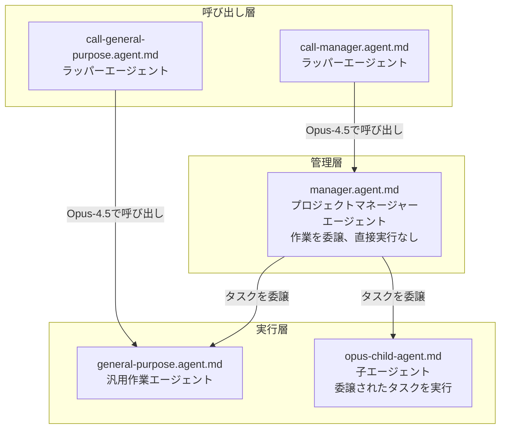

# エージェントシステムドキュメント

このドキュメントは、本リポジトリで使用される階層的なエージェントシステムについて説明します。

## エージェント階層



## エージェントの役割

| エージェント | ファイル | 目的 | 主要な制約 |
|-------|------|---------|----------------|
| **call-manager** | `call-manager.agent.md` | Opus-4.5モデルでマネージャーエージェントを呼び出すラッパー | - |
| **manager** | `manager.agent.md` | プロジェクトマネージャー - 委譲を通じて作業を調整 | **直接作業禁止**: コードやファイルの編集不可（ディレクトリ作成を除く） |
| **call-general-purpose** | `call-general-purpose.agent.md` | 汎用エージェントを呼び出すラッパー | - |
| **general-purpose** | `general-purpose.agent.md` | 親から委譲されたタスクを実行する作業エージェント | プロセス固有のスキルに従う |
| **opus-child-agent** | `opus-child-agent.md` | 委譲されたタスクを完了する子エージェント | **親の情報を信頼**: パス/環境変数の再検証なし |

## プロセスフロー

マネージャーエージェントは構造化されたプロセスフローに従います：

1. **調査** → 2. **設計** → 3. **計画** → 4. **実行**

各プロセスは専用ディレクトリに特定の成果物を生成します。

## 主要原則

### マネージャーエージェント
- **委譲のみ**: すべての作業は子エージェントに委譲する必要があります
- **追跡**: すべての進捗を実行履歴に記録します
- **パス管理**: すべての出力ディレクトリを事前作成し、絶対パスを子エージェントに提供します

### 子エージェント
- **親の情報を信頼**: 提供されたパスと環境変数をそのまま使用します
- **再検証禁止**: 環境変数の確認やパスの変換を行いません
- **成果物出力**: 要件に従ってプロセス固有のドキュメントを生成します

## パス処理ルール

### 親（マネージャー）エージェント向け
1. 子に渡す前にすべての環境変数を解決する
2. 絶対パスのみを提供する
3. 出力ディレクトリを事前作成する

### 子エージェント向け
1. **提供されたパスをそのまま使用** - 変換や解決を行わない
2. **実行禁止**: `echo $DOCS_ROOT`、`echo $HOME`、`echo $PWD`
3. **変換禁止**: 絶対パスから相対パス、またはその逆

## ドキュメント出力標準

すべてのマークダウンドキュメントにはフロントマターを含める必要があります：

```yaml
---
sidebar_position: {unix_timestamp}
date: {ISO_8601_datetime}
---
```

ドキュメント作成時にシェルコマンドを実行してタイムスタンプ値を生成します：
- sidebar_position用に `date +%s`
- dateフィールド用に `date -Iseconds`

## プロセス別成果物

| プロセス | デフォルト出力ファイル |
|---------|---------------------|
| 調査 | `調査レポート.md` |
| 設計 | `設計書.md` |
| 計画 | `計画書.md` |
| 実行 | `実装レポート.md` |

詳細なテンプレートと内容要件については、子エージェントに提供されるシステムドキュメントを参照してください。

## 関連ドキュメント

- **README.md** - プロジェクト全体の概要
- **CLUADE.md** - 詳細なワークフロー図とスキル定義
- `/.github/agents/` のエージェント定義ファイル
- `/.claude/skills/` のスキル定義
