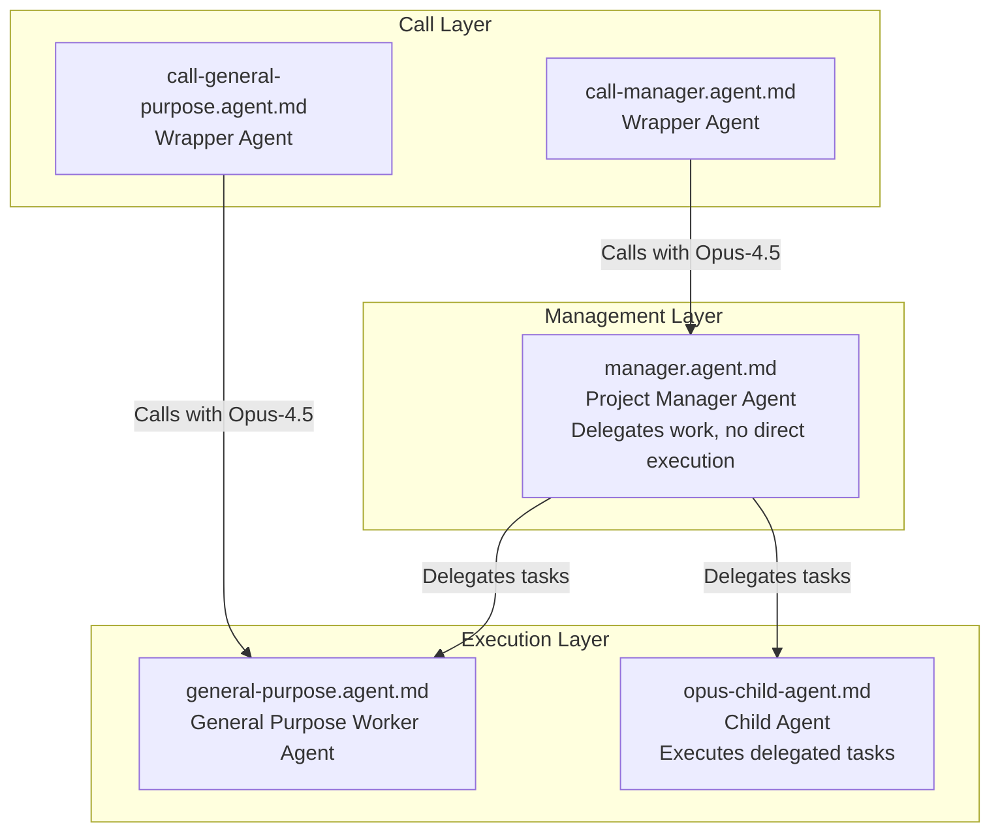

# Agent System Documentation

This document describes the hierarchical agent system used for task management and execution in this repository.

## Agent Hierarchy



## Agent Roles

| Agent | File | Purpose | Key Constraints |
|-------|------|---------|----------------|
| **call-manager** | `call-manager.agent.md` | Wrapper to invoke manager agent with Opus-4.5 model | - |
| **manager** | `manager.agent.md` | Project Manager - orchestrates work through delegation | **NO direct work**: Cannot edit code or files (except directory creation) |
| **call-general-purpose** | `call-general-purpose.agent.md` | Wrapper to invoke general-purpose agent | - |
| **general-purpose** | `general-purpose.agent.md` | Worker agent that executes tasks delegated from parent | Follows process-specific skills |
| **opus-child-agent** | `opus-child-agent.md` | Child agent that completes delegated tasks | **Trusts parent info**: No re-verification of paths/env vars |

## Process Flow

The manager agent follows a structured process flow:

1. **Investigation** → 2. **Design** → 3. **Planning** → 4. **Execution**

Each process generates specific deliverables in dedicated directories.

## Key Principles

### Manager Agent
- **Delegation-only**: All work must be delegated to child agents
- **Tracking**: Records all progress in execution history
- **Path Management**: Pre-creates all output directories and provides absolute paths to child agents

### Child Agents
- **Trust parent information**: Use provided paths and environment variables as-is
- **No re-verification**: Do NOT check environment variables or transform paths
- **Output deliverables**: Generate process-specific documentation per requirements

## Path Handling Rules

### For Parent (Manager) Agents
1. Resolve all environment variables before passing to children
2. Provide absolute paths only
3. Pre-create output directories

### For Child Agents
1. **Use paths as provided** - no transformation or resolution
2. **Do NOT execute**: `echo $DOCS_ROOT`, `echo $HOME`, `echo $PWD`
3. **Do NOT convert**: Absolute paths to relative paths or vice versa

## Document Output Standards

All markdown documents must include frontmatter:

```yaml
---
sidebar_position: {unix_timestamp}
date: {ISO_8601_datetime}
---
```

Generate timestamp values by executing shell commands at document creation time:
- `date +%s` for sidebar_position
- `date -Iseconds` for date field

## Deliverables by Process

| Process | Default Output Files |
|---------|---------------------|
| Investigation | `調査レポート.md` |
| Design | `設計書.md` |
| Planning | `計画書.md` |
| Execution | `実装レポート.md` |

For detailed templates and content requirements, refer to the system documentation provided to child agents.

## Related Documentation

- **README.md** - General project overview
- **CLUADE.md** - Detailed workflow diagrams and skill definitions
- Agent definition files in `/.github/agents/`
- Skill definitions in `/.claude/skills/`
