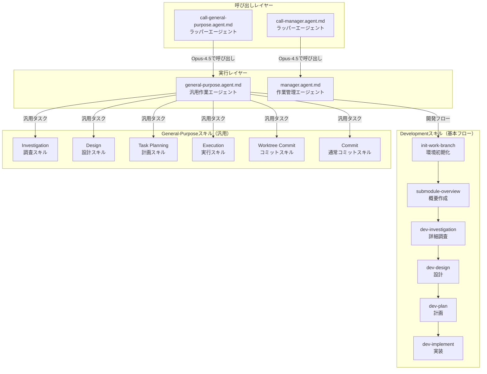
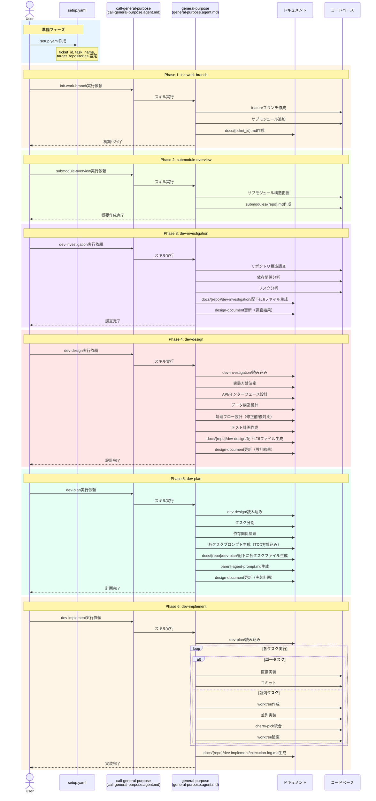
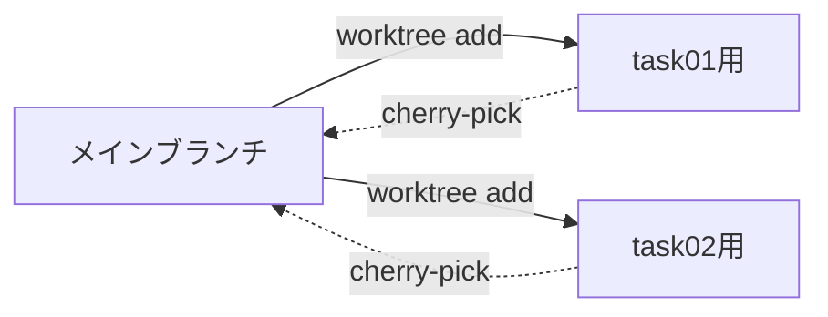
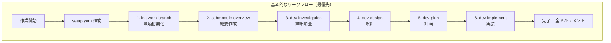

# Development Process Skills

Claude AIエージェント向けの開発プロセススキル集です。体系的な開発フローを通じて、調査・設計・計画・実装を効率的に遂行します。

## プロジェクト概要

### 目的

このリポジトリ（`.claude/skills`）は、Claude AIエージェントが開発タスクを体系的に処理するためのスキル定義を提供します。

### 基本的なワークフロー（最優先）

**開発タスクには以下の6ステップを順番に実行します：**

```
call-general-purpose-agent経由で以下を順番に実行：
1. init-work-branch        - 開発環境初期化
2. submodule-overview      - サブモジュール概要作成
3. dev-investigation       - 詳細調査
4. dev-design             - 設計
5. dev-plan               - 計画（タスク分割、TDDプロンプト生成）
6. dev-implement          - 実装実行
```

各ステップは前のステップの成果物を入力として使用し、体系的にドキュメントを生成しながら開発を進めます。

---

## エージェント構成図



### 各エージェントの役割

| エージェント | ファイル | 役割 |
|-------------|----------|------|
| call-general-purpose | `call-general-purpose.agent.md` | general-purpose-agentを呼び出すラッパー（**推奨**） |
| general-purpose | `general-purpose.agent.md` | 開発スキル・汎用スキルを実行するメインエージェント |
| call-manager | `call-manager.agent.md` | manager-agentを呼び出すラッパー（複雑な並列タスク用） |
| manager | `manager.agent.md` | 作業管理エージェント（PM）。子エージェントに作業を委譲 |

---

## 基本的な開発ワークフロー（シーケンス図）



### 各ステップの概要

| ステップ | スキル | 目的 | 主な成果物 |
|----------|--------|------|------------|
| 1 | init-work-branch | 開発環境初期化 | featureブランチ、`docs/{ticket_id}.md` |
| 2 | submodule-overview | サブモジュール概要作成 | `submodules/{repo}.md` |
| 3 | dev-investigation | 詳細調査 | `docs/{repo}/dev-investigation/` 配下6ファイル |
| 4 | dev-design | 設計 | `docs/{repo}/dev-design/` 配下6ファイル |
| 5 | dev-plan | 計画（TDDプロンプト生成） | `docs/{repo}/dev-plan/` 配下タスクファイル |
| 6 | dev-implement | 実装実行 | コード変更、`docs/{repo}/dev-implement/execution-log.md` |

---

## 各プロセスの詳細

### 調査プロセス（Investigation）

| 項目 | 内容 |
|------|------|
| **目的** | 既存コードベース、要件、リスクを把握する |
| **スキル** | `/.claude/skills/general-purpose/investigation/SKILL.md` |
| **入力（前提条件）** | リクエスト内容、リポジトリアクセス |
| **出力（成果物）** | `investigation-report.md`, `risk-analysis.md` |

**成果物の内容:**

- `investigation-report.md`: 構造概要、関連ファイル一覧、既存パターン、依存関係
- `risk-analysis.md`: 特定されたリスク、影響度・発生可能性、緩和策

---

### 設計プロセス（Design）

| 項目 | 内容 |
|------|------|
| **目的** | ソリューションのアーキテクチャを決定する |
| **スキル** | `/.claude/skills/general-purpose/design/SKILL.md` |
| **入力（前提条件）** | `investigation-report.md`（調査結果） |
| **出力（成果物）** | `design-document.md`, `interface-spec.md`, `data-structure.md`, `flow-diagram.md` |

**成果物の内容:**

- `design-document.md`: 設計書（全体）- 実装方針、コンポーネント設計、非機能要件対応
- `interface-spec.md`: API・インターフェース仕様
- `data-structure.md`: エンティティ、型定義、DBスキーマ
- `flow-diagram.md`: シーケンス図、フローチャート、状態遷移図

---

### 計画プロセス（Task Planning）

| 項目 | 内容 |
|------|------|
| **目的** | 実行可能なタスク計画を作成する |
| **スキル** | `/.claude/skills/general-purpose/task-planning/SKILL.md` |
| **入力（前提条件）** | `design-document.md`（設計結果） |
| **出力（成果物）** | `task-plan.md`, `dependency-graph.md`, `parallel-groups.md` |

**成果物の内容:**

- `task-plan.md`: タスク一覧、作業内容、完了条件、推定時間
- `dependency-graph.md`: タスク間の依存関係（mermaid図）
- `parallel-groups.md`: 並列実行可能なタスクグループ定義

---

### 実行プロセス（Execution）

| 項目 | 内容 |
|------|------|
| **目的** | 計画に従ってタスクを実行する |
| **スキル** | `/.claude/skills/general-purpose/execution/SKILL.md` |
| **入力（前提条件）** | `task-plan.md`（計画結果） |
| **出力（成果物）** | 各タスクごとの `result.md` |

**成果物の内容:**

- `result.md`: 実装完了状況、変更ファイル一覧、テスト結果、コミットハッシュ

---

## ディレクトリ構造とファイル一覧

### スキル定義ファイル（`/.claude/skills/`配下）

```
.claude/skills/
├── README.md                           # このファイル
├── commit/
│   └── SKILL.md                        # 通常のgitコミットスキル
├── development/                        # 開発プロセススキル（基本フロー）
│   ├── init-work-branch/               # 環境初期化
│   ├── submodule-overview/             # 概要作成
│   ├── dev-investigation/              # 詳細調査
│   ├── dev-design/                     # 設計
│   ├── dev-plan/                       # 計画
│   ├── dev-implement/                  # 実装
│   └── commit-multi-repo/              # マルチリポジトリコミット
└── general-purpose/                    # 汎用スキル
    ├── investigation/                  # 調査プロセス
    ├── design/                         # 設計プロセス
    ├── task-planning/                  # 計画プロセス
    ├── execution/                      # 実行プロセス
    └── worktree-commit/                # worktreeコミット
```

### 各スキルの役割

| カテゴリ | スキル | 役割 |
|----------|--------|------|
| **Development（基本）** | init-work-branch | featureブランチ作成、サブモジュール追加、設計ドキュメント初期化 |
| | submodule-overview | サブモジュールの構造概要作成 |
| | dev-investigation | 6ファイル構成の詳細調査 |
| | dev-design | 6ファイル構成の設計ドキュメント |
| | dev-plan | タスク分割、TDDプロンプト生成 |
| | dev-implement | 計画に基づく実装実行 |
| | commit-multi-repo | マルチリポジトリ環境でのコミット |
| **General-Purpose（汎用）** | investigation | 汎用的な調査ガイド |
| | design | 汎用的な設計ガイド |
| | task-planning | タスク分割・依存関係整理 |
| | execution | worktree管理、実行ガイド |
| | worktree-commit | worktree環境でのコミット |
| **Commit** | SKILL.md | チケット連携・日本語コミットメッセージ生成 |

---

## 補足：manager-agentによる並列実行

`call-general-purpose-manager-agent` を使用する場合、以下のフォルダ構造とworktree管理が適用されます。

### リクエストフォルダ構造

```
{出力先ディレクトリ}/
└── YYYYMMDD-HHMM-{リクエスト名}/
    ├── 実行履歴.md              # リクエスト進行状況の記録
    ├── 01_調査/
    ├── 02_設計/
    ├── 03_計画/
    └── 04_実行/
```

### Worktree管理

並列実行時はgit worktreeを活用し、各タスクを独立したブランチで実行します。完了後にcherry-pickで統合します。



---

## 使用方法

### 基本的なワークフロー（最優先）

**新機能開発や複雑なタスクには、development スキルの6ステップを順番に実行します。**



#### Step 1: setup.yamlの作成

```bash
# テンプレートをコピー
cp setup-template.yaml setup.yaml

# 内容を編集
vim setup.yaml
```

```yaml
# setup.yaml の例
ticket_id: "PROJ-123"
task_name: "ユーザー認証機能の追加"
description: "OAuth2.0を使用したユーザー認証機能を実装する"
target_repositories:
  - name: "backend-api"
    url: "git@github.com:org/backend-api.git"
    base_branch: "main"
related_repositories:
  - name: "auth-library"
    url: "git@github.com:org/auth-library.git"
options:
  submodules_dir: "submodules"
  design_document_dir: "docs"
```

#### Step 2: 各スキルの実行

```
# Phase 1: 開発環境初期化
call-general-purpose-agentを使用して、init-work-branchスキルでsetup.yamlから初期化してください。

# Phase 2: サブモジュール概要作成
call-general-purpose-agentを使用して、submodule-overviewスキルで概要を作成してください。

# Phase 3: 詳細調査
call-general-purpose-agentを使用して、dev-investigationスキルで調査を実行してください。

# Phase 4: 設計
call-general-purpose-agentを使用して、dev-designスキルで設計を実行してください。

# Phase 5: 計画
call-general-purpose-agentを使用して、dev-planスキルで計画を作成してください。

# Phase 6: 実装
call-general-purpose-agentを使用して、dev-implementスキルで実装を実行してください。
```

### 成果物一覧

| フェーズ | 成果物 | 出力先 |
|----------|--------|--------|
| init-work-branch | 設計ドキュメント | `docs/{ticket_id}.md` |
| submodule-overview | サブモジュール概要 | `submodules/{repo}.md` |
| dev-investigation | アーキテクチャ調査等 | `docs/{repo}/dev-investigation/` 配下6ファイル |
| dev-design | 設計ドキュメント | `docs/{repo}/dev-design/` 配下6ファイル |
| dev-plan | タスク計画・プロンプト | `docs/{repo}/dev-plan/` 配下 |
| dev-implement | 実行ログ | `docs/{repo}/dev-implement/execution-log.md` |

---

## 補足的な使用方法

### 簡単な作業向け（call-general-purpose-agent）

単純なタスクを直接実行するワークフローです。調査・設計・計画のプロセスを省略し、即座に実装を開始します。

**適用ケース:**
- バグ修正
- ドキュメント更新
- 設定変更
- 小規模な改善

**実行例:**
```
# バグ修正
call-general-purpose-agentを使用して、ログイン画面のバリデーションエラーを修正してください。

# ドキュメント更新
call-general-purpose-agentを使用して、READMEのインストール手順を最新化してください。

# 設定変更
call-general-purpose-agentを使用して、ESLintの設定を厳格化してください。
```

---

### 複雑な並列タスク向け（call-general-purpose-manager-agent）

複数の関連タスクを並列実行で効率的に処理するワークフローです。git worktreeを活用して独立した作業環境を作成し、cherry-pickで統合します。

**適用ケース:**
- 複数APIの同時追加
- 複数モジュールの同時改修
- 並列実装が効率的な場合

**実行例:**
```
# 機能追加
call-general-purpose-manager-agentを使用して、ユーザー管理機能を実装してください。
- ユーザー一覧API
- ユーザー詳細API
- ユーザー更新API

# 複数モジュールの改修
call-general-purpose-manager-agentを使用して、ログ出力を全モジュールに追加してください。
```

---

## ユースケース選択ガイド

| 項目 | 基本ワークフロー | 簡単な作業 | 複雑な並列タスク |
|------|-----------------|------------|------------------|
| **用途** | 新機能開発、複雑なリファクタリング、重大な設計変更 | 単純なタスク、ちょっとした修正 | 複数の関連タスク、並列実装が必要な場合 |
| **エージェント** | development スキル6ステップ | `call-general-purpose-agent` | `call-general-purpose-manager-agent` |
| **ドキュメント** | 調査/設計/計画/実装の全ドキュメント | 最小限 | 実行履歴のみ |
| **並列実行** | ○（worktree管理） | ✕ | ○（worktree管理） |
| **推奨ケース** | 大規模機能開発、アーキテクチャ変更、チーム共有が必要 | バグ修正、設定変更、小規模改善 | 中規模機能追加、複数ファイル同時変更 |

---

## 開発フローの成果物ディレクトリ構造

```
{project-root}/
├── setup.yaml                          # セットアップ定義
├── docs/
│   ├── {ticket_id}.md                  # 設計ドキュメント（全フェーズで更新）
│   └── {target-repo}/                  # フェーズ別成果物
│       ├── dev-investigation/
│       │   ├── 01_architecture.md
│       │   ├── 02_data-structure.md
│       │   ├── 03_dependencies.md
│       │   ├── 04_existing-patterns.md
│       │   ├── 05_integration-points.md
│       │   └── 06_risks-and-constraints.md
│       ├── dev-design/
│       │   ├── 01_implementation-approach.md
│       │   ├── 02_interface-api-design.md
│       │   ├── 03_data-structure-design.md
│       │   ├── 04_process-flow-design.md
│       │   ├── 05_test-plan.md
│       │   └── 06_side-effect-verification.md
│       ├── dev-plan/
│       │   ├── task-list.md
│       │   ├── task01.md
│       │   ├── task02-01.md
│       │   ├── task02-02.md
│       │   └── parent-agent-prompt.md
│       └── dev-implement/
│           └── execution-log.md
└── submodules/
    ├── {target-repo}/                  # 対象リポジトリの作業コピー
    └── {target-repo}.md                # サブモジュール概要（フォルダ単位）
```

---

## 注意事項

### managerエージェントの制約

- **直接作業禁止**: コード編集、ファイル操作は一切行わない（ディレクトリ作成は例外）
- **サブエージェント経由**: 全ての作業を子エージェントに依頼
- **追跡機能**: 実行履歴ファイルで全てのタスクの進行状況を記録
- **出力先明記**: 子エージェントへの依頼には必ず成果物出力先の絶対パスを含める

### コミットに関する制約

- **日本語コミットメッセージ必須**: 全てのコミットメッセージは日本語で記述
- **worktree環境ではpushしない**: プッシュは親エージェントまたはユーザーが実行
