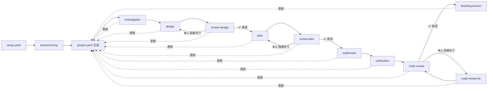
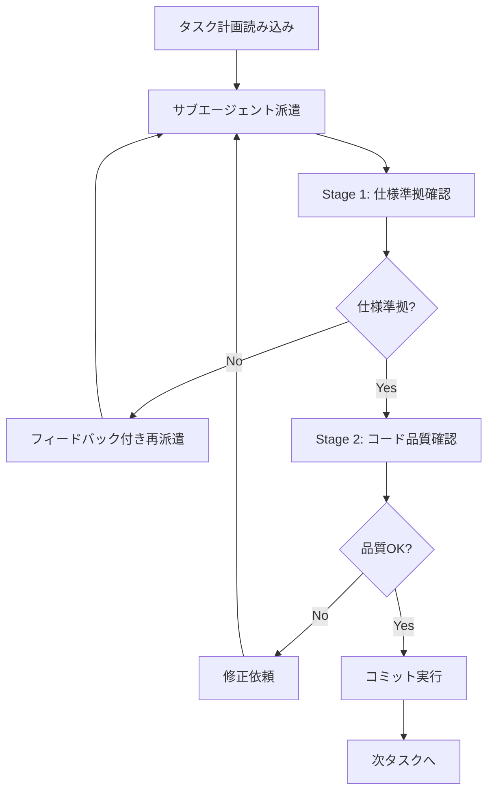
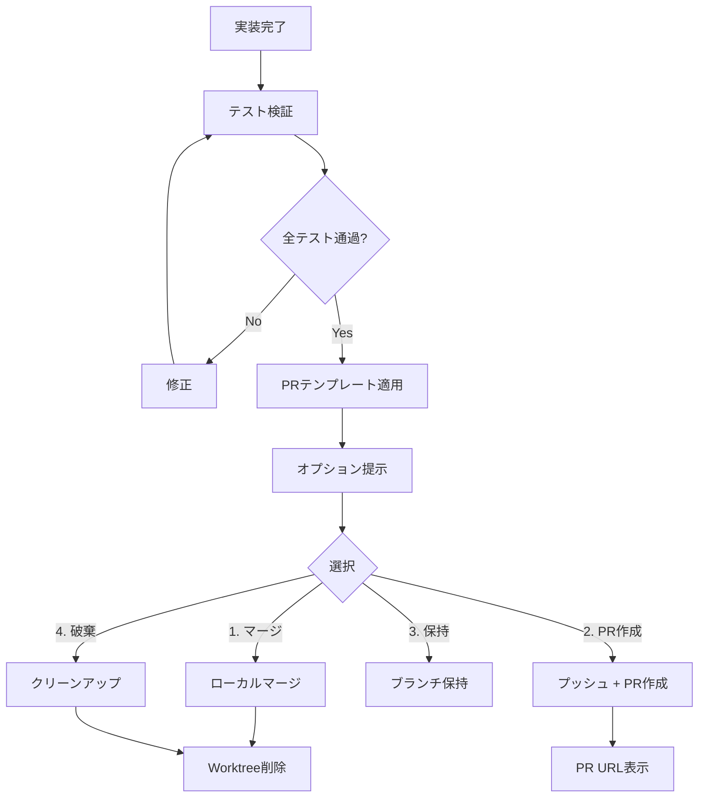

# Development Process Skills

Claude向けの開発プロセス用スキル集とエージェント構成をまとめたリポジトリです。

## プロジェクト概要

本リポジトリは、AIエージェントによる開発プロセスを体系化し、10ステップワークフローで高品質なソフトウェア開発を実現します。

### 主な特徴

- **10ステップワークフロー**: 初期化 → ブレスト → 調査 → 設計 → 計画 → 実装 → 検証 → レビューの体系的プロセス
- **エージェント階層構造**: call-\* ラッパー → 実行エージェント → サブエージェント
- **品質スキル統合**: TDD、検証、デバッグ、コードレビューの組み込み
- **並列実行対応**: 独立タスクの並列処理によるスループット向上

---

## エージェント呼び出しパターン

```
ユーザー
   ↓
call-* ラッパー (Opus-4.6 指定可)
   ↓
実行エージェント (Opus-4.6 指定可)
   ↓
サブエージェント (Opus-4.6 必須)
```

### 呼び出しルール

1. **ユーザーは call-\* ラッパーを呼ぶ**（直接実行エージェントを呼ばない）
2. **call-\* ラッパーと実行エージェントは Opus-4.6 指定可能**
3. **サブエージェント起動時は Opus-4.6 必須**: `model: "claude-opus-4.6"`

```yaml
# サブエージェント起動例
- agent_type: "general-purpose"
  model: "claude-opus-4.6"
  prompt: "タスク内容"
```

---

## 10ステップワークフロー

```mermaid
flowchart LR
    init[1. init-work-branch] --> overview[2. submodule-overview]
    overview --> brainstorm[3. brainstorming]
    brainstorm --> investigation[4. investigation]
    investigation --> design[5. design]
    design --> review_d[5a. review-design]
    review_d --> plan[6. plan]
    plan --> review_p[6a. review-plan]
    review_p --> implement[7. implement]
    implement --> verification[8. verification]
    verification --> code_review[9. code-review]
    code_review --> finish[10. finishing-branch]
    
    review_d -->|❌ 差し戻し| design
    review_p -->|❌ 差し戻し| plan
    code_review -->|❌⚠️ 指摘あり| code_review_fix[9a. code-review-fix]
    code_review_fix --> code_review
```



### 1. init-work-branch（作業ブランチ初期化）

**インプット:**

- `setup.yaml`: プロジェクト設定ファイル（SSOT）

**成果物:**

- `feature/{ticket_id}` ブランチ
- `submodules/{repo_name}/`: サブモジュール追加
- `docs/{ticket_id}.md`: 設計ドキュメント

**説明:**

- `setup.yaml` を読み込み、featureブランチを作成
- 関連・修正対象リポジトリをサブモジュールとして追加
- 設計ドキュメント（`docs/{ticket_id}.md`）を生成

> **Note**: このステップでは `project.yaml` はまだ存在しない（`brainstorming` で生成される）

### 2. submodule-overview（サブモジュール概要作成）

**インプット:**

- `project.yaml`（存在する場合）
- `submodules/{repo_name}/`: サブモジュールディレクトリ
- `submodules/{repo_name}/README.md`: プロジェクト概要
- `submodules/{repo_name}/CLAUDE.md`: Claude向けコンテキスト（任意）
- `submodules/{repo_name}/AGENTS.md`: エージェント向け指示（任意）

**成果物:**

- `submodules/{name}.md`: サブモジュール概要ドキュメント
- `project.yaml` の `overview` セクション更新

**説明:**

- サブモジュールのREADME/CLAUDE.md/AGENTS.mdから情報収集
- 技術スタック、API、依存関係を分析
- `submodules/{name}.md` に概要ドキュメント生成

### 3. brainstorming（要件探索・テスト戦略確認・project.yaml 生成）

**インプット:**

- `setup.yaml`: プロジェクト設定ファイル（ユーザーが作成した一次情報）
- ユーザーとの対話: 意図・要件・背景の聞き取り

**成果物:**

- **`project.yaml`**: 全プロセスの SSOT（`meta`, `setup`, `brainstorming` セクション）
- `docs/{repo}/brainstorming/*.md`: ブレインストーミング詳細ドキュメント

**説明:**

`setup.yaml` を基に `project.yaml` を生成する唯一のプロセスです。ユーザーとの対話により要件の明確化・妥当性評価を行い、機能要件・非機能要件の具体化、技術的制約の確認を実施します。2〜3つのアプローチを提案しトレードオフを説明した上で設計方針を決定し、結果を `project.yaml` の `brainstorming` セクションに記録します。

**テスト戦略の確認（必須）:** テスト範囲（単体テスト/結合テスト/E2Eテスト）を `ask_user` ツールでユーザーに確認し、`test_strategy` として `project.yaml` に記録します。この戦略は以降の design（テスト計画）、plan（E2Eタスク生成）、implement（テスト実行）、verification（acceptance_criteria照合）の全工程で参照されます。

> **Important**: `brainstorming` 以降の全プロセス（investigation, design, plan, implement 等）は `project.yaml` を SSOT として参照・更新します。`setup.yaml` は直接参照しません。

### 4. investigation（詳細調査）

**インプット:**

- `project.yaml`（SSOT — `setup.description.background` を背景情報として参照）
- `submodules/{target_repo}/`: 調査対象リポジトリ

**成果物:**

- `docs/{target_repo}/investigation/01_architecture.md`: アーキテクチャ調査
- `docs/{target_repo}/investigation/02_data-structure.md`: データ構造調査
- `docs/{target_repo}/investigation/03_dependencies.md`: 依存関係調査
- `docs/{target_repo}/investigation/04_existing-patterns.md`: 既存パターン調査
- `docs/{target_repo}/investigation/05_integration-points.md`: 統合ポイント調査
- `docs/{target_repo}/investigation/06_risks-and-constraints.md`: リスク・制約分析
- `project.yaml` の `investigation` セクション更新

**説明:**

- `project.yaml` の `setup.description.background` と `brainstorming.refined_requirements` を参照
- アーキテクチャ、データ構造、依存関係を体系的に調査
- UML図（Mermaid形式）を含む調査結果を生成
- `docs/{target_repo}/investigation/` に出力

### 5. design（設計）

**インプット:**

- `project.yaml`（SSOT — `setup.description.requirements` を設計要件として参照）
- `docs/{target_repo}/investigation/`: 調査結果

**成果物:**

- `docs/{target_repo}/design/01_implementation-approach.md`: 実装方針
- `docs/{target_repo}/design/02_interface-api-design.md`: インターフェース/API設計
- `docs/{target_repo}/design/03_data-structure-design.md`: データ構造設計
- `docs/{target_repo}/design/04_process-flow-design.md`: 処理フロー設計
- `docs/{target_repo}/design/05_test-plan.md`: テスト計画
- `docs/{target_repo}/design/06_side-effect-verification.md`: 弊害検証計画
- `project.yaml` の `design` セクション更新

**説明:**

- `project.yaml` の `investigation` + `brainstorming.decisions` を参照
- 調査結果を基に詳細設計を実施
- API設計、データ構造設計、処理フロー設計
- 修正前/修正後のシーケンス図を作成
- `docs/{target_repo}/design/` に出力

### 6. plan（タスク計画）

**インプット:**

- `project.yaml`（SSOT — `setup.acceptance_criteria` を完了条件基準として参照）
- `docs/{target_repo}/design/`: 詳細設計結果

**成果物:**

- `docs/{target_repo}/plan/task-list.md`: タスク一覧と依存関係
- `docs/{target_repo}/plan/task01.md`, `task02-01.md`, ...: 各タスク用プロンプト
- `docs/{target_repo}/plan/parent-agent-prompt.md`: 親エージェント統合管理プロンプト
- `project.yaml` の `plan` セクション更新

**説明:**

- `project.yaml` の `design.artifacts` パスから設計成果物を読み込み
- 設計からタスクを分割、依存関係を整理
- 各タスク用プロンプト（task0X.md）をTDD方針で生成
- 親エージェント用統合管理プロンプトを生成
- `docs/{target_repo}/plan/` に出力

### 7. implement（実装）

**インプット:**

- `project.yaml`（SSOT — `plan.tasks` からタスク一覧取得、`plan.review.status = approved` が前提）
- `docs/{target_repo}/plan/`: タスク計画（task-list.md, task0X.md, parent-agent-prompt.md）

**成果物:**

- `docs/{target_repo}/implement/execution-log.md`: 実行ログ
- 実装コード（サブモジュール内）
- テストコード（サブモジュール内）
- コミット履歴（各タスク完了時）
- `project.yaml` の `implement` セクション更新

**説明:**

- `project.yaml` の `plan.tasks` からタスク一覧・依存関係を取得
- サブエージェントに実装を依頼（2段階レビュー: 仕様準拠 → コード品質）
- 並列タスクはworktreeを使用して並行実行、cherry-pickで統合
- 各タスク完了時に `project.yaml` の `implement.tasks` を更新
- `docs/{target_repo}/implement/` に実行ログ出力

### 8. verification（検証）

**インプット:**

- `project.yaml`（SSOT — `implement.status = completed` が前提）
- `submodules/{target_repo}/`: 実装済みコード

**成果物:**

- `docs/{target_repo}/verification/results.md`: 検証結果レポート
- `project.yaml` の `verification` セクション更新

**説明:**

- テスト・ビルド・リント・型チェックを実行し、自動化可能な客観検証を実施
- `project.yaml` の `brainstorming.test_strategy` に基づき、定義されたテスト（単体/結合/E2E）をすべて実行
- `setup.acceptance_criteria` の各項目に対して検証方法（単体テスト/E2Eテスト等）と結果を照合し `acceptance_criteria_check` として記録
- 全検証通過で code-review へ進行、失敗時は implement に戻る

### 9. code-review（コードレビュー）

**インプット:**

- `project.yaml`（SSOT — `verification.status = completed` が前提）
- コミット範囲（BASE_SHA..HEAD_SHA）
- `docs/{target_repo}/design/`: 設計成果物（設計準拠性チェック用）

**成果物:**

- `docs/{target_repo}/code-review/round-01.md`（以降 round-02.md, ...）: レビュー結果
- `project.yaml` の `code_review` セクション更新（チェックリスト結果・指摘・ラウンド）

**説明:**

- 8カテゴリのチェックリスト（設計準拠性、静的解析、言語別ベストプラクティス、セキュリティ、テスト・CI、パフォーマンス、ドキュメント、Git作法）でレビューを実施
- プロジェクト内の静的解析ツール（prettier / eslint / black / flake8 等）を検出・実行
- 指摘と修正案の提示が責務（修正自体は code-review-fix が担当）
- `project.yaml` の `code_review.review_checklist` にチェック項目と結果を構造化記録

### 9a. code-review-fix（レビュー指摘修正）

**インプット:**

- `project.yaml`（SSOT — `code_review.issues` から未解決指摘を取得）
- `docs/{target_repo}/code-review/round-{NN}.md`: レビュー結果

**成果物:**

- 修正コード・コミット
- `project.yaml` の `code_review.issues` 更新（fixed / disputed）

**説明:**

- 各指摘を技術的に検証し、妥当な場合は修正、不適切な場合は技術的理由で反論
- 修正後にテスト・リント・型チェックを実行して確認
- 完了後 code-review で再レビュー

### 10. finishing-branch（ブランチ完了）

**インプット:**

- `project.yaml`（SSOT — `code_review.status = approved` が前提）

**成果物:**

- マージ / PR / ブランチ保持 / 破棄
- `project.yaml` の `finishing` セクション更新

**説明:**

- テスト検証後、4つの選択肢を提示（ローカルマージ / PR作成 / ブランチ保持 / 破棄）
- 選択されたワークフローを実行し、worktreeクリーンアップを実施

---

## project.yaml — プロジェクトコンテキストファイル

全プロセスの **SSOT（Single Source of Truth）** として機能するYAMLファイルです。

### 概要

- **生成**: `brainstorming` スキルが `setup.yaml` を基に初期生成
- **更新**: 各プロセスが完了時に自セクションを追記
- **参照**: 以降の全プロセスがこのファイルを入力として使用

### 設計方針

| 方針                   | 説明                                                                   |
| ---------------------- | ---------------------------------------------------------------------- |
| **YAMLはインデックス** | 各プロセスの状態・要約・成果物パスを記録。詳細は外部ドキュメントに委譲 |
| **肥大化防止**         | 各セクションの `summary` は3行以内。詳細は `artifacts` パスで参照      |
| **累積更新**           | 各プロセスは自セクションのみ追記/更新。他セクションは読み取り専用      |
| **setup.yaml互換**     | `meta` + `setup` セクションに setup.yaml の内容をそのまま保持          |

### セクション構成

| プロセス           | project.yaml セクション          | 記録内容                                                         |
| ------------------ | -------------------------------- | ---------------------------------------------------------------- |
| brainstorming      | `meta`, `setup`, `brainstorming` | 要件探索結果、決定事項、テスト戦略                               |
| submodule-overview | `overview`                       | サブモジュール概要                                               |
| investigation      | `investigation`                  | 調査結果、リスク                                                 |
| design             | `design`                         | 設計方針                                                         |
| review-design      | `design.review`                  | 設計レビュー指摘・ラウンド                                       |
| plan               | `plan`                           | タスク一覧、依存関係                                             |
| review-plan        | `plan.review`                    | 計画レビュー指摘・ラウンド                                       |
| implement          | `implement`                      | 実行状況、コミットハッシュ                                       |
| verification       | `verification`                   | テスト・ビルド・リント実行結果、E2E結果、acceptance_criteria照合 |
| code-review        | `code_review`                    | チェックリスト、指摘、ラウンド                                   |
| code-review-fix    | `code_review`                    | 指摘修正記録（同セクション更新）                                 |
| finishing-branch   | `finishing`                      | 最終アクション、PR URL                                           |

### ワークフロー



---

## 追加スキル一覧

### ワークフロー補助スキル

| スキル                   | 説明                                                      |
| ------------------------ | --------------------------------------------------------- |
| **issue-to-setup-yaml**  | Issue 情報から setup.yaml を自動生成                      |
| **commit**               | MCP連携でチケット情報取得し日本語コミットメッセージを生成 |
| **commit-multi-repo**    | 複数リポジトリ（サブモジュール含む）の一括コミット管理    |
| **skill-usage-protocol** | スキル発動ルール・開発フロー全体の定義                    |
| **finishing-branch**     | 実装完了後のマージ/PR/クリーンアップオプション提示        |

### 品質ルール（各ステップ内で適用）

| スキル                             | 説明                                                         |
| ---------------------------------- | ------------------------------------------------------------ |
| **test-driven-development**        | RED-GREEN-REFACTORサイクルでテストファーストの開発を実践     |
| **systematic-debugging**           | 根本原因を特定してから修正する体系的デバッグ手法             |
| **verification-before-completion** | 完了主張前に検証コマンドを実行し証拠を確認（汎用品質ルール） |
| **writing-skills**                 | スキルファイル（SKILL.md）の作成・編集ガイド                 |

### レビュースキル

| スキル              | 説明                                                               |
| ------------------- | ------------------------------------------------------------------ |
| **review-design**   | 設計結果の妥当性をレビュー                                         |
| **review-plan**     | タスク計画の妥当性をレビュー                                       |
| **code-review**     | 実装変更のチェックリストベースレビュー（8カテゴリ・SHAベース差分） |
| **code-review-fix** | コードレビュー指摘の技術的検証・修正対応                           |

---

## 実行例

各スキルは Claude Code セッション内で直接呼び出せます。`skill-usage-protocol` に従い、関連スキルが自動的に発動します。

```bash
# 典型的な開発フロー（セッション内で順次実行）
claude "setup.yaml を使って作業ブランチを初期化してください"    # → init-work-branch
claude "サブモジュールの概要を作成してください"                  # → submodule-overview
claude "ブレストしましょう"                                      # → brainstorming → project.yaml 生成
claude "詳細調査を実行してください"                              # → investigation
claude "設計してください"                                        # → design
claude "設計をレビューしてください"                              # → review-design
claude "タスク計画を作成してください"                            # → plan
claude "計画をレビューしてください"                              # → review-plan
claude "実装を開始してください"                                  # → implement
claude "検証してください"                                        # → verification
claude "コードレビューしてください"                              # → code-review
claude "レビュー指摘を修正してください"                          # → code-review-fix（指摘がある場合）
claude "ブランチを完了してください"                              # → finishing-branch
```

---

## 運用上の注意

### TDD（テスト駆動開発）

- **失敗するテストなしに本番コードを書かない**
- 各タスクプロンプトにTDD方針（RED-GREEN-REFACTOR）を組み込み
- テストが先、実装は最小限

### verification（完了前検証）

- **新しい検証証拠なしに完了を主張しない**
- テスト通過、ビルド成功、リンタークリアを実際のコマンド出力で確認
- `brainstorming.test_strategy` で定義されたテスト（単体/結合/E2E）をすべて実行
- `acceptance_criteria` の各項目と検証結果を照合し、未検証項目がないことを確認
- 「〜はず」「おそらく」は禁止

### 並列化判断

- 3つ以上の独立タスクが同一フェーズに存在する場合に検討
- ファイル編集の衝突がないことを確認
- 各タスクが独立したテストファイルを持つこと

#### 並列化判断フローチャート

```
[タスクリスト確認]
      ↓
[Q1] 独立タスクが3つ以上ある？
      ↓ Yes                    ↓ No → 順次実行
[Q2] ファイル編集の衝突がない？
      ↓ Yes                    ↓ No → 順次実行
[Q3] 各タスクが独立テストを持つ？
      ↓ Yes                    ↓ No → 順次実行
[Q4] リスクスコア ≤ 速度スコア？
      ↓ Yes                    ↓ No → 順次実行
      ↓
[並列実行を選択]
```

**判断アルゴリズム:**

```
function shouldParallelize(tasks):
  # Step 1: 独立タスク数の確認
  independentTasks = tasks.filter(t => t.dependencies.isEmpty())
  if independentTasks.count < 3:
    return false

  # Step 2: ファイル衝突チェック
  allTargetFiles = independentTasks.flatMap(t => t.targetFiles)
  if allTargetFiles.hasDuplicates():
    return false

  # Step 3: テスト独立性チェック
  for task in independentTasks:
    if not task.hasIndependentTestFile():
      return false

  # Step 4: リスク vs 速度スコアリング
  riskScore = calculateRisk(independentTasks)
  speedScore = calculateSpeedGain(independentTasks)
  return speedScore >= riskScore
```

**リスクスコアリング基準:**

| 要素             | 低リスク (1) | 中リスク (2)           | 高リスク (3) |
| ---------------- | ------------ | ---------------------- | ------------ |
| モジュール結合度 | 完全独立     | 共有ユーティリティ使用 | 共有状態あり |
| 変更規模         | 〜50行       | 50-200行               | 200行超      |
| テスト範囲       | 単体のみ     | 単体+結合              | E2E必要      |

**速度スコア計算:**

- 並列タスク数 × 平均タスク時間 / 最大タスク時間

---

## ファイル・ディレクトリ成果物例

```
project/
├── setup.yaml                          # プロジェクト設定（初期入力）
├── project.yaml                        # プロジェクトコンテキスト（SSOT）
├── docs/
│   ├── {ticket_id}.md                  # 設計ドキュメント
│   └── {target_repo}/
│       ├── investigation/              # 調査結果
│       │   ├── 01_architecture.md
│       │   ├── 02_data-structure.md
│       │   └── ...
│       ├── design/                     # 設計結果
│       │   ├── 01_implementation-approach.md
│       │   ├── 02_interface-api-design.md
│       │   └── ...
│       ├── plan/                       # タスク計画
│       │   ├── task-list.md
│       │   ├── task01.md
│       │   ├── parent-agent-prompt.md
│       │   └── ...
│       ├── implement/                  # 実行ログ
│       │   └── execution-log.md
│       ├── verification/               # 検証結果
│       │   └── results.md
│       └── code-review/                # コードレビュー結果
│           ├── round-01.md
│           └── round-02.md
└── submodules/
    ├── {repo_name}/                    # サブモジュール
    └── {repo_name}.md                  # サブモジュール概要
```

---

## 依存関係グラフ

エージェント・スキル・スクリプト・設定ファイル間の依存関係を示します。

```mermaid
graph TD
    %% ── スタイル定義 ──
    classDef agent fill:#6366f1,stroke:#4338ca,color:#fff
    classDef workflow fill:#8b5cf6,stroke:#6d28d9,color:#fff
    classDef review fill:#ec4899,stroke:#be185d,color:#fff
    classDef quality fill:#f59e0b,stroke:#d97706,color:#000
    classDef helper fill:#14b8a6,stroke:#0d9488,color:#fff
    classDef script fill:#06b6d4,stroke:#0891b2,color:#fff
    classDef config fill:#64748b,stroke:#475569,color:#fff
    classDef data fill:#22c55e,stroke:#16a34a,color:#fff
    classDef hook fill:#f97316,stroke:#ea580c,color:#fff

    %% ── エージェント ──
    AGENT[dev-workflow<br/>エージェント]:::agent

    %% ── ワークフロースキル（10ステップ） ──
    S_INIT[init-work-branch]:::workflow
    S_OVER[submodule-overview]:::workflow
    S_BRAIN[brainstorming]:::workflow
    S_INV[investigation]:::workflow
    S_DES[design]:::workflow
    S_PLAN[plan]:::workflow
    S_IMPL[implement]:::workflow
    S_VER[verification]:::workflow
    S_FIN[finishing-branch]:::workflow

    %% ── レビュースキル ──
    S_RD[review-design]:::review
    S_RP[review-plan]:::review
    S_CR[code-review]:::review
    S_CRF[code-review-fix]:::review

    %% ── 品質・補助スキル ──
    S_PROTO[skill-usage-protocol]:::quality
    S_TDD[test-driven-development]:::quality
    S_VBC[verification-before-completion]:::quality
    S_DEBUG[systematic-debugging]:::quality
    S_COMMIT[commit]:::quality
    S_COMMITM[commit-multi-repo]:::quality
    S_WRITING[writing-skills]:::quality
    S_ISSUE[issue-to-setup-yaml]:::quality
    S_SETUP[create-setup-yaml]:::quality

    %% ── スクリプト ──
    SC_HELPER[project-yaml-helper.sh]:::script
    SC_VALID[validate-project-yaml.sh]:::script
    SC_METRICS[generate-metrics.sh]:::script

    %% ── フック ──
    HOOK_SS[hooks/session-start.sh]:::hook
    HOOKS_JSON[.claude/hooks.json]:::hook

    %% ── 設定・データファイル ──
    F_PY[project.yaml<br/>SSOT]:::data
    F_SY[setup.yaml]:::config
    F_PREC[preconditions.yaml]:::config
    F_SCHEMA[project-yaml.schema.yaml]:::config
    F_REG[_registry.yaml]:::config
    F_AGENTS[AGENTS.md]:::config

    %% ═══ エージェント → スキル ═══
    AGENT -->|ステップ実行| S_INIT
    AGENT -->|ステップ実行| S_OVER
    AGENT -->|ステップ実行| S_BRAIN
    AGENT -->|ステップ実行| S_INV
    AGENT -->|ステップ実行| S_DES
    AGENT -->|ステップ実行| S_RD
    AGENT -->|ステップ実行| S_PLAN
    AGENT -->|ステップ実行| S_RP
    AGENT -->|ステップ実行| S_IMPL
    AGENT -->|ステップ実行| S_VER
    AGENT -->|ステップ実行| S_CR
    AGENT -->|ステップ実行| S_CRF
    AGENT -->|ステップ実行| S_FIN
    AGENT -.->|参照| SC_HELPER
    AGENT -.->|参照| F_REG

    %% ═══ スキル → project-yaml-helper.sh ═══
    S_INV -->|init-section / update| SC_HELPER
    S_DES -->|init-section / update| SC_HELPER
    S_BRAIN -->|update| SC_HELPER
    S_VER -->|init-section / update| SC_HELPER
    S_CR -->|init-section| SC_HELPER
    S_FIN -->|init-section| SC_HELPER

    %% ═══ スキル → project.yaml（yq 読み書き） ═══
    S_BRAIN -->|生成| F_PY
    S_INV -->|読み書き| F_PY
    S_DES -->|読み書き| F_PY
    S_RD -->|読み書き| F_PY
    S_PLAN -->|読み書き| F_PY
    S_RP -->|読み書き| F_PY
    S_IMPL -->|読み書き| F_PY
    S_VER -->|読み書き| F_PY
    S_CR -->|読み書き| F_PY
    S_CRF -->|読み書き| F_PY
    S_FIN -->|読み書き| F_PY

    %% ═══ setup.yaml 関連 ═══
    S_ISSUE -->|生成| F_SY
    S_SETUP -->|生成| F_SY
    S_INIT -->|読み込み| F_SY
    S_BRAIN -->|読み込み| F_SY

    %% ═══ スクリプト間の依存 ═══
    SC_HELPER -->|validate サブコマンド| SC_VALID
    SC_VALID -->|前提条件チェック| F_PREC
    SC_VALID -->|スキーマ検証| F_SCHEMA
    SC_HELPER -->|読み書き| F_PY

    %% ═══ フック ═══
    HOOKS_JSON -->|SessionStart| HOOK_SS
    HOOK_SS -->|注入| S_PROTO
    HOOK_SS -->|読み込み| F_PY

    %% ═══ レビューループ ═══
    S_CR <-->|再帰ループ| S_CRF
    S_RD -.->|差し戻し| S_DES
    S_RP -.->|差し戻し| S_PLAN
```



### 凡例

| 色         | カテゴリ           | 説明                             |
| ---------- | ------------------ | -------------------------------- |
| 🟪 紫       | エージェント       | ワークフロー全体を統合管理       |
| 🟣 薄紫     | ワークフロースキル | 10ステップの各プロセス           |
| 🩷 ピンク   | レビュースキル     | 設計・計画・コードの品質レビュー |
| 🟡 黄       | 品質・補助スキル   | TDD・デバッグ・コミット等        |
| 🔵 水色     | スクリプト         | project.yaml 操作ヘルパー        |
| 🟠 オレンジ | フック             | セッション開始時の自動注入       |
| 🟢 緑       | データファイル     | project.yaml（SSOT）             |
| ⬜ グレー   | 設定ファイル       | スキーマ・レジストリ・前提条件   |

---

## 関連ドキュメント

- **AGENTS.md**: プロジェクト固有の運用ルールとモデル指定
- **setup-template.yaml**: セットアップYAMLのテンプレート
- **docs/templates/pr-template.md**: PRテンプレート

---

## サブエージェント駆動開発（Subagent-Driven Development）

### 概要

親エージェントがサブエージェントに実装を委譲し、その戻り値を検証する開発パターンです。

### 同一セッションでのサブエージェント派遣手順



### 2段階レビュー手順

#### Stage 1: 仕様準拠確認

```markdown
## Stage 1 チェックリスト

- [ ] task0X.md のプロンプト要件を全て満たしているか
- [ ] 完了条件が全てクリアされているか
- [ ] design-document の設計に従っているか
- [ ] 期待されるファイルが作成/変更されているか
```

#### Stage 2: コード品質確認

```markdown
## Stage 2 チェックリスト

- [ ] テストが先に書かれているか（TDD原則）
- [ ] テストが全てパスしているか
- [ ] リントエラーがないか
- [ ] 型エラーがないか
- [ ] result.md が作成されているか
```

### 具体的ワークフロー例

```bash
# 1. タスクプロンプト読み込み
TASK_PROMPT=$(cat docs/target-repo/plan/task01.md)

# 2. サブエージェント派遣
claude --agent general-purpose --model claude-opus-4.6 --prompt "
## 実装タスク

$TASK_PROMPT

## 完了時の成果物
- 実装コード
- テストコード
- result.md
"

# 3. Stage 1: 仕様準拠確認
echo "=== Stage 1: 仕様準拠確認 ==="
# - 要件チェック
# - 成果物確認

# 4. Stage 2: コード品質確認
echo "=== Stage 2: コード品質確認 ==="
cd submodules/target-repo
npm test && npm run lint && npm run typecheck

# 5. 問題なければコミット
git add -A
git commit -m "task01: 機能実装完了"
```

---

## finishing-branch 自動化手順

### 概要

実装完了後、テスト検証からPR作成・マージまでを自動化するワークフローです。

### 自動化フロー



### 具体的コマンド例

#### 1. テスト検証

```bash
#!/bin/bash
# finishing-branch-verify.sh

REPO_ROOT=$(git rev-parse --show-toplevel)
cd "$REPO_ROOT"

echo "=== テスト検証 ==="

# ビルド確認
npm run build || { echo "ビルド失敗"; exit 1; }

# テスト実行
npm test || { echo "テスト失敗"; exit 1; }

# リント
npm run lint || { echo "リントエラー"; exit 1; }

# 型チェック
npm run typecheck || { echo "型エラー"; exit 1; }

echo "✅ 全検証通過"
```

#### 2. PRテンプレート適用

```bash
#!/bin/bash
# generate-pr-description.sh

TICKET_ID="${1:-UNKNOWN}"
BRANCH_NAME=$(git branch --show-current)
BASE_SHA=$(git merge-base HEAD origin/main)
HEAD_SHA=$(git rev-parse HEAD)
FILE_COUNT=$(git diff $BASE_SHA..$HEAD_SHA --name-only | wc -l)

# テンプレートを読み込み、変数を置換
cat docs/templates/pr-template.md | \
  sed "s|{{timestamp}}|$(date '+%Y-%m-%d %H:%M:%S')|g" | \
  sed "s|{{branch_name}}|$BRANCH_NAME|g" | \
  sed "s|{{base_sha}}|$BASE_SHA|g" | \
  sed "s|{{head_sha}}|$HEAD_SHA|g" | \
  sed "s|{{file_count}}|$FILE_COUNT|g"
```

#### 3. オプション実行

```bash
#!/bin/bash
# finishing-branch-execute.sh

OPTION="${1:-3}"  # デフォルトは保持
TICKET_ID="${2:-UNKNOWN}"
BASE_BRANCH="${3:-main}"

case $OPTION in
  1)
    echo "=== ローカルマージ ==="
    git checkout "$BASE_BRANCH"
    git merge "feature/$TICKET_ID"
    git branch -d "feature/$TICKET_ID"
    echo "✅ マージ完了"
    ;;
  2)
    echo "=== PR作成 ==="
    git push -u origin "feature/$TICKET_ID"

    # gh CLIでPR作成
    PR_BODY=$(./generate-pr-description.sh "$TICKET_ID")
    gh pr create \
      --base "$BASE_BRANCH" \
      --title "[$TICKET_ID] 機能実装" \
      --body "$PR_BODY"

    echo "✅ PR作成完了"
    ;;
  3)
    echo "=== ブランチ保持 ==="
    echo "ブランチ feature/$TICKET_ID を保持します"
    ;;
  4)
    echo "=== 破棄 ==="
    git checkout "$BASE_BRANCH"
    git branch -D "feature/$TICKET_ID"
    echo "✅ ブランチ削除完了"
    ;;
esac
```

#### 4. Worktreeクリーンアップ

```bash
#!/bin/bash
# cleanup-worktrees.sh

TICKET_ID="${1:-UNKNOWN}"

echo "=== Worktree クリーンアップ ==="

# 並列タスク用worktreeを検索して削除
for WT in $(git worktree list | grep "/tmp/$TICKET_ID" | awk '{print $1}'); do
  echo "削除: $WT"
  git worktree remove "$WT" --force 2>/dev/null || true
done

# 対応するブランチも削除
for BR in $(git branch | grep "feature/$TICKET_ID-task"); do
  echo "ブランチ削除: $BR"
  git branch -D "$BR" 2>/dev/null || true
done

echo "✅ クリーンアップ完了"
```

---

## SHAベースコードレビュー

### 概要

コード変更をSHAベースで指定し、`code-review` スキルに従ってレビューを実施します。

詳細は `.claude/skills/code-review/SKILL.md` を参照。

### SHAベースレビュー依頼テンプレート

```yaml
# 基本テンプレート
- agent_type: "code-review"
  prompt: |
    ## SHAベースレビュー依頼

    ### 対象コミット
    - ベースSHA: {BASE_SHA}
    - ヘッドSHA: {HEAD_SHA}
    - 変更ファイル: {file_list}

    ### 実装内容
    {implementation_summary}

    ### 要件ドキュメント
    {requirements_path}

    ### レビュー観点
    1. 要件との整合性
    2. コード品質
    3. テストカバレッジ
    4. セキュリティ
```

### 運用例

#### 例1: 単一タスク完了後

```bash
# SHA取得
BASE_SHA=$(git rev-parse HEAD~1)
HEAD_SHA=$(git rev-parse HEAD)

# レビュー依頼
claude --agent code-review --prompt "
## レビュー依頼: task01

### コミット範囲
- BASE: $BASE_SHA
- HEAD: $HEAD_SHA

### 実装内容
- ユーザー認証機能の追加
- JWT トークン生成/検証
- ログイン/ログアウトAPI

### 要件
docs/target-repo/plan/task01.md の内容に準拠

### 確認ポイント
- セキュリティ（トークン有効期限、HTTPS強制）
- エラーハンドリング
- テストカバレッジ
"
```

#### 例2: 並列タスク統合後

```bash
# 統合前のベースと統合後のHEADを取得
BASE_SHA=$(git rev-parse HEAD~3)  # 3つの並列タスク
HEAD_SHA=$(git rev-parse HEAD)

# 統合レビュー
claude --agent code-review --prompt "
## 統合レビュー依頼

### コミット範囲
- BASE: $BASE_SHA
- HEAD: $HEAD_SHA
- 統合タスク: task02-01, task02-02, task02-03

### 確認ポイント
- 並列実装間の整合性
- 共有リソースへの影響
- 統合テストの通過
"
```

#### 例3: PR作成前最終レビュー

```bash
# mainとの差分全体をレビュー
BASE_SHA=$(git merge-base HEAD origin/main)
HEAD_SHA=$(git rev-parse HEAD)

# 変更ファイル一覧
FILES=$(git diff $BASE_SHA..$HEAD_SHA --name-only | tr '\n' ', ')

claude --agent code-review --prompt "
## PR前最終レビュー

### ブランチ情報
- ブランチ: feature/PROJ-123
- ベース: origin/main

### コミット範囲
- BASE: $BASE_SHA
- HEAD: $HEAD_SHA

### 変更ファイル
$FILES

### 全体チェック
- [ ] Critical問題なし
- [ ] Important問題なし
- [ ] テスト全通過
- [ ] ドキュメント更新済み
"
```

### レビュー結果の対応

```
[Critical問題検出]
      ↓
code-review-fix で修正 → 再コミット → code-review 再レビュー
      ↓
[Important問題検出]
      ↓
code-review-fix で修正 → 再コミット → code-review 再レビュー
      ↓
[Minor問題のみ or 問題なし]
      ↓
finishing-branch へ進む
```
