# Development Process Skills

Claude向けの開発プロセス用スキル集とエージェント構成をまとめたリポジトリです。

## このリポジトリの目的

1. **ワークフローとスキルの整備**: AIエージェントによる開発プロセスを10ステップワークフローとして体系化し、各ステップに対応するスキル・品質ルール・レビュー機構を一元管理します
2. **修正対象リポジトリと独立した中間ドキュメント管理**: サブモジュールを活用し、設計・調査・計画・レビュー等の中間成果物を本リポジトリ側で管理します。修正対象のリポジトリには実装コードのみが反映され、開発プロセスの成果物が混入しません

---

## 主な特徴

- **10ステップワークフロー**: 初期化 → ブレスト → 調査 → 設計 → 計画 → 実装 → 検証 → レビューの体系的プロセス
- **エージェント階層構造**: call-\* ラッパー → 実行エージェント → サブエージェント
- **品質スキル統合**: TDD、検証、デバッグ、コードレビューの組み込み
- **並列実行対応**: 独立タスクの並列処理によるスループット向上

---

## エージェント呼び出しパターン

```
ユーザー
   ↓
call-* ラッパー (Opus-4.6 指定可)
   ↓
実行エージェント (Opus-4.6 指定可)
   ↓
サブエージェント (Opus-4.6 必須)
```

### 呼び出しルール

1. **ユーザーは call-\* ラッパーを呼ぶ**（直接実行エージェントを呼ばない）
2. **call-\* ラッパーと実行エージェントは Opus-4.6 指定可能**
3. **サブエージェント起動時は Opus-4.6 必須**: `model: "claude-opus-4.6"`

---

## 10ステップワークフロー

```mermaid
flowchart LR
    init[1. init-work-branch] --> overview[2. submodule-overview]
    overview --> brainstorm[3. brainstorming]
    brainstorm --> investigation[4. investigation]
    investigation --> design[5. design]
    design --> review_d[5a. review-design]
    review_d --> plan[6. plan]
    plan --> review_p[6a. review-plan]
    review_p --> implement[7. implement]
    implement --> verification[8. verification]
    verification --> code_review[9. code-review]
    code_review --> finish[10. finishing-branch]
    
    review_d -->|❌ 差し戻し| design
    review_p -->|❌ 差し戻し| plan
    code_review -->|❌⚠️ 指摘あり| code_review_fix[9a. code-review-fix]
    code_review_fix --> code_review
```



| ステップ              | 説明                                                           |
| --------------------- | -------------------------------------------------------------- |
| 1. init-work-branch   | setup.yaml を読み込み feature ブランチ・サブモジュールを初期化 |
| 2. submodule-overview | サブモジュールの技術スタック・API・依存関係を分析              |
| 3. brainstorming      | ユーザー対話で要件探索、**project.yaml（SSOT）を生成**         |
| 4. investigation      | アーキテクチャ・データ構造・依存関係の詳細調査                 |
| 5. design             | API・データ構造・処理フローの詳細設計                          |
| 5a. review-design     | 設計の妥当性レビュー（差し戻しあり）                           |
| 6. plan               | タスク分割・依存関係整理・TDDプロンプト生成                    |
| 6a. review-plan       | 計画の妥当性レビュー（差し戻しあり）                           |
| 7. implement          | サブエージェントによる実装（2段階レビュー付き）                |
| 8. verification       | テスト・ビルド・リント・型チェック・受入基準照合               |
| 9. code-review        | 8カテゴリのチェックリストベースレビュー                        |
| 9a. code-review-fix   | レビュー指摘の修正対応                                         |
| 10. finishing-branch  | マージ / PR作成 / ブランチ保持 / 破棄                          |

📄 各ステップの詳細（インプット/成果物/説明）→ [docs/workflow-details.md](docs/workflow-details.md)

---

## project.yaml — SSOT

全プロセスの **Single Source of Truth** として機能するYAMLファイルです。`brainstorming` で生成され、以降の全プロセスが参照・更新します。

📄 設計方針・セクション構成・ワークフロー図 → [docs/project-yaml.md](docs/project-yaml.md)

---

## スキル一覧

| カテゴリ             | スキル例                                                                                      |
| -------------------- | --------------------------------------------------------------------------------------------- |
| **ワークフロー補助** | issue-to-setup-yaml, commit, commit-multi-repo, skill-usage-protocol, finishing-branch        |
| **品質ルール**       | test-driven-development, systematic-debugging, verification-before-completion, writing-skills |
| **レビュー**         | review-design, review-plan, code-review, code-review-fix                                      |

📄 全スキルの詳細一覧 → [docs/skills.md](docs/skills.md)

---

## 実行例

```bash
# 典型的な開発フロー（セッション内で順次実行）
claude "setup.yaml を使って作業ブランチを初期化してください"    # → init-work-branch
claude "サブモジュールの概要を作成してください"                  # → submodule-overview
claude "ブレストしましょう"                                      # → brainstorming → project.yaml 生成
claude "詳細調査を実行してください"                              # → investigation
claude "設計してください"                                        # → design
claude "設計をレビューしてください"                              # → review-design
claude "タスク計画を作成してください"                            # → plan
claude "計画をレビューしてください"                              # → review-plan
claude "実装を開始してください"                                  # → implement
claude "検証してください"                                        # → verification
claude "コードレビューしてください"                              # → code-review
claude "レビュー指摘を修正してください"                          # → code-review-fix（指摘がある場合）
claude "ブランチを完了してください"                              # → finishing-branch
```

---

## 詳細ドキュメント

| ドキュメント                                                 | 内容                                                    |
| ------------------------------------------------------------ | ------------------------------------------------------- |
| [docs/workflow-details.md](docs/workflow-details.md)         | 10ステップの各ステップ詳細（インプット/成果物/説明）    |
| [docs/project-yaml.md](docs/project-yaml.md)                 | project.yaml の設計方針・セクション構成・ワークフロー図 |
| [docs/skills.md](docs/skills.md)                             | 全スキル一覧と分類                                      |
| [docs/operations-guide.md](docs/operations-guide.md)         | TDD方針・検証ルール・並列化判断フロー                   |
| [docs/subagent-development.md](docs/subagent-development.md) | サブエージェント駆動開発の手順・2段階レビュー           |
| [docs/finishing-branch.md](docs/finishing-branch.md)         | ブランチ完了の自動化フロー・スクリプト例                |
| [docs/code-review-guide.md](docs/code-review-guide.md)       | SHAベースコードレビュー手順・テンプレート・運用例       |
| [docs/directory-structure.md](docs/directory-structure.md)   | ディレクトリ構成例・依存関係グラフ                      |

---

## 関連ドキュメント

- **[AGENTS.md](AGENTS.md)**: プロジェクト固有の運用ルールとモデル指定
- **[setup-template.yaml](setup-template.yaml)**: セットアップYAMLのテンプレート
- **[docs/templates/pr-template.md](docs/templates/pr-template.md)**: PRテンプレート
