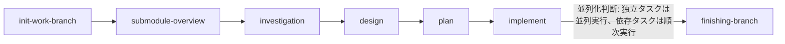

# Development Process Skills

Claude向けの開発プロセス用スキル集とエージェントの使い方をまとめたリポジトリです。

## 簡潔な利用手順

- setup-template.yaml をコピーして setup.yaml を作成し ticket_id 等を記入する。
- 大きな開発は以下の6ステップ（init -> submodule-overview -> investigation -> design -> plan -> implement）を順に実行する。
- 単純タスクは call-general-purpose.agent を使い、調査・設計・計画は call-pre-implementation-planning などを利用する。

## 実行コマンド例

```bash
# 環境構築（サブモジュール追加・初期セットアップ）
claude --agent call-environment-setup.agent.md

# 実装前計画（調査・設計・タスク分割）
claude --agent call-pre-implementation-planning.agent.md

# 汎用作業
claude --agent call-general-purpose.agent.md
```

## implement スキルの並列化判断

implement スキルは、タスク計画（plan/）に基づいてサブエージェントに実装を委任する。各タスクの依存関係を分析し、独立したタスクは並列で実行し、依存関係のあるタスクは順次実行する。並列化により開発速度を最大化しつつ、依存関係による整合性問題を回避する。

並列化判断は TDD（test-driven-development スキル）と verification-before-completion スキルを組み合わせて行う。各タスク完了時には必ずテスト実行と検証を行い、品質を担保する。

## 開発フロー（mermaid）



変更履歴やエージェントの詳細は AGENTS.md を参照してください。

