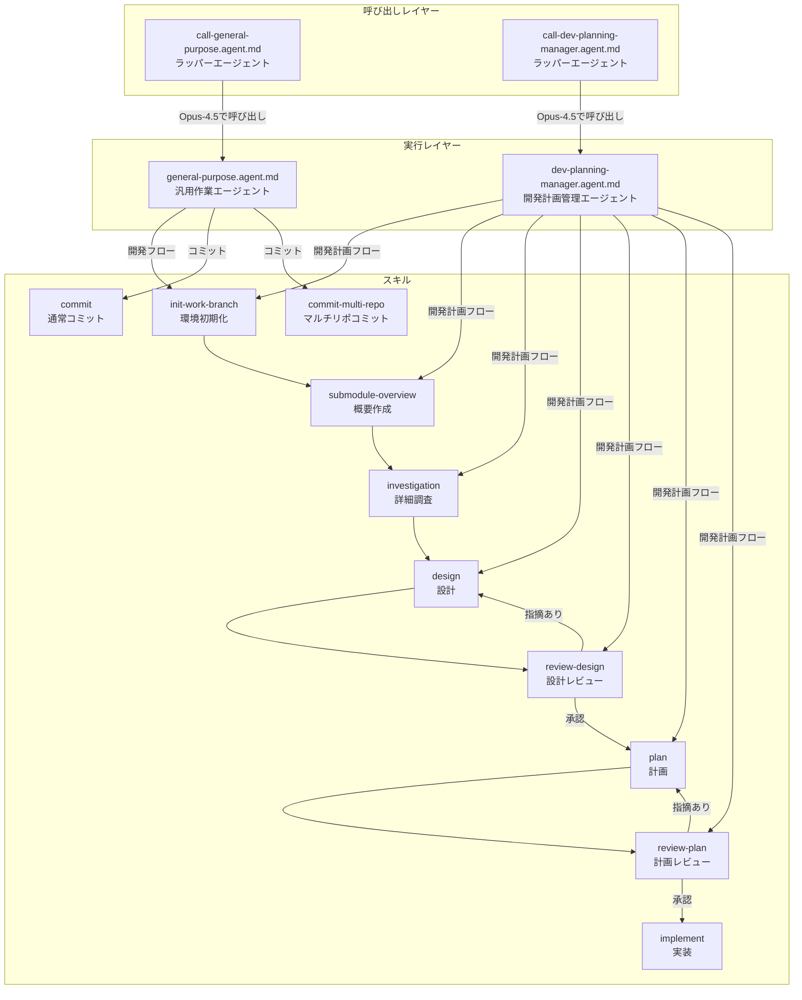
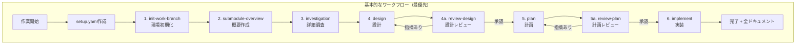

# Development Process Skills

Claude AIエージェント向けの開発プロセススキル集です。体系的な開発フローを通じて、調査・設計・計画・実装を効率的に遂行します。

## プロジェクト概要

### 目的

このリポジトリ（`.claude/skills`）は、Claude AIエージェントが開発タスクを体系的に処理するためのスキル定義を提供します。

### 基本的なワークフロー（最優先）

**開発タスクには以下の6ステップを順番に実行します：**

```
call-general-purpose-agent経由で以下を順番に実行：
1. init-work-branch        - 開発環境初期化
2. submodule-overview      - サブモジュール概要作成
3. investigation       - 詳細調査
4. design             - 設計
4a. review-design          - 設計レビュー（指摘があれば4に戻る）
5. plan               - 計画（タスク分割、TDDプロンプト生成）
5a. review-plan            - 計画レビュー（指摘があれば5に戻る）
6. implement          - 実装実行
```

各ステップは前のステップの成果物を入力として使用し、体系的にドキュメントを生成しながら開発を進めます。

---

## エージェント構成図



### 各エージェントの役割

| エージェント | ファイル | 役割 |
|-------------|----------|------|
| call-general-purpose | `call-general-purpose.agent.md` | general-purpose-agentを呼び出すラッパー（**推奨**） |
| general-purpose | `general-purpose.agent.md` | スキルを実行するメインエージェント |
| call-dev-planning-manager | `call-dev-planning-manager.agent.md` | dev-planning-manager-agentを呼び出すラッパー（調査・設計・計画用） |
| dev-planning-manager | `dev-planning-manager.agent.md` | 開発計画管理エージェント。スキルで調査・設計・計画を実施しMR作成 |

---

## 基本的な開発ワークフロー（シーケンス図）


### 各ステップの概要

| ステップ | スキル | 目的 | 主な成果物 |
|----------|--------|------|------------|
| 1 | init-work-branch | 開発環境初期化 | featureブランチ、`docs/{ticket_id}.md` |
| 2 | submodule-overview | サブモジュール概要作成 | `submodules/{repo}.md` |
| 3 | investigation | 詳細調査 | `docs/{repo}/investigation/` 配下6ファイル |
| 4 | design | 設計 | `docs/{repo}/design/` 配下6ファイル |
| 4a | review-design | 設計レビュー（ループ） | `docs/{repo}/review-design/` 配下6ファイル |
| 5 | plan | 計画（TDDプロンプト生成） | `docs/{repo}/plan/` 配下タスクファイル |
| 5a | review-plan | 計画レビュー（ループ） | `docs/{repo}/review-plan/` 配下6ファイル |
| 6 | implement | 実装実行 | コード変更、`docs/{repo}/implement/execution-log.md` |

---

## 各プロセスの詳細

### 各プロセスの詳細

各プロセスの詳細は対応するスキルファイル（`/.claude/skills/{skill-name}/SKILL.md`）を参照してください。

---

## ディレクトリ構造とファイル一覧

### スキル定義ファイル（`/.claude/skills/`配下）

```
.claude/skills/
├── commit/                             # 通常のgitコミットスキル
├── commit-multi-repo/                  # マルチリポジトリコミット
├── design/                         # 設計
├── implement/                      # 実装
├── investigation/                  # 詳細調査
├── plan/                           # 計画
├── init-work-branch/                   # 環境初期化
├── issue-to-setup-yaml/                # Issue→setup.yaml変換
├── review-design/                      # 設計レビュー
├── review-plan/                        # 計画レビュー
└── submodule-overview/                 # 概要作成
```

### 各スキルの役割

| スキル | 役割 |
|--------|------|
| commit | チケット連携・日本語コミットメッセージ生成 |
| commit-multi-repo | マルチリポジトリ環境でのコミット |
| design | 6ファイル構成の設計ドキュメント |
| implement | 計画に基づく実装実行 |
| investigation | 6ファイル構成の詳細調査 |
| plan | タスク分割、TDDプロンプト生成 |
| init-work-branch | featureブランチ作成、サブモジュール追加、設計ドキュメント初期化 |
| issue-to-setup-yaml | GitHub IssueからDevelopmentスキル用setup.yamlを生成 |
| review-design | 設計結果の妥当性レビュー |
| review-plan | タスク計画の妥当性レビュー |
| submodule-overview | サブモジュールの構造概要作成 |

---

---

## 使用方法

### 基本的なワークフロー（最優先）

**新機能開発や複雑なタスクには、development スキルの6ステップを順番に実行します。**



#### Step 1: setup.yamlの作成

```bash
# テンプレートをコピー
cp setup-template.yaml setup.yaml

# 内容を編集
vim setup.yaml
```

```yaml
# setup.yaml の例
ticket_id: "PROJ-123"
task_name: "ユーザー認証機能の追加"
description: "OAuth2.0を使用したユーザー認証機能を実装する"
target_repositories:
  - name: "backend-api"
    url: "git@github.com:org/backend-api.git"
    base_branch: "main"
related_repositories:
  - name: "auth-library"
    url: "git@github.com:org/auth-library.git"
options:
  submodules_dir: "submodules"
  design_document_dir: "docs"
```

#### Step 2: 各スキルの実行

```
# Phase 1: 開発環境初期化
call-general-purpose-agentを使用して、init-work-branchスキルでsetup.yamlから初期化してください。

# Phase 2: サブモジュール概要作成
call-general-purpose-agentを使用して、submodule-overviewスキルで概要を作成してください。

# Phase 3: 詳細調査
call-general-purpose-agentを使用して、investigationスキルで調査を実行してください。

# Phase 4: 設計
call-general-purpose-agentを使用して、designスキルで設計を実行してください。

# Phase 4a: 設計レビュー（指摘がなくなるまで繰り返し）
call-general-purpose-agentを使用して、review-designスキルで設計レビューを実行してください。
# 指摘があればPhase 4に戻って設計を修正し、再レビューしてください。

# Phase 5: 計画
call-general-purpose-agentを使用して、planスキルで計画を作成してください。

# Phase 5a: 計画レビュー（指摘がなくなるまで繰り返し）
call-general-purpose-agentを使用して、review-planスキルで計画レビューを実行してください。
# 指摘があればPhase 5に戻って計画を修正し、再レビューしてください。

# Phase 6: 実装
call-general-purpose-agentを使用して、implementスキルで実装を実行してください。
```

### 成果物一覧

| フェーズ | 成果物 | 出力先 |
|----------|--------|--------|
| init-work-branch | 設計ドキュメント | `docs/{ticket_id}.md` |
| submodule-overview | サブモジュール概要 | `submodules/{repo}.md` |
| investigation | アーキテクチャ調査等 | `docs/{repo}/investigation/` 配下6ファイル |
| design | 設計ドキュメント | `docs/{repo}/design/` 配下6ファイル |
| review-design | 設計レビュー結果 | `docs/{repo}/review-design/` 配下6ファイル |
| plan | タスク計画・プロンプト | `docs/{repo}/plan/` 配下 |
| review-plan | 計画レビュー結果 | `docs/{repo}/review-plan/` 配下6ファイル |
| implement | 実行ログ | `docs/{repo}/implement/execution-log.md` |

---

## 補足的な使用方法

### 簡単な作業向け（call-general-purpose-agent）

単純なタスクを直接実行するワークフローです。調査・設計・計画のプロセスを省略し、即座に実装を開始します。

**適用ケース:**
- バグ修正
- ドキュメント更新
- 設定変更
- 小規模な改善

**実行例:**
```
# バグ修正
call-general-purpose-agentを使用して、ログイン画面のバリデーションエラーを修正してください。

# ドキュメント更新
call-general-purpose-agentを使用して、READMEのインストール手順を最新化してください。

# 設定変更
call-general-purpose-agentを使用して、ESLintの設定を厳格化してください。
```

---

### 調査・設計・計画向け（call-dev-planning-manager-agent）

Issueやユーザーのリクエストからスキルを使って調査・設計・計画までを実施し、マージリクエストを作成するワークフローです。実装は行わず、計画までの成果物を作成します。

**適用ケース:**
- Issueから調査・設計・計画ドキュメントを自動作成したい場合
- 実装前の調査・設計レビューを実施したい場合
- 計画のマージリクエストを作成してチームレビューを受けたい場合

**実行例:**
```
# Issueから調査・設計・計画を実施
call-dev-planning-manager-agentを使用して、以下のIssueの調査・設計・計画を行ってください。
https://github.com/org/repo/issues/123

# ユーザー要望から調査・設計・計画を実施
call-dev-planning-manager-agentを使用して、ユーザー認証機能の追加について調査・設計・計画を行ってください。
```

---

## ユースケース選択ガイド

| 項目 | 基本ワークフロー | 簡単な作業 | 調査・設計・計画 |
|------|-----------------|------------|------------------|
| **用途** | 新機能開発、複雑なリファクタリング、重大な設計変更 | 単純なタスク、ちょっとした修正 | Issueや要望から調査・設計・計画を実施しMR作成 |
| **エージェント** | スキル6ステップ | `call-general-purpose-agent` | `call-dev-planning-manager-agent` |
| **ドキュメント** | 調査/設計/計画/実装の全ドキュメント | 最小限 | 調査/設計/計画のドキュメント + MR |
| **並列実行** | ○（worktree管理） | ✕ | ✕（順次実行） |
| **推奨ケース** | 大規模機能開発、アーキテクチャ変更、チーム共有が必要 | バグ修正、設定変更、小規模改善 | 実装前レビュー、計画立案、設計共有 |

---

## 開発フローの成果物ディレクトリ構造

```
{project-root}/
├── setup.yaml                          # セットアップ定義
├── docs/
│   ├── {ticket_id}.md                  # 設計ドキュメント（全フェーズで更新）
│   └── {target-repo}/                  # フェーズ別成果物
│       ├── investigation/
│       │   ├── 01_architecture.md
│       │   ├── 02_data-structure.md
│       │   ├── 03_dependencies.md
│       │   ├── 04_existing-patterns.md
│       │   ├── 05_integration-points.md
│       │   └── 06_risks-and-constraints.md
│       ├── design/
│       │   ├── 01_implementation-approach.md
│       │   ├── 02_interface-api-design.md
│       │   ├── 03_data-structure-design.md
│       │   ├── 04_process-flow-design.md
│       │   ├── 05_test-plan.md
│       │   └── 06_side-effect-verification.md
│       ├── review-design/
│       │   ├── 01_requirements-coverage.md
│       │   ├── 02_technical-validity.md
│       │   ├── 03_implementation-feasibility.md
│       │   ├── 04_testability.md
│       │   ├── 05_risks-and-concerns.md
│       │   └── 06_review-summary.md
│       ├── plan/
│       │   ├── task-list.md
│       │   ├── task01.md
│       │   ├── task02-01.md
│       │   ├── task02-02.md
│       │   └── parent-agent-prompt.md
│       ├── review-plan/
│       │   ├── 01_task-decomposition.md
│       │   ├── 02_dependency-accuracy.md
│       │   ├── 03_estimation-validity.md
│       │   ├── 04_tdd-approach.md
│       │   ├── 05_acceptance-coverage.md
│       │   └── 06_review-summary.md
│       └── implement/
│           └── execution-log.md
└── submodules/
    ├── {target-repo}/                  # 対象リポジトリの作業コピー
    └── {target-repo}.md                # サブモジュール概要（フォルダ単位）
```

---

## 注意事項

### コミットに関する制約

- **日本語コミットメッセージ必須**: 全てのコミットメッセージは日本語で記述
- **worktree環境ではpushしない**: プッシュは親エージェントまたはユーザーが実行
