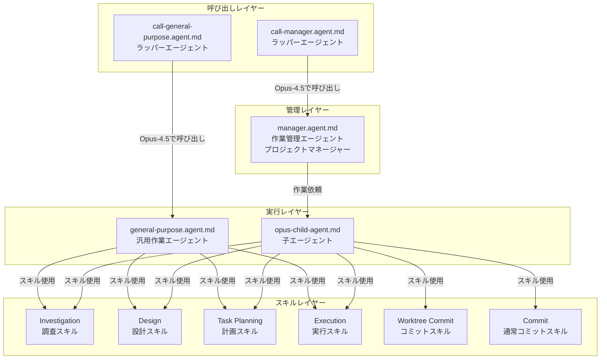
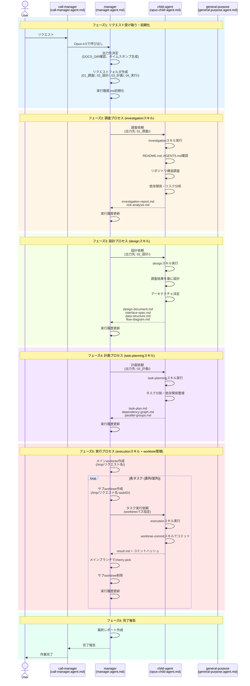
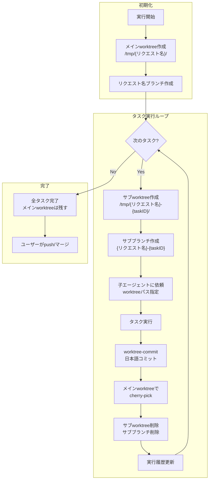
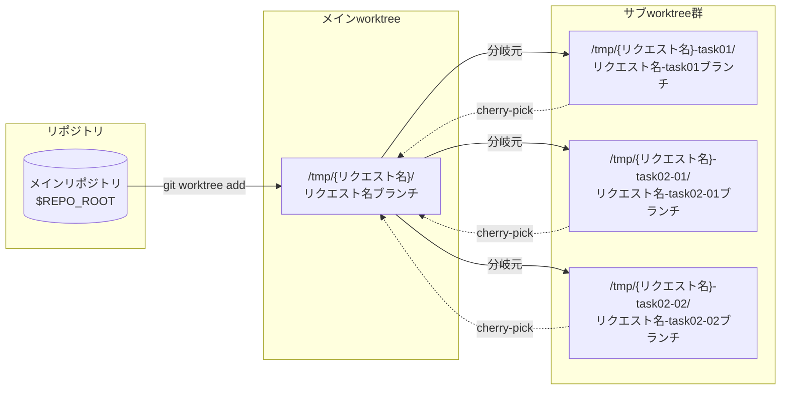
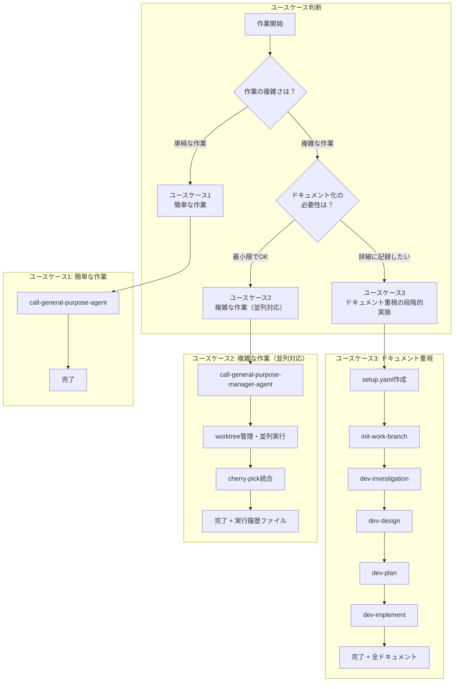
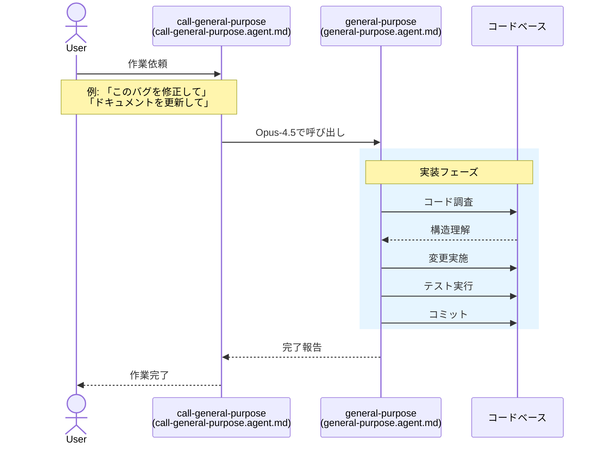
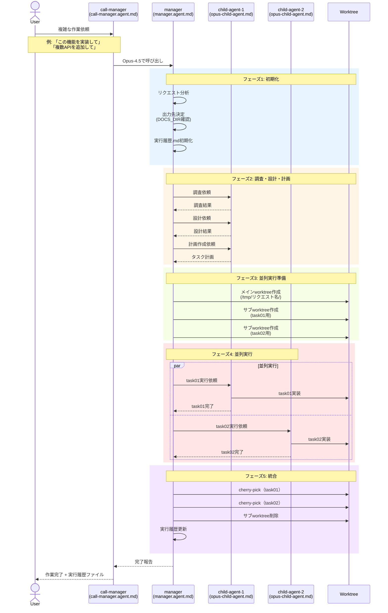
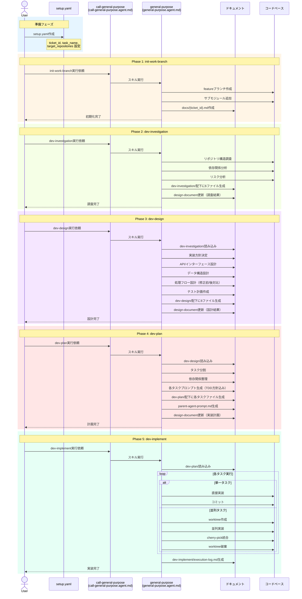

# General-Purpose Manager Skills

Claude AIエージェント向けの汎用作業管理スキル集です。複雑なリクエストを体系的に管理し、調査・設計・計画・実行の各プロセスを通じて作業を完遂します。

## プロジェクト概要

### 目的

このリポジトリ（`.claude/skills`）は、Claude AIエージェントが複雑なリクエストを体系的に処理するためのスキル定義を提供します。

### General-Purpose Managerの役割

General-Purpose Manager（`manager.agent.md`）は、プロジェクトマネージャーとして機能するエージェントです。直接作業を行わず、子エージェントに作業を委譲しながら、以下の責務を遂行します：

- リクエストの受け取りと分析
- ドキュメント出力先の決定と作成
- 各プロセスディレクトリの事前作成
- 子エージェントへの作業依頼
- 進行状況の追跡・監視
- 実行履歴の記録

---

## エージェント構成図



### 各エージェントの役割

| エージェント | ファイル | 役割 |
|-------------|----------|------|
| call-manager | `call-manager.agent.md` | manager-agentを呼び出すラッパー。Opus-4.5を使用 |
| manager | `manager.agent.md` | 作業管理エージェント（PM）。直接作業禁止、子エージェントに委譲 |
| call-general-purpose | `call-general-purpose.agent.md` | general-purpose-agentを呼び出すラッパー |
| general-purpose | `general-purpose.agent.md` | 親から依頼された作業を実行するサブエージェント |
| opus-child-agent | `opus-child-agent.md` | 依頼された作業を完遂する子エージェント。プロセス別成果物を出力 |

---

## 全体ワークフロー（シーケンス図）



---

## 各プロセスの詳細

### 調査プロセス（Investigation）

| 項目 | 内容 |
|------|------|
| **目的** | 既存コードベース、要件、リスクを把握する |
| **スキル** | `/.claude/skills/general-purpose/investigation/SKILL.md` |
| **入力（前提条件）** | リクエスト内容、リポジトリアクセス |
| **出力（成果物）** | `investigation-report.md`, `risk-analysis.md` |

**成果物の内容:**

- `investigation-report.md`: 構造概要、関連ファイル一覧、既存パターン、依存関係
- `risk-analysis.md`: 特定されたリスク、影響度・発生可能性、緩和策

---

### 設計プロセス（Design）

| 項目 | 内容 |
|------|------|
| **目的** | ソリューションのアーキテクチャを決定する |
| **スキル** | `/.claude/skills/general-purpose/design/SKILL.md` |
| **入力（前提条件）** | `investigation-report.md`（調査結果） |
| **出力（成果物）** | `design-document.md`, `interface-spec.md`, `data-structure.md`, `flow-diagram.md` |

**成果物の内容:**

- `design-document.md`: 設計書（全体）- 実装方針、コンポーネント設計、非機能要件対応
- `interface-spec.md`: API・インターフェース仕様
- `data-structure.md`: エンティティ、型定義、DBスキーマ
- `flow-diagram.md`: シーケンス図、フローチャート、状態遷移図

---

### 計画プロセス（Task Planning）

| 項目 | 内容 |
|------|------|
| **目的** | 実行可能なタスク計画を作成する |
| **スキル** | `/.claude/skills/general-purpose/task-planning/SKILL.md` |
| **入力（前提条件）** | `design-document.md`（設計結果） |
| **出力（成果物）** | `task-plan.md`, `dependency-graph.md`, `parallel-groups.md` |

**成果物の内容:**

- `task-plan.md`: タスク一覧、作業内容、完了条件、推定時間
- `dependency-graph.md`: タスク間の依存関係（mermaid図）
- `parallel-groups.md`: 並列実行可能なタスクグループ定義

---

### 実行プロセス（Execution）

| 項目 | 内容 |
|------|------|
| **目的** | 計画に従ってタスクを実行する |
| **スキル** | `/.claude/skills/general-purpose/execution/SKILL.md` |
| **入力（前提条件）** | `task-plan.md`（計画結果） |
| **出力（成果物）** | 各タスクごとの `result.md` |

**成果物の内容:**

- `result.md`: 実装完了状況、変更ファイル一覧、テスト結果、コミットハッシュ

---

## ディレクトリ構造とファイル一覧

```
.claude/skills/
├── README.md                           # このファイル
├── commit/
│   └── SKILL.md                        # 通常のgitコミットスキル
└── general-purpose/
    ├── investigation/
    │   ├── SKILL.md                    # 調査プロセススキル定義
    │   └── references/
    │       ├── investigation-report-template.md
    │       └── risk-analysis-template.md
    ├── design/
    │   ├── SKILL.md                    # 設計プロセススキル定義
    │   └── references/
    │       └── design-templates.md     # 設計書テンプレート集
    ├── task-planning/
    │   ├── SKILL.md                    # 計画プロセススキル定義
    │   └── references/
    │       └── templates.md            # 計画書テンプレート
    ├── execution/
    │   ├── SKILL.md                    # 実行プロセススキル定義
    │   └── references/
    │       └── templates.md            # 実行テンプレート集
    └── worktree-commit/
        └── SKILL.md                    # worktree環境でのコミットスキル
```

### 各ファイルの役割

| ファイル | 役割 |
|----------|------|
| `commit/SKILL.md` | ブランチ名からチケットID抽出、MCP連携でチケット情報取得、日本語コミットメッセージ生成 |
| `investigation/SKILL.md` | リポジトリ構造確認、関連ファイル特定、既存パターン調査、リスク分析のガイド |
| `investigation/references/*.md` | 調査レポート・リスク分析のテンプレート |
| `design/SKILL.md` | 実装方針決定、API設計、データ構造設計、処理フロー設計のガイド |
| `design/references/*.md` | 設計書・インターフェース仕様・データ構造定義のテンプレート |
| `task-planning/SKILL.md` | タスク分割、依存関係整理、並列実行グループ特定のガイド |
| `task-planning/references/*.md` | タスク計画書・依存関係図・並列グループ定義のテンプレート |
| `execution/SKILL.md` | worktree管理、子エージェント依頼、cherry-pick、クリーンアップのガイド |
| `execution/references/*.md` | 依頼テンプレート、result.md形式、実行履歴エントリ形式 |
| `worktree-commit/SKILL.md` | worktree環境での全変更ステージング、日本語コミットメッセージ生成 |

---

## リクエストフォルダ構造

manager.agent.mdがリクエスト開始時に作成するフォルダ構造:

```
{出力先ディレクトリ}/
└── YYYYMMDD-HHMM-{リクエスト名}/
    ├── 実行履歴.md              # リクエスト進行状況の記録
    ├── 01_調査/
    │   ├── investigation-report.md
    │   └── risk-analysis.md
    ├── 02_設計/
    │   ├── design-document.md
    │   ├── interface-spec.md
    │   ├── data-structure.md
    │   └── flow-diagram.md
    ├── 03_計画/
    │   ├── task-plan.md
    │   ├── dependency-graph.md
    │   └── parallel-groups.md
    └── 04_実行/
        ├── task01/
        │   └── result.md
        ├── task02-01/
        │   └── result.md
        ├── task02-02/
        │   └── result.md
        └── ...
```

### ディレクトリ命名規則

| 項目 | 形式 | 例 |
|------|------|-----|
| リクエストフォルダ | `YYYYMMDD-HHMM-{リクエスト名}` | `20260208-0149-機能追加` |
| プロセスフォルダ | `{番号}_{プロセス名}` | `01_調査`, `02_設計` |
| 実行タスクフォルダ | `{タスク識別子}` | `task01`, `task02-01` |

---

## 成果物一覧

### プロセス別成果物

| プロセス | ファイル名 | 内容の概要 |
|----------|------------|------------|
| 調査 | `investigation-report.md` | 構造概要、関連ファイル、既存パターン、依存関係 |
| 調査 | `risk-analysis.md` | リスク特定、影響度評価、緩和策 |
| 設計 | `design-document.md` | アーキテクチャ、実装方針、コンポーネント設計 |
| 設計 | `interface-spec.md` | API仕様、内部インターフェース定義 |
| 設計 | `data-structure.md` | エンティティ、値オブジェクト、DBスキーマ |
| 設計 | `flow-diagram.md` | シーケンス図、フローチャート、状態遷移図 |
| 計画 | `task-plan.md` | タスク一覧、作業内容、完了条件、見積もり |
| 計画 | `dependency-graph.md` | タスク間依存関係（mermaid図） |
| 計画 | `parallel-groups.md` | 並列実行グループ定義 |
| 実行 | `result.md` | 各タスクの実行結果、変更ファイル、テスト結果 |
| 管理 | `実行履歴.md` | 全タスクの進行状況、ステータス、成果物リンク |

---

## Worktree管理フロー

実行プロセスではgit worktreeを活用して、各タスクを独立したブランチで実行します。



### worktreeの関係



### 並列タスクのcherry-pick

並列タスクは全て同じベースコミットから分岐し、完了後に順次cherry-pickします:

1. 全並列タスクのサブworktreeを作成（同じベースから分岐）
2. 各タスクを並列実行
3. 全タスク完了後、順番にcherry-pick
4. コンフリクト発生時は手動解消またはabort
5. 全cherry-pick完了後、サブworktreeを一括削除

---

## 関連ファイルの参照表

### エージェント定義ファイル（`/.github/agents/`配下）

| ファイル | 役割 |
|----------|------|
| `call-manager.agent.md` | manager-agentを呼び出すラッパー。Opus-4.5使用 |
| `manager.agent.md` | 作業管理エージェント（PM）。直接作業禁止、子エージェントに委譲 |
| `call-general-purpose.agent.md` | general-purpose-agentを呼び出すラッパー |
| `general-purpose.agent.md` | 親から依頼された作業を実行するサブエージェント |
| `opus-child-agent.md` | 子エージェント。親から受け取った情報を信頼して使用 |

### スキル定義ファイル（`/.claude/skills/`配下）

| ファイル | 役割 |
|----------|------|
| `general-purpose/investigation/SKILL.md` | 調査プロセスのガイド |
| `general-purpose/design/SKILL.md` | 設計プロセスのガイド |
| `general-purpose/task-planning/SKILL.md` | 計画プロセスのガイド |
| `general-purpose/execution/SKILL.md` | 実行プロセスのガイド（worktree管理含む） |
| `general-purpose/worktree-commit/SKILL.md` | worktree環境でのコミットスキル |
| `commit/SKILL.md` | 通常のgitコミットスキル（MCP連携） |

### リファレンステンプレート

| ファイル | 内容 |
|----------|------|
| `investigation/references/investigation-report-template.md` | 調査レポートテンプレート |
| `investigation/references/risk-analysis-template.md` | リスク分析テンプレート |
| `design/references/design-templates.md` | 設計書テンプレート集（design-document, interface-spec, data-structure, flow-diagram） |
| `task-planning/references/templates.md` | タスク計画テンプレート（task-plan, dependency-graph, parallel-groups） |
| `execution/references/templates.md` | 実行テンプレート（子エージェント依頼、worktree初期化、result.md、実行履歴エントリ、cherry-pick・クリーンアップコマンド） |

---

## 使用方法（全体フロー）

本リポジトリは3つのユースケースに対応しています。作業の複雑さとドキュメント化の必要性に応じて適切なワークフローを選択してください。



---

## ユースケース選択ガイド

| 項目 | ユースケース1 | ユースケース2 | ユースケース3 |
|------|---------------|---------------|---------------|
| **用途** | 単純なタスク、ちょっとした修正、ドキュメント更新 | 複数の関連タスク、並列実装が必要な場合 | 新機能開発、複雑なリファクタリング、重大な設計変更 |
| **エージェント** | `call-general-purpose-agent` | `call-general-purpose-manager-agent` | 各開発スキルを順番に実行 |
| **ドキュメント** | 最小限 | 実行履歴のみ | 調査/設計/計画/実装の全ドキュメント |
| **並列実行** | ✕ | ○（worktree管理） | ○（worktree管理） |
| **推奨ケース** | バグ修正、設定変更、小規模改善 | 中規模機能追加、複数ファイル同時変更 | 大規模機能開発、アーキテクチャ変更、チーム共有が必要 |

---

## ユースケース1: 簡単な作業

### 概要

単純なタスクを直接実行するワークフローです。調査・設計・計画のプロセスを省略し、即座に実装を開始します。

### シーケンス図



### 実行例

```
# バグ修正
call-general-purpose-agentを使用して、ログイン画面のバリデーションエラーを修正してください。

# ドキュメント更新
call-general-purpose-agentを使用して、READMEのインストール手順を最新化してください。

# 設定変更
call-general-purpose-agentを使用して、ESLintの設定を厳格化してください。
```

### 成果物

| 成果物 | 説明 |
|--------|------|
| コード変更 | 直接コミット |
| ドキュメント | 必要に応じて最小限 |

---

## ユースケース2: 複雑な作業（並列対応）

### 概要

複数の関連タスクを並列実行で効率的に処理するワークフローです。git worktreeを活用して独立した作業環境を作成し、cherry-pickで統合します。

### シーケンス図



### 実行例

```
# 機能追加
call-general-purpose-manager-agentを使用して、ユーザー管理機能を実装してください。
- ユーザー一覧API
- ユーザー詳細API
- ユーザー更新API

# 複数モジュールの改修
call-general-purpose-manager-agentを使用して、ログ出力を全モジュールに追加してください。
```

### 成果物

| 成果物 | 説明 |
|--------|------|
| コード変更 | cherry-pickで統合済みのコミット |
| 実行履歴.md | タスク実行の記録 |
| 各タスクのresult.md | 個別タスクの結果（04_実行/配下） |

### Worktree管理フロー

```mermaid
flowchart LR
    subgraph "メインリポジトリ"
        MAIN[feature/リクエスト名<br/>ブランチ]
    end
    
    subgraph "並列worktree"
        WT1[/tmp/リクエスト名-task01/<br/>task01用ブランチ]
        WT2[/tmp/リクエスト名-task02/<br/>task02用ブランチ]
    end
    
    MAIN -->|git worktree add| WT1
    MAIN -->|git worktree add| WT2
    
    WT1 -.->|cherry-pick| MAIN
    WT2 -.->|cherry-pick| MAIN
```

---

## ユースケース3: ドキュメント重視の段階的実施

### 概要

新機能開発や複雑なリファクタリングなど、詳細なドキュメント化が必要な作業向けのワークフローです。調査→設計→計画→実装の各フェーズで成果物を生成し、設計変更の履歴を完全に記録します。

### シーケンス図



### 実行手順

#### Step 1: setup.yamlの作成

```bash
# テンプレートをコピー
cp setup-template.yaml setup.yaml

# 内容を編集
vim setup.yaml
```

```yaml
# setup.yaml の例
ticket_id: "PROJ-123"
task_name: "ユーザー認証機能の追加"
description: "OAuth2.0を使用したユーザー認証機能を実装する"
target_repositories:
  - name: "backend-api"
    url: "git@github.com:org/backend-api.git"
    base_branch: "main"
related_repositories:
  - name: "auth-library"
    url: "git@github.com:org/auth-library.git"
options:
  submodules_dir: "submodules"
  design_document_dir: "docs"
```

#### Step 2: 各スキルの実行

```
# Phase 1: 開発環境初期化
call-general-purpose-agentを使用して、init-work-branchスキルでsetup.yamlから初期化してください。

# Phase 2: 詳細調査（オプション: submodule-overview）
call-general-purpose-agentを使用して、dev-investigationスキルで調査を実行してください。

# Phase 3: 設計
call-general-purpose-agentを使用して、dev-designスキルで設計を実行してください。

# Phase 4: 計画
call-general-purpose-agentを使用して、dev-planスキルで計画を作成してください。

# Phase 5: 実装
call-general-purpose-agentを使用して、dev-implementスキルで実装を実行してください。
```

### 成果物一覧

| フェーズ | 成果物 | 出力先 |
|----------|--------|--------|
| init-work-branch | 設計ドキュメント | `docs/{ticket_id}.md` |
| dev-investigation | アーキテクチャ調査 | `submodules/{repo}/dev-investigation/01_architecture.md` |
| dev-investigation | データ構造調査 | `submodules/{repo}/dev-investigation/02_data-structure.md` |
| dev-investigation | 依存関係調査 | `submodules/{repo}/dev-investigation/03_dependencies.md` |
| dev-investigation | 既存パターン調査 | `submodules/{repo}/dev-investigation/04_existing-patterns.md` |
| dev-investigation | 統合ポイント調査 | `submodules/{repo}/dev-investigation/05_integration-points.md` |
| dev-investigation | リスク・制約分析 | `submodules/{repo}/dev-investigation/06_risks-and-constraints.md` |
| dev-design | 実装方針 | `submodules/{repo}/dev-design/01_implementation-approach.md` |
| dev-design | インターフェース/API設計 | `submodules/{repo}/dev-design/02_interface-api-design.md` |
| dev-design | データ構造設計 | `submodules/{repo}/dev-design/03_data-structure-design.md` |
| dev-design | 処理フロー設計 | `submodules/{repo}/dev-design/04_process-flow-design.md` |
| dev-design | テスト計画 | `submodules/{repo}/dev-design/05_test-plan.md` |
| dev-design | 弊害検証計画 | `submodules/{repo}/dev-design/06_side-effect-verification.md` |
| dev-plan | タスク一覧 | `submodules/{repo}/dev-plan/task-list.md` |
| dev-plan | 各タスクプロンプト | `submodules/{repo}/dev-plan/task0X.md` |
| dev-plan | 親エージェント用プロンプト | `submodules/{repo}/dev-plan/parent-agent-prompt.md` |
| dev-implement | 実行ログ | `submodules/{repo}/dev-implement/execution-log.md` |

### ディレクトリ構造

```
{project-root}/
├── setup.yaml                          # セットアップ定義
├── docs/
│   └── {ticket_id}.md                  # 設計ドキュメント（全フェーズで更新）
└── submodules/
    └── {target-repo}/
        ├── dev-investigation/          # 調査結果
        │   ├── 01_architecture.md
        │   ├── 02_data-structure.md
        │   ├── 03_dependencies.md
        │   ├── 04_existing-patterns.md
        │   ├── 05_integration-points.md
        │   └── 06_risks-and-constraints.md
        ├── dev-design/                 # 設計結果
        │   ├── 01_implementation-approach.md
        │   ├── 02_interface-api-design.md
        │   ├── 03_data-structure-design.md
        │   ├── 04_process-flow-design.md
        │   ├── 05_test-plan.md
        │   └── 06_side-effect-verification.md
        ├── dev-plan/                   # 計画結果
        │   ├── task-list.md
        │   ├── task01.md
        │   ├── task02-01.md
        │   ├── task02-02.md
        │   └── parent-agent-prompt.md
        └── dev-implement/              # 実行結果
            └── execution-log.md
```

---

## 成果物一覧（ユースケース別）

| ユースケース | 主要成果物 | 特徴 |
|--------------|------------|------|
| **UC1: 簡単な作業** | コード変更のみ | 最小限のオーバーヘッド |
| **UC2: 複雑な作業** | コード変更 + 実行履歴.md | 並列実行対応、worktree管理 |
| **UC3: ドキュメント重視** | 調査/設計/計画/実装の全ドキュメント + コード変更 | 完全な変更履歴、チーム共有可能 |

---

## 実行例とコマンド

### ユースケース1: バグ修正

```
call-general-purpose-agentを使用して、src/utils/validation.tsのメールアドレスバリデーションのバグを修正してください。
正規表現が「.co.jp」ドメインを正しく検証できていません。
```

### ユースケース2: 複数APIの追加

```
call-general-purpose-manager-agentを使用して、以下のREST APIを追加してください：
1. GET /api/users - ユーザー一覧取得
2. GET /api/users/:id - ユーザー詳細取得
3. POST /api/users - ユーザー作成
4. PUT /api/users/:id - ユーザー更新
5. DELETE /api/users/:id - ユーザー削除

各APIは並列で実装可能です。
```

### ユースケース3: 新機能開発

```bash
# 1. setup.yaml作成
cat > setup.yaml << 'EOF'
ticket_id: "FEAT-456"
task_name: "OAuth2.0認証の実装"
description: "Google/GitHub OAuthを使用したSSO機能を実装"
target_repositories:
  - name: "auth-service"
    url: "git@github.com:org/auth-service.git"
    base_branch: "develop"
EOF

# 2. 各フェーズを順番に実行
# Phase 1
call-general-purpose-agentを使用して、init-work-branchスキルでsetup.yamlから初期化してください。

# Phase 2
call-general-purpose-agentを使用して、dev-investigationスキルで調査を実行してください。

# Phase 3
call-general-purpose-agentを使用して、dev-designスキルで設計を実行してください。

# Phase 4
call-general-purpose-agentを使用して、dev-planスキルで計画を作成してください。

# Phase 5
call-general-purpose-agentを使用して、dev-implementスキルで実装を実行してください。
```

---

## 基本的な呼び出し（レガシー）

### 直接managerを呼び出す方法

1. **call-managerエージェントを呼び出す**
   ```
   call-managerエージェントを使用して、〇〇の機能を実装してください。
   ```

2. **managerエージェントが自動的に以下を実行**
   - リクエストフォルダの作成
   - 調査→設計→計画→実行の各プロセスを順次実行
   - 子エージェントへの作業委譲
   - 進行状況の追跡・記録

### 個別スキルの直接使用

各スキルは単独でも使用可能です:

```
investigationスキルを使用して、このリポジトリの構造を調査してください。
```

```
designスキルを使用して、ログイン機能の設計を行ってください。
```

---

## 注意事項

### managerエージェントの制約

- **直接作業禁止**: コード編集、ファイル操作は一切行わない（ディレクトリ作成は例外）
- **サブエージェント経由**: 全ての作業を子エージェントに依頼
- **追跡機能**: 実行履歴ファイルで全てのタスクの進行状況を記録
- **出力先明記**: 子エージェントへの依頼には必ず成果物出力先の絶対パスを含める

### 子エージェントの制約

- **環境変数の再確認禁止**: 親から渡された情報を信頼して使用
- **パスの加工禁止**: 提供された絶対パスをそのまま使用
- **コミットメッセージは日本語**: 必ず日本語でコミットメッセージを生成

### コミットに関する制約

- **日本語コミットメッセージ必須**: 全てのコミットメッセージは日本語で記述
- **worktree環境ではpushしない**: プッシュは親エージェントまたはユーザーが実行
