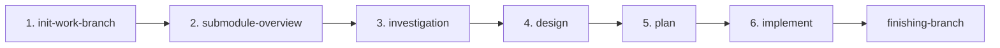

# Development Process Skills

Claude向けの開発プロセス用スキル集とエージェント構成をまとめたリポジトリです。

## プロジェクト概要

本リポジトリは、AIエージェントによる開発プロセスを体系化し、6ステップワークフローで高品質なソフトウェア開発を実現します。

### 主な特徴

- **6ステップワークフロー**: 初期化 → 調査 → 設計 → 計画 → 実装の体系的プロセス
- **エージェント階層構造**: call-* ラッパー → 実行エージェント → サブエージェント
- **品質スキル統合**: TDD、検証、デバッグ、コードレビューの組み込み
- **並列実行対応**: 独立タスクの並列処理によるスループット向上

---

## エージェント呼び出しパターン

```
ユーザー
   ↓
call-* ラッパー (Opus-4.6 指定可)
   ↓
実行エージェント (Opus-4.6 指定可)
   ↓
サブエージェント (Opus-4.5 必須)
```

### 呼び出しルール

1. **ユーザーは call-* ラッパーを呼ぶ**（直接実行エージェントを呼ばない）
2. **call-* ラッパーと実行エージェントは Opus-4.6 指定可能**
3. **サブエージェント起動時は Opus-4.5 必須**: `model: "claude-opus-4.5"`

```yaml
# サブエージェント起動例
- agent_type: "general-purpose"
  model: "claude-opus-4.5"
  prompt: "タスク内容"
```

---

## 6ステップワークフロー



### 1. init-work-branch（作業ブランチ初期化）

- `setup.yaml` を読み込み、featureブランチを作成
- 関連・修正対象リポジトリをサブモジュールとして追加
- 設計ドキュメント（`docs/{ticket_id}.md`）を生成

### 2. submodule-overview（サブモジュール概要作成）

- サブモジュールのREADME/CLAUDE.md/AGENTS.mdから情報収集
- 技術スタック、API、依存関係を分析
- `submodules/{name}.md` に概要ドキュメント生成

### 3. investigation（詳細調査）

- アーキテクチャ、データ構造、依存関係を調査
- UML図（Mermaid形式）を含む調査結果を生成
- `docs/{target_repo}/investigation/` に出力

### 4. design（設計）

- 調査結果を基に詳細設計を実施
- API設計、データ構造設計、処理フロー設計
- 修正前/修正後のシーケンス図を作成
- `docs/{target_repo}/design/` に出力

### 5. plan（タスク計画）

- 設計からタスクを分割、依存関係を整理
- 各タスク用プロンプト（task0X.md）を生成
- 親エージェント用統合管理プロンプトを生成
- `docs/{target_repo}/plan/` に出力

### 6. implement（実装）

- タスク計画に従ってサブエージェントに実装を依頼
- 並列タスクはworktreeを使用して並行実行
- cherry-pickで親ブランチに統合
- `docs/{target_repo}/implement/` に実行ログ出力

---

## 追加スキル一覧

### 品質・開発支援スキル

| スキル | 説明 |
|--------|------|
| **brainstorming** | 創造的作業の前にユーザー意図・要件・設計を対話的に探求 |
| **test-driven-development** | RED-GREEN-REFACTORサイクルでテストファーストの開発を実践 |
| **systematic-debugging** | 根本原因を特定してから修正する体系的デバッグ手法 |
| **verification-before-completion** | 完了主張前に検証コマンドを実行し証拠を確認 |
| **writing-skills** | スキルファイル（SKILL.md）の作成・編集ガイド |
| **receiving-code-review** | レビューフィードバック受信時の技術的検証プロセス |
| **requesting-code-review** | code-reviewerエージェントへのレビュー依頼手順 |
| **finishing-branch** | 実装完了後のマージ/PR/クリーンアップオプション提示 |

### レビュースキル

| スキル | 説明 |
|--------|------|
| **review-design** | 設計結果の妥当性をレビュー |
| **review-plan** | タスク計画の妥当性をレビュー |

---

## 実行コマンド例

```bash
# 環境構築（サブモジュール追加・初期セットアップ）
claude --agent call-environment-setup.agent.md

# 実装前計画（調査・設計・タスク分割）
claude --agent call-pre-implementation-planning.agent.md

# 汎用作業
claude --agent call-general-purpose.agent.md
```

---

## 運用上の注意

### TDD（テスト駆動開発）

- **失敗するテストなしに本番コードを書かない**
- 各タスクプロンプトにTDD方針（RED-GREEN-REFACTOR）を組み込み
- テストが先、実装は最小限

### verification（完了前検証）

- **新しい検証証拠なしに完了を主張しない**
- テスト通過、ビルド成功、リンタークリアを実際のコマンド出力で確認
- 「〜はず」「おそらく」は禁止

### 並列化判断

- 3つ以上の独立タスクが同一フェーズに存在する場合に検討
- ファイル編集の衝突がないことを確認
- 各タスクが独立したテストファイルを持つこと

---

## ファイル・ディレクトリ成果物例

```
project/
├── setup.yaml                          # プロジェクト設定（SSOT）
├── docs/
│   ├── {ticket_id}.md                  # 設計ドキュメント
│   └── {target_repo}/
│       ├── investigation/              # 調査結果
│       │   ├── 01_architecture.md
│       │   ├── 02_data-structure.md
│       │   └── ...
│       ├── design/                     # 設計結果
│       │   ├── 01_implementation-approach.md
│       │   ├── 02_interface-api-design.md
│       │   └── ...
│       ├── plan/                       # タスク計画
│       │   ├── task-list.md
│       │   ├── task01.md
│       │   ├── parent-agent-prompt.md
│       │   └── ...
│       └── implement/                  # 実行ログ
│           └── execution-log.md
└── submodules/
    ├── {repo_name}/                    # サブモジュール
    └── {repo_name}.md                  # サブモジュール概要
```

---

## 関連ドキュメント

- **AGENTS.md**: プロジェクト固有の運用ルールとモデル指定
- **setup-template.yaml**: セットアップYAMLのテンプレート
