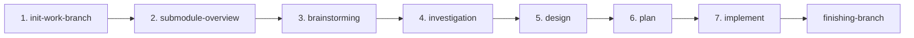
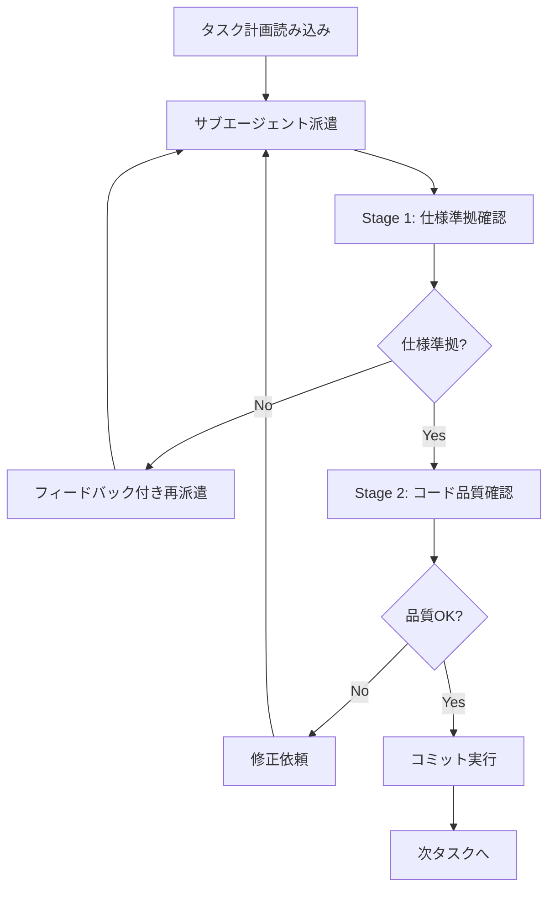
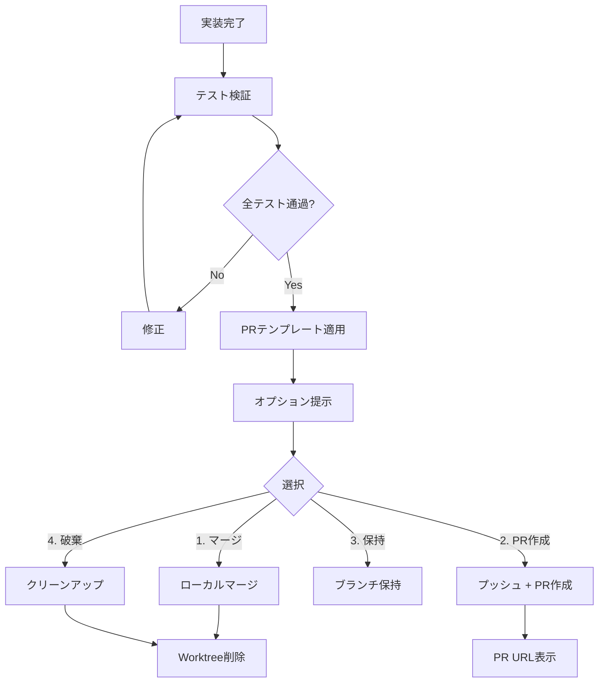

# Development Process Skills

Claude向けの開発プロセス用スキル集とエージェント構成をまとめたリポジトリです。

## プロジェクト概要

本リポジトリは、AIエージェントによる開発プロセスを体系化し、7ステップワークフローで高品質なソフトウェア開発を実現します。

### 主な特徴

- **7ステップワークフロー**: 初期化 → ブレスト → 調査 → 設計 → 計画 → 実装の体系的プロセス
- **エージェント階層構造**: call-* ラッパー → 実行エージェント → サブエージェント
- **品質スキル統合**: TDD、検証、デバッグ、コードレビューの組み込み
- **並列実行対応**: 独立タスクの並列処理によるスループット向上

---

## エージェント呼び出しパターン

```
ユーザー
   ↓
call-* ラッパー (Opus-4.6 指定可)
   ↓
実行エージェント (Opus-4.6 指定可)
   ↓
サブエージェント (Opus-4.5 必須)
```

### 呼び出しルール

1. **ユーザーは call-* ラッパーを呼ぶ**（直接実行エージェントを呼ばない）
2. **call-* ラッパーと実行エージェントは Opus-4.6 指定可能**
3. **サブエージェント起動時は Opus-4.5 必須**: `model: "claude-opus-4.5"`

```yaml
# サブエージェント起動例
- agent_type: "general-purpose"
  model: "claude-opus-4.5"
  prompt: "タスク内容"
```

---

## 7ステップワークフロー



### 1. init-work-branch（作業ブランチ初期化）

**インプット:**
- `setup.yaml`: プロジェクト設定ファイル（SSOT）

**成果物:**
- `feature/{ticket_id}` ブランチ
- `submodules/{repo_name}/`: サブモジュール追加
- `docs/{ticket_id}.md`: 設計ドキュメント

**説明:**
- `setup.yaml` を読み込み、featureブランチを作成
- 関連・修正対象リポジトリをサブモジュールとして追加
- 設計ドキュメント（`docs/{ticket_id}.md`）を生成

### 2. submodule-overview（サブモジュール概要作成）

**インプット:**
- `submodules/{repo_name}/`: サブモジュールディレクトリ
- `submodules/{repo_name}/README.md`: プロジェクト概要
- `submodules/{repo_name}/CLAUDE.md`: Claude向けコンテキスト（任意）
- `submodules/{repo_name}/AGENTS.md`: エージェント向け指示（任意）

**成果物:**
- `submodules/{name}.md`: サブモジュール概要ドキュメント

**説明:**
- サブモジュールのREADME/CLAUDE.md/AGENTS.mdから情報収集
- 技術スタック、API、依存関係を分析
- `submodules/{name}.md` に概要ドキュメント生成

### 3. brainstorming（要件探索）

**インプット:**
- `setup.yaml`: プロジェクト設定ファイル
- ユーザーとの対話: 意図・要件・背景の聞き取り

**成果物:**
- 要件候補リスト
- 各要件の妥当性評価（実現可能性・リスク・依存関係）
- `docs/plans/`: 設計ドキュメント（任意）

**説明:**
調査開始前にユーザーと短い対話ループを行い、要件の明確化と妥当性評価を実施します。ユーザーの意図や背景を質問形式で掘り下げ、機能要件・非機能要件の候補を洗い出し、技術的制約や優先度を確認します。出力として「要件候補リスト」と「各要件の妥当性評価（実現可能性・リスク・依存関係）」を生成し、後続の investigation フェーズで何を調査すべきかを明確にします。

### 4. investigation（詳細調査）

**インプット:**
- `setup.yaml`: プロジェクト設定（`description.background` を背景情報として参照）
- `docs/{ticket_id}.md`: 設計ドキュメント
- `submodules/{target_repo}/`: 調査対象リポジトリ

**成果物:**
- `docs/{target_repo}/investigation/01_architecture.md`: アーキテクチャ調査
- `docs/{target_repo}/investigation/02_data-structure.md`: データ構造調査
- `docs/{target_repo}/investigation/03_dependencies.md`: 依存関係調査
- `docs/{target_repo}/investigation/04_existing-patterns.md`: 既存パターン調査
- `docs/{target_repo}/investigation/05_integration-points.md`: 統合ポイント調査
- `docs/{target_repo}/investigation/06_risks-and-constraints.md`: リスク・制約分析
- `docs/{ticket_id}.md`: 調査結果セクション更新

**説明:**
- アーキテクチャ、データ構造、依存関係を調査
- UML図（Mermaid形式）を含む調査結果を生成
- `docs/{target_repo}/investigation/` に出力

### 5. design（設計）

**インプット:**
- `setup.yaml`: プロジェクト設定（`description.requirements` を設計要件として参照）
- `docs/{ticket_id}.md`: 設計ドキュメント
- `docs/{target_repo}/investigation/`: 調査結果

**成果物:**
- `docs/{target_repo}/design/01_implementation-approach.md`: 実装方針
- `docs/{target_repo}/design/02_interface-api-design.md`: インターフェース/API設計
- `docs/{target_repo}/design/03_data-structure-design.md`: データ構造設計
- `docs/{target_repo}/design/04_process-flow-design.md`: 処理フロー設計
- `docs/{target_repo}/design/05_test-plan.md`: テスト計画
- `docs/{target_repo}/design/06_side-effect-verification.md`: 弊害検証計画
- `docs/{ticket_id}.md`: 設計セクション・完了条件更新

**説明:**
- 調査結果を基に詳細設計を実施
- API設計、データ構造設計、処理フロー設計
- 修正前/修正後のシーケンス図を作成
- `docs/{target_repo}/design/` に出力

### 6. plan（タスク計画）

**インプット:**
- `setup.yaml`: プロジェクト設定（`description.acceptance_criteria` を完了条件基準として参照）
- `docs/{ticket_id}.md`: 設計ドキュメント
- `docs/{target_repo}/design/`: 詳細設計結果

**成果物:**
- `docs/{target_repo}/plan/task-list.md`: タスク一覧と依存関係
- `docs/{target_repo}/plan/task01.md`, `task02-01.md`, ...: 各タスク用プロンプト
- `docs/{target_repo}/plan/parent-agent-prompt.md`: 親エージェント統合管理プロンプト
- `docs/{ticket_id}.md`: 実装計画セクション更新

**説明:**
- 設計からタスクを分割、依存関係を整理
- 各タスク用プロンプト（task0X.md）を生成
- 親エージェント用統合管理プロンプトを生成
- `docs/{target_repo}/plan/` に出力

### 7. implement（実装）

**インプット:**
- `setup.yaml`: プロジェクト設定
- `docs/{ticket_id}.md`: 設計ドキュメント
- `docs/{target_repo}/plan/`: タスク計画
- `docs/{target_repo}/plan/task-list.md`: タスク一覧
- `docs/{target_repo}/plan/task0X.md`: 各タスクプロンプト
- `docs/{target_repo}/plan/parent-agent-prompt.md`: 統合管理プロンプト

**成果物:**
- `docs/{target_repo}/implement/execution-log.md`: 実行ログ
- 実装コード（サブモジュール内）
- テストコード（サブモジュール内）
- コミット履歴（各タスク完了時）

**説明:**
- タスク計画に従ってサブエージェントに実装を依頼
- 並列タスクはworktreeを使用して並行実行
- cherry-pickで親ブランチに統合
- `docs/{target_repo}/implement/` に実行ログ出力

---

## 追加スキル一覧

### 品質・開発支援スキル

| スキル | 説明 |
|--------|------|
| **brainstorming** | 創造的作業の前にユーザー意図・要件・設計を対話的に探求 |
| **test-driven-development** | RED-GREEN-REFACTORサイクルでテストファーストの開発を実践 |
| **systematic-debugging** | 根本原因を特定してから修正する体系的デバッグ手法 |
| **verification-before-completion** | 完了主張前に検証コマンドを実行し証拠を確認 |
| **writing-skills** | スキルファイル（SKILL.md）の作成・編集ガイド |
| **receiving-code-review** | レビューフィードバック受信時の技術的検証プロセス |
| **requesting-code-review** | code-reviewerエージェントへのレビュー依頼手順 |
| **finishing-branch** | 実装完了後のマージ/PR/クリーンアップオプション提示 |

### レビュースキル

| スキル | 説明 |
|--------|------|
| **review-design** | 設計結果の妥当性をレビュー |
| **review-plan** | タスク計画の妥当性をレビュー |

---

## 実行コマンド例

```bash
# 環境構築（サブモジュール追加・初期セットアップ）
claude --agent call-environment-setup.agent.md

# 実装前計画（調査・設計・タスク分割）
claude --agent call-pre-implementation-planning.agent.md

# 汎用作業
claude --agent call-general-purpose.agent.md

# brainstorming（要件探索）- 汎用エージェント経由
claude --agent call-general-purpose.agent.md --prompt "brainstormingスキルを使って要件を探索してください"
```

---

## 運用上の注意

### TDD（テスト駆動開発）

- **失敗するテストなしに本番コードを書かない**
- 各タスクプロンプトにTDD方針（RED-GREEN-REFACTOR）を組み込み
- テストが先、実装は最小限

### verification（完了前検証）

- **新しい検証証拠なしに完了を主張しない**
- テスト通過、ビルド成功、リンタークリアを実際のコマンド出力で確認
- 「〜はず」「おそらく」は禁止

### 並列化判断

- 3つ以上の独立タスクが同一フェーズに存在する場合に検討
- ファイル編集の衝突がないことを確認
- 各タスクが独立したテストファイルを持つこと

#### 並列化判断フローチャート

```
[タスクリスト確認]
      ↓
[Q1] 独立タスクが3つ以上ある？
      ↓ Yes                    ↓ No → 順次実行
[Q2] ファイル編集の衝突がない？
      ↓ Yes                    ↓ No → 順次実行
[Q3] 各タスクが独立テストを持つ？
      ↓ Yes                    ↓ No → 順次実行
[Q4] リスクスコア ≤ 速度スコア？
      ↓ Yes                    ↓ No → 順次実行
      ↓
[並列実行を選択]
```

**判断アルゴリズム:**

```
function shouldParallelize(tasks):
  # Step 1: 独立タスク数の確認
  independentTasks = tasks.filter(t => t.dependencies.isEmpty())
  if independentTasks.count < 3:
    return false

  # Step 2: ファイル衝突チェック
  allTargetFiles = independentTasks.flatMap(t => t.targetFiles)
  if allTargetFiles.hasDuplicates():
    return false

  # Step 3: テスト独立性チェック
  for task in independentTasks:
    if not task.hasIndependentTestFile():
      return false

  # Step 4: リスク vs 速度スコアリング
  riskScore = calculateRisk(independentTasks)
  speedScore = calculateSpeedGain(independentTasks)
  return speedScore >= riskScore
```

**リスクスコアリング基準:**

| 要素 | 低リスク (1) | 中リスク (2) | 高リスク (3) |
|------|-------------|-------------|-------------|
| モジュール結合度 | 完全独立 | 共有ユーティリティ使用 | 共有状態あり |
| 変更規模 | 〜50行 | 50-200行 | 200行超 |
| テスト範囲 | 単体のみ | 単体+結合 | E2E必要 |

**速度スコア計算:**
- 並列タスク数 × 平均タスク時間 / 最大タスク時間

---

## ファイル・ディレクトリ成果物例

```
project/
├── setup.yaml                          # プロジェクト設定（SSOT）
├── docs/
│   ├── {ticket_id}.md                  # 設計ドキュメント
│   └── {target_repo}/
│       ├── investigation/              # 調査結果
│       │   ├── 01_architecture.md
│       │   ├── 02_data-structure.md
│       │   └── ...
│       ├── design/                     # 設計結果
│       │   ├── 01_implementation-approach.md
│       │   ├── 02_interface-api-design.md
│       │   └── ...
│       ├── plan/                       # タスク計画
│       │   ├── task-list.md
│       │   ├── task01.md
│       │   ├── parent-agent-prompt.md
│       │   └── ...
│       └── implement/                  # 実行ログ
│           └── execution-log.md
└── submodules/
    ├── {repo_name}/                    # サブモジュール
    └── {repo_name}.md                  # サブモジュール概要
```

---

## 関連ドキュメント

- **AGENTS.md**: プロジェクト固有の運用ルールとモデル指定
- **setup-template.yaml**: セットアップYAMLのテンプレート
- **.claude/agents/code-reviewer.agent.md**: コードレビューエージェント定義
- **docs/templates/pr-template.md**: PRテンプレート

---

## サブエージェント駆動開発（Subagent-Driven Development）

### 概要

親エージェントがサブエージェントに実装を委譲し、その戻り値を検証する開発パターンです。

### 同一セッションでのサブエージェント派遣手順



### 2段階レビュー手順

#### Stage 1: 仕様準拠確認

```markdown
## Stage 1 チェックリスト

- [ ] task0X.md のプロンプト要件を全て満たしているか
- [ ] 完了条件が全てクリアされているか
- [ ] design-document の設計に従っているか
- [ ] 期待されるファイルが作成/変更されているか
```

#### Stage 2: コード品質確認

```markdown
## Stage 2 チェックリスト

- [ ] テストが先に書かれているか（TDD原則）
- [ ] テストが全てパスしているか
- [ ] リントエラーがないか
- [ ] 型エラーがないか
- [ ] result.md が作成されているか
```

### 具体的ワークフロー例

```bash
# 1. タスクプロンプト読み込み
TASK_PROMPT=$(cat docs/target-repo/plan/task01.md)

# 2. サブエージェント派遣
claude --agent general-purpose --model claude-opus-4.5 --prompt "
## 実装タスク

$TASK_PROMPT

## 完了時の成果物
- 実装コード
- テストコード
- result.md
"

# 3. Stage 1: 仕様準拠確認
echo "=== Stage 1: 仕様準拠確認 ==="
# - 要件チェック
# - 成果物確認

# 4. Stage 2: コード品質確認
echo "=== Stage 2: コード品質確認 ==="
cd submodules/target-repo
npm test && npm run lint && npm run typecheck

# 5. 問題なければコミット
git add -A
git commit -m "task01: 機能実装完了"
```

---

## finishing-branch 自動化手順

### 概要

実装完了後、テスト検証からPR作成・マージまでを自動化するワークフローです。

### 自動化フロー



### 具体的コマンド例

#### 1. テスト検証

```bash
#!/bin/bash
# finishing-branch-verify.sh

REPO_ROOT=$(git rev-parse --show-toplevel)
cd "$REPO_ROOT"

echo "=== テスト検証 ==="

# ビルド確認
npm run build || { echo "ビルド失敗"; exit 1; }

# テスト実行
npm test || { echo "テスト失敗"; exit 1; }

# リント
npm run lint || { echo "リントエラー"; exit 1; }

# 型チェック
npm run typecheck || { echo "型エラー"; exit 1; }

echo "✅ 全検証通過"
```

#### 2. PRテンプレート適用

```bash
#!/bin/bash
# generate-pr-description.sh

TICKET_ID="${1:-UNKNOWN}"
BRANCH_NAME=$(git branch --show-current)
BASE_SHA=$(git merge-base HEAD origin/main)
HEAD_SHA=$(git rev-parse HEAD)
FILE_COUNT=$(git diff $BASE_SHA..$HEAD_SHA --name-only | wc -l)

# テンプレートを読み込み、変数を置換
cat docs/templates/pr-template.md | \
  sed "s|{{timestamp}}|$(date '+%Y-%m-%d %H:%M:%S')|g" | \
  sed "s|{{branch_name}}|$BRANCH_NAME|g" | \
  sed "s|{{base_sha}}|$BASE_SHA|g" | \
  sed "s|{{head_sha}}|$HEAD_SHA|g" | \
  sed "s|{{file_count}}|$FILE_COUNT|g"
```

#### 3. オプション実行

```bash
#!/bin/bash
# finishing-branch-execute.sh

OPTION="${1:-3}"  # デフォルトは保持
TICKET_ID="${2:-UNKNOWN}"
BASE_BRANCH="${3:-main}"

case $OPTION in
  1)
    echo "=== ローカルマージ ==="
    git checkout "$BASE_BRANCH"
    git merge "feature/$TICKET_ID"
    git branch -d "feature/$TICKET_ID"
    echo "✅ マージ完了"
    ;;
  2)
    echo "=== PR作成 ==="
    git push -u origin "feature/$TICKET_ID"
    
    # gh CLIでPR作成
    PR_BODY=$(./generate-pr-description.sh "$TICKET_ID")
    gh pr create \
      --base "$BASE_BRANCH" \
      --title "[$TICKET_ID] 機能実装" \
      --body "$PR_BODY"
    
    echo "✅ PR作成完了"
    ;;
  3)
    echo "=== ブランチ保持 ==="
    echo "ブランチ feature/$TICKET_ID を保持します"
    ;;
  4)
    echo "=== 破棄 ==="
    git checkout "$BASE_BRANCH"
    git branch -D "feature/$TICKET_ID"
    echo "✅ ブランチ削除完了"
    ;;
esac
```

#### 4. Worktreeクリーンアップ

```bash
#!/bin/bash
# cleanup-worktrees.sh

TICKET_ID="${1:-UNKNOWN}"

echo "=== Worktree クリーンアップ ==="

# 並列タスク用worktreeを検索して削除
for WT in $(git worktree list | grep "/tmp/$TICKET_ID" | awk '{print $1}'); do
  echo "削除: $WT"
  git worktree remove "$WT" --force 2>/dev/null || true
done

# 対応するブランチも削除
for BR in $(git branch | grep "feature/$TICKET_ID-task"); do
  echo "ブランチ削除: $BR"
  git branch -D "$BR" 2>/dev/null || true
done

echo "✅ クリーンアップ完了"
```

---

## code-reviewer エージェントとSHAベースレビュー

### 概要

コード変更をSHAベースで指定し、`code-reviewer`エージェントにレビューを依頼します。

### エージェント定義

詳細は `.claude/agents/code-reviewer.agent.md` を参照。

### SHAベースレビュー依頼テンプレート

```yaml
# 基本テンプレート
- agent_type: "code-review"
  prompt: |
    ## SHAベースレビュー依頼

    ### 対象コミット
    - ベースSHA: {BASE_SHA}
    - ヘッドSHA: {HEAD_SHA}
    - 変更ファイル: {file_list}

    ### 実装内容
    {implementation_summary}

    ### 要件ドキュメント
    {requirements_path}

    ### レビュー観点
    1. 要件との整合性
    2. コード品質
    3. テストカバレッジ
    4. セキュリティ
```

### 運用例

#### 例1: 単一タスク完了後

```bash
# SHA取得
BASE_SHA=$(git rev-parse HEAD~1)
HEAD_SHA=$(git rev-parse HEAD)

# レビュー依頼
claude --agent code-review --prompt "
## レビュー依頼: task01

### コミット範囲
- BASE: $BASE_SHA
- HEAD: $HEAD_SHA

### 実装内容
- ユーザー認証機能の追加
- JWT トークン生成/検証
- ログイン/ログアウトAPI

### 要件
docs/target-repo/plan/task01.md の内容に準拠

### 確認ポイント
- セキュリティ（トークン有効期限、HTTPS強制）
- エラーハンドリング
- テストカバレッジ
"
```

#### 例2: 並列タスク統合後

```bash
# 統合前のベースと統合後のHEADを取得
BASE_SHA=$(git rev-parse HEAD~3)  # 3つの並列タスク
HEAD_SHA=$(git rev-parse HEAD)

# 統合レビュー
claude --agent code-review --prompt "
## 統合レビュー依頼

### コミット範囲
- BASE: $BASE_SHA
- HEAD: $HEAD_SHA
- 統合タスク: task02-01, task02-02, task02-03

### 確認ポイント
- 並列実装間の整合性
- 共有リソースへの影響
- 統合テストの通過
"
```

#### 例3: PR作成前最終レビュー

```bash
# mainとの差分全体をレビュー
BASE_SHA=$(git merge-base HEAD origin/main)
HEAD_SHA=$(git rev-parse HEAD)

# 変更ファイル一覧
FILES=$(git diff $BASE_SHA..$HEAD_SHA --name-only | tr '\n' ', ')

claude --agent code-review --prompt "
## PR前最終レビュー

### ブランチ情報
- ブランチ: feature/PROJ-123
- ベース: origin/main

### コミット範囲
- BASE: $BASE_SHA
- HEAD: $HEAD_SHA

### 変更ファイル
$FILES

### 全体チェック
- [ ] Critical問題なし
- [ ] Important問題なし
- [ ] テスト全通過
- [ ] ドキュメント更新済み
"
```

### レビュー結果の対応

```
[Critical問題検出]
      ↓
即座に修正 → 再コミット → 再レビュー
      ↓
[Important問題検出]
      ↓
修正 → 再コミット → 再レビュー
      ↓
[Minor問題のみ or 問題なし]
      ↓
finishing-branch へ進む
```
