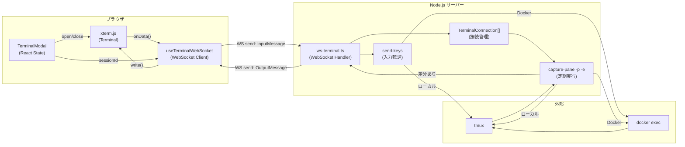
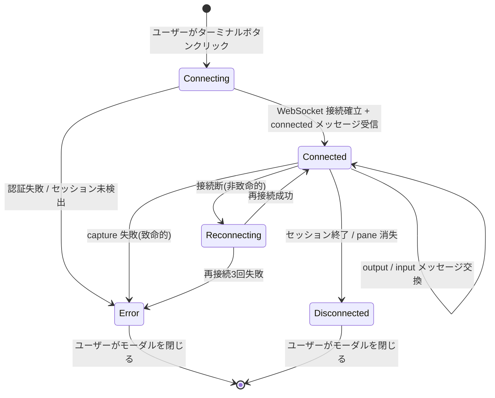

# データ構造設計

## 概要

| 項目 | 内容 |
|------|------|
| チケットID | tmux-pane-viewer |
| タスク名 | tmux pane ターミナルビューア機能 |
| 作成日 | 2025-07-17 |

---

## 1. 新規型定義

### 1.1 WebSocket メッセージ型（src/lib/ws-terminal.ts）

```typescript
// ===== クライアント→サーバー メッセージ =====

/** キー入力メッセージ */
export interface InputMessage {
  type: "input";
  data: string;
}

/** ターミナルリサイズメッセージ */
export interface ResizeMessage {
  type: "resize";
  cols: number;
  rows: number;
}

/** KeepAlive ping */
export interface PingMessage {
  type: "ping";
}

/** クライアントからのメッセージ Union */
export type ClientMessage = InputMessage | ResizeMessage | PingMessage;

// ===== サーバー→クライアント メッセージ =====

/** 接続確立通知 */
export interface ConnectedMessage {
  type: "connected";
  sessionId: string;
  tmuxPane: string;
  containerId?: string;
  cols: number;
  rows: number;
}

/** 端末出力 */
export interface OutputMessage {
  type: "output";
  data: string;
}

/** エラー通知 */
export interface ErrorMessage {
  type: "error";
  code: ErrorCode;
  message: string;
}

/** KeepAlive pong */
export interface PongMessage {
  type: "pong";
}

/** セッション切断通知 */
export interface DisconnectedMessage {
  type: "disconnected";
  reason: DisconnectReason;
}

/** サーバーからのメッセージ Union */
export type ServerMessage =
  | ConnectedMessage
  | OutputMessage
  | ErrorMessage
  | PongMessage
  | DisconnectedMessage;
```

### 1.2 エラー・切断理由の定数型

```typescript
/** WebSocket エラーコード */
export type ErrorCode =
  | "SESSION_NOT_FOUND"
  | "PANE_NOT_FOUND"
  | "CAPTURE_FAILED"
  | "AUTH_FAILED"
  | "CONNECTION_LIMIT";

/** 切断理由 */
export type DisconnectReason =
  | "session_ended"      // セッションが正常終了
  | "pane_closed"        // tmux pane が閉じられた
  | "timeout"            // KeepAlive タイムアウト
  | "capture_failed"     // capture-pane 連続失敗による切断（MRD-007）
  | "auth_expired"       // 認証期限切れ（MRD-007）
  | "server_shutdown";   // サーバーシャットダウン（MRD-007）
```

### 1.3 セッション解決結果型

```typescript
/** sessionId から解決されたセッション情報 */
export interface ResolvedSession {
  sessionId: string;
  tmuxPane: string;
  containerId?: string;
  containerUser?: string;
}
```

### 1.4 WebSocket 接続管理型

```typescript
/** アクティブな WebSocket ターミナル接続 */
export interface TerminalConnection {
  ws: WebSocket;
  sessionId: string;
  tmuxPane: string;
  containerId?: string;
  containerUser?: string;
  captureInterval: ReturnType<typeof setInterval> | null;
  lastOutput: string;         // 前回の capture-pane 出力（差分検出用）
  createdAt: number;          // 接続開始時刻（Unix ms）
  errorCount: number;         // capture-pane 連続失敗カウント（MRD-008）
}
```

### 1.5 フロントエンド状態型（src/hooks/useTerminalWebSocket.ts）

```typescript
/** WebSocket 接続状態 */
export type ConnectionState =
  | "connecting"
  | "connected"
  | "disconnected"
  | "error";

/** フック返却型 */
export interface UseTerminalWebSocketReturn {
  connectionState: ConnectionState;
  error: string | null;
  sendInput: (data: string) => void;
  sendResize: (cols: number, rows: number) => void;
  disconnect: () => void;
}

/** フックオプション */
export interface UseTerminalWebSocketOptions {
  onOutput?: (data: string) => void;
  onConnected?: (info: ConnectedMessage) => void;
  onError?: (error: ErrorMessage) => void;
  onDisconnected?: (reason: string) => void;
}
```

---

## 2. 既存型の変更

### 2.1 ActiveSession への影響

ActiveSession 型自体は変更不要。既存の `tmuxPane`、`containerId`、`containerUser` フィールドがそのままターミナルビューアで使用される。

| フィールド | 型 | 用途（ターミナルビューア） |
|------------|-----|--------------------------|
| `tmuxPane` | `string?` | ターミナルボタン表示条件 + WebSocket 接続パラメータ |
| `containerId` | `string?` | Docker exec 経由の capture-pane / send-keys |
| `containerUser` | `string?` | Docker exec の `-u` オプション |

### 2.2 既存型の変更

| 型名 | 変更前 | 変更後 | 理由 |
|------|--------|--------|------|
| （なし） | — | — | 既存型への変更は不要 |

---

## 3. データフロー

### 3.1 WebSocket ターミナルデータフロー



### 3.2 接続ライフサイクル



---

## 4. サーバー側接続管理

### 4.1 接続ストア

接続管理は `Map<WebSocket, TerminalConnection>` で行い、プロセスメモリ内で管理する（永続化不要）。

```typescript
// 接続ストア（モジュールスコープ）
const connections = new Map<WebSocket, TerminalConnection>();

// 同一 pane への接続数制限
const MAX_CONNECTIONS_PER_PANE = 2;

// 環境別の同時接続数上限（MRD-006）
const MAX_TOTAL_CONNECTIONS_LOCAL = 5;   // ローカル環境
const MAX_TOTAL_CONNECTIONS_DOCKER = 2;  // Docker環境（イベントループブロッキング防止）
```

### 4.2 キャプチャ間隔

| 環境 | 間隔 | 理由 |
|------|------|------|
| ローカル（containerId なし） | 200ms | execFileSync < 5ms、十分なリアルタイム性 |
| Docker（containerId あり） | 500ms | Docker exec 30-100ms のオーバーヘッド考慮 |

### 4.3 差分検出

```typescript
// capture-pane の出力を前回と比較
// 差分がある場合のみ OutputMessage を送信
if (currentOutput !== connection.lastOutput) {
  connection.lastOutput = currentOutput;
  ws.send(JSON.stringify({ type: "output", data: currentOutput }));
}
```

---

## 5. xterm.js キー入力と tmux send-keys の変換マップ

```typescript
/**
 * xterm.js onData の生データを tmux send-keys 用に変換
 * 特殊キー（制御文字・エスケープシーケンス）をマッピング
 */
const SPECIAL_KEY_MAP: Record<string, string> = {
  "\r":       "Enter",
  "\t":       "Tab",
  "\x7f":     "BSpace",
  "\x1b":     "Escape",
  "\x03":     "C-c",
  "\x04":     "C-d",
  "\x1a":     "C-z",
  "\x0c":     "C-l",
  "\x01":     "C-a",
  "\x05":     "C-e",
  "\x0b":     "C-k",
  "\x15":     "C-u",
  "\x17":     "C-w",
  "\x1b[A":   "Up",
  "\x1b[B":   "Down",
  "\x1b[C":   "Right",
  "\x1b[D":   "Left",
  "\x1b[H":   "Home",
  "\x1b[F":   "End",
  "\x1b[2~":  "IC",      // Insert
  "\x1b[3~":  "DC",      // Delete
  "\x1b[5~":  "PPage",   // PageUp
  "\x1b[6~":  "NPage",   // PageDown
};
```

---

## 6. マイグレーション計画

DB スキーマ変更なし。既存のファイルベースデータ（events.jsonl, workspace.yaml）にも影響なし。

新規データはすべてプロセスメモリ内（WebSocket 接続管理）で、永続化は不要。

---

## 変更履歴

| 日付 | バージョン | 変更内容 | 変更者 |
|------|------------|----------|--------|
| 2025-07-17 | 1.0 | 初版作成 | Copilot |
| 2025-07-17 | 1.1 | MRD-006: 同時接続数上限追加、MRD-007: DisconnectReason整備、MRD-008: errorCount追加 | Copilot |
