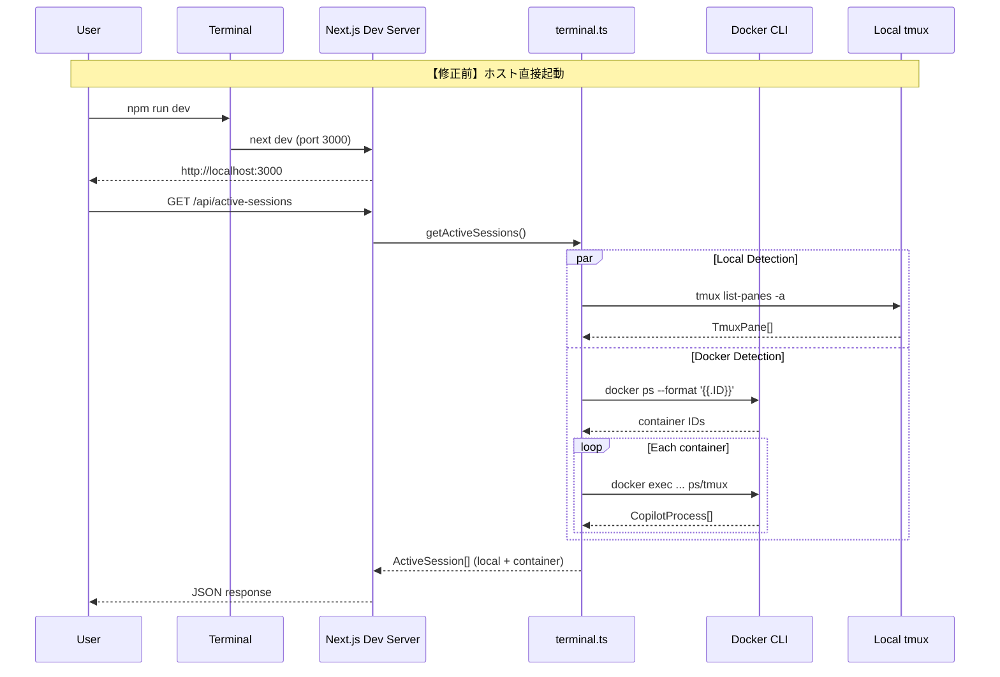
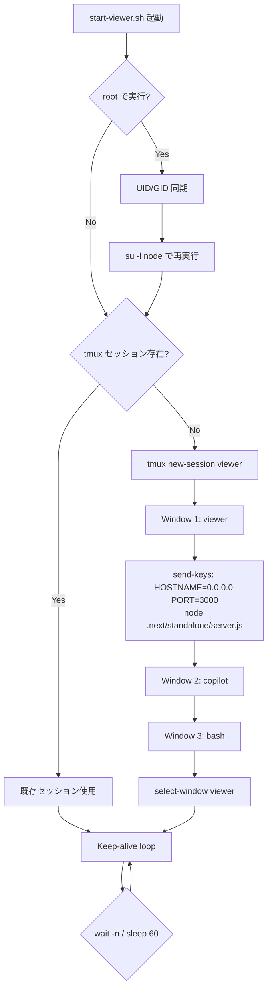
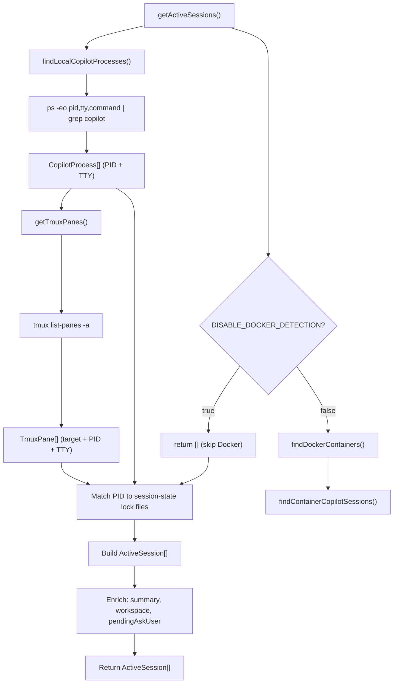
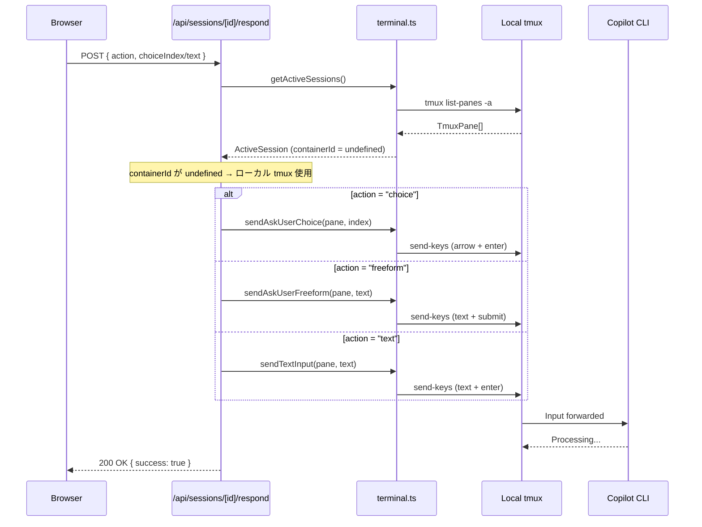
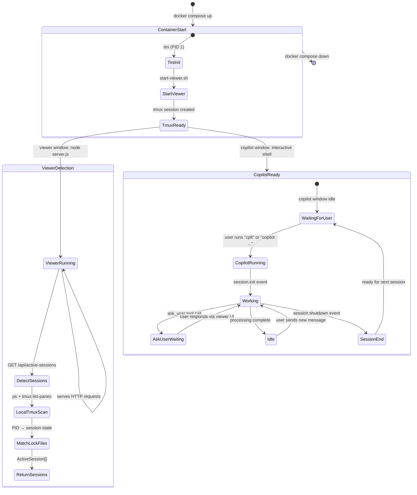
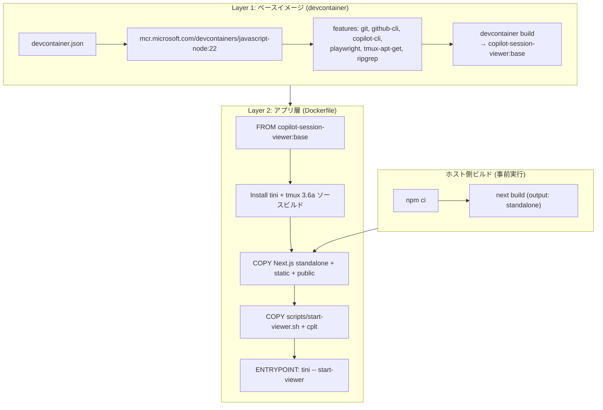
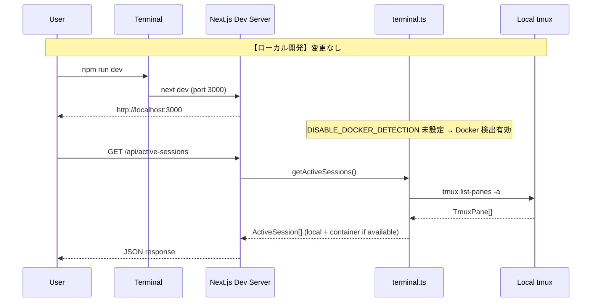

# 04. 処理フロー設計

## 概要

| 項目 | 内容 |
|------|------|
| チケットID | viewer-container-local |
| タスク名 | container |
| 作成日 | 2026-03-21 |
| 調査結果参照 | [investigation/](../investigation/) |

---

## 1. コンテナ起動フロー

### 1.1 修正前（ホスト直接起動）



### 1.2 修正後（コンテナ起動）

```mermaid
sequenceDiagram
    participant User as User
    participant Compose as docker compose
    participant Tini as tini (PID 1)
    participant Script as start-viewer.sh
    participant Tmux as tmux
    participant Next as Next.js Standalone
    participant Term as terminal.ts

    Note over User,Term: 【修正後】コンテナ起動

    User->>Compose: docker compose up -d
    Compose->>Tini: tini -- start-viewer
    Tini->>Script: start-viewer.sh

    Note over Script: UID/GID sync (if root)

    Script->>Tmux: tmux new-session -d -s viewer
    Script->>Tmux: tmux new-window "viewer"
    Script->>Tmux: send-keys "node server.js" (viewer window)
    Tmux->>Next: node .next/standalone/server.js
    Script->>Tmux: tmux new-window "copilot"
    Script->>Tmux: tmux new-window "bash"

    Note over Script: Keep-alive loop (while true; wait; sleep 60)

    Next-->>User: http://localhost:3000

    User->>Next: GET /api/active-sessions
    Next->>Term: getActiveSessions()

    Note over Term: DISABLE_DOCKER_DETECTION=true

    Term->>Tmux: tmux list-panes -a (local only)
    Tmux-->>Term: TmuxPane[]
    Note over Term: Docker detection SKIPPED
    Term-->>Next: ActiveSession[] (local tmux only)
    Next-->>User: JSON response
```

### 1.3 変更点サマリー

| 項目 | 修正前 | 修正後 | 理由 |
|------|--------|--------|------|
| 起動方法 | `npm run dev` | `docker compose up -d` | コンテナ化 |
| PID 1 | Node.js | tini | ゾンビプロセス回収 |
| Next.js 実行 | `next dev` | `node server.js` (standalone) | プロダクション実行 |
| tmux 管理 | ユーザー手動 | start-viewer.sh が自動起動 | self-contained |
| Docker 検出 | 有効 | 無効 (`DISABLE_DOCKER_DETECTION=true`) | コンテナ内では不要 |
| セッション検出 | ローカル + Docker | ローカルのみ | self-contained |

---

## 2. start-viewer.sh 詳細フロー



---

## 3. セッション検出フロー（コンテナ内）



---

## 4. ask_user 応答フロー（コンテナ内）



**コンテナ内の動作**: `containerId` が `undefined` の場合、`execFileSync("tmux", ...)` で
ローカル tmux に直接送信。Docker exec 経由の送信はスキップ。既存ロジックがそのまま動作する。

---

## 5. Copilot CLI セッションライフサイクル（コンテナ内）



---

## 6. ビルドフロー



> **NOTE**: Next.js の standalone ビルドはホスト側（またはCI）で事前に実行し、
> アプリ層 Dockerfile では COPY のみ行う。ベースイメージの再ビルドは features 変更時のみ。

---

## 7. ローカル開発フロー（非コンテナ）



**重要**: ローカル開発時は `DISABLE_DOCKER_DETECTION` が未設定のため、従来通り Docker 検出も有効。
既存の動作に影響なし。

---

## 変更履歴

| 日付 | バージョン | 変更内容 | 変更者 |
|------|------------|----------|--------|
| 2026-03-21 | 1.0 | 初版作成 | Copilot |
| 2026-03-21 | 1.1 | ビルドフローを devcontainer ベース + アプリ層の2層構成に変更 | Copilot |
