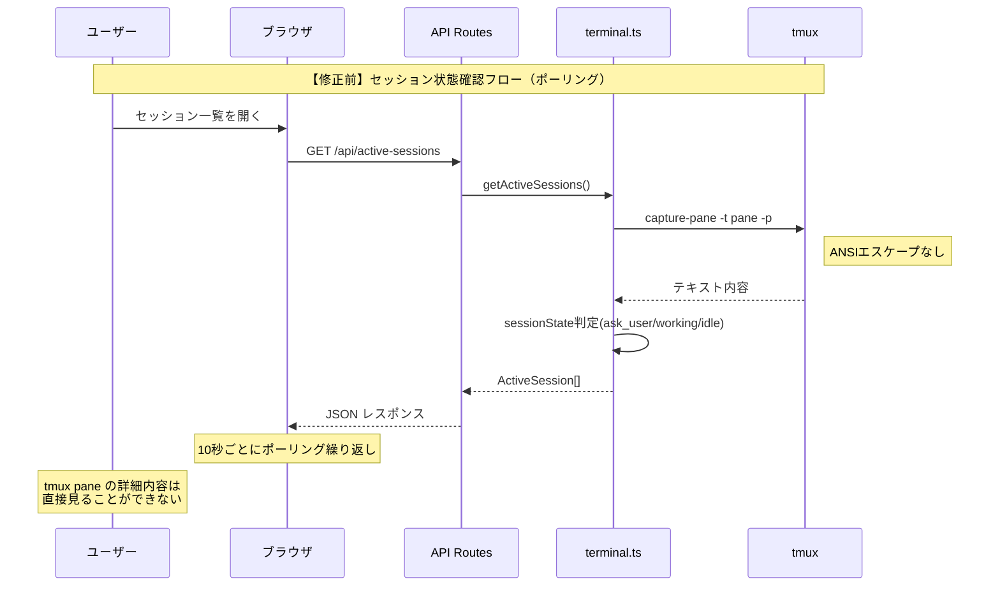
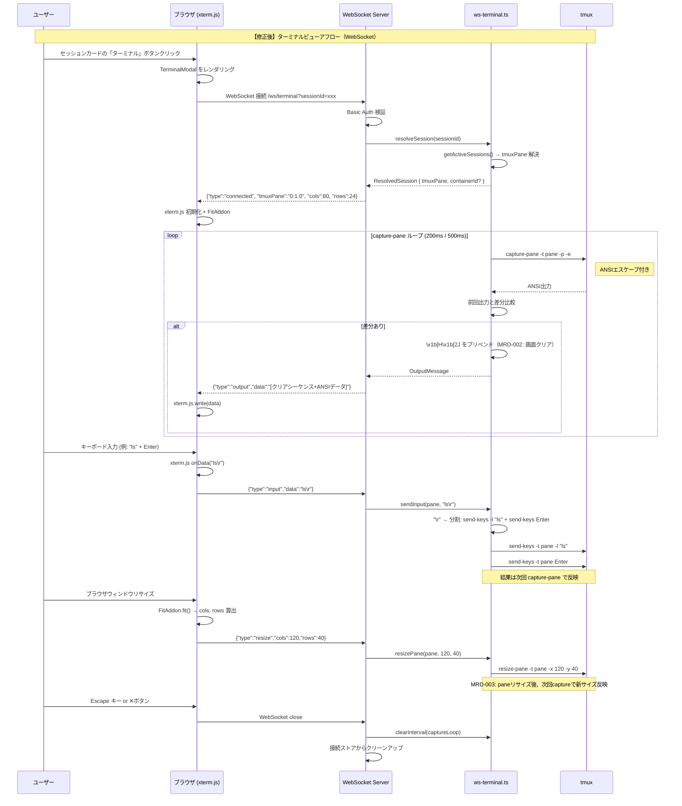
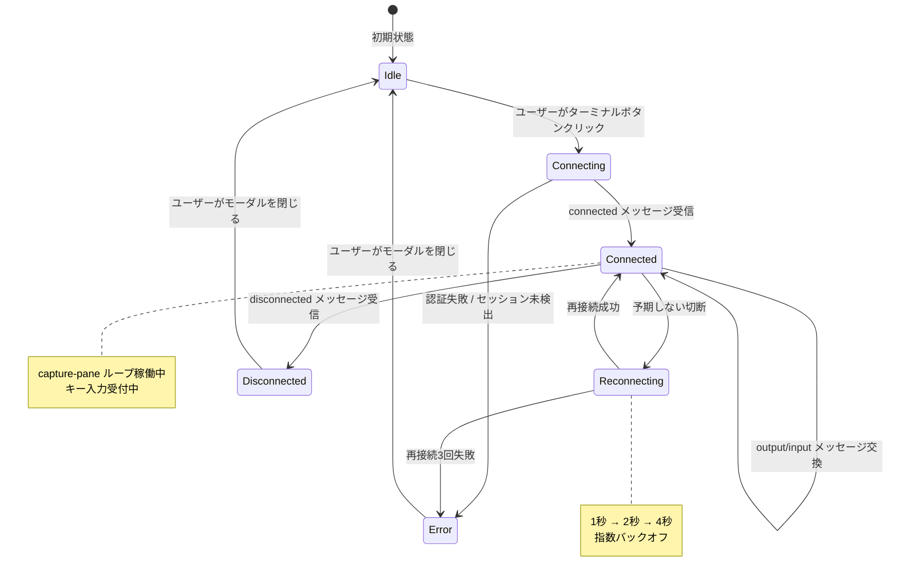
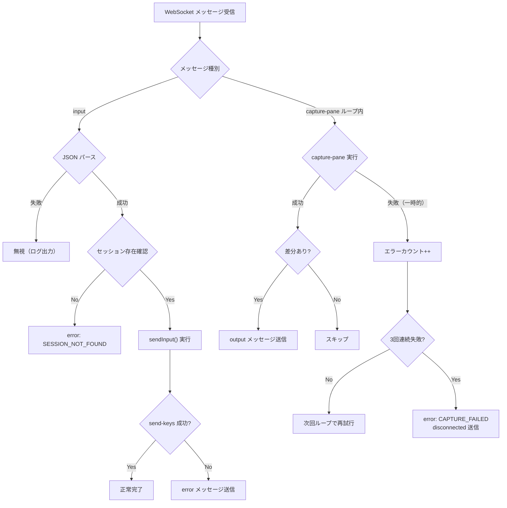
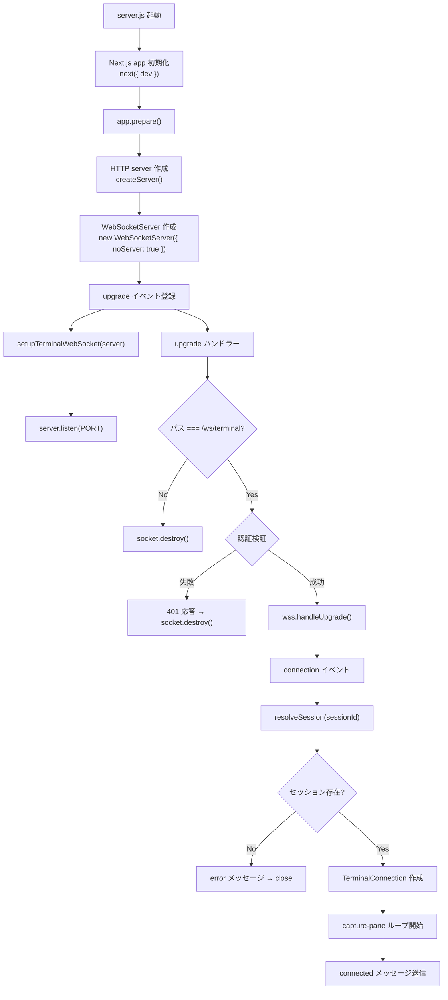
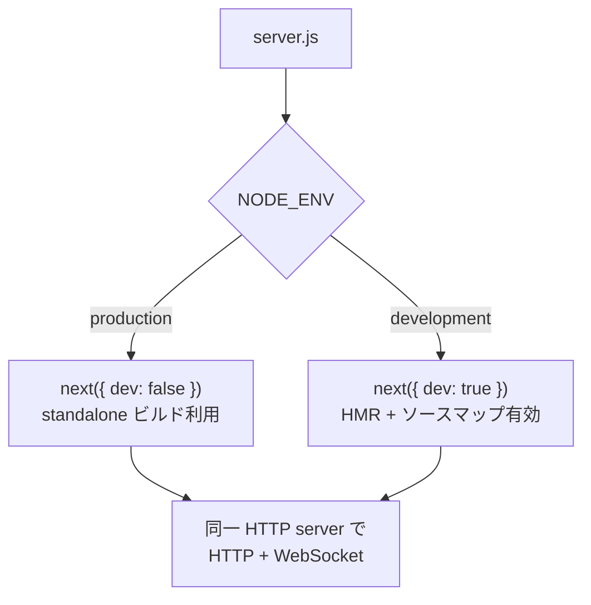
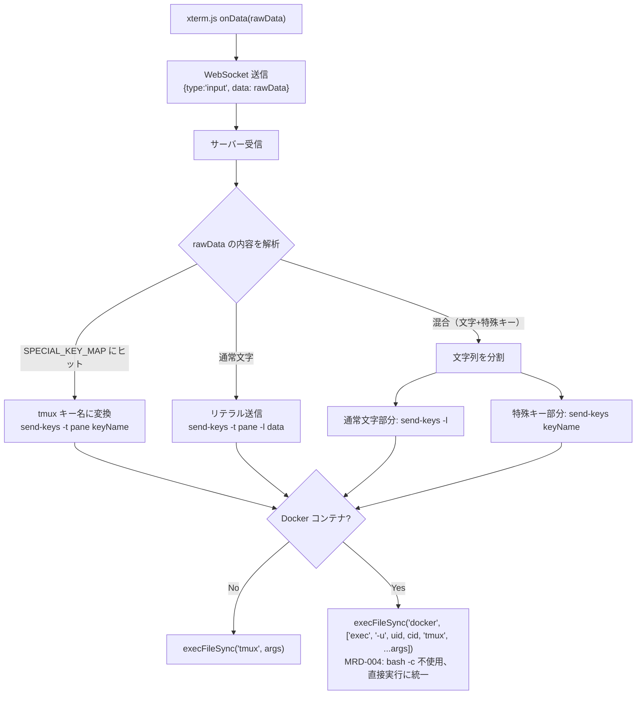
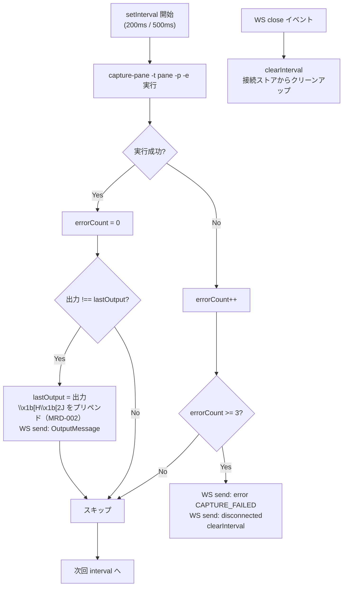
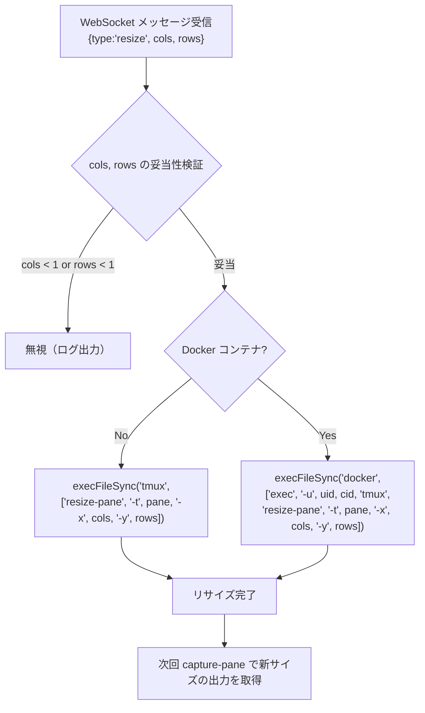

# 処理フロー設計

## 概要

| 項目 | 内容 |
|------|------|
| チケットID | tmux-pane-viewer |
| タスク名 | tmux pane ターミナルビューア機能 |
| 作成日 | 2025-07-17 |

---

## 1. シーケンス図（修正前/修正後対比）

### 1.1 修正前：現在の tmux pane 内容確認フロー



### 1.2 修正後：ターミナルビューアによるリアルタイム表示フロー



### 1.3 変更点サマリー

| 項目 | 修正前 | 修正後 | 理由 |
|------|--------|--------|------|
| 端末内容の取得 | ポーリング(10秒) + capture-pane -p | WebSocket + capture-pane -p -e (200ms) | リアルタイム表示 + ANSI色対応 |
| 表示方式 | セッション状態のみ（テキスト要約） | xterm.js によるフルターミナル描画 | TUI アプリ操作対応 |
| キー入力 | ask_user 応答のみ（テキストフォーム） | xterm.js → WS → send-keys パイプライン | 直接ターミナル操作 |
| 通信方式 | HTTP ポーリング | WebSocket 双方向 | 低レイテンシ |
| サーバー構成 | Next.js standalone server.js | カスタム server.js (HTTP + WS) | WebSocket 対応のため |

---

## 2. 状態遷移図

### 2.1 WebSocket 接続の状態遷移



### 2.2 状態定義

| 状態 | 説明 | 遷移条件（IN） | 遷移条件（OUT） |
|------|------|----------------|-----------------|
| Idle | モーダル未表示 | モーダル閉じる | ターミナルボタンクリック |
| Connecting | WebSocket 接続中 | ボタンクリック | connected / error |
| Connected | アクティブストリーミング中 | 接続確立 | 切断 / エラー |
| Reconnecting | 自動再接続中 | 予期しない切断 | 再接続成功 / 3回失敗 |
| Disconnected | セッション終了による切断 | disconnected メッセージ | モーダル閉じる |
| Error | エラー状態 | 認証失敗 / 再接続失敗 | モーダル閉じる |

---

## 3. エラーフロー

### 3.1 エラーハンドリングフロー



### 3.2 エラー種別と対応

| エラー種別 | 発生条件 | サーバー側対応 | クライアント側対応 | リトライ |
|------------|----------|---------------|-------------------|----------|
| 認証失敗 | Authorization ヘッダー不正 | 401 → socket.destroy() | — (接続不可) | ❌ |
| セッション未検出 | sessionId に対応するアクティブセッションなし | error メッセージ → close | エラー表示 | ❌ |
| pane 未検出 | tmuxPane が null | error メッセージ → close | エラー表示 | ❌ |
| capture 一時失敗 | tmux コマンドエラー | エラーカウント、ループ継続 | — | ✅(自動) |
| capture 連続失敗 | 3回連続 capture 失敗 | disconnected メッセージ → close | 再接続提案 | ✅(ユーザー操作) |
| 予期しない切断 | ネットワーク断等 | — | 自動再接続(3回) | ✅(自動) |
| 接続数超過 | 同一 pane に MAX_CONNECTIONS_PER_PANE 超 | error: CONNECTION_LIMIT → close | エラー表示 | ❌ |

---

## 4. カスタム server.js の処理フロー

### 4.1 サーバー起動フロー



### 4.2 本番モード vs 開発モード



---

## 5. send-keys 入力処理フロー

### 5.1 キー入力変換パイプライン



---

## 6. capture-pane ループ処理フロー

### 6.1 キャプチャ制御フロー



---

## 7. resize 処理フロー（MRD-003）

### 7.1 resize メッセージ受信時の処理フロー



---

## 8. sendInput 擬似コード（MRD-009）

### 8.1 入力分割アルゴリズム

```typescript
/**
 * sendInput 擬似コード
 * 基本方針: xterm.js onData は通常1キーずつ発火する。
 * ペースト時は複数文字が一括で来るため -l（リテラル）で送信する。
 * エスケープシーケンス途中での分割を防ぐため、先頭からマッチングを行う。
 */
function sendInput(pane: string, data: string, containerId?: string, containerUser?: string): void {
  let remaining = data;

  while (remaining.length > 0) {
    let matched = false;

    // 1. SPECIAL_KEY_MAP の長いキーから順にマッチ（エスケープシーケンス優先）
    for (const [sequence, tmuxKey] of sortedByLengthDesc(SPECIAL_KEY_MAP)) {
      if (remaining.startsWith(sequence)) {
        execTmuxSendKeys(pane, tmuxKey, containerId, containerUser);  // send-keys KeyName
        remaining = remaining.slice(sequence.length);
        matched = true;
        break;
      }
    }

    if (!matched) {
      // 2. 次の特殊キーまでの通常文字をまとめてリテラル送信
      const nextSpecialIdx = findNextSpecialKeyIndex(remaining);
      const literal = nextSpecialIdx === -1 ? remaining : remaining.slice(0, nextSpecialIdx);
      execTmuxSendKeysLiteral(pane, literal, containerId, containerUser);  // send-keys -l "text"
      remaining = remaining.slice(literal.length);
    }
  }
}
```

> **設計判断**: 単一キー入力が主ケース。ペースト時は `send-keys -l` でリテラル送信し、エスケープシーケンスの途中分割を回避する。

---

## 変更履歴

| 日付 | バージョン | 変更内容 | 変更者 |
|------|------------|----------|--------|
| 2025-07-17 | 1.0 | 初版作成 | Copilot |
| 2025-07-17 | 1.1 | MRD-002: クリアシーケンスプリペンド、MRD-003: resizeフロー追加、MRD-004: Docker exec統一、MRD-009: sendInput擬似コード追加 | Copilot |
