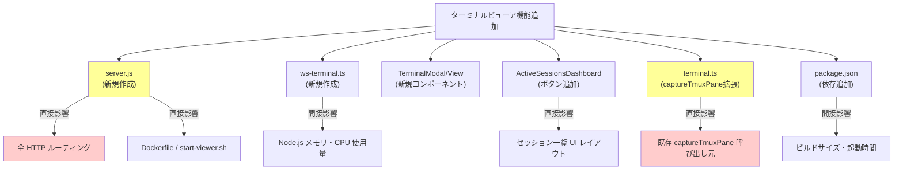

# 弊害検証計画

## 概要

| 項目 | 内容 |
|------|------|
| チケットID | tmux-pane-viewer |
| タスク名 | tmux pane ターミナルビューア機能 |
| 作成日 | 2025-07-17 |

---

## 1. 副作用分析

### 1.1 副作用が発生しやすい箇所

| 箇所 | 影響度 | 発生可能性 | 検証方法 | 優先度 |
|------|--------|------------|----------|--------|
| カスタム server.js 導入による既存 HTTP ルーティングへの影響 | 高 | 中 | 既存 E2E テスト全通過確認 | 高 |
| captureTmuxPane の `-e` フラグ追加 | 中 | 低 | 既存 terminal.test.ts 通過 + 新規 UT | 中 |
| ActiveSessionsDashboard へのボタン追加 | 低 | 低 | 既存コンポーネントテスト + E2E | 低 |
| 高頻度 capture-pane 実行による tmux 負荷 | 中 | 中 | 負荷テスト（複数接続） | 中 |
| WebSocket 接続による Node.js プロセスメモリ使用量増加 | 中 | 中 | メモリモニタリング | 中 |
| package.json 依存追加 (ws, @xterm/xterm) による ビルドサイズ増加 | 低 | 低 | ビルドサイズ比較 | 低 |

### 1.2 影響範囲マップ

---

## 2. 回帰テスト

### 2.1 実行すべき回帰テスト

| テストスイート | 対象機能 | 優先度 | 必須/推奨 |
|----------------|----------|--------|-----------|
| `src/lib/__tests__/terminal.test.ts` | tmux 操作全般 | 高 | 必須 |
| `src/lib/__tests__/sessions.test.ts` | セッション解析 | 高 | 必須 |
| `src/__tests__/middleware.test.ts` | Basic Auth ミドルウェア | 高 | 必須 |
| `src/components/__tests__/*.test.tsx` | 全コンポーネント | 中 | 必須 |
| `e2e/auth.spec.ts` | 認証 E2E | 高 | 必須 |
| `e2e/container-startup.spec.ts` | コンテナ起動 | 高 | 必須 |
| `e2e/tmux-stability.spec.ts` | tmux 安定性 | 高 | 必須 |
| `e2e/yaml-viewer.spec.ts` | YAML ビューア | 中 | 推奨 |
| `e2e/container-isolation.spec.ts` | コンテナ分離 | 中 | 推奨 |

### 2.2 回帰テストチェックリスト

- [ ] 既存の全単体テスト (Vitest) が通過
- [ ] 既存の全コンポーネントテストが通過
- [ ] セッション一覧の表示が正常（ポーリング動作含む）
- [ ] セッション詳細ページの表示が正常
- [ ] ask_user 応答機能が正常動作
- [ ] セッション終了機能が正常動作
- [ ] Basic Auth 認証が既存通り動作
- [ ] Docker コンテナ起動が正常
- [ ] tmux セッション管理が安定動作

---

## 3. パフォーマンス検証

### 3.1 検証項目

| 項目 | 目標値 | 許容値 | 測定方法 |
|------|--------|--------|----------|
| capture-pane 応答時間（ローカル） | < 5ms | < 10ms | console.time 計測 |
| capture-pane 応答時間（Docker） | < 100ms | < 200ms | console.time 計測 |
| WebSocket メッセージ遅延 | < 50ms | < 200ms | クライアント側タイムスタンプ比較 |
| ターミナルビューアの初期表示時間 | < 500ms | < 1000ms | Playwright performance timing |
| Node.js メモリ使用量（5接続時） | < 150MB | < 200MB | process.memoryUsage() |
| CPU 使用率（5接続 capture ループ時） | < 10% | < 20% | top / pidstat |

### 3.2 負荷テストシナリオ

| シナリオ | 条件 | 期待結果 | 実行時間 |
|----------|------|----------|----------|
| 単一接続持続 | 1 WebSocket 接続、5分間 | メモリリーク・CPU スパイクなし | 5分 |
| 複数同時接続 | 5 WebSocket 接続（異なるセッション） | 全接続で応答遅延 < 500ms | 2分 |
| 急速入力 | 連続キー入力 100 文字/秒 | ドロップなし、表示遅延 < 1秒 | 30秒 |
| 大量出力 | tmux pane に大量テキスト出力 | xterm.js がフリーズしない | 1分 |
| Docker 環境 複数接続（MRD-006） | Docker 環境で 2 WebSocket 接続（上限値） | 全接続で応答遅延 < 1000ms、イベントループブロッキングなし | 2分 |
| Docker 環境 接続数超過（MRD-006） | Docker 環境で 3 WebSocket 接続（上限超過） | 3番目の接続が CONNECTION_LIMIT で拒否される | 30秒 |

---

## 4. セキュリティ検証

### 4.1 検証項目

| 項目 | 確認内容 | 検証方法 | チェック |
|------|----------|----------|----------|
| WS 認証 | Basic Auth 未設定時は認証スキップ、設定時は検証 | UT-1〜3 + 手動テスト | ⬜ |
| WS 認証バイパス | 認証なしで /ws/terminal に接続不可 | E2E-8 | ⬜ |
| 入力サニタイズ | send-keys -l でリテラル送信（インジェクション防止） | UT-10〜15 | ⬜ |
| sessionId 検証 | 無効な sessionId で接続拒否 | UT-5 | ⬜ |
| コマンドインジェクション | WebSocket 入力経由のシェルインジェクション不可 | execFileSync 使用確認 | ⬜ |
| DoS | 接続数制限が機能 | UT-19 | ⬜ |

### 4.2 セキュリティチェックリスト

- [ ] WebSocket Upgrade ハンドラーで Authorization ヘッダーを検証
- [ ] 無効な Upgrade パスは即座に socket.destroy()
- [ ] sessionId は getActiveSessions() の結果と突合（任意のファイルアクセス不可）
- [ ] send-keys は execFileSync で直接実行（シェル経由しない）
- [ ] 接続数制限 (MAX_CONNECTIONS_PER_PANE = 2) でリソース枯渇を防止
- [ ] WebSocket close 時にリソース（interval, 接続ストア）が確実にクリーンアップされる

---

## 5. 互換性検証

### 5.1 後方互換性

| 項目 | 互換性 | 確認方法 | 備考 |
|------|--------|----------|------|
| 既存 REST API | ✅ | 既存 E2E テスト | 一切変更なし |
| セッション一覧 UI | ✅ | E2E-6 | ボタン追加のみ、レイアウト影響最小 |
| ask_user 応答 | ✅ | E2E-7 | 変更なし |
| Basic Auth ミドルウェア | ✅ | auth.spec.ts | 変更なし（WS は別パスで処理） |
| captureTmuxPane | ✅ | terminal.test.ts | デフォルト値 false で後方互換 |

### 5.2 環境互換性

| 環境 | 対応状況 | 確認方法 |
|------|----------|----------|
| ローカル（tmux 直接） | ✅ 対応 | 単体テスト + E2E |
| Docker コンテナ内 | ✅ 対応 | E2E-5 |
| カスタム server.js 環境 | ✅ 対応（本変更で導入） | container-startup.spec.ts |
| WebSocket 未対応ブラウザ | ⚠️ 非対応（エラー表示） | 手動確認 |

### 5.3 ブラウザ互換性（MRD-011）

WebSocket Upgrade リクエストへの Authorization ヘッダー自動付与はブラウザ実装依存のため、以下の互換性情報を明記する。

| ブラウザ | 最小バージョン | WS Authorization 自動付与 | 備考 |
|----------|---------------|--------------------------|------|
| Chrome | 16+ | ✅ | Basic Auth 認証済み時に自動付与 |
| Firefox | 11+ | ✅ | Basic Auth 認証済み時に自動付与 |
| Safari | 7+ | ✅ | Basic Auth 認証済み時に自動付与 |
| Edge | 12+ | ✅ | Chromium ベース |
| IE | — | ❌ | 非対応（サポート対象外） |

**非対応ブラウザの挙動**: WebSocket 接続時に Authorization ヘッダーが付与されない場合、サーバー側で 401 応答を返しソケットを切断する。クライアント側では「ご利用のブラウザではターミナル機能を利用できません」のエラーメッセージを表示する。

---

## 6. カスタム server.js 導入の影響検証

### 6.1 検証項目

| 項目 | 確認内容 | 検証方法 |
|------|----------|----------|
| HTTP ルーティング | 全既存 API ルートが正常応答 | 既存 E2E テスト |
| 静的ファイル配信 | _next/static, favicon.ico が正常 | ブラウザ DevTools |
| HMR（開発モード） | next dev 相当の HMR が動作 | 開発中に手動確認 |
| standalone ビルド | `next build` + カスタム server.js で正常起動 | container-startup.spec.ts |
| 起動時間 | 従来の standalone server.js と同等 | 計測比較 |
| Dockerfile | COPY server.js が正しく配置される | docker build + 起動確認 |
| start-viewer.sh | `node server.js` が正しく起動 | コンテナ内動作確認 |

---

## 7. 検証実行計画

### 7.1 実行順序

1. 回帰テスト（既存テスト全通過確認）
2. セキュリティ検証（認証、入力サニタイズ）
3. パフォーマンス検証（レイテンシ、メモリ）
4. 互換性検証（後方互換、環境互換）
5. カスタム server.js 影響検証

---

## 8. 結果レポートテンプレート

### 8.1 検証結果サマリー

| 検証項目 | 結果 | 発見事項 | 対応状況 |
|----------|------|----------|----------|
| 回帰テスト | ⬜ | | |
| セキュリティ | ⬜ | | |
| パフォーマンス | ⬜ | | |
| 互換性 | ⬜ | | |
| server.js 影響 | ⬜ | | |

### 8.2 発見した問題

| No | 問題 | 重大度 | 対応方針 | 対応状況 |
|----|------|--------|----------|----------|
| | | | | |

---

## 変更履歴

| 日付 | バージョン | 変更内容 | 変更者 |
|------|------------|----------|--------|
| 2025-07-17 | 1.0 | 初版作成 | Copilot |
| 2025-07-17 | 1.1 | MRD-006: Docker負荷テストシナリオ追加、MRD-011: ブラウザ互換性注記追加 | Copilot |
