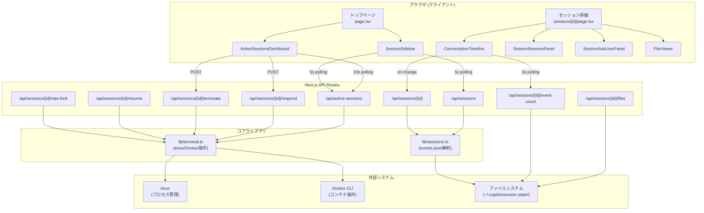

# アーキテクチャ調査

## 概要

copilot-session-viewer は Next.js 16 (React 19, App Router) で構築された Web ビューアで、GitHub Copilot CLI のセッションデータをブラウザから閲覧・操作する。standalone モードでビルドし、Docker コンテナ内で tmux セッション管理と併用して稼働する。

## ディレクトリ構造

```
copilot-session-viewer/
├── src/
│   ├── app/                                # Next.js App Router
│   │   ├── api/                            # API Routes (REST)
│   │   │   ├── active-sessions/route.ts    # GET アクティブセッション一覧
│   │   │   ├── dev-process/start-copilot/route.ts  # Dev-process操作(880行)
│   │   │   └── sessions/
│   │   │       ├── route.ts                # GET セッション一覧
│   │   │       └── [id]/
│   │   │           ├── route.ts            # GET セッション詳細
│   │   │           ├── event-count/route.ts  # GET イベントファイル統計(mtime)
│   │   │           ├── files/route.ts      # GET プロジェクト/セッションファイル
│   │   │           ├── rate-limit/route.ts # GET レート制限状態
│   │   │           ├── respond/route.ts    # POST ユーザー入力送信
│   │   │           ├── resume/route.ts     # GET/POST セッション再開
│   │   │           └── terminate/route.ts  # POST セッション終了
│   │   ├── layout.tsx                      # ルートレイアウト
│   │   ├── page.tsx                        # トップページ(一覧+アクティブ)
│   │   └── sessions/[id]/page.tsx          # セッション詳細ページ
│   ├── components/                         # React コンポーネント
│   │   ├── ActiveSessionsDashboard.tsx     # 458行 メインダッシュボード
│   │   ├── ConversationTimeline.tsx        # 911行 会話タイムライン
│   │   ├── SessionSidebar.tsx              # 192行 左サイドバー
│   │   ├── FileViewer.tsx                  # 387行 ファイルブラウザ
│   │   ├── SessionTodosPanel.tsx           # 162行 Todo進捗パネル
│   │   ├── SessionResumePanel.tsx          # 179行 セッション再開UI
│   │   ├── SessionAskUserPanel.tsx         # 271行 ask_user応答UI
│   │   ├── ExpandableTextInput.tsx         # 144行 拡張テキスト入力
│   │   ├── ContextWindowBadge.tsx          # コンテキストウィンドウ表示
│   │   ├── RateLimitBanner.tsx             # 79行 レート制限バナー
│   │   ├── DevProcessPanel.tsx             # Dev-process操作パネル
│   │   ├── ThemeProvider.tsx               # next-themes ラッパー
│   │   ├── ThemeToggle.tsx                 # テーマ切替ボタン
│   │   ├── ProjectFilesSection.tsx         # プロジェクトファイルセクション
│   │   ├── SessionFilesSection.tsx         # セッションファイルセクション
│   │   ├── __tests__/                      # コンポーネントテスト
│   │   └── renderers/                      # レンダラー
│   │       ├── MarkdownRenderer.tsx        # Markdown表示
│   │       ├── YamlRenderer.tsx            # YAML表示
│   │       └── __tests__/                  # レンダラーテスト
│   ├── lib/                                # コアライブラリ
│   │   ├── terminal.ts                     # 1092行 tmux/Docker操作
│   │   ├── sessions.ts                     # 762行 セッション解析
│   │   ├── format.ts                       # フォーマットユーティリティ
│   │   ├── yaml-utils.ts                   # YAML解析ヘルパー
│   │   └── __tests__/                      # ライブラリテスト
│   └── middleware.ts                       # Basic Auth ミドルウェア
├── e2e/                                    # Playwright E2E テスト
├── scripts/                                # Docker/シェルスクリプト
│   ├── docker-entrypoint.sh
│   ├── start-viewer.sh                     # tmux セッション構築
│   └── cplt                                # Copilot CLI ラッパー
├── compose.yaml                            # Docker Compose 本番設定
├── compose.dev.yaml                        # Docker Compose 開発オーバーレイ
├── Dockerfile                              # マルチステージビルド
├── next.config.ts                          # standalone出力設定
└── package.json                            # 依存関係・スクリプト
```

## アーキテクチャパターン

Next.js App Router ベースの 3 層アーキテクチャ:

1. **プレゼンテーション層**: React 19 コンポーネント（ポーリングベースのリアルタイム更新）
2. **API 層**: Next.js API Routes（REST エンドポイント、`force-dynamic`）
3. **インフラ層**: `lib/terminal.ts`（tmux / Docker exec 操作）、`lib/sessions.ts`（events.jsonl 解析）

## コンポーネント図



## レイヤー構成

| レイヤー | 責務 | 主要コンポーネント |
|----------|------|-------------------|
| プレゼンテーション | UI表示、ポーリング、ユーザー操作 | React 19コンポーネント、Tailwind CSS v4 |
| API | HTTPリクエスト処理、データ変換 | Next.js API Routes (10エンドポイント) |
| ライブラリ | ビジネスロジック、外部システム連携 | terminal.ts, sessions.ts |
| インフラ | プロセス管理、ファイルI/O | tmux, Docker CLI, ファイルシステム |

## 主要ファイル

| ファイルパス | 行数 | 役割 |
|--------------|------|------|
| `src/lib/terminal.ts` | 1092 | tmux操作・Docker exec・セッション検出・入力送信 |
| `src/lib/sessions.ts` | 762 | events.jsonl解析・会話履歴構築・メトリクス集計 |
| `src/components/ConversationTimeline.tsx` | 911 | 会話タイムライン表示（自動スクロール・サブエージェント色分け） |
| `src/components/ActiveSessionsDashboard.tsx` | 458 | アクティブセッション管理ダッシュボード |
| `src/app/api/dev-process/start-copilot/route.ts` | 880 | Dev-process統合（ワークツリー管理） |
| `src/middleware.ts` | 30 | Basic Auth ミドルウェア（オプション） |
| `next.config.ts` | 7 | standalone出力設定 |

## リアルタイム更新アーキテクチャ（現行）

現在はポーリングベースで、WebSocket / SSE は未使用:

| コンポーネント | エンドポイント | ポーリング間隔 |
|----------------|----------------|----------------|
| ActiveSessionsDashboard | `/api/active-sessions` | 10秒 |
| SessionSidebar | `/api/sessions` + `/api/active-sessions` | 5秒 |
| ConversationTimeline | `/api/sessions/{id}/event-count` | 3秒 (mtime変更時のみfetch) |
| SessionAskUserPanel | `/api/active-sessions` | 3秒 |
| RateLimitBanner | `/api/sessions/{id}/rate-limit` | 30秒 |

## 備考

- **カスタムサーバーは存在しない**: `server.js` / `server.ts` はリポジトリに含まれず、`next build` の standalone 出力が `.next/standalone/server.js` を自動生成する
- **WebSocket は未実装**: `ws` ライブラリも `socket.io` も依存関係に存在しない
- **状態管理ライブラリなし**: React hooks のみ（useState, useRef, useContext は ConversationTimeline 内ローカルのみ）
- **Docker 内 tmux 構成**: `start-viewer.sh` が tmux セッション（viewer / copilot / bash の3ウィンドウ）を構築
