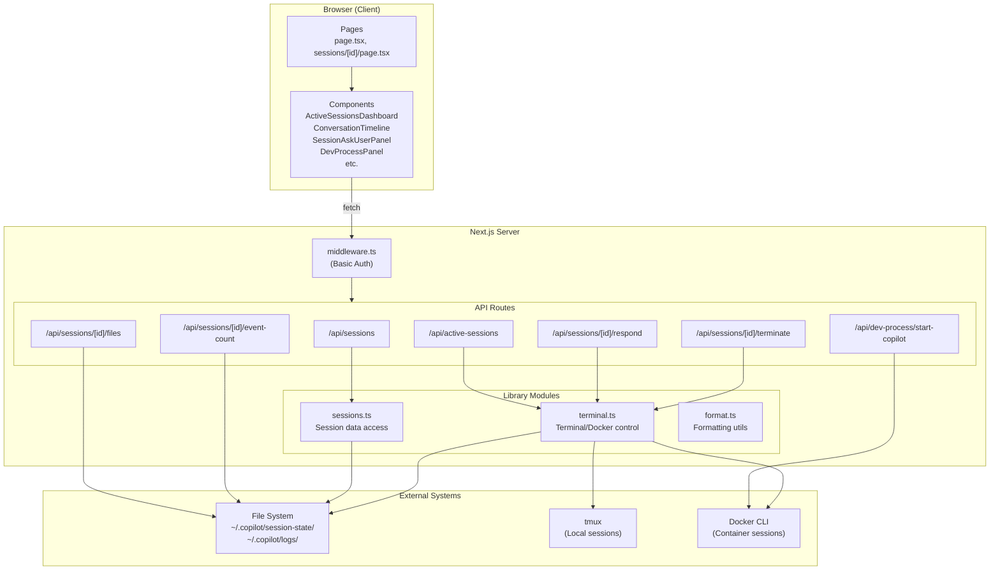

# 01. アーキテクチャ調査

## 背景

copilot-session-viewer を単一コンテナで自己完結動作させるため、現在のアーキテクチャを把握する。

## プロジェクト構成

### ディレクトリ構造

```
copilot-session-viewer/
├── public/                              # Static assets (SVG icons)
├── src/
│   ├── app/                             # Next.js App Router
│   │   ├── layout.tsx                   # Root layout (HTML/body/fonts)
│   │   ├── page.tsx                     # Home page (session list + active dashboard)
│   │   ├── sessions/
│   │   │   └── [id]/
│   │   │       └── page.tsx             # Session detail page
│   │   └── api/
│   │       ├── active-sessions/
│   │       │   └── route.ts             # GET: Active session list
│   │       ├── sessions/
│   │       │   ├── route.ts             # GET: All sessions
│   │       │   └── [id]/
│   │       │       ├── route.ts         # GET: Session detail
│   │       │       ├── respond/
│   │       │       │   └── route.ts     # POST: Send user response
│   │       │       ├── terminate/
│   │       │       │   └── route.ts     # POST: Terminate session
│   │       │       ├── files/
│   │       │       │   └── route.ts     # GET: Session files
│   │       │       └── event-count/
│   │       │           └── route.ts     # GET: Event count
│   │       └── dev-process/
│   │           └── start-copilot/
│   │               └── route.ts         # GET/POST/DELETE: Dev-process management
│   ├── components/                      # React UI components (11 files)
│   │   ├── ActiveSessionsDashboard.tsx  # Active session overview
│   │   ├── ContextWindowBadge.tsx       # Token utilization badge
│   │   ├── ConversationTimeline.tsx     # Session conversation display
│   │   ├── DevProcessPanel.tsx          # Dev-process control panel
│   │   ├── ExpandableTextInput.tsx      # Expandable text input
│   │   ├── MarkdownFileViewer.tsx       # Markdown preview with Mermaid
│   │   ├── ProjectFilesSection.tsx      # Git project files
│   │   ├── SessionAskUserPanel.tsx      # ask_user interaction panel
│   │   ├── SessionFilesSection.tsx      # Session state files
│   │   ├── SessionSidebar.tsx           # Navigation sidebar
│   │   └── SessionTodosPanel.tsx        # Todo tracking panel
│   ├── lib/                             # Server-side logic
│   │   ├── sessions.ts                  # Session data access (751 lines)
│   │   ├── terminal.ts                  # Terminal/Docker/tmux control (866 lines)
│   │   └── format.ts                    # Formatting utilities
│   └── middleware.ts                    # Basic auth middleware
├── submodules/
│   └── dev-process/                     # Git submodule (dev-process reference)
├── next.config.ts                       # Next.js configuration
├── tsconfig.json                        # TypeScript configuration
├── eslint.config.mjs                    # ESLint flat config
├── postcss.config.mjs                   # PostCSS (Tailwind v4)
├── package.json                         # Dependencies & scripts
└── package-lock.json                    # Lock file
```

### 技術スタック

| レイヤー | 技術 | バージョン |
|----------|------|-----------|
| フレームワーク | Next.js (App Router) | 16.2.0 |
| UI ライブラリ | React | 19.2.4 |
| スタイリング | Tailwind CSS | v4 |
| 言語 | TypeScript | 5.x (strict mode) |
| セッションストア | ファイルベース (YAML + JSONL) | — |
| プロセス制御 | child_process (tmux, docker) | — |
| 認証 | Basic Auth (middleware) | — |

## コンポーネント図



## Next.js 設定

### next.config.ts

```typescript
const nextConfig: NextConfig = {
  allowedDevOrigins: ["192.168.1.175"],
};
```

- 最小限の設定。`allowedDevOrigins` は開発用 LAN IP のみ
- `output: "standalone"` は未設定（コンテナ化時に追加が必要）

### tsconfig.json

- `target: "ES2017"`, `module: "esnext"`, `moduleResolution: "bundler"`
- `strict: true` 有効
- Path alias: `@/*` → `./src/*`
- `jsx: "react-jsx"` (Next.js デフォルト)
- `isolatedModules: true` — Vitest との互換性あり

## コンテナ化への影響

1. **`output: "standalone"` の追加が必要** — Next.js をコンテナ内で効率的に実行するため
2. **`allowedDevOrigins` の拡張** — コンテナ内からのアクセスを許可
3. **ファイルシステム依存** — `~/.copilot/` へのパスがハードコードされている（`process.env.HOME` 依存）
4. **child_process 依存** — tmux, docker CLI がコンテナ内で利用可能である必要がある
5. **テスト基盤なし** — Vitest の新規導入が必要（tsconfig.json は互換）
