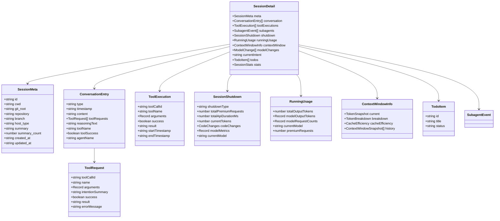
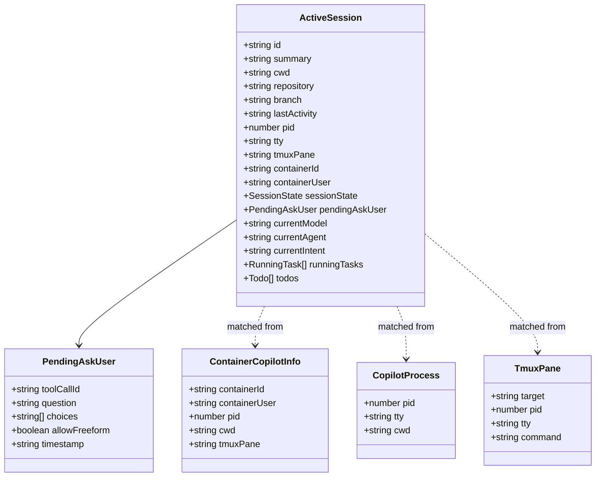
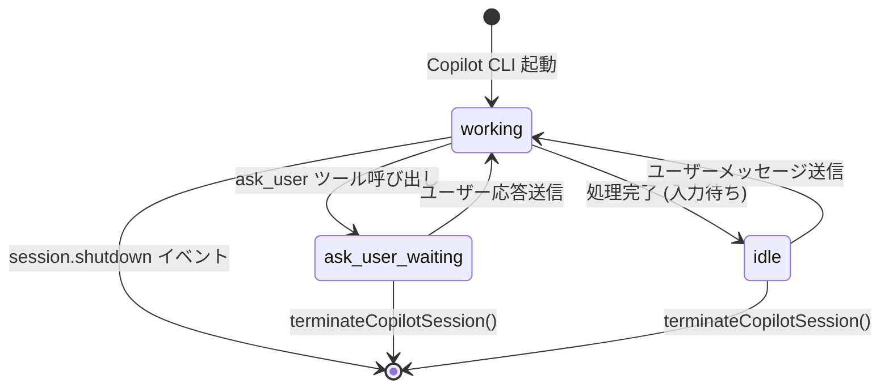

# 02. データ構造調査

## 背景

セッション管理の全データ構造を把握し、コンテナ内での `$HOME/.copilot` 分離設計に活用する。

## ファイルシステム上のデータ構造

### セッションストレージ

```
~/.copilot/
├── session-state/                    # セッションメタデータ・イベント
│   └── {session-id}/
│       ├── workspace.yaml            # Git/プロジェクトメタデータ
│       ├── events.jsonl              # セッションイベントログ (JSONL)
│       └── inuse.{PID}.lock          # プロセスロックファイル
├── logs/                             # Copilot プロセスログ
│   └── process-{timestamp}-{PID}.log
└── config.json                       # Copilot 設定
```

### パス構築パターン

```typescript
// sessions.ts, terminal.ts で共通
const SESSION_STATE_DIR = path.join(
  process.env.HOME || "~",
  ".copilot",
  "session-state"
);

const COPILOT_LOGS_DIR = path.join(
  process.env.HOME || "~",
  ".copilot",
  "logs"
);
```

**コンテナ化への影響**: `process.env.HOME` に依存しているため、コンテナ内では自動的に分離される。追加の変更は不要。

## TypeScript 型定義

### セッション関連（sessions.ts）



### アクティブセッション関連（terminal.ts）



### セッション状態遷移



## workspace.yaml フォーマット

```yaml
# ~/.copilot/session-state/{session-id}/workspace.yaml
cwd: "/path/to/project"
git_root: "/path/to/project"
repository: "org/repo-name"
branch: "feature/some-branch"
host_type: "cli"
```

## events.jsonl フォーマット

各行は JSON オブジェクト:

```jsonl
{"type":"session.init","id":"evt-1","timestamp":"2024-01-01T00:00:00Z","parentId":null,"data":{...}}
{"type":"user.message","id":"evt-2","timestamp":"...","parentId":"evt-1","data":{"content":"..."}}
{"type":"assistant.message","id":"evt-3","timestamp":"...","parentId":"evt-2","data":{"content":"...","toolRequests":[...]}}
{"type":"tool.execution","id":"evt-4","timestamp":"...","parentId":"evt-3","data":{"toolCallId":"...","toolName":"bash",...}}
{"type":"session.shutdown","id":"evt-N","timestamp":"...","parentId":null,"data":{"shutdownType":"normal",...}}
```

## コンテナ化における考慮事項

1. **`$HOME/.copilot` の分離**: コンテナ内で `HOME=/home/vscode` → 自動的に `/home/vscode/.copilot/` に分離
2. **ログファイルのアクセス**: `process-{timestamp}-{PID}.log` はコンテナ内で生成・参照完結
3. **ロックファイル**: `inuse.{PID}.lock` はコンテナ内 PID を使用するため、ホストとの衝突なし
4. **better-sqlite3**: package.json に含まれるが**未使用**。コンテナ化でのネイティブビルド懸念は現時点で影響なし
