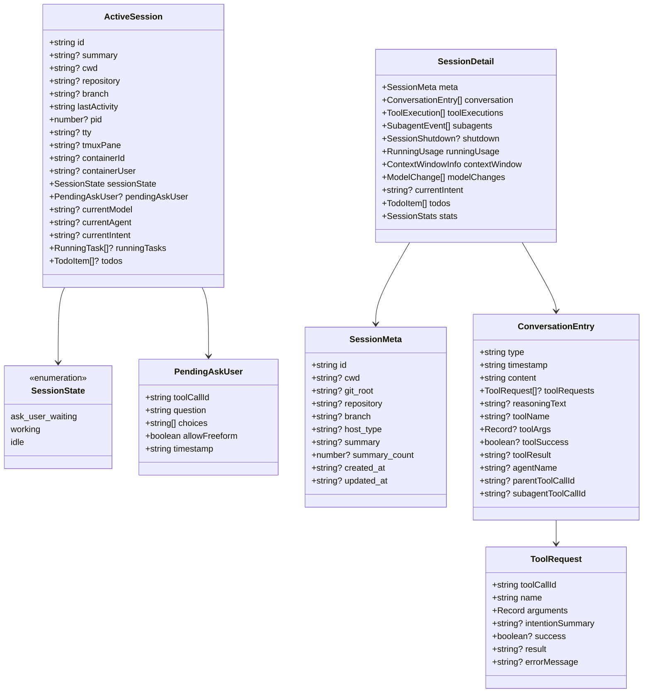
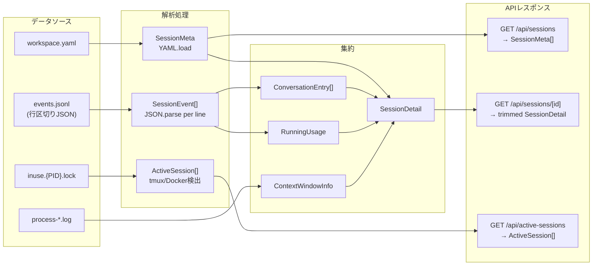

# データ構造調査

## 概要

データは `~/.copilot/session-state/{sessionId}/` 配下の events.jsonl / workspace.yaml / lock ファイルがソースで、TypeScript インターフェースとして型定義される。Zod 等のランタイムバリデーションは未使用。

## クラス図（主要型定義）



## エンティティ一覧

| エンティティ | 定義場所 | 説明 | 主要属性 |
|--------------|----------|------|----------|
| ActiveSession | terminal.ts:27-46 | 実行中セッションの状態スナップショット | id, sessionState, tmuxPane, containerId |
| SessionMeta | sessions.ts | セッションメタデータ（workspace.yaml由来） | id, cwd, repository, branch |
| SessionDetail | sessions.ts | セッション全詳細（API応答用） | meta, conversation, stats, contextWindow |
| ConversationEntry | sessions.ts | 会話タイムラインの1エントリ | type, timestamp, content, toolRequests |
| ToolRequest | sessions.ts | ツール呼び出しリクエスト | toolCallId, name, arguments, result |
| ToolExecution | sessions.ts | ツール実行の詳細レコード | toolCallId, toolName, startTimestamp |
| SubagentEvent | sessions.ts | サブエージェントのライフサイクル | toolCallId, agentName, completed |
| SessionShutdown | sessions.ts | セッション終了時の統計 | modelMetrics, codeChanges, totalPremiumRequests |
| PendingAskUser | terminal.ts | ask_user待ち状態 | question, choices, allowFreeform |
| ResumeInfo | terminal.ts | セッション再開可能性の判定情報 | canResume, availableModels, availableAgents |
| RunningUsage | sessions.ts | 実行時トークンメトリクス | totalOutputTokens, modelRequestCounts |
| ContextWindowInfo | sessions.ts | コンテキストウィンドウ分析 | current, breakdown, cacheEfficiency, history |
| TodoItem | sessions.ts | タスク/todo項目 | id, title, status |
| YamlSection | yaml-utils.ts | YAML折りたたみ構造 | key, startLine, endLine, children |

## 型定義・インターフェース

### ターミナル操作型 (terminal.ts)

```typescript
export type SessionState = "ask_user_waiting" | "working" | "idle";

export interface ActiveSession {
  id: string;
  summary?: string;
  cwd?: string;
  repository?: string;
  branch?: string;
  lastActivity: string;
  pid?: number;
  tty?: string;
  tmuxPane?: string;              // "session:window.pane" 形式
  containerId?: string;           // Docker コンテナID
  containerUser?: string;         // コンテナ内 UID
  sessionState: SessionState;
  pendingAskUser?: PendingAskUser;
  currentModel?: string;
  currentAgent?: string;
  currentIntent?: string;
  runningTasks?: { agentType: string; description: string }[];
  todos?: { id: string; title: string; status: string }[];
}

export interface PendingAskUser {
  toolCallId: string;
  question: string;
  choices: string[];
  allowFreeform: boolean;
  timestamp: string;
}

export interface ResumeInfo {
  canResume: boolean;
  reason?: string;
  isActive: boolean;
  cwd?: string;
  cwdExists: boolean;
  hostType?: string;
  hasLock: boolean;
  availableModels: string[];
  availableAgents: AgentDef[];
  defaultModel?: string;
}

export interface AgentDef {
  name: string;
  description: string;
  filename: string;
}
```

### 内部型（非エクスポート、terminal.ts）

```typescript
interface CopilotProcess {
  pid: number;
  tty: string;
  cwd: string;
}

interface TmuxPane {
  target: string;  // "0:3.1"
  pid: number;
  tty: string;
  command: string;
}

interface ContainerCopilotInfo {
  containerId: string;
  containerUser: string;  // UID文字列
  pid: number;
  cwd: string;
  tmuxPane?: string;
}
```

### セッション解析型 (sessions.ts)

```typescript
export interface SessionEvent {
  type: string;
  id: string;
  timestamp: string;
  parentId: string | null;
  data: Record<string, unknown>;
}

export interface SessionShutdown {
  shutdownType: string;
  totalPremiumRequests: number;
  totalApiDurationMs: number;
  currentTokens?: number;
  systemTokens?: number;
  conversationTokens?: number;
  codeChanges: {
    linesAdded: number;
    linesRemoved: number;
    filesModified: string[];
  };
  modelMetrics: Record<string, {
    requests: { count: number; cost: number };
    usage: { inputTokens: number; outputTokens: number; cacheReadTokens: number; cacheWriteTokens: number };
  }>;
  currentModel: string;
}

export interface ContextWindowInfo {
  current?: { currentTokens: number; maxTokens: number; utilization: number };
  breakdown?: { systemTokens: number; conversationTokens: number; toolDefinitionsTokens: number };
  cacheEfficiency?: { totalInput: number; totalCached: number; cacheRatio: number };
  history: ContextWindowSnapshot[];
}
```

## セッションファイルの配置

```
~/.copilot/session-state/{sessionId}/
├── workspace.yaml          # SessionMeta のソース
├── events.jsonl            # SessionEvent[] のソース（行区切りJSON）
├── inuse.{PID}.lock        # アクティブセッション判定用ロックファイル
└── session.db              # SQLite (better-sqlite3 経由)

~/.copilot/logs/
└── process-{timestamp}-{PID}.log  # コンテキストウィンドウ履歴のソース
```

## データフロー



## API レスポンスの型共有

型定義はサーバー/クライアント間で共有（同一 TypeScript インターフェース）:

| API エンドポイント | レスポンス型 | 備考 |
|-------------------|-------------|------|
| `GET /api/sessions` | `SessionMeta[]` | |
| `GET /api/sessions/[id]` | trimmed `SessionDetail` | toolExecutions 除外、content 5000字制限 |
| `GET /api/active-sessions` | `ActiveSession[]` | |
| `GET /api/sessions/[id]/resume` | `ResumeInfo` | |
| `GET /api/sessions/[id]/rate-limit` | `{ isRateLimited: boolean; rateLimitMessage?: string }` | |
| `GET /api/sessions/[id]/files` | `FileInfo[]` | |
| `POST /api/sessions/[id]/respond` | `{ success: boolean; error?: string; debug?: {...} }` | |

## 新機能に関連する型拡張ポイント

ターミナルビューア機能の追加に必要な新しい型:

| 新規型（想定） | 用途 |
|---------------|------|
| WebSocket メッセージ型 | capture-pane データ送信、キー入力受信 |
| Terminal セッション管理型 | 接続中のターミナルビューアセッション追跡 |
| xterm.js フィット情報 | 端末サイズ（cols × rows）の同期 |

## 備考

- **Zod 等のランタイムバリデーションは未使用**: すべてコンパイル時のみの TypeScript 型
- **パストラバーサル防止**: files API で `path.resolve()` を使用して検証
- **大きなデータの制限**: API レスポンスで content を 5000 文字、arguments を 200 文字に切り詰め
- **better-sqlite3**: session.db アクセスに使用されるが、主要データは events.jsonl ベース
