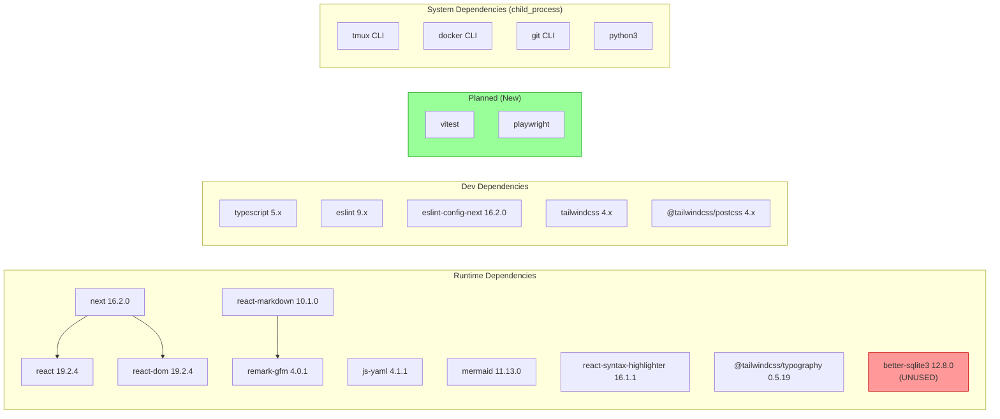

# 03. 依存関係調査

## 背景

コンテナ化および Vitest 導入に影響する全依存関係を把握する。

## package.json

```json
{
  "name": "copilot-cli-viewer",
  "version": "0.1.0",
  "private": true,
  "scripts": {
    "dev": "next dev",
    "build": "next build",
    "start": "next start",
    "lint": "eslint"
  },
  "dependencies": {
    "@tailwindcss/typography": "^0.5.19",
    "@types/react-syntax-highlighter": "^15.5.13",
    "better-sqlite3": "^12.8.0",
    "js-yaml": "^4.1.1",
    "mermaid": "^11.13.0",
    "next": "16.2.0",
    "react": "19.2.4",
    "react-dom": "19.2.4",
    "react-markdown": "^10.1.0",
    "react-syntax-highlighter": "^16.1.1",
    "remark-gfm": "^4.0.1"
  },
  "devDependencies": {
    "@tailwindcss/postcss": "^4",
    "@types/better-sqlite3": "^7.6.13",
    "@types/js-yaml": "^4.0.9",
    "@types/node": "^20",
    "@types/react": "^19",
    "@types/react-dom": "^19",
    "eslint": "^9",
    "eslint-config-next": "16.2.0",
    "tailwindcss": "^4",
    "typescript": "^5"
  }
}
```

## 依存関係図



## 依存関係の詳細分析

### ランタイム依存関係

| パッケージ | バージョン | 用途 | コンテナ化影響 |
|-----------|-----------|------|-------------|
| next | 16.2.0 | Web フレームワーク | `output: "standalone"` 追加推奨 |
| react / react-dom | 19.2.4 | UI ライブラリ | なし |
| js-yaml | 4.1.1 | YAML パース (workspace.yaml) | なし |
| mermaid | 11.13.0 | ダイアグラム描画 | クライアントサイドのみ |
| react-markdown | 10.1.0 | Markdown レンダリング | クライアントサイドのみ |
| react-syntax-highlighter | 16.1.1 | コードハイライト | クライアントサイドのみ |
| remark-gfm | 4.0.1 | GFM 拡張 | なし |
| @tailwindcss/typography | 0.5.19 | Typography プラグイン | なし |
| **better-sqlite3** | **12.8.0** | **SQLite バインディング** | **未使用だがネイティブビルドが必要** |

### 開発依存関係

| パッケージ | バージョン | 用途 |
|-----------|-----------|------|
| typescript | 5.x | 型チェック |
| eslint | 9.x | リント (flat config) |
| eslint-config-next | 16.2.0 | Next.js ESLint ルール |
| tailwindcss | 4.x | CSS フレームワーク |
| @tailwindcss/postcss | 4.x | PostCSS プラグイン |

### システム依存関係（child_process 経由）

| ツール | 使用箇所 | コンテナ内必須 |
|--------|---------|-------------|
| tmux | terminal.ts (全般) | **必須** |
| docker | terminal.ts (Docker 検出) | **不要** (無効化対象) |
| git | start-copilot/route.ts (worktree) | コンテナ化後は不要の可能性 |
| python3 | start-copilot/route.ts (設定操作) | コンテナ化後は不要の可能性 |
| ps | terminal.ts (プロセス検出) | **必須** |

## better-sqlite3 の分析

### 現状

- `package.json` に `better-sqlite3: ^12.8.0` と `@types/better-sqlite3: ^7.6.13` が記載
- **ソースコード内での使用箇所: 0**
- import 文なし、require 文なし
- **結論: 未使用の依存関係**

### コンテナ化への影響

- better-sqlite3 はネイティブ C++ アドオン → `npm install` 時に C++ コンパイラ (`build-essential`, `python3`) が必要
- コンテナイメージサイズへの影響あり
- **推奨: 削除を検討** (ただし、将来の使用予定がある可能性もあるため、タスクスコープ外)

## Vitest 導入時の依存関係追加

### 必要な新規パッケージ

```json
{
  "devDependencies": {
    "vitest": "^3.x",
    "@vitest/coverage-v8": "^3.x"
  }
}
```

### 互換性

- TypeScript: `isolatedModules: true` → Vitest 互換 ✅
- ESM: `module: "esnext"` → Vitest 互換 ✅
- Path aliases: `@/*` → Vitest の `resolve.alias` で設定が必要
- Next.js API routes のテスト: `next/server` の mock が必要

## Playwright 導入時の依存関係追加

### 必要な新規パッケージ

```json
{
  "devDependencies": {
    "@playwright/test": "^1.x"
  }
}
```

### コンテナ内実行要件

- Playwright ブラウザ（Chromium）のインストール: `npx playwright install --with-deps chromium`
- コンテナ内で約 200-400MB の追加ディスク使用
- dev-process の Dockerfile で既に `npm install -g playwright && npx playwright install-deps` パターンあり

## 内部モジュール依存関係

```mermaid
graph TD
    subgraph Pages["Pages"]
        Home["page.tsx"]
        SessionPage["sessions/[id]/page.tsx"]
    end

    subgraph Components["Components"]
        ASD["ActiveSessionsDashboard"]
        CT["ConversationTimeline"]
        SAP["SessionAskUserPanel"]
        DPP["DevProcessPanel"]
        SS["SessionSidebar"]
        STP["SessionTodosPanel"]
        CWB["ContextWindowBadge"]
        MFV["MarkdownFileViewer"]
        PFS["ProjectFilesSection"]
        SFS["SessionFilesSection"]
        ETI["ExpandableTextInput"]
    end

    subgraph API["API Routes"]
        SessionsRoute["/api/sessions"]
        ActiveRoute["/api/active-sessions"]
        DetailRoute["/api/sessions/[id]"]
        RespondRoute["/api/sessions/[id]/respond"]
        TerminateRoute["/api/sessions/[id]/terminate"]
        FilesRoute["/api/sessions/[id]/files"]
        EventRoute["/api/sessions/[id]/event-count"]
        DevRoute["/api/dev-process/start-copilot"]
    end

    subgraph Lib["Library"]
        Sessions["sessions.ts"]
        Terminal["terminal.ts"]
        Format["format.ts"]
    end

    Home --> ASD
    Home --> DPP
    Home --> SS
    SessionPage --> CT
    SessionPage --> SAP
    SessionPage --> STP
    SessionPage --> CWB
    SessionPage --> SFS
    SessionPage --> PFS

    SessionsRoute --> Sessions
    ActiveRoute --> Terminal
    DetailRoute --> Sessions
    RespondRoute --> Terminal
    TerminateRoute --> Terminal
    FilesRoute -.-> |direct fs| FS[(File System)]
    EventRoute -.-> |direct fs| FS

    Sessions --> FS
    Terminal --> FS
    Terminal -.-> |child_process| Tmux[tmux]
    Terminal -.-> |child_process| Docker[docker]
    DevRoute -.-> |child_process| Docker
    DevRoute -.-> |child_process| Git[git]
```


