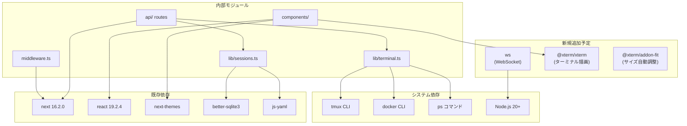
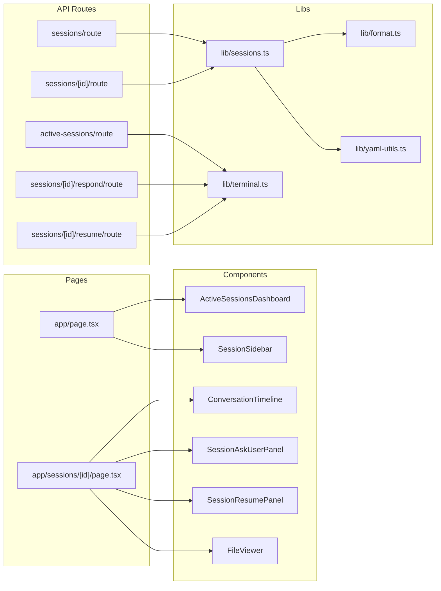

# 依存関係調査

## 概要

Next.js 16 + React 19 を中心に、比較的少ない依存関係で構成される。WebSocket ライブラリ（ws, socket.io 等）は未導入。xterm.js も未導入。

## 外部依存関係

### 本番依存（dependencies）

| パッケージ | バージョン | 用途 | 新機能への関連 |
|------------|------------|------|----------------|
| next | 16.2.0 | Webフレームワーク（App Router, standalone出力） | ⚠️ WebSocket非対応（カスタムserver.js必要） |
| react | 19.2.4 | UIライブラリ | xterm.js統合先 |
| react-dom | 19.2.4 | React DOMレンダリング | |
| next-themes | ^0.4.6 | ダーク/ライトモード切替 | テーマ連携（xterm.jsテーマ同期） |
| better-sqlite3 | ^12.8.0 | SQLiteアクセス | |
| js-yaml | ^4.1.1 | YAML解析 | |
| mermaid | ^11.13.0 | ダイアグラム描画（遅延読み込み） | |
| react-markdown | ^10.1.0 | Markdownレンダリング | |
| react-syntax-highlighter | ^16.1.1 | コードハイライト | |
| remark-gfm | ^4.0.1 | GitHub Flavored Markdown | |
| @tailwindcss/typography | ^0.5.19 | Tailwindタイポグラフィプラグイン | |
| @types/react-syntax-highlighter | ^15.5.13 | 型定義 | |

### 開発依存（devDependencies）

| パッケージ | バージョン | 用途 |
|------------|------------|------|
| typescript | ^5 | TypeScriptコンパイラ |
| @playwright/test | ^1.58.2 | E2Eテストフレームワーク |
| vitest | ^4.1.0 | ユニットテストフレームワーク |
| @vitest/coverage-v8 | ^4.1.0 | テストカバレッジ |
| @testing-library/react | ^16.3.2 | Reactコンポーネントテスト |
| @testing-library/jest-dom | ^6.9.1 | DOM マッチャー |
| jsdom | ^29.0.1 | テスト用DOM環境 |
| eslint | ^9 | リンター |
| eslint-config-next | 16.2.0 | Next.js用ESLint設定 |
| tailwindcss | ^4 | CSSフレームワーク |
| @tailwindcss/postcss | ^4 | Tailwind PostCSSプラグイン |
| @types/better-sqlite3 | ^7.6.13 | SQLite型定義 |
| @types/js-yaml | ^4.0.9 | YAML型定義 |
| @types/node | ^20 | Node.js型定義 |
| @types/react | ^19 | React型定義 |
| @types/react-dom | ^19 | React DOM型定義 |

### 新機能で追加が必要なパッケージ

| パッケージ | 用途 | 備考 |
|------------|------|------|
| **ws** | WebSocketサーバー | custom server.js に組み込み |
| **@xterm/xterm** | ターミナルエミュレータ | ANSIエスケープ完全対応 |
| **@xterm/addon-fit** | xterm.jsサイズ自動調整 | コンテナサイズに追従 |
| **@xterm/addon-web-links** | xterm.js リンク認識 | オプション |

## 依存関係図

## 内部モジュール依存関係

### モジュール間依存

| モジュール | 依存先 | 依存理由 |
|------------|--------|----------|
| API Routes | lib/terminal.ts | tmux操作・アクティブセッション検出 |
| API Routes | lib/sessions.ts | events.jsonl解析・セッション詳細取得 |
| lib/sessions.ts | lib/format.ts | タイムスタンプフォーマット |
| lib/sessions.ts | lib/yaml-utils.ts | workspace.yaml解析 |
| lib/sessions.ts | better-sqlite3 | session.db読み取り |
| lib/terminal.ts | child_process | execSync/execFileSync |
| components/ | React hooks | 状態管理（ライブラリなし） |
| middleware.ts | next/server | NextRequest/NextResponse |

## 循環依存の有無

- [x] 循環依存なし — モジュール間は単方向の依存関係

## バージョン制約・注意点

| 項目 | 制約内容 | 備考 |
|------|----------|------|
| Node.js | >= 20 | `@types/node: ^20`、ESM対応必須 |
| npm | >= 9 | package-lock.json v3形式使用 |
| TypeScript | ^5 | strict: true、bundler moduleResolution |
| React | 19.x | 最新のconcurrent features使用 |
| Next.js | 16.x | App Router、standalone output |
| tmux | システムインストール | コンテナ内で利用 |
| Docker | システムインストール | コンテナ検出に使用（オプション） |

## 備考

- **xterm.js (@xterm/xterm)** は v5 系で React 19 と互換性あり（DOM 直接操作、React ラッパー不要）
- **ws** は Next.js standalone の `server.js` をカスタマイズして組み込む必要がある
- **better-sqlite3** はネイティブモジュールのため、standalone ビルドで特別な設定が必要な場合がある（現在は動作済み）
- **mermaid** は動的インポートで遅延読み込みされている（パフォーマンス考慮）
