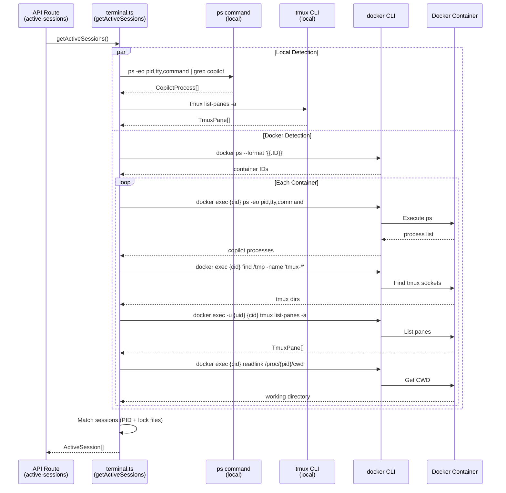
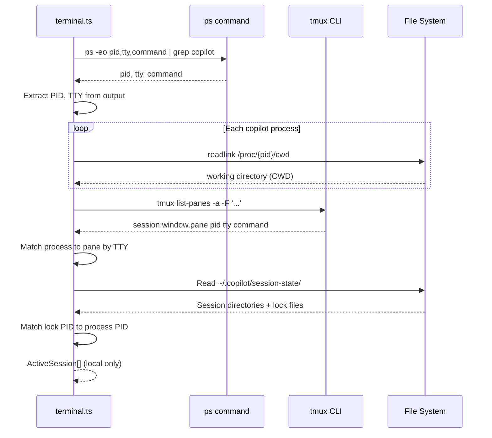
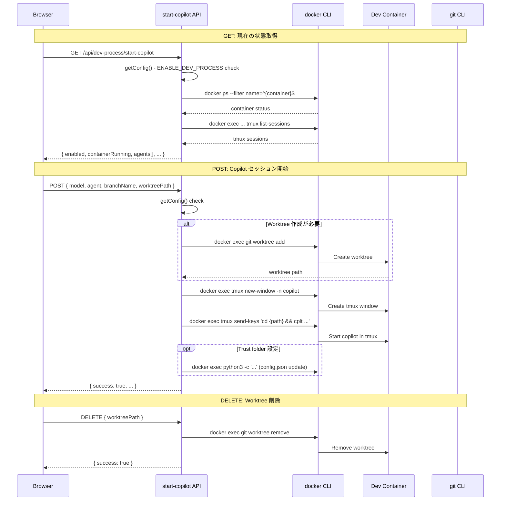
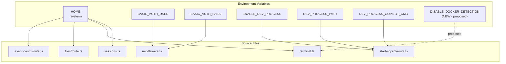
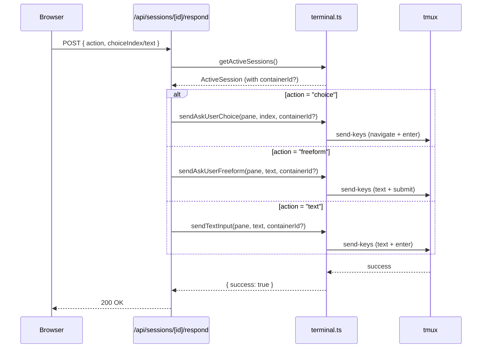

# 05. 統合ポイント調査

## 背景

コンテナ化で変更が必要な外部システムとの接点を特定する。特に Docker 検出ロジックの無効化範囲と start-copilot API の変更範囲を明確化する。

## Docker 検出ロジック（terminal.ts）

### 全体フロー



### 無効化の影響範囲

Docker 検出を無効化するために変更が必要な関数:

| 関数 | 行数 | 説明 | 無効化方法 |
|------|------|------|----------|
| `findDockerContainers()` | L126-137 | `docker ps` でコンテナ ID 一覧取得 | 環境変数チェックで空配列返却 |
| `findContainerCopilotSessions()` | L139-226 | コンテナ内 Copilot セッション検出 | 上記に依存（自動無効化） |
| `getActiveSessions()` | L421-551 | メイン検出関数（ローカル + コンテナ統合） | コンテナ部分スキップ |

### 推奨実装

```typescript
// 環境変数による Docker 検出無効化
const DISABLE_DOCKER_DETECTION = 
  process.env.DISABLE_DOCKER_DETECTION?.trim() === "true";

function findDockerContainers(): string[] {
  if (DISABLE_DOCKER_DETECTION) return [];
  // ... existing logic
}
```

## ローカル tmux 検出（terminal.ts）

### フロー



**コンテナ内での動作**: そのまま動作する。tmux がコンテナ内で起動していれば、ローカルと同じロジックで検出可能。

## start-copilot API（dev-process/start-copilot/route.ts）

### 現在のフロー



### コンテナ化での変更影響

start-copilot API はホスト側から別コンテナを管理するロジック。単一コンテナモードでは:

1. **コンテナ起動**: 不要（自身がコンテナ）
2. **Worktree 作成**: ローカル git 操作に変更
3. **tmux 操作**: docker exec 経由 → ローカル tmux 直接操作
4. **trust folder**: ローカルの config.json を直接更新

**推奨**: `ENABLE_DEV_PROCESS=false` で無効化し、コンテナ内では別の起動メカニズムを用意。

## 環境変数の統合マップ



### 環境変数一覧

| 変数名 | 使用箇所 | 必須 | デフォルト | コンテナ内の値 |
|--------|---------|------|----------|-------------|
| `HOME` | sessions.ts, terminal.ts, files/route.ts, event-count/route.ts | 自動 | — | `/home/vscode` |
| `BASIC_AUTH_USER` | middleware.ts | No | なし (認証無効) | .env から注入 |
| `BASIC_AUTH_PASS` | middleware.ts | No | なし (認証無効) | .env から注入 |
| `ENABLE_DEV_PROCESS` | start-copilot/route.ts | No | `false` | `false` (無効化) |
| `DEV_PROCESS_PATH` | start-copilot/route.ts | 条件付き | `""` | 不要 |
| `DEV_PROCESS_COPILOT_CMD` | start-copilot/route.ts | No | `copilot --yolo --agent dev-workflow` | 不要 |
| `DISABLE_DOCKER_DETECTION` | terminal.ts (提案) | No | `false` | `true` |

## ユーザー入力フロー

### ask_user 応答



**コンテナ内動作**: `containerId` が `undefined` の場合、ローカル tmux を使用するため、コンテナ内でもそのまま動作する。

## dev-process の参考実装

### Dockerfile パターン

```
Base Image (nagasakah/dev-process:base)
  └── tini (PID 1 プロセスマネージャ)
  └── tmux 3.6a (ソースビルド)
  └── Playwright (グローバルインストール)
  └── start-tmux.sh (エントリポイント)
  └── cplt (Copilot CLI ラッパー)
  └── .tmux.conf (設定)
```

### start-tmux.sh のキーパターン

1. **UID/GID 同期**: ホストのファイル所有者に合わせて vscode ユーザーを調整
2. **3 ウィンドウ作成**: editor, copilot, bash
3. **キープアライブ**: `while true; wait; sleep 60; done`
4. **PROJECT_NAME 環境変数**: tmux セッション名のカスタマイズ

### cplt のキーパターン

1. **自動 pane 分割**: 単一ペインの場合 40/60 で分割
2. **ウィンドウ名変更**: 実行中は "copilot" に変更
3. **デフォルトコマンド**: `copilot --allow-all --agent general-purpose`
