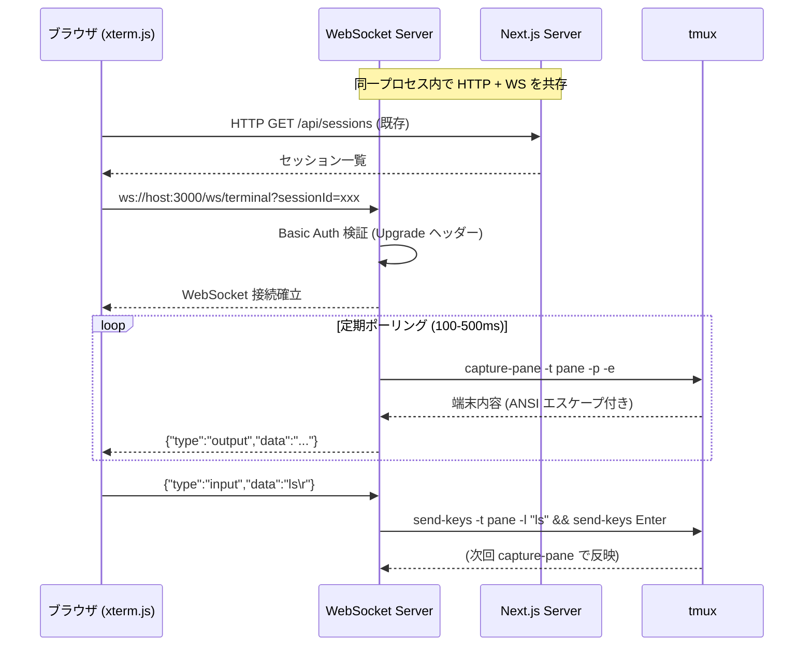
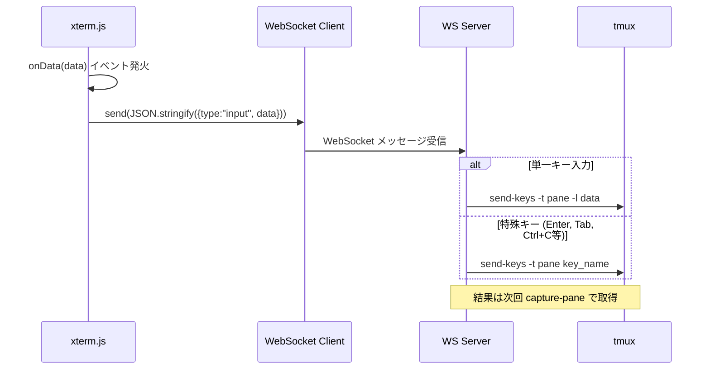
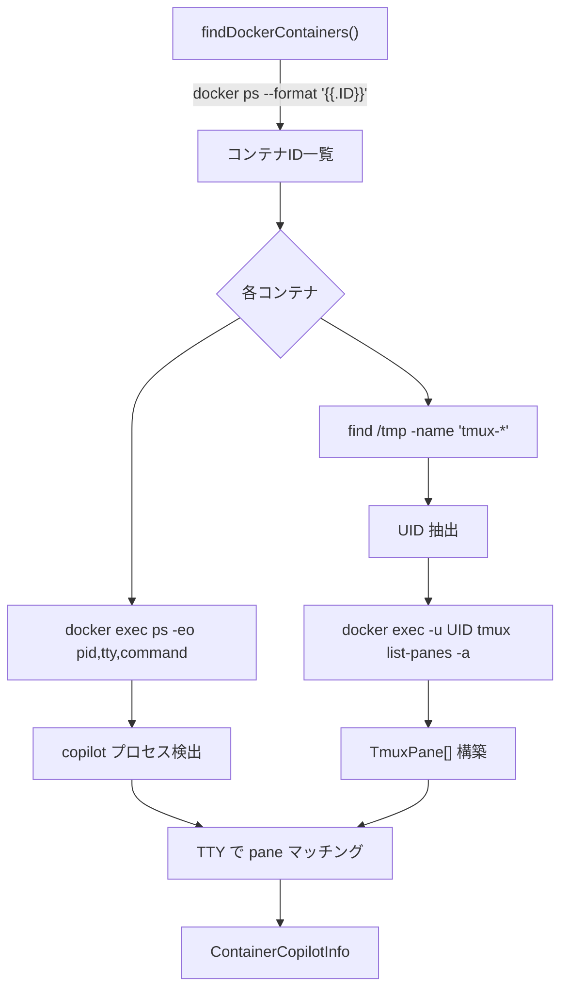

# 統合ポイント調査

## 概要

新機能（ターミナルビューア）の実装に関わる主要統合ポイントは、(1) WebSocket サーバーの Next.js standalone への組み込み、(2) capture-pane による端末内容取得、(3) send-keys によるキー入力送信、(4) xterm.js のフロントエンド統合、(5) Docker exec 経由のリモート操作、(6) 認証ミドルウェアの WebSocket 対応の6つ。

## API エンドポイント一覧（既存）

| メソッド | パス | 説明 |
|----------|------|------|
| GET | `/api/sessions` | セッション一覧取得 |
| GET | `/api/sessions/[id]` | セッション詳細取得 |
| GET | `/api/sessions/[id]/event-count` | イベントファイルmtime取得 |
| GET | `/api/sessions/[id]/files` | プロジェクト/セッションファイル取得 |
| GET | `/api/sessions/[id]/rate-limit` | レート制限状態 |
| GET | `/api/sessions/[id]/resume` | セッション再開可能性チェック |
| POST | `/api/sessions/[id]/respond` | ユーザー入力送信 |
| POST | `/api/sessions/[id]/resume` | セッション再開実行 |
| POST | `/api/sessions/[id]/terminate` | セッション終了 |
| GET | `/api/active-sessions` | アクティブセッション一覧 |
| GET/POST/DELETE | `/api/dev-process/start-copilot` | Dev-process操作 |

## 統合ポイント1: WebSocket サーバーの組み込み

### 現状

- カスタム server.js/server.ts はリポジトリに存在しない
- `next.config.ts` で `output: "standalone"` 設定
- ビルド時に `.next/standalone/server.js` が自動生成される
- 本番: `node server.js` で起動（start-viewer.sh 内）
- 開発: `npx next dev` で起動

### WebSocket 組み込み方式



### カスタム server.js の作成方針

```javascript
// server.js (プロジェクトルートに配置)
const { createServer } = require("http");
const { parse } = require("url");
const next = require("next");
const { WebSocketServer } = require("ws");

const app = next({ dev: process.env.NODE_ENV !== "production" });
const handle = app.getRequestHandler();

app.prepare().then(() => {
  const server = createServer((req, res) => {
    handle(req, res, parse(req.url, true));
  });

  const wss = new WebSocketServer({ noServer: true });

  server.on("upgrade", (request, socket, head) => {
    const { pathname } = parse(request.url);
    if (pathname === "/ws/terminal") {
      // Basic Auth 検証
      wss.handleUpgrade(request, socket, head, (ws) => {
        wss.emit("connection", ws, request);
      });
    } else {
      socket.destroy();
    }
  });

  server.listen(process.env.PORT || 3000);
});
```

### 重要な考慮事項

| 項目 | 詳細 |
|------|------|
| standalone 出力との両立 | standalone server.js を置き換えるか、ラッパーで起動する |
| Dockerfile 変更 | `node server.js` → カスタムserver.js を使用するよう変更 |
| 開発モード | `next dev` ではカスタムserverが不要 → APIルート内でSSEフォールバック |
| HMR との共存 | WebSocketポートが衝突しないよう `noServer: true` を使用 |

## 統合ポイント2: capture-pane の詳細

### 現行の呼び出し

```typescript
// terminal.ts:642-656
function captureTmuxPane(tmuxPane: string, containerId?: string, containerUser?: string): string {
  try {
    return execTmux(["capture-pane", "-t", tmuxPane, "-p"], containerId, containerUser).trim();
  } catch {
    return "";
  }
}
```

### ターミナルビューア用の拡張

| フラグ | 効果 | 用途 |
|--------|------|------|
| `-p` | 内容をstdoutに出力 | ✅ 現在使用中 |
| `-e` | ANSIエスケープシーケンスを含む | ⚠️ **未使用だが必要** |
| `-J` | 長い行を結合 | オプション |
| `-N` | 行番号を含む | 不要 |

**重要**: 現行の `capture-pane -p` は ANSI エスケープを含まない。xterm.js でカラー表示するには `-e` フラグが必要。

```bash
# 現行（テキストのみ）
tmux capture-pane -t 0:1.0 -p

# ターミナルビューア用（ANSIエスケープ付き）
tmux capture-pane -t 0:1.0 -p -e
```

### capture-pane のパフォーマンス特性

| 項目 | 値 | 備考 |
|------|-----|------|
| ローカル実行 | < 5ms | execFileSync で直接呼び出し |
| Docker exec 経由 | 30-100ms | ネットワーク + プロセス起動オーバーヘッド |
| デフォルトタイムアウト | 5000ms | |
| 出力サイズ | ~4-10KB (一般的な 80x24 端末) | ANSIエスケープ付きはやや増加 |

## 統合ポイント3: send-keys によるキー入力

### 既存のキー送信パターン

```typescript
// 名前付きキー（-l なし）
execTmux(["send-keys", "-t", tmuxPane, "Down"], containerId, containerUser);
execTmux(["send-keys", "-t", tmuxPane, "Enter"], containerId, containerUser);

// リテラルテキスト（-l あり）
execFileSync("tmux", ["send-keys", "-t", tmuxPane, "-l", sanitized]);

// Docker コンテナ向け複合コマンド
const bashCmd = `tmux send-keys -t '${safePane}' -l '${safeText}' && sleep 0.3 && tmux send-keys -t '${safePane}' Enter`;
execContainerBash(bashCmd, containerId, containerUser);
```

### ターミナルビューア用の入力パイプライン



### xterm.js の onData と tmux send-keys の対応

| xterm.js onData | tmux send-keys | 備考 |
|-----------------|----------------|------|
| 通常文字 ("a", "hello") | `send-keys -l "a"` | -l で リテラル送信 |
| Enter (\r) | `send-keys Enter` | 名前付きキー |
| Tab (\t) | `send-keys Tab` | |
| Ctrl+C (\x03) | `send-keys C-c` | tmux のCtrlキー表記 |
| 矢印キー (\x1b[A) | `send-keys Up` | |
| Escape (\x1b) | `send-keys Escape` | |
| Backspace (\x7f) | `send-keys BSpace` | |

## 統合ポイント4: xterm.js フロントエンド統合

### React 19 との互換性

xterm.js は DOM 直接操作ライブラリのため、React のライフサイクルと注意深く統合する必要がある:

```typescript
// 推奨パターン: useRef + useEffect
function TerminalViewer({ sessionId }: { sessionId: string }) {
  const termRef = useRef<HTMLDivElement>(null);
  const xtermRef = useRef<Terminal | null>(null);

  useEffect(() => {
    const term = new Terminal({ /* options */ });
    const fitAddon = new FitAddon();
    term.loadAddon(fitAddon);
    term.open(termRef.current!);
    fitAddon.fit();
    xtermRef.current = term;

    return () => { term.dispose(); };
  }, []);

  return <div ref={termRef} />;
}
```

### xterm.js テーマと next-themes の同期

```typescript
const { resolvedTheme } = useTheme();

useEffect(() => {
  if (xtermRef.current) {
    xtermRef.current.options.theme = resolvedTheme === "dark"
      ? { background: "#1a1a2e", foreground: "#e0e0e0" }
      : { background: "#ffffff", foreground: "#333333" };
  }
}, [resolvedTheme]);
```

## 統合ポイント5: Docker exec 経由の操作

### 現行のDockerコンテナ検出フロー



### ターミナルビューアでの Docker 対応

| 操作 | ローカル | Docker コンテナ |
|------|---------|----------------|
| capture-pane | `tmux capture-pane -t pane -p -e` | `docker exec -u UID CID tmux capture-pane -t pane -p -e` |
| send-keys | `tmux send-keys -t pane -l text` | `docker exec -u UID CID bash -c 'tmux send-keys ...'` |
| タイムアウト | 5000ms | 5000ms (capture), 10000ms (compound) |
| 遅延 | < 5ms | 30-100ms |

## 統合ポイント6: 認証の WebSocket 対応

### 現行の Basic Auth ミドルウェア

```typescript
// src/middleware.ts
export function middleware(request: NextRequest) {
  const user = process.env.BASIC_AUTH_USER?.trim();
  const pass = process.env.BASIC_AUTH_PASS?.trim();
  if (!user || !pass) return NextResponse.next();  // 未設定時はスキップ

  const authHeader = request.headers.get("authorization");
  // ... Basic Auth 検証 ...
}

export const config = {
  matcher: ["/((?!_next/static|_next/image|favicon.ico).*)"],
};
```

### WebSocket での認証方式

Next.js ミドルウェアは WebSocket Upgrade リクエストを処理しない。代わりに、カスタム server.js の `upgrade` イベントハンドラーで認証を行う:

```typescript
server.on("upgrade", (request, socket, head) => {
  // Basic Auth 検証
  const authHeader = request.headers["authorization"];
  const user = process.env.BASIC_AUTH_USER?.trim();
  const pass = process.env.BASIC_AUTH_PASS?.trim();

  if (user && pass) {
    if (!authHeader) {
      socket.write("HTTP/1.1 401 Unauthorized\r\n\r\n");
      socket.destroy();
      return;
    }
    const [scheme, encoded] = authHeader.split(" ");
    if (scheme !== "Basic") { socket.destroy(); return; }
    const decoded = Buffer.from(encoded, "base64").toString();
    const [u, p] = decoded.split(":");
    if (u !== user || p !== pass) { socket.destroy(); return; }
  }

  // 認証OK → WebSocket接続確立
  wss.handleUpgrade(request, socket, head, (ws) => {
    wss.emit("connection", ws, request);
  });
});
```

### クライアント側の認証ヘッダー

ブラウザの WebSocket API は カスタムヘッダーをサポートしない。対応方法:

| 方式 | 説明 | 推奨度 |
|------|------|--------|
| URL パラメータ | `ws://host/ws/terminal?token=base64(user:pass)` | ⚠️ ログに漏洩リスク |
| Cookie | ブラウザが自動送信 | ✅ 推奨 |
| プロトコルヘッダー | `new WebSocket(url, [base64(user:pass)])` | ⚠️ 非標準的 |
| 最初のメッセージ | 接続後に認証メッセージ送信 | ⚠️ 認証前にアクセス可能 |

**推奨**: Basic Auth のクレデンシャルをクッキーに保存し、WebSocket接続時にブラウザが自動送信する方式。または、URL上でブラウザがBasic Auth認証済みの場合、`Authorization` ヘッダーが Upgrade リクエストにも含まれることを利用。

## compose.yaml / compose.dev.yaml の WebSocket 対応

### 現行設定

```yaml
# compose.yaml
services:
  viewer:
    ports:
      - "${PORT:-3000}:3000"  # HTTP のみ
    environment:
      - HOSTNAME=0.0.0.0
```

### WebSocket 対応の変更点

WebSocket は HTTP と同一ポート (3000) で動作するため、`compose.yaml` のポート設定変更は不要。ただし:

| 設定項目 | 変更要否 | 理由 |
|----------|---------|------|
| ポート | 変更不要 | WSは HTTP Upgrade で同一ポート |
| healthcheck | 変更不要 | HTTP で引き続き動作確認 |
| HOSTNAME | 変更不要 | 0.0.0.0 で全インターフェースリッスン |
| environment | 追加不要 | WS は server.js 内で自動有効化 |
| 新規環境変数 | 検討 | `WS_CAPTURE_INTERVAL_MS` 等 |

## 備考

- **capture-pane -e フラグが重要**: 現行コードは `-e` を使用していないが、xterm.js でカラー表示するには必須
- **Docker exec のレイテンシ**: 30-100ms はリアルタイム表示に影響する可能性があり、キャプチャ間隔の調整が必要
- **WebSocket は HTTP と同一ポート**: 追加ポート公開は不要
- **ブラウザ Basic Auth**: URL に `ws://user:pass@host/` は非推奨（Chrome で廃止）。Cookie ベースまたは Upgrade リクエストの Authorization ヘッダーを利用
