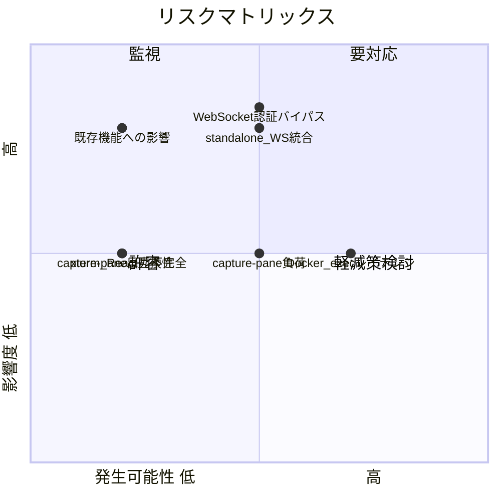
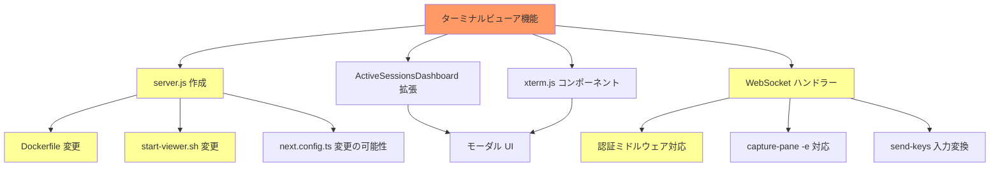

# リスク・制約分析

## 概要

tmux pane ターミナルビューア機能の追加には、Next.js standalone モードでの WebSocket 統合、xterm.js と React 19 の互換性、Docker exec のレイテンシ、セキュリティ面のリスクがある。

## 技術的リスク

| リスク | 影響度 | 発生可能性 | 対策 |
|--------|--------|------------|------|
| Next.js standalone + WebSocket の統合困難 | 高 | 中 | カスタム server.js でHTTP + WS共存 |
| capture-pane -e の出力が不完全 | 中 | 低 | tmux バージョン確認、フォールバック実装 |
| Docker exec のレイテンシでリアルタイム性低下 | 中 | 高 | キャプチャ間隔調整 (500ms-1s) |
| xterm.js と React 19 の互換性問題 | 中 | 低 | useRef + useEffect で DOM 直接操作 |
| WebSocket 接続の認証バイパス | 高 | 中 | Upgrade ハンドラーで Basic Auth 検証 |
| 高頻度 capture-pane による tmux 負荷 | 中 | 中 | 差分検出、接続数制限 |
| 既存ポーリング機能への影響 | 高 | 低 | WebSocket は別パスで独立実装 |

### リスクマトリックス



## ビジネスリスク

| リスク | 影響度 | 発生可能性 | 対策 |
|--------|--------|------------|------|
| 既存のask_user応答機能が壊れる | 高 | 低 | 既存テスト（UT, E2E）で保護 |
| ターミナルビューアのパフォーマンス不足 | 中 | 中 | 段階的リリース（ローカルのみ → Docker対応） |
| セッション一覧のポーリング増加による負荷 | 低 | 低 | WebSocketはターミナル専用、一覧は既存ポーリング維持 |

## 技術的制約

| 制約 | 詳細 | 影響範囲 |
|------|------|----------|
| Next.js App Router は WebSocket 非対応 | API Routes で WebSocket Upgrade を処理できない | サーバー実装方式 |
| standalone 出力の server.js はカスタマイズ不可 | `.next/standalone/server.js` は自動生成でimmutable | デプロイメント |
| capture-pane は差分取得不可 | 毎回全画面を取得する必要がある | パフォーマンス |
| tmux send-keys は同期的 | 各キー送信は execFileSync で逐次実行 | 入力レイテンシ |
| Docker exec のオーバーヘッド | 各コマンドに30-100msの遅延 | Docker 環境のリアルタイム性 |
| ブラウザ WebSocket API はカスタムヘッダー非対応 | 認証情報の送信方法に制限 | セキュリティ実装 |

## 設計上の制約

| 制約 | 理由 | 対応方針 |
|------|------|----------|
| カスタム server.js の作成が必要 | Next.js 標準では WS 非対応 | ルートに server.js を作成、Dockerfile/start-viewer.sh を更新 |
| モーダル表示（既存パターンに準拠） | brainstorming で決定済み | fixed position + z-index + backdrop パターン使用 |
| React hooks のみ（状態管理ライブラリなし） | 既存パターンとの一貫性 | useState + useRef + useEffect で管理 |
| Tailwind CSS v4 + next-themes | 既存スタイリング方式 | xterm.js テーマを resolvedTheme と同期 |
| テスト番号付き命名 (UT-N, INT-N 等) | 既存テストパターン | 新規テストも同じ規約に準拠 |

## セキュリティ考慮事項

| 項目 | 現状 | 新機能での考慮 |
|------|------|----------------|
| 認証 | Basic Auth（オプション） | WebSocket Upgrade でも同等の認証必須 |
| 入力サニタイズ | sanitizeForTmux() + shellEscapeSingleQuote() | WebSocket 経由の入力にも適用 |
| tmux コマンドインジェクション | execFileSync（シェル非介在） | WebSocket 入力を tmux send-keys -l で安全に送信 |
| Docker exec インジェクション | コンテナID・ユーザーID は内部生成 | WebSocket パラメータの sessionId を検証 |
| DoS | ポーリング間隔固定 | WebSocket 接続数制限、capture-pane 頻度制限 |
| セッション操作権限 | 認証済みユーザーは全セッション操作可能 | 同一ポリシーを維持（シングルユーザー想定） |

### 入力サニタイズの継続

```typescript
// 既存のサニタイズ処理を WebSocket 入力にも適用
function sanitizeForTmux(text: string): string {
  return text.replace(/\r?\n/g, " ").replace(/\s+/g, " ").trim();
}

// ただし、ターミナルビューアでは 改行 = Enter キーとして送信すべき
// → sanitizeForTmux は使わず、xterm.js onData の生データを send-keys で送信
// → -l フラグで安全にリテラル送信
```

## パフォーマンス考慮事項

| 項目 | ローカル | Docker | 備考 |
|------|---------|--------|------|
| capture-pane 実行時間 | < 5ms | 30-100ms | execFileSync のプロセス生成含む |
| capture-pane 出力サイズ | 4-10KB | 同左 | 80x24 端末、ANSI付き |
| 推奨キャプチャ間隔 | 100-200ms | 500-1000ms | Docker は遅延を考慮 |
| send-keys 実行時間 | < 5ms | 30-100ms | |
| WebSocket メッセージサイズ | 4-10KB/回 | 同左 | 圧縮検討の余地あり |
| 同時接続数上限（推奨） | 5-10 | 3-5 | capture-pane 負荷に比例 |

### パフォーマンス最適化案

1. **差分送信**: 前回キャプチャとの差分のみ送信 → 帯域削減
2. **アダプティブ間隔**: 画面変化がない場合は間隔を延長
3. **接続数制限**: 同一 pane への接続は1つに制限
4. **圧縮**: ANSI エスケープ付きテキストの gzip 圧縮

## 影響度・依存関係



## 緩和策一覧

| リスク/制約 | 緩和策 | 優先度 |
|-------------|--------|--------|
| standalone + WebSocket 統合 | カスタム server.js 作成、standalone server.js をラップ | 高 |
| WebSocket 認証 | Upgrade ハンドラーで Authorization ヘッダー検証 | 高 |
| Docker exec レイテンシ | キャプチャ間隔を 500ms-1s に調整、差分送信 | 中 |
| capture-pane 負荷 | 接続数制限、アダプティブ間隔 | 中 |
| 既存機能への影響 | WebSocket を別パス (/ws/terminal) で実装、既存 API は変更なし | 高 |
| xterm.js + React 19 | useRef + useEffect で DOM 直接操作、React 再レンダリングと分離 | 中 |
| 入力セキュリティ | send-keys -l でリテラル送信、特殊キーはホワイトリスト方式 | 高 |

## ロールバック計画

| フェーズ | ロールバック方法 | 所要時間 |
|----------|------------------|----------|
| server.js 追加前 | ブランチ切り戻し | 即時 |
| server.js 追加後 | server.js を削除、start-viewer.sh を元に戻す | 5分 |
| xterm.js 統合後 | コンポーネント削除、package.json 依存削除 | 10分 |
| Dockerfile 変更後 | Dockerfileを元に戻して再ビルド | 15分 |

## 備考

- **最大のリスクは Next.js standalone + WebSocket の統合**: Next.js 公式にはカスタムサーバーの使用は推奨されていないが、WebSocket には必須
- **capture-pane -e（ANSIエスケープ付き）のサポート確認が必要**: tmux のバージョンによって挙動が異なる可能性
- **段階的実装を推奨**: (1) ローカル tmux → (2) Docker 対応 → (3) パフォーマンス最適化
- **E2E テストは Docker Compose 環境で実行**: Playwright + Docker でターミナルビューアの動作確認が可能
