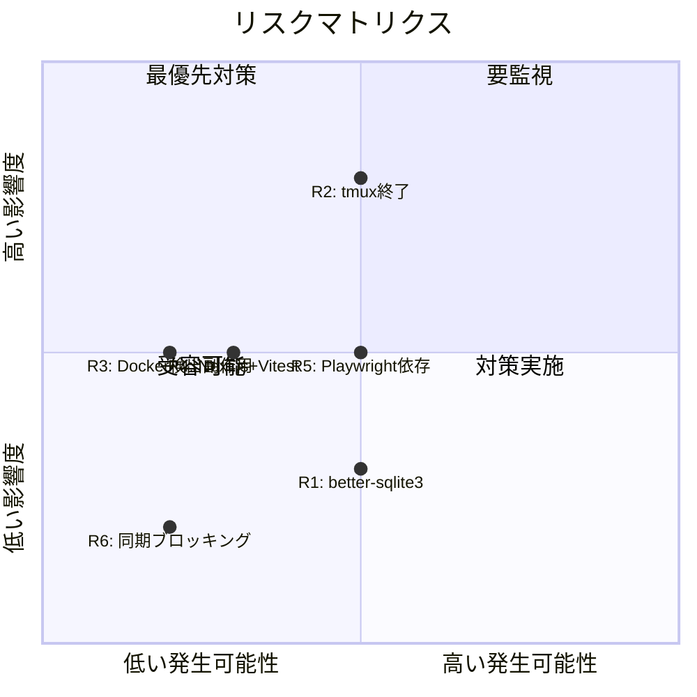

# 06. リスク・制約分析

## 背景

コンテナ化タスクにおけるリスクと制約を特定し、設計・実装の意思決定に活用する。

## リスク一覧

### R1: better-sqlite3 のネイティブビルド失敗

| 項目 | 内容 |
|------|------|
| 影響度 | 低 |
| 発生可能性 | 中 |
| 説明 | better-sqlite3 は C++ ネイティブアドオンだが、現在コードで**未使用**。`npm install` 時にビルドツール (`build-essential`, `python3`) が必要 |
| 対策 | Dockerfile に `build-essential`, `python3` を含める。または依存関係から削除を検討 |

### R2: tmux セッションの予期せぬ終了

| 項目 | 内容 |
|------|------|
| 影響度 | 高 |
| 発生可能性 | 中 |
| 説明 | 元々の課題。dev-process では別コンテナ管理時に tmux が終了する問題がある。コンテナ内ローカル動作で解消が期待されるが保証はない |
| 対策 | tini による PID 1 管理 + start-tmux.sh のキープアライブループ。tmux セッション自動復旧メカニズムの検討 |

### R3: Docker 検出ロジックの副作用

| 項目 | 内容 |
|------|------|
| 影響度 | 中 |
| 発生可能性 | 低 |
| 説明 | Docker 検出無効化により、将来コンテナ間通信が必要になった場合に再度有効化が必要 |
| 対策 | 環境変数フラグで切り替え可能にする（ハードコード削除ではなく無効化） |

### R4: Next.js 16 と Vitest の互換性

| 項目 | 内容 |
|------|------|
| 影響度 | 中 |
| 発生可能性 | 低 |
| 説明 | Next.js 16 は比較的新しいバージョン。server components のテストや `next/server` モジュールの mock で問題が起きる可能性 |
| 対策 | lib モジュール（sessions.ts, terminal.ts）の単体テストを優先。API route テストは integration テスト扱い |

### R5: Playwright E2E テストのコンテナ内実行

| 項目 | 内容 |
|------|------|
| 影響度 | 中 |
| 発生可能性 | 中 |
| 説明 | Chromium のヘッドレス実行にはシステム依存関係（libx11, libgbm 等）が必要。コンテナイメージサイズが 500MB+ 増加する可能性 |
| 対策 | dev-process Dockerfile のパターン (`npx playwright install-deps`) を流用。マルチステージビルドでイメージ最適化 |

### R6: child_process の同期実行によるブロッキング

| 項目 | 内容 |
|------|------|
| 影響度 | 低 |
| 発生可能性 | 低 |
| 説明 | `execSync`, `execFileSync` は Node.js イベントループをブロックする。コンテナ内でレイテンシが増加する可能性 |
| 対策 | タイムアウトが既に設定済み（5-10 秒）。改善は将来タスク |

## 制約事項

### C1: ファイルベースのセッションストア

- セッションデータは `~/.copilot/session-state/` に YAML + JSONL で保存
- データベース（better-sqlite3）は未使用
- ボリュームマウントによるデータ永続化が必要

### C2: ホスト依存なし（self-contained）

- コンテナ内で全機能が完結する必要がある
- ホスト側の Copilot CLI、tmux、Docker との連携は不要
- `$HOME/.copilot` はコンテナ内で完結

### C3: 既存機能の維持

- セッション一覧表示、詳細表示、会話タイムライン
- ask_user 応答機能
- セッション終了機能
- Basic Auth 認証
- DevProcessPanel（UI コンポーネントは残すが、API は無効化可能）

### C4: 認証設定の外部注入

- PAT (Personal Access Token) は .env から注入
- BASIC_AUTH_USER / BASIC_AUTH_PASS も .env から注入
- コンテナ内にハードコードしない

### C5: compose.yaml の命名規約

- brainstorming で決定: `compose.yaml` を使用
- `docker-compose.yml` は使用しない (Docker Compose V2 標準)

## リスクマトリクス

## 推奨する対応優先順位

1. **R2 (tmux 終了)**: tini + start-tmux.sh パターンの適用で対処
2. **R5 (Playwright)**: dev-process Dockerfile パターンの流用
3. **R1 (better-sqlite3)**: Dockerfile に build-essential 含める（削除は別タスク）
4. **R3 (Docker 検出)**: 環境変数フラグで無効化
5. **R4 (Vitest 互換)**: lib モジュールから段階的にテスト追加
6. **R6 (同期実行)**: 現状維持（タイムアウトで十分）
