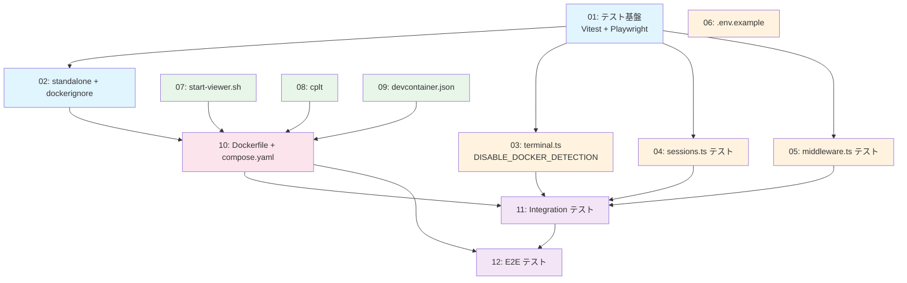

# 親エージェント統合管理プロンプト — viewer-container-local

## プロジェクト情報

| 項目 | 内容 |
|------|------|
| チケットID | viewer-container-local |
| タスク名 | container |
| 対象リポジトリ | copilot-session-viewer |
| ブランチ | feature/viewer-container-local |
| メインworktree | /Users/haoming/git/worktrees/viewer-container-local |
| サブモジュール | submodules/copilot-session-viewer/ |

---

## 1. タスク一覧と依存関係

| ID | タスク名 | 見積 | 依存 | 並列グループ |
|----|---------|------|------|-------------|
| 01 | テスト基盤 (Vitest + Playwright) | 15min | — | — |
| 02 | standalone + .dockerignore | 10min | 01 | — |
| 03 | terminal.ts DISABLE_DOCKER_DETECTION | 15min | 01 | P2-A |
| 04 | sessions.ts 単体テスト | 15min | 01 | P2-A |
| 05 | middleware.ts 単体テスト | 10min | 01 | P2-A |
| 06 | .env.example | 5min | — | P2-A |
| 07 | start-viewer.sh | 20min | — | P3-A |
| 08 | cplt ラッパー | 10min | — | P3-A |
| 09 | devcontainer.json | 10min | — | P3-B |
| 10 | Dockerfile + compose.yaml | 20min | 02,07,08,09 | — |
| 11 | Integration テスト | 20min | 03,04,05,10 | — |
| 12 | E2E テスト | 30min | 10,11 | — |

---

## 2. 依存グラフ



---

## 3. 並列実行グループと実行順序

### 実行ステップ

| Step | タスク | 並列? | 備考 |
|------|--------|------|------|
| 1 | 01 | 単独 | テスト基盤は全後続の前提 |
| 2 | 02 | 単独 | standalone 必須 (Dockerfile 依存) |
| 3 | 03, 04, 05, 06, 07, 08, 09 | **全並列** | 7タスク同時実行可能 |
| 4 | 10 | 単独 | Dockerfile 統合 (02,07,08,09 待ち) |
| 5 | 11 | 単独 | Integration テスト (03,04,05,10 待ち) |
| 6 | 12 | 単独 | E2E テスト (10,11 待ち) |

### 並列実行の制約

- Step 3 のタスクは全て独立しているため最大 7 並列
- ただし worktree の作成・cherry-pick のオーバーヘッドを考慮し、3-4 並列を推奨
- **推奨並列構成**:
  - グループA: 03, 04, 05 (TypeScript テスト系)
  - グループB: 06, 07, 08, 09 (設定・スクリプト系)

---

## 4. Worktree 管理手順

### 4.1 Worktree 作成

```bash
# メインworktreeから実行
cd /Users/haoming/git/worktrees/viewer-container-local

# タスクN用のworktree作成
git worktree add /tmp/viewer-container-local-{NN}/ -b task/{NN}-{task-name} feature/viewer-container-local

# サブモジュール初期化
cd /tmp/viewer-container-local-{NN}/
git submodule update --init submodules/copilot-session-viewer
```

### 4.2 依存タスクの Cherry-pick

```bash
# タスクNのworktreeで、前提タスクの成果物を取り込む
cd /tmp/viewer-container-local-{NN}/

# 例: Task 02 は Task 01 に依存
git cherry-pick <task-01-commit-sha>

# サブモジュールの更新も忘れずに
cd submodules/copilot-session-viewer
git cherry-pick <task-01-submodule-commit-sha>
```

### 4.3 Worktree クリーンアップ

```bash
# タスク完了・cherry-pick後
cd /Users/haoming/git/worktrees/viewer-container-local
git worktree remove /tmp/viewer-container-local-{NN}/
git branch -d task/{NN}-{task-name}
```

---

## 5. Cherry-pick フロー

### 5.1 タスク完了時

1. タスクworktreeでコミット完了
2. コミットSHAを記録
3. メインworktree (feature/viewer-container-local) に cherry-pick

```bash
# メインworktreeで
cd /Users/haoming/git/worktrees/viewer-container-local
git cherry-pick <task-commit-sha>

# サブモジュール変更がある場合
cd submodules/copilot-session-viewer
git cherry-pick <submodule-commit-sha>
cd ../..
git add submodules/copilot-session-viewer
git commit --amend --no-edit
```

### 5.2 コンフリクト解決

- 並列タスク (03-09) は異なるファイルを変更するため、コンフリクトは稀
- Task 01 (package.json) への変更が複数タスクで競合する可能性 → package.json のマージは手動確認
- コンフリクト発生時: `git cherry-pick --abort` → 手動マージ → 再コミット

---

## 6. ブロッカー管理

### 6.1 想定ブロッカー

| ブロッカー | 影響タスク | 対策 |
|----------|-----------|------|
| Vitest + Next.js 16 互換性問題 | 01, 03-05, 11 | `vitest.config.ts` の `resolve.alias` で `@` パスを解決。ESM 互換性確認 |
| NextRequest/NextResponse モック | 05 | Web API の Request/Response を使用してテスト |
| devcontainer CLI 未インストール | 09 | `npx @devcontainers/cli build` で代替 |
| Docker Desktop 未起動 | 10, 12 | テスト前に Docker 起動を確認。CI では Docker-in-Docker |
| Playwright ブラウザインストール | 12 | `npx playwright install chromium` を事前実行 |
| better-sqlite3 ネイティブビルド | 10 | ベースイメージに build-essential が含まれることを確認 |

### 6.2 ブロッカー発生時の手順

1. ブロッカーの内容を記録
2. 影響タスクのステータスを `blocked` に更新
3. 独立した他タスクの実行を継続
4. ブロッカー解決後、blocked タスクを再開

---

## 7. 結果統合

### 7.1 統合順序

```
feature/viewer-container-local
  ← cherry-pick Task 01 (テスト基盤)
  ← cherry-pick Task 02 (standalone + dockerignore)
  ← cherry-pick Task 03 (DISABLE_DOCKER_DETECTION)
  ← cherry-pick Task 04 (sessions テスト)
  ← cherry-pick Task 05 (middleware テスト)
  ← cherry-pick Task 06 (.env.example)
  ← cherry-pick Task 07 (start-viewer.sh)
  ← cherry-pick Task 08 (cplt)
  ← cherry-pick Task 09 (devcontainer.json)
  ← cherry-pick Task 10 (Dockerfile + compose.yaml)
  ← cherry-pick Task 11 (Integration テスト)
  ← cherry-pick Task 12 (E2E テスト)
```

### 7.2 統合後の検証

```bash
cd /Users/haoming/git/worktrees/viewer-container-local/submodules/copilot-session-viewer

# 全テスト実行
npm run test

# ビルド確認
npm run build

# リント
npm run lint

# E2E (コンテナ起動後)
# 1. devcontainer build --workspace-folder . --image-name copilot-session-viewer:base
# 2. docker compose up -d --build
# 3. npm run test:e2e
```

---

## 8. チェックポイント

### CP-1: テスト基盤完了 (Task 01-02 完了後)

- [ ] `npm run test` が動作する
- [ ] `npm run build` で standalone 出力される
- [ ] `.dockerignore` が存在する

### CP-2: 単体テスト完了 (Task 03-05 完了後)

- [ ] UT-1 to UT-11 が全て PASS
- [ ] terminal.ts に DISABLE_DOCKER_DETECTION が実装済み
- [ ] sessions.ts, middleware.ts のテストカバレッジが目標達成

### CP-3: コンテナ構成完了 (Task 06-10 完了後)

- [ ] `.env.example` が存在
- [ ] `scripts/start-viewer.sh` が存在し実行可能
- [ ] `scripts/cplt` が存在し実行可能
- [ ] `.devcontainer/devcontainer.json` が存在
- [ ] `Dockerfile` + `compose.yaml` が存在
- [ ] `docker compose config` が成功

### CP-4: 全テスト完了 (Task 11-12 完了後)

- [ ] Integration テスト PASS
- [ ] E2E テスト PASS (E2E-6 除く)
- [ ] 全 acceptance criteria が充足

---

## 9. Acceptance Criteria 照合

| AC | 検証タスク | テスト |
|----|----------|--------|
| コンテナ起動で Copilot CLI 実行環境・viewer・tmux が利用可能 | 10, 12 | E2E-1, E2E-2 |
| tmux セッションが予期せず終了しない | 12 | E2E-3, E2E-6 |
| .env から PAT を含む認証設定を供給できる | 03, 05, 12 | UT-9-11, E2E-4, E2E-7 |
| $HOME/.copilot がコンテナごとに分離 | 03 | UT-3 |
| Unit/Integration/E2E テストが実行可能 | 01, 11, 12 | IT-1, E2E テスト全体 |
