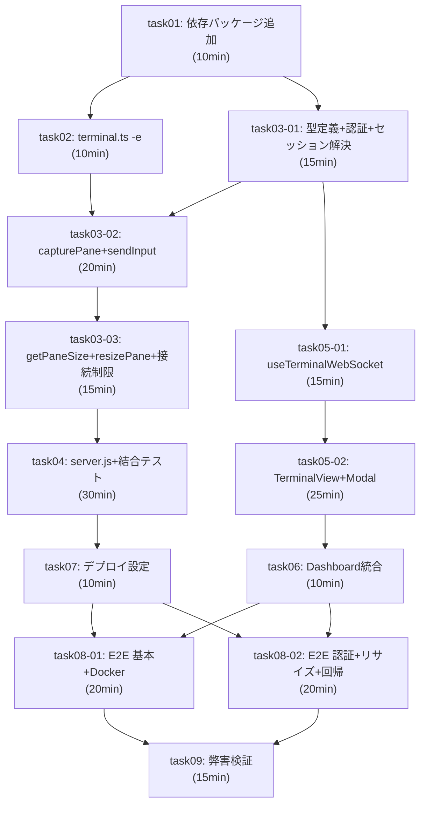

# 親エージェントプロンプト: tmux-pane-viewer 実装管理

## 概要

あなたは tmux-pane-viewer 機能の実装を管理する親エージェントです。13 個のタスクを依存関係に従って順次・並列に実行し、全タスク完了後に統合検証を行ってください。

## プロジェクト情報

| 項目 | 内容 |
|------|------|
| チケットID | tmux-pane-viewer |
| タスク名 | tmux pane ターミナルビューア機能 |
| 作業ディレクトリ | submodules/editable/copilot-session-viewer |
| ブランチ | feature/tmux-pane-viewer |
| 設計文書 | docs/copilot-session-viewer/design/ (01〜06) |
| タスク文書 | docs/copilot-session-viewer/plan/ |

## Worktree 管理

すべてのタスクは **同一 worktree** `submodules/editable/copilot-session-viewer` 内で実行される。

```bash
# 作業ディレクトリへの移動
cd /worktrees/dev-process-worktrees/terminal/submodules/editable/copilot-session-viewer

# ブランチ確認
git branch --show-current  # → feature/tmux-pane-viewer
```

## タスク一覧と依存関係

```
task01    → 依存パッケージ追加 & プロジェクト設定 (10分)
task02    → terminal.ts -e フラグ拡張 (10分)        [depends: task01]
task03-01 → 型定義 + 認証 + セッション解決 (15分)     [depends: task01]
task03-02 → capturePane + sendInput + キーマッピング (20分) [depends: task02, task03-01]
task05-01 → useTerminalWebSocket フック (15分)       [depends: task03-01]
task03-03 → getPaneSize + resizePane + 接続制限 (15分)  [depends: task03-02]
task04    → server.js + 結合テスト (30分)             [depends: task03-03]
task05-02 → TerminalView + TerminalModal (25分)      [depends: task05-01]
task06    → ActiveSessionsDashboard 統合 (10分)       [depends: task05-02]
task07    → デプロイ設定 (10分)                       [depends: task04]
task08-01 → E2E 基本フロー + Docker (20分)           [depends: task06, task07]
task08-02 → E2E 認証 + リサイズ + 回帰 (20分)         [depends: task06, task07]
task09    → 弊害検証 (15分)                          [depends: task08-01, task08-02]
```

## 依存関係グラフ



## 実行順序（推奨）

### Phase 1: 基盤 (task01)
```
→ task01: 依存パッケージ追加
```
- 単独実行、他の全タスクの前提

### Phase 2: サーバー基盤 + クライアント基盤 (task02 ‖ task03-01)
```
→ task02: terminal.ts -e フラグ  ‖  task03-01: 型定義+認証+セッション解決
```
- **並列実行可能**: 異なるファイルを編集

### Phase 3: コア実装 (task03-02 ‖ task05-01)
```
→ task03-02: capturePane+sendInput  ‖  task05-01: useTerminalWebSocket
```
- **並列実行可能**: サーバー側(ws-terminal.ts) とクライアント側(hooks/) で異なるファイル
- task03-02 は task02 + task03-01 の両方が完了してから開始
- task05-01 は task03-01 が完了してから開始

### Phase 4: サーバー補完 (task03-03)
```
→ task03-03: getPaneSize+resizePane+接続制限
```
- task03-02 完了後に単独実行

### Phase 5: サーバー統合 + フロントエンド (task04 ‖ task05-02)
```
→ task04: server.js+結合テスト  ‖  task05-02: TerminalView+Modal
```
- **並列実行可能**: server.js/結合テスト とコンポーネントで異なるファイル
- task04 は task03-03 完了後
- task05-02 は task05-01 完了後

### Phase 6: 統合 (task06 ‖ task07)
```
→ task06: Dashboard統合  ‖  task07: デプロイ設定
```
- **並列実行可能**: 異なるファイル
- task06 は task05-02 完了後
- task07 は task04 完了後

### Phase 7: E2E テスト (task08-01 ‖ task08-02)
```
→ task08-01: E2E 基本+Docker  ‖  task08-02: E2E 認証+リサイズ+回帰
```
- **並列実行可能**: 異なるテストスイート（同一ファイルだが describe ブロックが独立）
- task06 + task07 の両方が完了してから開始

### Phase 8: 最終検証 (task09)
```
→ task09: 弊害検証
```
- 全 E2E テスト完了後に単独実行

## 並列実行グループ一覧

| Phase | 並列タスク | 最大並列度 |
|-------|-----------|-----------|
| 2 | task02, task03-01 | 2 |
| 3 | task03-02, task05-01 | 2 |
| 5 | task04, task05-02 | 2 |
| 6 | task06, task07 | 2 |
| 7 | task08-01, task08-02 | 2 |

## コミット戦略

各タスク完了後にコミットする:

```bash
cd /worktrees/dev-process-worktrees/terminal/submodules/editable/copilot-session-viewer

# 例: task01 完了後
git add -A
git commit -m "feat(terminal-viewer): task01 - 依存パッケージ追加

- ws, @xterm/xterm, @xterm/addon-fit を追加
- vitest.config.mts にコンポーネントテスト設定追加

Co-authored-by: Copilot <223556219+Copilot@users.noreply.github.com>"
```

**コミットメッセージ規約:**
- Prefix: `feat(terminal-viewer):`
- Body: タスク ID + タスク名 + 変更サマリー
- Footer: Co-authored-by トレーラー

## Cherry-pick フロー

サブモジュール内のコミットを親リポジトリに反映:

```bash
# 1. サブモジュール内で全コミット完了後
cd /worktrees/dev-process-worktrees/terminal/submodules/editable/copilot-session-viewer
git log --oneline -10  # コミットハッシュを確認

# 2. 親リポジトリのサブモジュール参照を更新
cd /worktrees/dev-process-worktrees/terminal
git add submodules/editable/copilot-session-viewer
git commit -m "chore: update copilot-session-viewer submodule (tmux-pane-viewer)

Co-authored-by: Copilot <223556219+Copilot@users.noreply.github.com>"
```

## ブロッカー管理

タスク実行中にブロッカーが発生した場合:

1. **テスト失敗**: エラーメッセージを確認し、該当タスクの設計参照を再確認
2. **依存パッケージ問題**: package.json と lock ファイルを確認
3. **型エラー**: `npx tsc --noEmit` で詳細エラーを確認
4. **ビルドエラー**: `npm run build` のエラーログを確認
5. **E2E テスト不安定**: Docker Compose 環境の起動状態を確認

ブロッカーの記録:
```
ブロッカー: {タスクID}
- 問題: {問題の説明}
- 原因: {原因の分析}
- 対応: {対応策}
- 状態: 対応中 / 解決済み
```

## 各タスク実行時の手順

子エージェントに以下の情報を渡すこと:

1. **タスクプロンプトファイル**: `docs/copilot-session-viewer/plan/task{XX}.md`
2. **作業ディレクトリ**: `submodules/editable/copilot-session-viewer`
3. **ブランチ**: `feature/tmux-pane-viewer`
4. **設計参照**: `docs/copilot-session-viewer/design/` 内の該当ファイル
5. **TDD 方針**: RED → GREEN → REFACTOR の順序を遵守

## テスト実行コマンド

```bash
cd submodules/editable/copilot-session-viewer

# 単体 + 結合テスト（全体）
npx vitest run

# 特定テスト
npx vitest run src/lib/__tests__/ws-terminal.test.ts
npx vitest run src/components/__tests__/TerminalModal.test.tsx
npx vitest run src/components/__tests__/TerminalView.test.tsx

# 型チェック
npx tsc --noEmit

# Lint
npm run lint

# ビルド
npm run build

# E2E テスト
docker compose -f compose.yaml -f compose.dev.yaml up -d
npx playwright test e2e/terminal-viewer.spec.ts
npx playwright test  # 全 E2E
```

## 完了基準

全タスク完了後に以下が満たされていること:

- [ ] 全 13 タスクが完了
- [ ] 全単体テスト通過（28+ ケース）
- [ ] 全結合テスト通過（11 ケース）
- [ ] 全 E2E テスト通過（12 ケース）
- [ ] `npx tsc --noEmit` エラーなし
- [ ] `npm run lint` エラーなし
- [ ] `npm run build` 成功
- [ ] AC-1〜5 すべてカバー
- [ ] 弊害検証チェックリスト全項目 ✅
