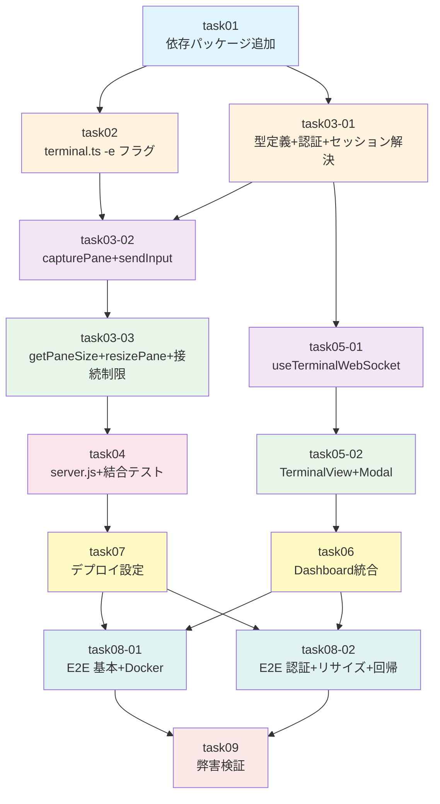

# タスク計画: tmux-pane-viewer

## 概要

| 項目 | 内容 |
|------|------|
| チケットID | tmux-pane-viewer |
| タスク名 | tmux pane ターミナルビューア機能 |
| 作業ディレクトリ | submodules/editable/copilot-session-viewer |
| ブランチ | feature/tmux-pane-viewer |
| 総タスク数 | 13 |
| 推定総工数 | 約 200 分 |

---

## タスク一覧

| タスクID | タスク名 | 前提タスク | 並列グループ | 推定時間 | テストケース |
|----------|----------|-----------|-------------|---------|-------------|
| task01 | 依存パッケージ追加 & プロジェクト設定 | — | G1 | 10分 | — |
| task02 | terminal.ts captureTmuxPane `-e` フラグ拡張 | task01 | G2-A | 10分 | 既存テスト修正 |
| task03-01 | ws-terminal 型定義 + 認証 + セッション解決 | task01 | G2-A | 15分 | UT-1,2,4,5,6,24-r |
| task03-02 | capturePane + sendInput + キーマッピング | task02, task03-01 | G3 | 20分 | UT-7〜15,17,18,20 |
| task03-03 | getPaneSize + resizePane + 接続数制限 | task03-02 | G4 | 15分 | UT-16,19,21-r〜26-r |
| task04 | server.js + setupTerminalWebSocket + 結合テスト | task03-03 | G5 | 30分 | IT-1〜11 |
| task05-01 | useTerminalWebSocket フック | task03-01 | G3 | 15分 | — (コンポーネントテストでカバー) |
| task05-02 | TerminalView + TerminalModal コンポーネント | task05-01 | G6 | 25分 | UT-21〜28 (Modal+View) |
| task06 | ActiveSessionsDashboard 統合 | task05-02 | G7 | 10分 | — |
| task07 | デプロイ設定 (Dockerfile + scripts) | task04 | G7 | 10分 | — |
| task08-01 | E2E テスト: 基本フロー + Docker | task06, task07 | G8 | 20分 | E2E-1〜5 |
| task08-02 | E2E テスト: 認証 + リサイズ + 回帰 | task06, task07 | G8 | 20分 | E2E-6〜12 |
| task09 | 弊害検証 | task08-01, task08-02 | G9 | 15分 | 回帰テスト全体 |

---

## 依存関係グラフ

---

## 並列実行グループ

| グループ | タスク | 備考 |
|---------|--------|------|
| G1 | task01 | 基盤（単独実行） |
| G2-A | task02, task03-01 | 異なるファイル → 並列可 |
| G3 | task03-02, task05-01 | 異なるファイル → 並列可 |
| G4 | task03-03 | ws-terminal.ts 追加（単独） |
| G5 | task04 | server.js + 結合テスト（単独） |
| G6 | task05-02 | コンポーネント（単独） |
| G7 | task06, task07 | 異なるファイル → 並列可 |
| G8 | task08-01, task08-02 | 異なる E2E ファイル → 並列可 |
| G9 | task09 | 検証（単独） |

---

## テストケース→タスク マッピング

### 単体テスト (ws-terminal.test.ts)

| テストID | タスク | テスト内容 |
|----------|--------|-----------|
| UT-1 | task03-01 | authenticateUpgrade 正常認証 |
| UT-2 | task03-01 | authenticateUpgrade 認証失敗 |
| UT-24-r | task03-01 | authenticateUpgrade 環境変数未設定 |
| UT-4 | task03-01 | resolveSession 有効sessionId |
| UT-5 | task03-01 | resolveSession 無効sessionId |
| UT-6 | task03-01 | resolveSession tmuxPane なし |
| UT-7 | task03-02 | capturePane ローカル実行 |
| UT-8 | task03-02 | capturePane Docker exec |
| UT-9 | task03-02 | capturePane 失敗時空文字 |
| UT-10 | task03-02 | sendInput 通常文字 |
| UT-11 | task03-02 | sendInput Enter変換 |
| UT-12 | task03-02 | sendInput Ctrl+C変換 |
| UT-13 | task03-02 | sendInput 矢印キー変換 |
| UT-14 | task03-02 | sendInput 混合入力分割 |
| UT-15 | task03-02 | sendInput Docker exec経由 |
| UT-17 | task03-02 | 差分検出（同一出力→スキップ） |
| UT-18 | task03-02 | 差分検出（変更あり→送信） |
| UT-20 | task03-02 | SPECIAL_KEY_MAP 完全性 |
| UT-16 | task03-03 | getPaneSize 取得 |
| UT-19 | task03-03 | 同一pane接続数制限 |
| UT-21-r | task03-03 | resizePane ローカル |
| UT-22-r | task03-03 | resizePane Docker |
| UT-23-r | task03-03 | resizePane 不正サイズ |
| UT-25-r | task03-03 | 総接続上限（ローカル） |
| UT-26-r | task03-03 | 総接続上限（Docker） |

### 単体テスト (TerminalModal.test.tsx)

| テストID | タスク | テスト内容 |
|----------|--------|-----------|
| UT-21 | task05-02 | モーダルレンダリング |
| UT-22 | task05-02 | ✕ボタン onClose |
| UT-23 | task05-02 | Escape キー onClose |
| UT-24 | task05-02 | セッション情報表示 |
| UT-25 | task05-02 | エラー状態表示 |

### 単体テスト (TerminalView.test.tsx)

| テストID | タスク | テスト内容 |
|----------|--------|-----------|
| UT-26 | task05-02 | xterm.js 初期化 |
| UT-27 | task05-02 | unmount 時 dispose |
| UT-28 | task05-02 | テーマ同期 |

### 結合テスト (ws-terminal.test.ts 内)

| テストID | タスク | テスト内容 |
|----------|--------|-----------|
| IT-1 | task04 | WS接続→connected メッセージ |
| IT-2 | task04 | capture-pane→WS出力 |
| IT-3 | task04 | WS入力→send-keys |
| IT-4 | task04 | 認証→WS接続拒否 |
| IT-5 | task04 | WS切断→クリーンアップ |
| IT-6 | task04 | Docker環境capture+send |
| IT-7 | task04 | 接続再確立 |
| IT-8 | task04 | resize→tmux resize-pane |
| IT-9 | task04 | 認証未設定時接続拒否 |
| IT-10 | task04 | ローカル総接続上限 |
| IT-11 | task04 | Docker総接続上限 |

### E2E テスト (terminal-viewer.spec.ts)

| テストID | タスク | テスト内容 |
|----------|--------|-----------|
| E2E-1 | task08-01 | ターミナルモーダル表示 |
| E2E-2 | task08-01 | リアルタイム表示 |
| E2E-3 | task08-01 | キー入力送信 |
| E2E-4 | task08-01 | モーダル閉じる |
| E2E-5 | task08-01 | Docker コンテナ内セッション |
| E2E-6 | task08-02 | 既存機能 — セッション一覧 |
| E2E-7 | task08-02 | 既存機能 — ask_user 応答 |
| E2E-8 | task08-02 | 認証付き WS 接続 |
| E2E-9 | task08-02 | 未認証 WS 接続拒否 |
| E2E-10 | task08-02 | 誤認証 WS 接続拒否 |
| E2E-11 | task08-02 | 認証後のみ入力可能 |
| E2E-12 | task08-02 | ターミナルリサイズ |

---

## acceptance_criteria → テスト → タスク 対応表

| acceptance_criteria | テストケース | 実装タスク | テストタスク |
|---------------------|-------------|-----------|-------------|
| AC-1: UI存在 | E2E-1 | task06 | task08-01 |
| AC-2: リアルタイム表示 | UT-7,8 / IT-2 / E2E-2 | task03-02, task04 | task03-02, task04, task08-01 |
| AC-3: キー入力送信 | UT-10〜15 / IT-3 / E2E-3 | task03-02, task04 | task03-02, task04, task08-01 |
| AC-4: Docker対応 | UT-8,15 / IT-6 / E2E-5 | task03-02, task04 | task03-02, task04, task08-01 |
| AC-5: 既存機能正常 | E2E-6, E2E-7 | — | task08-02 |

---

## 変更履歴

| 日付 | バージョン | 変更内容 | 変更者 |
|------|------------|----------|--------|
| 2025-07-18 | 1.0 | 初版作成 | Copilot |
