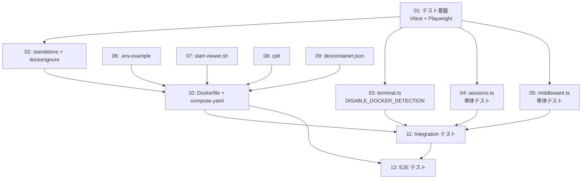

# タスク一覧 — viewer-container-local

## 概要

| 項目 | 内容 |
|------|------|
| チケットID | viewer-container-local |
| タスク名 | container |
| 総タスク数 | 12 |
| 見積合計 | 約3.5時間 (バッファ込み ~4.5時間 ※MPR-012: 環境問題・コンフリクト解決等で ~20% 増の想定) |
| 作成日 | 2026-03-22 |

---

## タスク一覧

| ID | タスク名 | 見積 | フェーズ | 並列グループ | 依存 |
|----|---------|------|---------|-------------|------|
| 01 | テスト基盤セットアップ (Vitest + Playwright + package.json) | 15min | Phase 1 | — | なし |
| 02 | next.config.ts standalone 出力 + .dockerignore | 10min | Phase 1 | — | 01 |
| 03 | terminal.ts DISABLE_DOCKER_DETECTION + 単体テスト | 15min | Phase 2 | P2-A | 01 |
| 04 | sessions.ts 単体テスト | 15min | Phase 2 | P2-A | 01 |
| 05 | middleware.ts 単体テスト | 10min | Phase 2 | P2-A | 01 |
| 06 | .env.example + 環境変数ドキュメント | 5min | Phase 2 | P2-A | なし |
| 07 | start-viewer.sh エントリポイントスクリプト | 20min | Phase 3 | P3-A | なし |
| 08 | cplt ラッパースクリプト | 10min | Phase 3 | P3-A | なし |
| 09 | devcontainer.json ベースイメージ定義 | 10min | Phase 3 | P3-B | なし |
| 10 | Dockerfile アプリ層 + compose.yaml | 30min | Phase 3 | — | 02, 06, 07, 08, 09 |
| 11 | Integration テスト (tmux 検出 + .env 読み込み) | 20min | Phase 4 | — | 03, 04, 05, 10 |
| 12 | E2E テスト (Playwright コンテナフロー) | 30min | Phase 5 | — | 10, 11 |

---

## 依存グラフ



---

## 並列実行グループ

### Phase 1: テスト基盤 (順次)
- **01** → **02**

### Phase 2: 単体テスト + 環境設定 (並列グループ P2-A)
- **03**, **04**, **05**, **06** — 全て並列実行可能

### Phase 3: コンテナ構成ファイル (部分並列)
- **P3-A**: **07**, **08** — 並列実行可能
- **P3-B**: **09** — P3-A と並列実行可能
- **10** — 02, 06, 07, 08, 09 完了待ち (順次)

### Phase 4: Integration テスト (順次)
- **11** — Phase 2 + Task 10 完了待ち

### Phase 5: E2E テスト (順次)
- **12** — Task 10 + 11 完了待ち

---

## 実行順序（推奨）

```
Step 1: [01]                          # テスト基盤 (順次)
Step 2: [02]                          # standalone + dockerignore (順次)
Step 3: [03, 04, 05, 06, 07, 08, 09]  # 全並列実行
Step 4: [10]                          # Dockerfile + compose.yaml (順次)
Step 5: [11]                          # Integration テスト (順次)
Step 6: [12]                          # E2E テスト (順次)
```
