# ディレクトリ構成と依存関係

## ファイル・ディレクトリ成果物例

```
project/
├── setup.yaml                          # プロジェクト設定（初期入力）
├── project.yaml                        # プロジェクトコンテキスト（SSOT）
├── docs/
│   ├── {ticket_id}.md                  # 設計ドキュメント
│   └── {target_repo}/
│       ├── investigation/              # 調査結果
│       │   ├── 01_architecture.md
│       │   ├── 02_data-structure.md
│       │   └── ...
│       ├── design/                     # 設計結果
│       │   ├── 01_implementation-approach.md
│       │   ├── 02_interface-api-design.md
│       │   └── ...
│       ├── plan/                       # タスク計画
│       │   ├── task-list.md
│       │   ├── task01.md
│       │   ├── parent-agent-prompt.md
│       │   └── ...
│       ├── implement/                  # 実行ログ
│       │   └── execution-log.md
│       ├── verification/               # 検証結果
│       │   └── results.md
│       └── code-review/                # コードレビュー結果
│           ├── round-01.md
│           └── round-02.md
└── submodules/
    ├── {repo_name}/                    # サブモジュール
    └── {repo_name}.md                  # サブモジュール概要
```

---

## 依存関係グラフ

エージェント・スキル・スクリプト・設定ファイル間の依存関係を示します。

```mermaid
graph TD
    %% ── スタイル定義 ──
    classDef agent fill:#6366f1,stroke:#4338ca,color:#fff
    classDef workflow fill:#8b5cf6,stroke:#6d28d9,color:#fff
    classDef review fill:#ec4899,stroke:#be185d,color:#fff
    classDef quality fill:#f59e0b,stroke:#d97706,color:#000
    classDef helper fill:#14b8a6,stroke:#0d9488,color:#fff
    classDef script fill:#06b6d4,stroke:#0891b2,color:#fff
    classDef config fill:#64748b,stroke:#475569,color:#fff
    classDef data fill:#22c55e,stroke:#16a34a,color:#fff
    classDef hook fill:#f97316,stroke:#ea580c,color:#fff

    %% ── エージェント ──
    AGENT[dev-workflow<br/>エージェント]:::agent

    %% ── ワークフロースキル（10ステップ） ──
    S_INIT[init-work-branch]:::workflow
    S_OVER[submodule-overview]:::workflow
    S_BRAIN[brainstorming]:::workflow
    S_INV[investigation]:::workflow
    S_DES[design]:::workflow
    S_PLAN[plan]:::workflow
    S_IMPL[implement]:::workflow
    S_VER[verification]:::workflow
    S_FIN[finishing-branch]:::workflow

    %% ── レビュースキル ──
    S_RD[review-design]:::review
    S_RP[review-plan]:::review
    S_CR[code-review]:::review
    S_CRF[code-review-fix]:::review

    %% ── 品質・補助スキル ──
    S_PROTO[skill-usage-protocol]:::quality
    S_TDD[test-driven-development]:::quality
    S_VBC[verification-before-completion]:::quality
    S_DEBUG[systematic-debugging]:::quality
    S_COMMIT[commit]:::quality
    S_COMMITM[commit-multi-repo]:::quality
    S_WRITING[writing-skills]:::quality
    S_ISSUE[issue-to-setup-yaml]:::quality
    S_SETUP[create-setup-yaml]:::quality

    %% ── スクリプト ──
    SC_HELPER[project-yaml-helper.sh]:::script
    SC_VALID[validate-project-yaml.sh]:::script
    SC_METRICS[generate-metrics.sh]:::script

    %% ── フック ──
    HOOK_SS[hooks/session-start.sh]:::hook
    HOOKS_JSON[.claude/hooks.json]:::hook

    %% ── 設定・データファイル ──
    F_PY[project.yaml<br/>SSOT]:::data
    F_SY[setup.yaml]:::config
    F_PREC[preconditions.yaml]:::config
    F_SCHEMA[project-yaml.schema.yaml]:::config
    F_REG[_registry.yaml]:::config
    F_AGENTS[AGENTS.md]:::config

    %% ═══ エージェント → スキル ═══
    AGENT -->|ステップ実行| S_INIT
    AGENT -->|ステップ実行| S_OVER
    AGENT -->|ステップ実行| S_BRAIN
    AGENT -->|ステップ実行| S_INV
    AGENT -->|ステップ実行| S_DES
    AGENT -->|ステップ実行| S_RD
    AGENT -->|ステップ実行| S_PLAN
    AGENT -->|ステップ実行| S_RP
    AGENT -->|ステップ実行| S_IMPL
    AGENT -->|ステップ実行| S_VER
    AGENT -->|ステップ実行| S_CR
    AGENT -->|ステップ実行| S_CRF
    AGENT -->|ステップ実行| S_FIN
    AGENT -.->|参照| SC_HELPER
    AGENT -.->|参照| F_REG

    %% ═══ スキル → project-yaml-helper.sh ═══
    S_INV -->|init-section / update| SC_HELPER
    S_DES -->|init-section / update| SC_HELPER
    S_BRAIN -->|update| SC_HELPER
    S_VER -->|init-section / update| SC_HELPER
    S_CR -->|init-section| SC_HELPER
    S_FIN -->|init-section| SC_HELPER

    %% ═══ スキル → project.yaml（yq 読み書き） ═══
    S_BRAIN -->|生成| F_PY
    S_INV -->|読み書き| F_PY
    S_DES -->|読み書き| F_PY
    S_RD -->|読み書き| F_PY
    S_PLAN -->|読み書き| F_PY
    S_RP -->|読み書き| F_PY
    S_IMPL -->|読み書き| F_PY
    S_VER -->|読み書き| F_PY
    S_CR -->|読み書き| F_PY
    S_CRF -->|読み書き| F_PY
    S_FIN -->|読み書き| F_PY

    %% ═══ setup.yaml 関連 ═══
    S_ISSUE -->|生成| F_SY
    S_SETUP -->|生成| F_SY
    S_INIT -->|読み込み| F_SY
    S_BRAIN -->|読み込み| F_SY

    %% ═══ スクリプト間の依存 ═══
    SC_HELPER -->|validate サブコマンド| SC_VALID
    SC_VALID -->|前提条件チェック| F_PREC
    SC_VALID -->|スキーマ検証| F_SCHEMA
    SC_HELPER -->|読み書き| F_PY

    %% ═══ フック ═══
    HOOKS_JSON -->|SessionStart| HOOK_SS
    HOOK_SS -->|注入| S_PROTO
    HOOK_SS -->|読み込み| F_PY

    %% ═══ レビューループ ═══
    S_CR <-->|再帰ループ| S_CRF
    S_RD -.->|差し戻し| S_DES
    S_RP -.->|差し戻し| S_PLAN
```



---

## 凡例

| 色         | カテゴリ           | 説明                             |
| ---------- | ------------------ | -------------------------------- |
| 🟪 紫       | エージェント       | ワークフロー全体を統合管理       |
| 🟣 薄紫     | ワークフロースキル | 10ステップの各プロセス           |
| 🩷 ピンク   | レビュースキル     | 設計・計画・コードの品質レビュー |
| 🟡 黄       | 品質・補助スキル   | TDD・デバッグ・コミット等        |
| 🔵 水色     | スクリプト         | project.yaml 操作ヘルパー        |
| 🟠 オレンジ | フック             | セッション開始時の自動注入       |
| 🟢 緑       | データファイル     | project.yaml（SSOT）             |
| ⬜ グレー   | 設定ファイル       | スキーマ・レジストリ・前提条件   |
