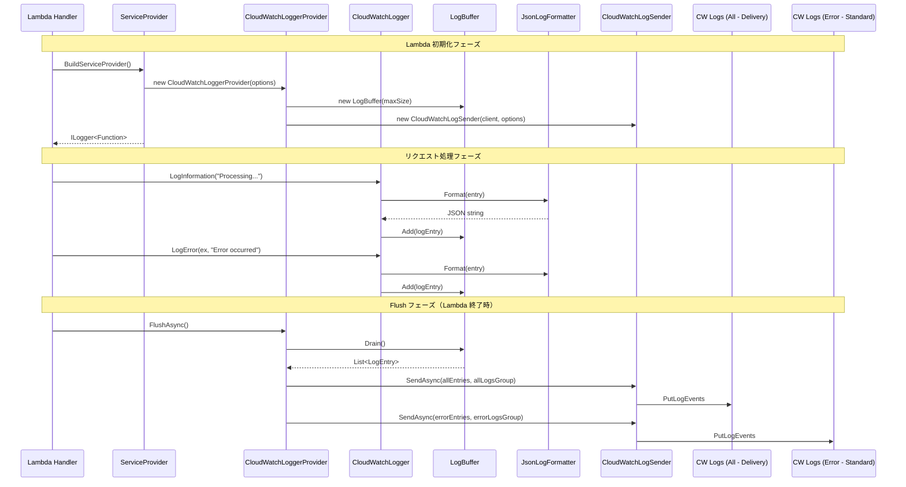
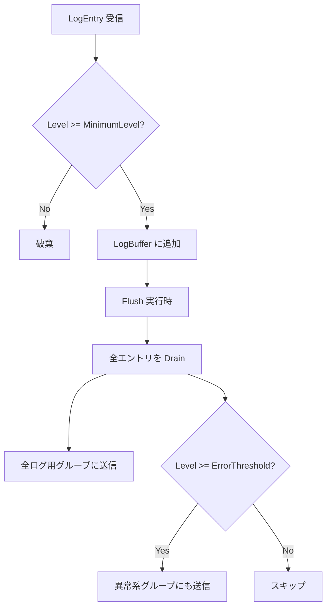
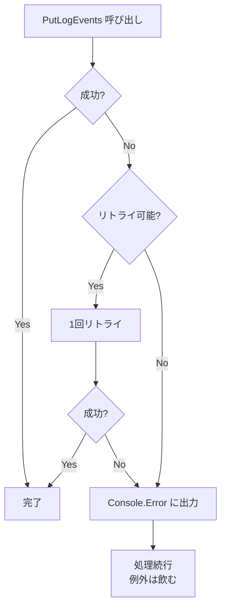
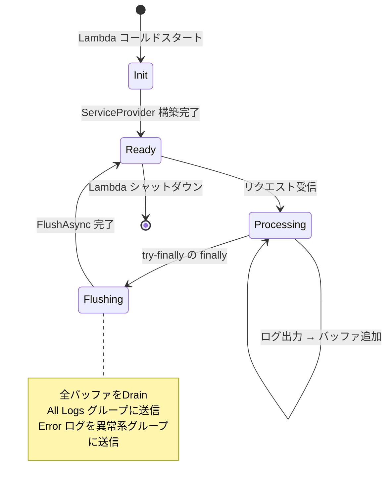

# 処理フロー設計

## メイン処理フロー



## ログ振り分けフロー



## エラーハンドリングフロー



## Lambda ライフサイクルとの統合



## ストリーム名生成ロジック

```
パターン: {yyyy/MM/dd}/{FunctionName}/{Guid}
例: 2026/02/15/my-function/a1b2c3d4-e5f6-7890-abcd-ef1234567890
```

- 日付プレフィックスで CloudWatch Logs コンソールでの視認性向上
- Guid で Lambda 実行インスタンスごとの一意性確保
- 同一ストリームへの並列書き込みを回避
