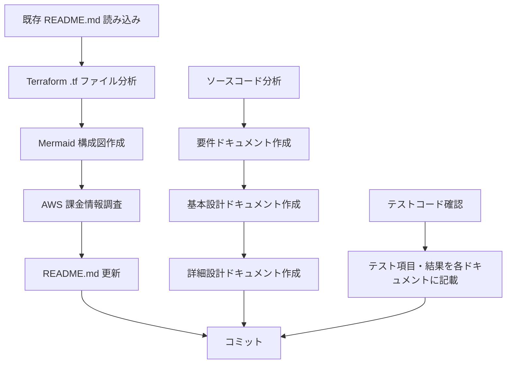

# 処理フロー設計

本タスクはドキュメント作成のみのため、処理フローの変更はなし。

## ドキュメント作成フロー

```mermaid
flowchart TD
    A[既存 README.md 読み込み] --> B[Terraform .tf ファイル分析]
    B --> C[Mermaid 構成図作成]
    C --> D[AWS 課金情報調査]
    D --> E[README.md 更新]

    F[ソースコード分析] --> G[要件ドキュメント作成]
    G --> H[基本設計ドキュメント作成]
    H --> I[詳細設計ドキュメント作成]

    J[テストコード確認] --> K[テスト項目・結果を各ドキュメントに記載]

    E --> L[コミット]
    I --> L
    K --> L
```
