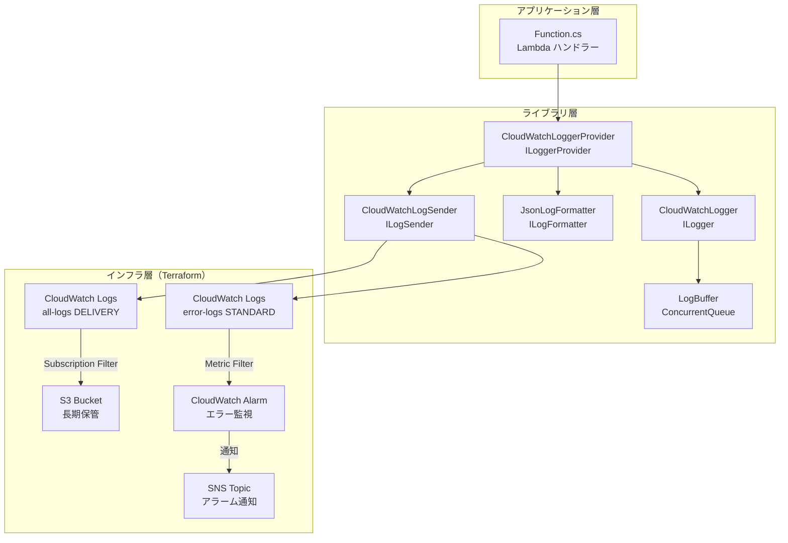
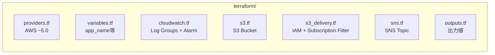

# アーキテクチャ調査

## プロジェクト構成

```
dotnet-lambda-log-base/
├── DotnetLambdaLogBase.sln
├── README.md
├── src/
│   ├── DotnetLambdaLogBase/              # Lambda 関数（アプリケーション層）
│   └── DotnetLambdaLogBase.Logging/      # ログライブラリ（ライブラリ層）
├── tests/
│   └── DotnetLambdaLogBase.Logging.Tests/ # 単体テスト
├── terraform/                             # インフラ定義（IaC層）
└── e2e/                                   # E2Eテスト環境
```

## レイヤー構成



## Terraform リソース構成（課金対象調査用）



### Terraform リソース一覧

| リソース | ファイル | 課金発生 |
|---|---|---|
| `aws_cloudwatch_log_group.all_logs` (DELIVERY) | cloudwatch.tf | ✅ |
| `aws_cloudwatch_log_group.error_logs` (STANDARD) | cloudwatch.tf | ✅ |
| `aws_cloudwatch_log_metric_filter` | cloudwatch.tf | ❌（無料） |
| `aws_cloudwatch_metric_alarm` | cloudwatch.tf | ✅ |
| `aws_s3_bucket` + 関連設定 | s3.tf | ✅ |
| `aws_iam_role` + policy (CWL→S3) | s3_delivery.tf | ❌（無料） |
| `aws_cloudwatch_log_subscription_filter` | s3_delivery.tf | ❌（無料） |
| `aws_sns_topic` + subscription | sns.tf | ✅（条件付き） |
