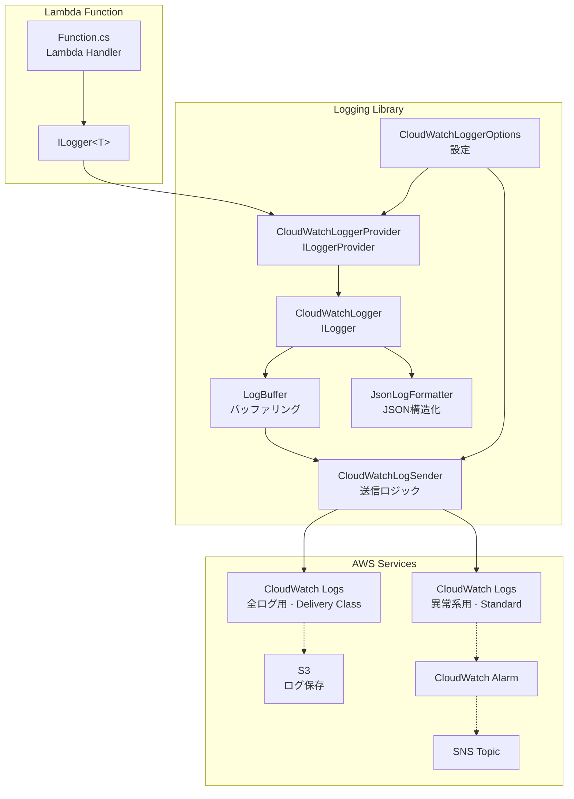

# アーキテクチャ調査

## 対象リポジトリの現状

`dotnet-lambda-log-base` は新規リポジトリ（README.md のみ）。テンプレートプロジェクトを0から構築する。

## 推奨プロジェクト構成

```
dotnet-lambda-log-base/
├── src/
│   ├── DotnetLambdaLogBase/              # Lambda 関数プロジェクト
│   │   ├── Function.cs                    # Lambda ハンドラー（テンプレート）
│   │   ├── DotnetLambdaLogBase.csproj
│   │   └── aws-lambda-tools-defaults.json
│   └── DotnetLambdaLogBase.Logging/      # ログライブラリプロジェクト
│       ├── CloudWatchLoggerProvider.cs    # ILoggerProvider 実装
│       ├── CloudWatchLogger.cs            # ILogger 実装
│       ├── CloudWatchLoggerOptions.cs     # 設定オプション
│       ├── LogBuffer.cs                   # ログバッファリング
│       ├── CloudWatchLogSender.cs         # CloudWatch Logs 送信
│       ├── JsonLogFormatter.cs            # JSON 構造化ログフォーマッター
│       ├── LoggingServiceCollectionExtensions.cs  # DI 拡張メソッド
│       └── DotnetLambdaLogBase.Logging.csproj
├── tests/
│   └── DotnetLambdaLogBase.Logging.Tests/ # xUnit テスト
│       ├── CloudWatchLoggerTests.cs
│       ├── LogBufferTests.cs
│       ├── JsonLogFormatterTests.cs
│       └── DotnetLambdaLogBase.Logging.Tests.csproj
├── terraform/
│   ├── main.tf                            # メインリソース定義
│   ├── variables.tf                       # 変数定義
│   ├── outputs.tf                         # 出力定義
│   ├── cloudwatch.tf                      # CloudWatch Logs グループ・Alarm
│   ├── s3.tf                              # S3 バケット（ログ保存先）
│   ├── sns.tf                             # SNS トピック（仮実装）
│   └── providers.tf                       # プロバイダ設定
├── DotnetLambdaLogBase.sln               # ソリューションファイル
└── README.md
```

## コンポーネント図



## レイヤー構成

| レイヤー | 責務 | コンポーネント |
|----------|------|----------------|
| Application | Lambda ハンドラー | Function.cs |
| Logging Abstraction | ILogger インターフェース | Microsoft.Extensions.Logging |
| Logging Provider | カスタムログプロバイダー | CloudWatchLoggerProvider, CloudWatchLogger |
| Formatting | ログフォーマット | JsonLogFormatter |
| Buffering | バッファリング | LogBuffer |
| Transport | CloudWatch Logs 送信 | CloudWatchLogSender (AWS SDK) |
| Infrastructure | AWS リソース定義 | Terraform |
