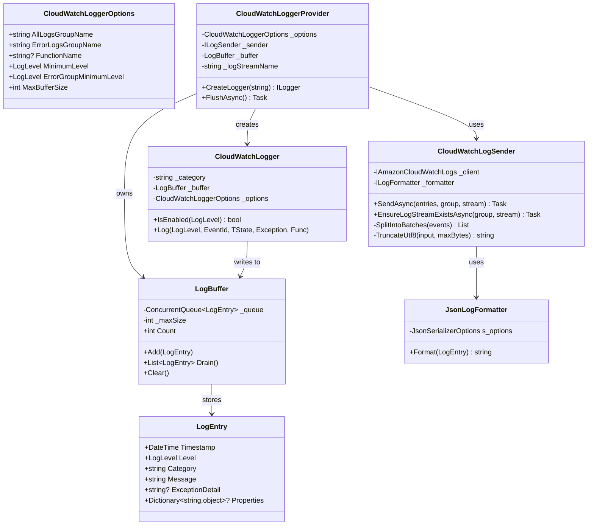

# データ構造調査

## LogEntry（ログエントリモデル）



## JSON 出力フォーマット

```json
{
  "timestamp": "2026-02-15T06:00:00.0000000Z",
  "level": "Error",
  "category": "DotnetLambdaLogBase.Function",
  "message": "Error processing request: abc-123",
  "exception": "System.InvalidOperationException: ...",
  "properties": { "key": "value" }
}
```

## PutLogEvents API 制約

| 制限 | 値 | 対応方法 |
|---|---|---|
| バッチサイズ | 最大 1 MB | `SplitIntoBatches` で自動分割 |
| バッチイベント数 | 最大 10,000 件 | `SplitIntoBatches` で自動分割 |
| 個別イベントサイズ | 最大 256 KB | `TruncateUtf8` で UTF-8 安全に切り詰め |
| イベントオーバーヘッド | 26 bytes/イベント | バッチサイズ計算に含める |
