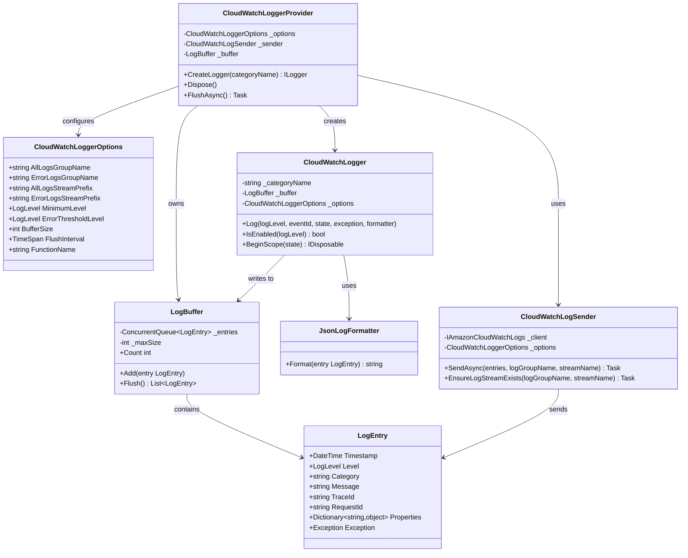

# データ構造調査

## ログエントリ構造（JSON 構造化ログ）

```json
{
  "timestamp": "2026-02-15T00:00:00.000Z",
  "level": "Information",
  "category": "MyApp.Handlers.OrderHandler",
  "message": "Processing order",
  "traceId": "1-abc-def",
  "requestId": "lambda-request-id",
  "functionName": "my-lambda-function",
  "properties": {
    "orderId": "12345",
    "customerId": "67890"
  },
  "exception": null
}
```

## クラス図



## PutLogEvents API 制約

| 制約 | 値 |
|------|-----|
| 最大バッチサイズ | 1,048,576 bytes (1MB) |
| 最大イベント数/バッチ | 10,000 |
| 最大イベントサイズ | 1 MB |
| タイムスタンプ範囲 | 過去14日 〜 未来2時間 |
| バッチ内時間スパン | 24時間以内 |
| イベント順序 | タイムスタンプ昇順必須 |
| シーケンストークン | 不要（現在は無視される） |
| 並列 PutLogEvents | 同一ストリームで可能 |

## CloudWatch Logs グループ設計

### 全ログ用（Delivery Class）
- ログクラス: `DELIVERY`
- 保持期間: 自動的に2日（Delivery Class の制約）
- S3 への配信で永続化
- GetLogEvents/FilterLogEvents API は使用不可

### 異常系用（Standard Class）
- ログクラス: `STANDARD`
- 保持期間: 3〜7日（設定可能）
- メトリクスフィルター対応
- CloudWatch Alarm 連携可能
