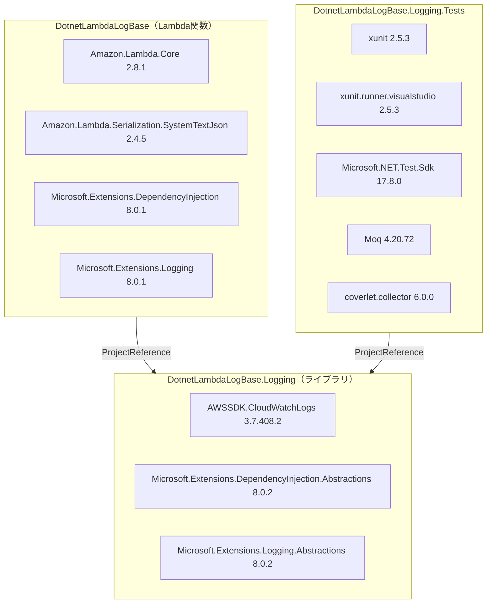

# 依存関係調査

## NuGet パッケージ依存関係

## E2E テストで修正されたバージョン互換性

| パッケージ | 修正前 | 修正後 | 理由 |
|---|---|---|---|
| AWSSDK.CloudWatchLogs | 4.0.14.5 | 3.7.408.2 | v4 は .NET 9+ 必須 |
| Microsoft.Extensions.DependencyInjection | 10.0.3 | 8.0.1 | v10 は .NET 10 Preview |
| Microsoft.Extensions.Logging | 10.0.3 | 8.0.1 | 同上 |
| Microsoft.Extensions.DependencyInjection.Abstractions | 10.0.3 | 8.0.2 | 同上 |
| Microsoft.Extensions.Logging.Abstractions | 10.0.3 | 8.0.2 | 同上 |

## Terraform プロバイダ依存

| プロバイダ | バージョン | 用途 |
|---|---|---|
| hashicorp/aws | ~> 5.0 | AWS リソース管理 |
| terraform | >= 1.0 | IaC エンジン |
