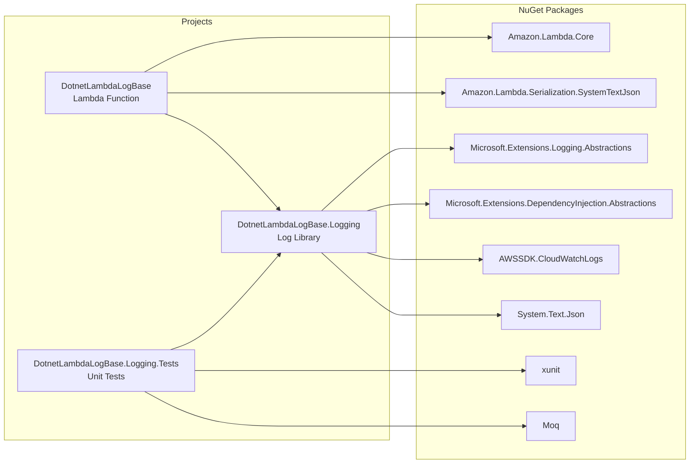

# 依存関係調査

## NuGet パッケージ依存関係

### Lambda 関数プロジェクト

| パッケージ | 用途 |
|------------|------|
| Amazon.Lambda.Core | Lambda 基盤 |
| Amazon.Lambda.Serialization.SystemTextJson | JSON シリアライゼーション |
| DotnetLambdaLogBase.Logging | カスタムログライブラリ（プロジェクト参照） |

### ログライブラリプロジェクト

| パッケージ | 用途 |
|------------|------|
| Microsoft.Extensions.Logging.Abstractions | ILogger/ILoggerProvider インターフェース |
| Microsoft.Extensions.DependencyInjection.Abstractions | DI 拡張メソッド |
| AWSSDK.CloudWatchLogs | CloudWatch Logs API クライアント |
| System.Text.Json | JSON シリアライゼーション |

### テストプロジェクト

| パッケージ | 用途 |
|------------|------|
| xunit | テストフレームワーク |
| xunit.runner.visualstudio | テストランナー |
| Moq | モックライブラリ |
| Microsoft.NET.Test.Sdk | テスト SDK |
| coverlet.collector | カバレッジ収集 |

## 依存関係図

## Terraform プロバイダ依存

| プロバイダ | バージョン | 用途 |
|------------|-----------|------|
| hashicorp/aws | >= 5.0 | AWS リソース管理 |
