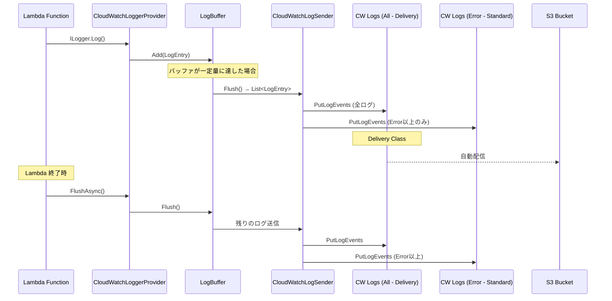
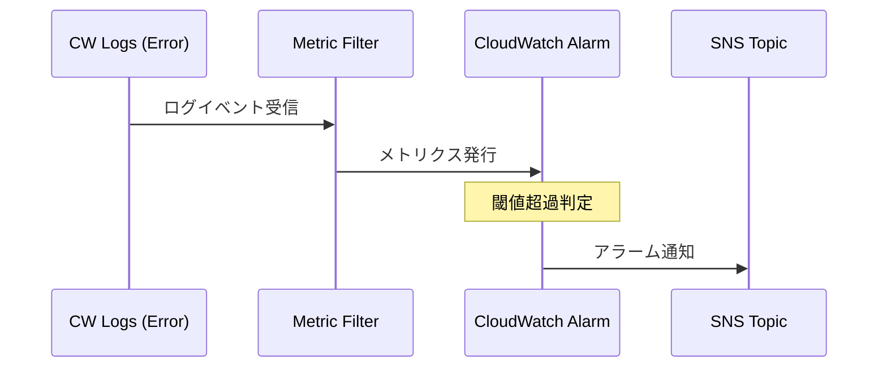

# 統合ポイント調査

## AWS サービス統合

### CloudWatch Logs との統合

### ログ振り分けロジック

| ログレベル | 全ログ用グループ | 異常系グループ |
|------------|-----------------|----------------|
| Trace | ✅ | ❌ |
| Debug | ✅ | ❌ |
| Information | ✅ | ❌ |
| Warning | ✅ | ❌ |
| Error | ✅ | ✅ |
| Critical | ✅ | ✅ |

### CloudWatch Alarm 統合

## Flush タイミング

| タイミング | トリガー | 実装方法 |
|------------|----------|----------|
| バッファフル | バッファサイズ到達 | LogBuffer.Add() 内で自動 Flush |
| タイマー | 一定間隔経過 | Timer による定期 Flush |
| Lambda 終了 | FunctionHandler の finally | FlushAsync() 明示呼び出し |
| Dispose | IAsyncDisposable | DisposeAsync() で Flush |
