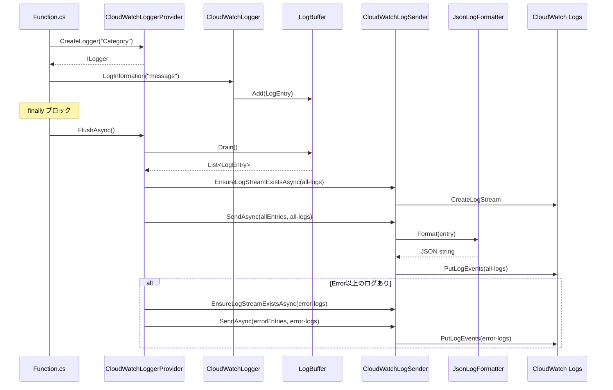
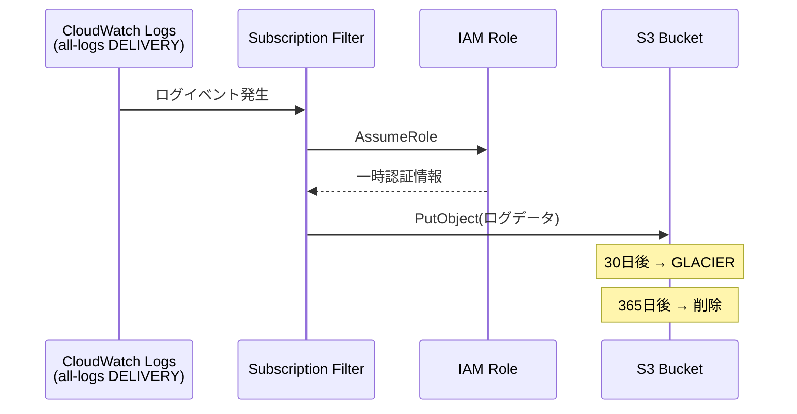
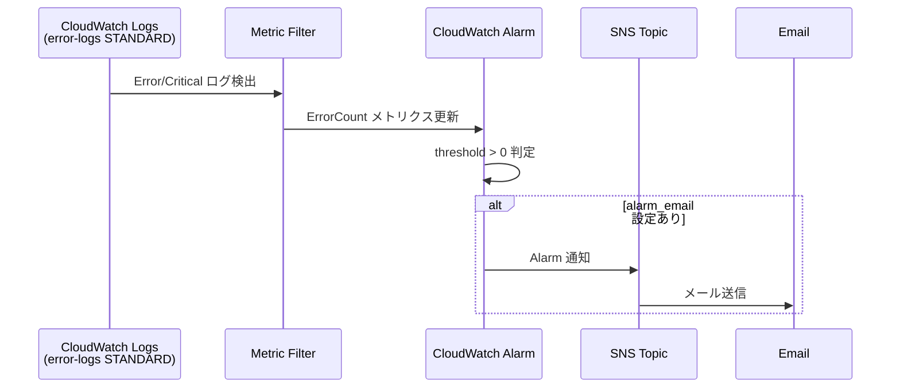

# 統合ポイント調査

## ログ送信シーケンス

```mermaid
sequenceDiagram
    participant F as Function.cs
    participant P as CloudWatchLoggerProvider
    participant L as CloudWatchLogger
    participant B as LogBuffer
    participant S as CloudWatchLogSender
    participant FMT as JsonLogFormatter
    participant CW as CloudWatch Logs

    F->>P: CreateLogger("Category")
    P-->>F: ILogger

    F->>L: LogInformation("message")
    L->>B: Add(LogEntry)

    Note over F: finally ブロック
    F->>P: FlushAsync()
    P->>B: Drain()
    B-->>P: List<LogEntry>

    P->>S: EnsureLogStreamExistsAsync(all-logs)
    S->>CW: CreateLogStream
    P->>S: SendAsync(allEntries, all-logs)
    S->>FMT: Format(entry)
    FMT-->>S: JSON string
    S->>CW: PutLogEvents(all-logs)

    alt Error以上のログあり
        P->>S: EnsureLogStreamExistsAsync(error-logs)
        P->>S: SendAsync(errorEntries, error-logs)
        S->>CW: PutLogEvents(error-logs)
    end
```

## S3 配信フロー

```mermaid
sequenceDiagram
    participant CW as CloudWatch Logs<br/>(all-logs DELIVERY)
    participant SF as Subscription Filter
    participant IAM as IAM Role
    participant S3 as S3 Bucket

    CW->>SF: ログイベント発生
    SF->>IAM: AssumeRole
    IAM-->>SF: 一時認証情報
    SF->>S3: PutObject(ログデータ)
    Note over S3: 30日後 → GLACIER
    Note over S3: 365日後 → 削除
```

## アラーム連携フロー

```mermaid
sequenceDiagram
    participant CW as CloudWatch Logs<br/>(error-logs STANDARD)
    participant MF as Metric Filter
    participant MA as CloudWatch Alarm
    participant SNS as SNS Topic
    participant Email as Email

    CW->>MF: Error/Critical ログ検出
    MF->>MA: ErrorCount メトリクス更新
    MA->>MA: threshold > 0 判定
    alt alarm_email 設定あり
        MA->>SNS: Alarm 通知
        SNS->>Email: メール送信
    end
```
