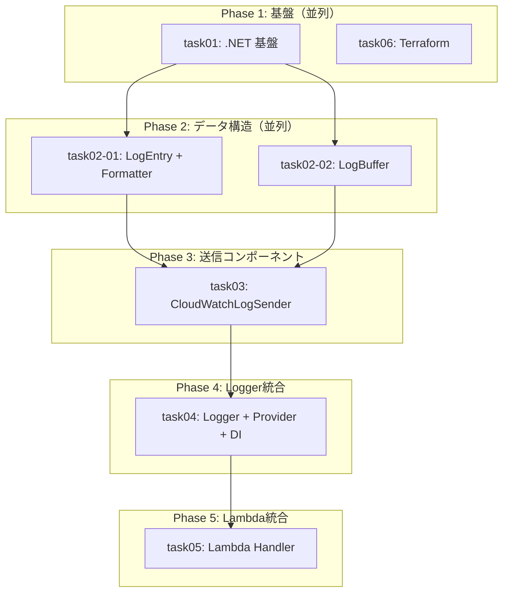

# 統合管理プロンプト: init-dotnet-lambda-log-base - .NET Lambda ログ管理テンプレート

## 概要

このプロンプトは、タスク計画に基づいて子エージェントを管理し、並列実行を調整するための統合管理ガイドです。

| 項目 | 値 |
|------|-----|
| チケットID | init-dotnet-lambda-log-base |
| タスク名 | .NET Lambda ログ管理テンプレートの作成 |
| 総タスク数 | 7 |
| 並列グループ数 | 2 |
| 推定総時間 | 1.5時間 |

---

## 全タスク一覧

| タスク識別子 | タスク名 | 前提条件 | 並列可否 | 推定時間 | ステータス |
|--------------|----------|----------|----------|----------|------------|
| task01 | .NET プロジェクト基盤セットアップ | なし | 可 | 10分 | ⬜ 未着手 |
| task06 | Terraform インフラ定義 | なし | 可 | 15分 | ⬜ 未着手 |
| task02-01 | LogEntry + JsonLogFormatter 実装 | task01 | 可 | 15分 | ⬜ 未着手 |
| task02-02 | LogBuffer 実装 | task01 | 可 | 10分 | ⬜ 未着手 |
| task03 | CloudWatchLogSender 実装 | task02-01, task02-02 | 不可 | 15分 | ⬜ 未着手 |
| task04 | CloudWatchLogger + Provider + DI 実装 | task03 | 不可 | 15分 | ⬜ 未着手 |
| task05 | Lambda ハンドラーテンプレート + Flush 統合 | task04 | 不可 | 10分 | ⬜ 未着手 |

---

## 依存関係グラフ



---

## 並列実行グループ

### Group A: 基盤準備（並列実行）

| タスク | 推定時間 | プロンプト |
|--------|----------|------------|
| task01 | 10分 | [task01.md](task01.md) |
| task06 | 15分 | [task06.md](task06.md) |

**開始条件**: なし（初期グループ）
**完了条件**: task01, task06 すべて完了

**並列実行の根拠**:
- .NET プロジェクトと Terraform は完全に独立
- 異なるディレクトリで作業

---

### Group B: データ構造（並列実行）

| タスク | 推定時間 | プロンプト |
|--------|----------|------------|
| task02-01 | 15分 | [task02-01.md](task02-01.md) |
| task02-02 | 10分 | [task02-02.md](task02-02.md) |

**開始条件**: task01 完了
**完了条件**: task02-01, task02-02 すべて完了

**並列実行の根拠**:
- LogEntry/Formatter と LogBuffer は独立したクラス
- 異なるファイルを編集
- 共有状態変更なし

---

### Group C〜E: 順次実行

| Phase | タスク | プロンプト |
|-------|--------|------------|
| Phase 3 | task03 | [task03.md](task03.md) |
| Phase 4 | task04 | [task04.md](task04.md) |
| Phase 5 | task05 | [task05.md](task05.md) |

---

## 実行順序

1. **Phase 1**: task01, task06 を並列実行
2. **Checkpoint 1**: 基盤の完了確認（dotnet build, terraform validate）
3. **Phase 2**: task02-01, task02-02 を並列実行
4. **Checkpoint 2**: データ構造テスト通過確認
5. **Phase 3**: task03 を実行
6. **Checkpoint 3**: LogSender テスト通過確認
7. **Phase 4**: task04 を実行
8. **Checkpoint 4**: Logger + Provider テスト通過確認
9. **Phase 5**: task05 を実行
10. **Final**: 全テスト実行、全体ビルド確認

---

## タスクプロンプト参照

| タスク | プロンプトファイル |
|--------|-------------------|
| task01 | [task01.md](task01.md) |
| task02-01 | [task02-01.md](task02-01.md) |
| task02-02 | [task02-02.md](task02-02.md) |
| task03 | [task03.md](task03.md) |
| task04 | [task04.md](task04.md) |
| task05 | [task05.md](task05.md) |
| task06 | [task06.md](task06.md) |

---

## Worktree管理手順

### 実行開始時

```bash
REPO_ROOT=$(git rev-parse --show-toplevel)
REQUEST_NAME="init-dotnet-lambda-log-base"
cd $REPO_ROOT
git branch $REQUEST_NAME HEAD 2>/dev/null || echo "ブランチは既に存在"
git worktree add /tmp/$REQUEST_NAME $REQUEST_NAME
```

### 並列タスク用

```bash
cd /tmp/$REQUEST_NAME
BASE_COMMIT=$(git rev-parse HEAD)
cd $REPO_ROOT
for TASK_ID in task01 task06; do
    git branch ${REQUEST_NAME}-${TASK_ID} $BASE_COMMIT
    git worktree add /tmp/${REQUEST_NAME}-${TASK_ID} ${REQUEST_NAME}-${TASK_ID}
done
```

---

## Cherry-pickフロー

### 並列タスク完了後

```bash
cd /tmp/$REQUEST_NAME
for TASK_ID in task01 task06; do
    cd /tmp/${REQUEST_NAME}-${TASK_ID}
    COMMIT_HASH=$(git rev-parse HEAD)
    cd /tmp/$REQUEST_NAME
    git cherry-pick $COMMIT_HASH
done

cd $REPO_ROOT
for TASK_ID in task01 task06; do
    git worktree remove /tmp/${REQUEST_NAME}-${TASK_ID} --force
    git branch -D ${REQUEST_NAME}-${TASK_ID}
done
```

---

## 完了条件

### 全体完了条件

- [ ] 全 7 タスクが完了していること
- [ ] `dotnet build` が成功すること
- [ ] `dotnet test` が全テスト通過すること（29テストケース）
- [ ] `terraform validate` が成功すること
- [ ] design-document が更新されていること

---

## 実行履歴

| タスク | 開始時刻 | 完了時刻 | コミット | ステータス |
|--------|----------|----------|----------|------------|
| task01 | - | - | - | ⬜ 未着手 |
| task06 | - | - | - | ⬜ 未着手 |
| task02-01 | - | - | - | ⬜ 未着手 |
| task02-02 | - | - | - | ⬜ 未着手 |
| task03 | - | - | - | ⬜ 未着手 |
| task04 | - | - | - | ⬜ 未着手 |
| task05 | - | - | - | ⬜ 未着手 |

### 進捗サマリー

- 完了: 0/7
- 進行中: 0
- 待機: 7

---

## チェックポイント

| ID | タイミング | チェック内容 | 結果 |
|----|------------|--------------|------|
| CP1 | Phase 1完了後 | dotnet build, terraform validate | ⬜ |
| CP2 | Phase 2完了後 | データ構造テスト通過 | ⬜ |
| CP3 | Phase 3完了後 | LogSender テスト通過 | ⬜ |
| CP4 | Phase 4完了後 | Logger + Provider テスト通過 | ⬜ |
| CP5 | Phase 5完了後 | 全テスト通過、ビルド確認 | ⬜ |
