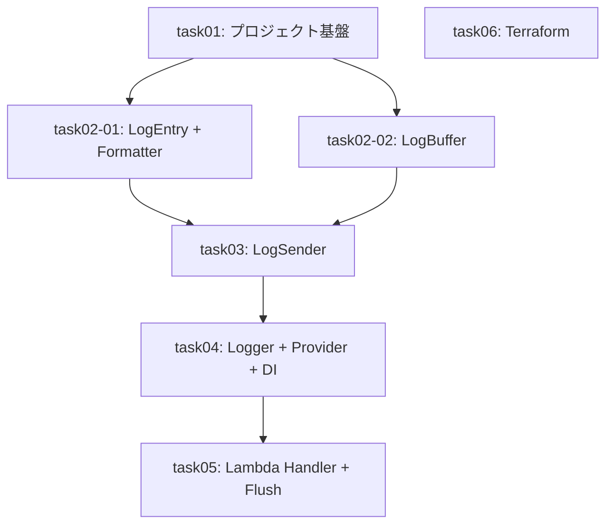

# タスク一覧と依存関係

## タスクサマリー

| タスク識別子 | タスク名 | 前提条件 | 並列可否 | 推定時間 | ステータス |
|--------------|----------|----------|----------|----------|------------|
| task01 | .NET プロジェクト基盤セットアップ | なし | 不可 | 10分 |  ⬜ 未着手 |
| task02-01 | LogEntry + JsonLogFormatter 実装 | task01 | 可 | 15分 | ⬜ 未着手 |
| task02-02 | LogBuffer 実装 | task01 | 可 | 10分 | ⬜ 未着手 |
| task03 | CloudWatchLogSender 実装 | task02-01, task02-02 | 不可 | 15分 | ⬜ 未着手 |
| task04 | CloudWatchLogger + Provider + DI 実装 | task03 | 不可 | 15分 | ⬜ 未着手 |
| task05 | Lambda ハンドラーテンプレート + Flush 統合 | task04 | 不可 | 10分 | ⬜ 未着手 |
| task06 | Terraform インフラ定義 | なし | 可(task01と並列) | 15分 | ⬜ 未着手 |

## 依存関係図

## 並列実行グループ

| グループ | タスク | 備考 |
|----------|--------|------|
| Group A | task01, task06 | プロジェクト基盤と Terraform は独立 |
| Group B | task02-01, task02-02 | データ構造とバッファは独立 |

## クリティカルパス

task01 → task02-01 → task03 → task04 → task05
