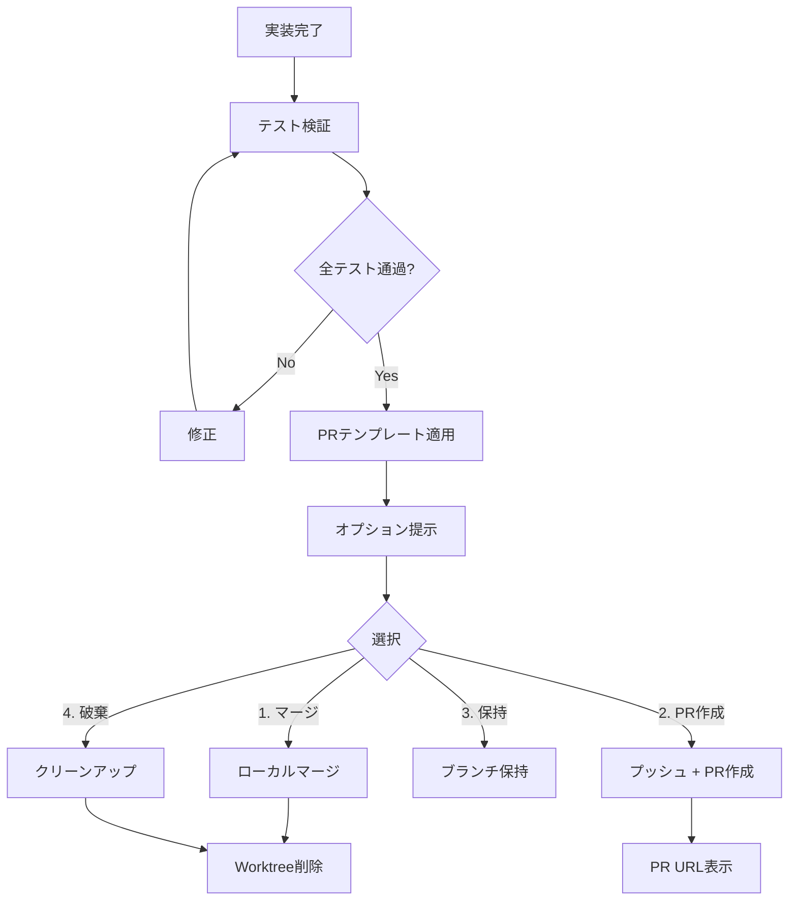

# finishing-branch 自動化手順

## 概要

実装完了後、テスト検証からPR作成・マージまでを自動化するワークフローです。

---

## 自動化フロー



---

## 具体的コマンド例

### 1. テスト検証

```bash
#!/bin/bash
# finishing-branch-verify.sh

REPO_ROOT=$(git rev-parse --show-toplevel)
cd "$REPO_ROOT"

echo "=== テスト検証 ==="

# ビルド確認
npm run build || { echo "ビルド失敗"; exit 1; }

# テスト実行
npm test || { echo "テスト失敗"; exit 1; }

# リント
npm run lint || { echo "リントエラー"; exit 1; }

# 型チェック
npm run typecheck || { echo "型エラー"; exit 1; }

echo "✅ 全検証通過"
```

### 2. PRテンプレート適用

```bash
#!/bin/bash
# generate-pr-description.sh

TICKET_ID="${1:-UNKNOWN}"
BRANCH_NAME=$(git branch --show-current)
BASE_SHA=$(git merge-base HEAD origin/main)
HEAD_SHA=$(git rev-parse HEAD)
FILE_COUNT=$(git diff $BASE_SHA..$HEAD_SHA --name-only | wc -l)

# テンプレートを読み込み、変数を置換
cat docs/templates/pr-template.md | \
  sed "s|{{timestamp}}|$(date '+%Y-%m-%d %H:%M:%S')|g" | \
  sed "s|{{branch_name}}|$BRANCH_NAME|g" | \
  sed "s|{{base_sha}}|$BASE_SHA|g" | \
  sed "s|{{head_sha}}|$HEAD_SHA|g" | \
  sed "s|{{file_count}}|$FILE_COUNT|g"
```

### 3. オプション実行

```bash
#!/bin/bash
# finishing-branch-execute.sh

OPTION="${1:-3}"  # デフォルトは保持
TICKET_ID="${2:-UNKNOWN}"
BASE_BRANCH="${3:-main}"

case $OPTION in
  1)
    echo "=== ローカルマージ ==="
    git checkout "$BASE_BRANCH"
    git merge "feature/$TICKET_ID"
    git branch -d "feature/$TICKET_ID"
    echo "✅ マージ完了"
    ;;
  2)
    echo "=== PR作成 ==="
    git push -u origin "feature/$TICKET_ID"

    # gh CLIでPR作成
    PR_BODY=$(./generate-pr-description.sh "$TICKET_ID")
    gh pr create \
      --base "$BASE_BRANCH" \
      --title "[$TICKET_ID] 機能実装" \
      --body "$PR_BODY"

    echo "✅ PR作成完了"
    ;;
  3)
    echo "=== ブランチ保持 ==="
    echo "ブランチ feature/$TICKET_ID を保持します"
    ;;
  4)
    echo "=== 破棄 ==="
    git checkout "$BASE_BRANCH"
    git branch -D "feature/$TICKET_ID"
    echo "✅ ブランチ削除完了"
    ;;
esac
```

### 4. Worktreeクリーンアップ

```bash
#!/bin/bash
# cleanup-worktrees.sh

TICKET_ID="${1:-UNKNOWN}"

echo "=== Worktree クリーンアップ ==="

# 並列タスク用worktreeを検索して削除
for WT in $(git worktree list | grep "/tmp/$TICKET_ID" | awk '{print $1}'); do
  echo "削除: $WT"
  git worktree remove "$WT" --force 2>/dev/null || true
done

# 対応するブランチも削除
for BR in $(git branch | grep "feature/$TICKET_ID-task"); do
  echo "ブランチ削除: $BR"
  git branch -D "$BR" 2>/dev/null || true
done

echo "✅ クリーンアップ完了"
```
