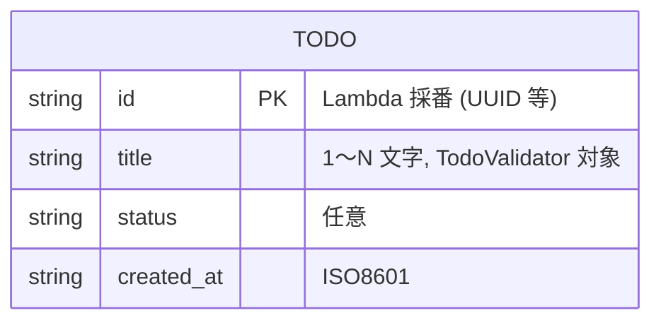
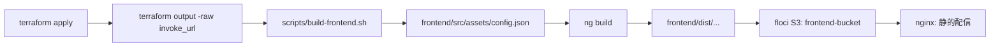

# データ構造設計

## 概要

| 項目       | 内容                                                  |
| ---------- | ----------------------------------------------------- |
| チケットID | FRONTEND-001                                          |
| タスク名   | floci-apigateway-csharp に Angular フロントエンド追加 |
| 作成日     | 2026-04-29                                            |

既存バックエンドのエンティティ（Todo）と DynamoDB スキーマは **変更しない**。
本タスクで追加されるのは **Angular 側の TypeScript 型**、**ランタイム設定 JSON**、**floci S3 上のオブジェクト構造**、**Terraform リソース定義の追加分** である。

---

## 1. 既存エンティティ（変更なし）



DynamoDB テーブル `Todos`（既存）に変更なし。

---

## 2. 追加する TypeScript 型

### 2.1 ドメインモデル

```typescript
// frontend/src/app/models/todo.ts
export interface Todo {
  id: string;
  title: string;
  status?: string;
  created_at?: string;
}

export interface TodoCreateRequest {
  title: string;
}

// 既存 Lambda の 4xx/5xx レスポンス両形式に対応
export interface ApiErrorResponse {
  errors?: string[];
  error?: string;
}

// UI 表示用のフラット化型（コンポーネント内で `errors[]` も `error` も同一に扱う）
export interface UiError {
  message: string;
  detail?: string[];
}
```

### 2.2 アプリケーション設定型

```typescript
// frontend/src/app/services/config.service.ts
export interface AppConfig {
  apiBaseUrl: string;   // floci API Gateway invoke_url（末尾スラッシュ無し）
}
```

### 2.3 型バリデーション

`ConfigService.load()` 内で `apiBaseUrl` を以下で検証する：

- 文字列であること
- 空文字でないこと
- `http://` または `https://` で始まること

不正時は reject し、UI に「設定読み込みエラー」を表示（fail-fast）。

---

## 3. ランタイム設定 `assets/config.json`

### 3.1 スキーマ

```json
{
  "apiBaseUrl": "string (必須, http(s)://...)"
}
```

| フィールド   | 型     | 必須 | 説明                                                      |
| ------------ | ------ | ---- | --------------------------------------------------------- |
| `apiBaseUrl` | string | ✅   | floci API Gateway invoke_url。末尾スラッシュ無し          |

### 3.2 生成タイミング



### 3.3 例

```json
{ "apiBaseUrl": "http://localhost:4566/restapis/abcd1234/dev/_user_request_" }
```

---

## 4. floci S3 上のオブジェクト構造

### 4.1 バケット

| バケット名         | 用途                       | 備考                                                           |
| ------------------ | -------------------------- | -------------------------------------------------------------- |
| `frontend-bucket`  | Angular 成果物の配置先     | floci ローカル限定。実 AWS S3 へは絶対に sync しない（DR-001） |

### 4.2 オブジェクトレイアウト

```
s3://frontend-bucket/
├── index.html
├── favicon.ico
├── main-XXXXXX.js
├── polyfills-XXXXXX.js
├── styles-XXXXXX.css
└── assets/
    └── config.json
```

`aws s3 sync frontend/dist/ s3://frontend-bucket/` で配置。
nginx は本タスクではこの S3 を直接 origin にせず、`./frontend/dist:/usr/share/nginx/html:ro` のボリュームマウントで配信する（floci S3 静的ホスティング互換不確実のため）。S3 への sync は「将来の本番化導線」「`scripts/deploy-frontend.sh` の存在確認」を兼ねる。

> **R2 軽減策**: floci S3 が静的ホスティング互換であれば、nginx の `proxy_pass` ではなく **「nginx を撤去して S3 静的ホスティング URL を直接使う」または「nginx config を S3 オブジェクトを fetch するよう書き換える」** どちらの拡張も可能な構造としておく（実装フェーズで決定）。

---

## 5. Terraform リソース追加（infra/）

### 5.1 追加リソース一覧

| リソースタイプ                                      | 名称                          | 役割                                          |
| --------------------------------------------------- | ----------------------------- | --------------------------------------------- |
| `aws_s3_bucket`                                     | `frontend`                    | フロント成果物の配信元                        |
| `aws_s3_bucket_website_configuration`               | `frontend`                    | （任意）静的ホスティング設定                  |
| `aws_api_gateway_method` (`OPTIONS`)                | `options_todos`               | `/todos` の OPTIONS                           |
| `aws_api_gateway_method` (`OPTIONS`)                | `options_todo_id`             | `/todos/{id}` の OPTIONS                      |
| `aws_api_gateway_integration` (`MOCK`)              | `options_todos_int`           | OPTIONS の MOCK 統合（200 を即返す）          |
| `aws_api_gateway_integration` (`MOCK`)              | `options_todo_id_int`         | 同上                                          |
| `aws_api_gateway_method_response`                   | `options_todos_resp`          | OPTIONS の応答ヘッダ宣言                      |
| `aws_api_gateway_integration_response`              | `options_todos_int_resp`      | OPTIONS の応答ヘッダ値（CORS）                |
| 同上 (`/todos/{id}` 用)                             | `options_todo_id_*`           | 同上                                          |

### 5.2 outputs.tf 追加

```hcl
output "frontend_bucket" {
  value = aws_s3_bucket.frontend.bucket
}

output "frontend_url" {
  # nginx ベース URL（compose 側 8080 固定）
  value = "http://localhost:8080"
}
```

> 互換性懸念がある場合は `aws_s3_bucket_website_configuration` を実装フェーズで切り離し可能に保つ。

---

## 6. compose / Docker Volume の構造

### 6.1 compose/docker-compose.yml 差分（要点）

```yaml
services:
  floci:
    environment:
      SERVICES: "apigateway,lambda,dynamodb,stepfunctions,iam,sts,cloudwatchlogs,s3"   # +s3
  nginx:                                # 新規 sidecar
    image: nginx:1.27-alpine
    ports: ["8080:8080"]
    networks: [floci-net]
    volumes:
      - ./compose/nginx/default.conf:/etc/nginx/conf.d/default.conf:ro
      - ./frontend/dist:/usr/share/nginx/html:ro
    depends_on: [floci]
networks:
  floci-net:
    name: floci-net
```

### 6.2 ファイル構成（追加分）

```
floci-apigateway-csharp/
├── compose/
│   └── nginx/
│       └── default.conf         # 新規: SPA 静的配信のみ
├── frontend/
│   ├── angular.json
│   ├── package.json
│   ├── package-lock.json
│   ├── tsconfig.json
│   ├── playwright.config.ts
│   ├── src/
│   │   ├── index.html
│   │   ├── main.ts
│   │   ├── styles.css
│   │   ├── assets/
│   │   │   └── config.json      # build-frontend.sh で生成
│   │   └── app/
│   │       ├── app.component.{ts,html,css,spec.ts}
│   │       ├── todo/
│   │       │   ├── todo.component.{ts,html,css,spec.ts}
│   │       └── services/
│   │           ├── config.service.{ts,spec.ts}
│   │           └── todo-api.service.{ts,spec.ts}
│   └── e2e/
│       └── todo.spec.ts         # Playwright
├── infra/
│   └── frontend.tf              # 新規 or main.tf に追記
└── scripts/
    ├── build-frontend.sh        # 新規
    ├── deploy-frontend.sh       # 新規
    └── web-e2e.sh               # 新規
```

---

## 7. マイグレーション計画

| 対象                | マイグレーション要否 | 内容                                                                           |
| ------------------- | -------------------- | ------------------------------------------------------------------------------ |
| DynamoDB `Todos`    | 不要                 | スキーマ無変更                                                                 |
| 既存 Lambda 配備    | 自動再配備           | `JsonHeaders` 変更により `dotnet lambda package` → `terraform apply` で更新   |
| API Gateway         | terraform apply      | OPTIONS メソッド追加。stage 再デプロイで反映                                   |
| floci S3 bucket     | terraform apply      | 新規 bucket 作成。既存環境ではロールバック時に削除                             |
| compose             | docker compose up    | nginx サービス追加分のみ起動                                                   |
| frontend            | 新規                 | `frontend/` ディレクトリごと追加                                               |

ロールバックは `06_side-effect-verification.md` §4 ロールバック計画 を参照。

---

## 8. スキーマ整合性

- Angular `Todo` 型は Lambda `Models/Todo.cs` のフィールド名（`id`, `title`, `status`, `created_at`）に追従する。命名差異（snake_case vs camelCase）は実装フェーズで `JsonOpts.cs` の Naming Policy を確認のうえ、Angular 側で `JsonProperty`/`@SerializedName` 相当の変換は行わずに **API のキー名そのまま** を採用する。
- API レスポンスのフィールド追加には Angular 側 `Todo` を `Partial`-tolerant な定義（オプショナル `?`）で受ける。

---

## 9. 変更点サマリー（データ構造）

| 項目                       | 修正前         | 修正後                                                  | 理由                              |
| -------------------------- | -------------- | ------------------------------------------------------- | --------------------------------- |
| Angular ドメイン型         | 無し           | `Todo`, `TodoCreateRequest`, `ApiErrorResponse`, `UiError` | フロント追加                      |
| ランタイム設定             | 無し           | `assets/config.json` (`AppConfig`)                      | invoke_url の環境差吸収           |
| floci `SERVICES`           | s3 無し        | `s3` 追加                                               | フロント成果物配置                |
| Terraform                  | API + Lambda + SFN + DDB | + S3 bucket + APIGW OPTIONS                  | フロント配信 + CORS               |
| Lambda レスポンスヘッダ辞書 | `Content-Type` のみ | + CORS ヘッダ                                          | ブラウザ直呼び対応                |
