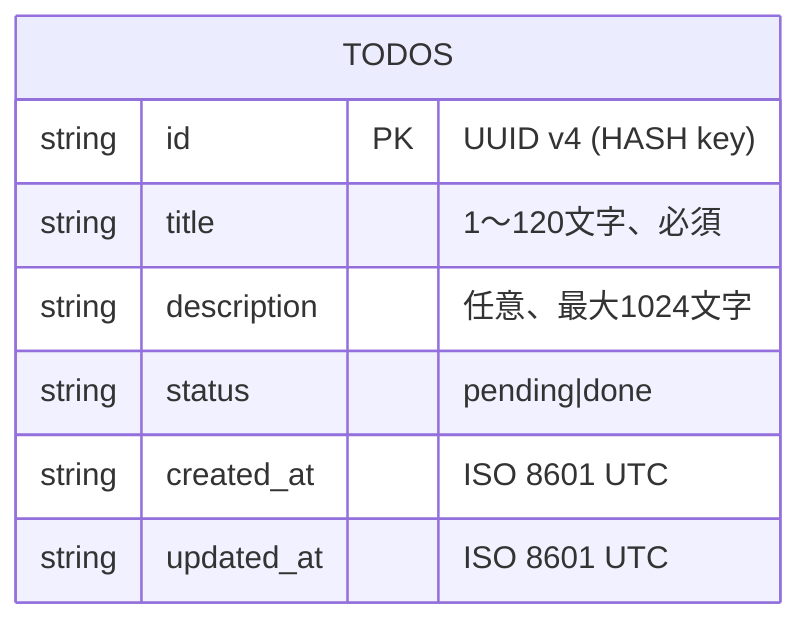
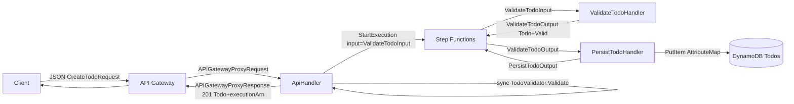
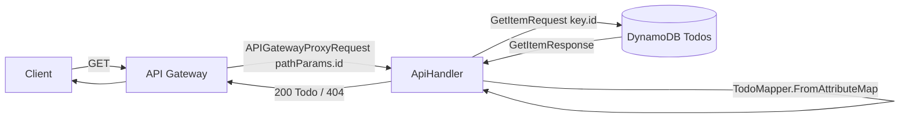

# データ構造設計

## 概要

| 項目 | 内容 |
|------|------|
| チケットID | floci-apigateway-csharp-001 |
| タスク名 | API Gateway + Lambda(.NET) + Step Functions サンプルアプリと CI/CD 基盤の構築 |
| 作成日 | 2026-04-25 |

---

## 1. エンティティ/モデル設計

### 1.1 ER図（DynamoDB シングルテーブル）



### 1.2 エンティティ定義

| エンティティ名 | 説明 | テーブル名 |
|----------------|------|------------|
| Todo | Todo ドメインモデル（API/SFN/Repository で共通） | `Todos` |

---

## 2. スキーマ変更

### 2.1 新規テーブル（Terraform）

```hcl
resource "aws_dynamodb_table" "todos" {
  name         = "Todos"
  billing_mode = "PAY_PER_REQUEST"
  hash_key     = "id"

  attribute {
    name = "id"
    type = "S"
  }
}
```

| 属性 | DynamoDB 型 | 必須 | 説明 |
|------|------------|------|------|
| `id` | S | ✅ | UUID v4。PartitionKey |
| `title` | S | ✅ | 1〜120 文字 |
| `description` | S | — | 任意、最大 1024 文字。空文字は格納しない（属性欠損で表現） |
| `status` | S | ✅ | `pending` / `done` |
| `created_at` | S | ✅ | ISO 8601 UTC（例 `2026-04-25T10:00:00Z`） |
| `updated_at` | S | ✅ | 同上 |

**GSI / TTL / Streams**: 未使用（サンプル簡素化、setup.yaml の non_functional 要件遵守）。

### 2.2 既存テーブル変更

新規リポジトリのため対象なし。

---

## 3. 型定義（C#）

### 3.1 新規型定義

```csharp
namespace TodoApi.Lambda.Models;

public sealed record Todo(
    string Id,
    string Title,
    string? Description,
    TodoStatus Status,
    DateTime CreatedAt,
    DateTime UpdatedAt);

public enum TodoStatus { Pending, Done }

public sealed record CreateTodoRequest(string Title, string? Description);

public sealed record ValidateTodoInput(CreateTodoRequest Todo);

public sealed record ValidateTodoOutput(
    Todo Todo,
    bool Valid,
    IReadOnlyList<string> Errors);

public sealed record PersistTodoOutput(string TodoId, bool Persisted);
```

JSON 設定（共通）:

```csharp
internal static class JsonOpts
{
    public static readonly JsonSerializerOptions Default = new()
    {
        PropertyNamingPolicy = JsonNamingPolicy.CamelCase,
        Converters = { new JsonStringEnumConverter(JsonNamingPolicy.CamelCase) }
    };
}
```

### 3.2 マッピング（DynamoDB ⇄ C#）

`Repositories/TodoMapper.cs` に集約。

| C# プロパティ | DynamoDB 属性名 | 型 | 備考 |
|---------------|-----------------|----|------|
| `Id` | `id` | S | — |
| `Title` | `title` | S | — |
| `Description` | `description` | S | `null` の場合は属性自体を出力しない |
| `Status` | `status` | S | `Pending` → `"pending"` / `Done` → `"done"` |
| `CreatedAt` | `created_at` | S | `ToUniversalTime().ToString("O")` |
| `UpdatedAt` | `updated_at` | S | 同上 |

```csharp
public static Dictionary<string, AttributeValue> ToAttributeMap(Todo t);
public static Todo FromAttributeMap(Dictionary<string, AttributeValue> map);
```

### 3.3 既存型の変更

新規作成のため対象なし。

---

## 4. データフロー

### 4.1 POST /todos のデータフロー



### 4.2 GET /todos/{id} のデータフロー



---

## 5. マイグレーション計画

### 5.1 マイグレーションステップ

| ステップ | 内容 | ロールバック方法 | 実行順序 |
|----------|------|------------------|----------|
| 1 | `terraform apply` で `aws_dynamodb_table.todos` 作成 | `terraform destroy` | 初回 1 回のみ |
| 2 | 既存データなし（サンプル新規） | — | — |

### 5.2 データ移行

新規構築のため対象なし。

---

## 6. インデックス設計

| テーブル | カラム | インデックス種別 | 目的 |
|----------|--------|------------------|------|
| `Todos` | `id` | PRIMARY (HASH) | 単一アイテム取得 |

GSI/LSI は未使用（サンプル要件に含まれないため）。

---

## 7. アイテムサンプル

```jsonc
{
  "id":          { "S": "f1c8f7a8-1d3a-4cf9-8f88-3b9a3a0b9af1" },
  "title":       { "S": "Buy milk" },
  "description": { "S": "2L organic" },
  "status":      { "S": "pending" },
  "created_at":  { "S": "2026-04-25T10:00:00Z" },
  "updated_at":  { "S": "2026-04-25T10:00:00Z" }
}
```

---

## 変更履歴

| 日付 | バージョン | 変更内容 | 変更者 |
|------|------------|----------|--------|
| 2026-04-25 | 1.0 | 初版作成 | dev-workflow |
