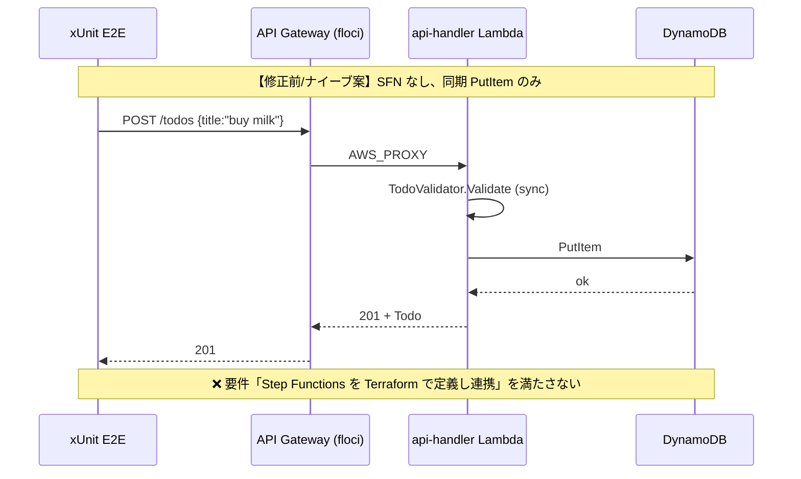
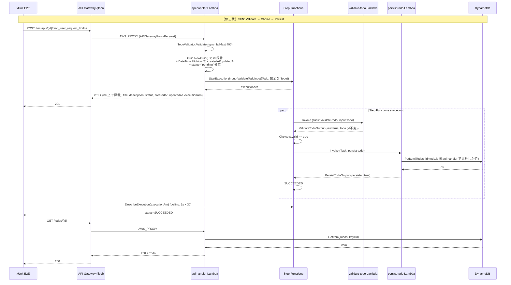
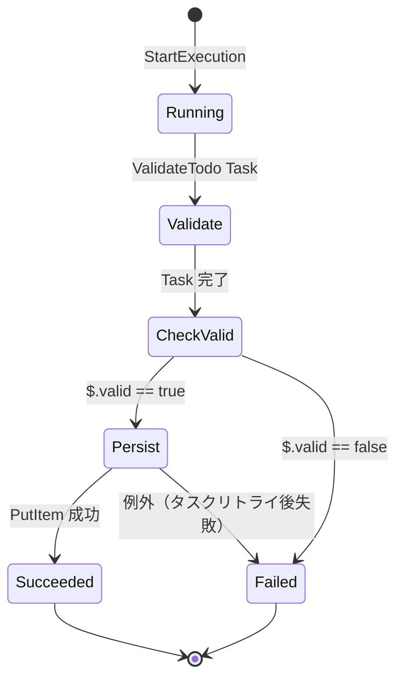
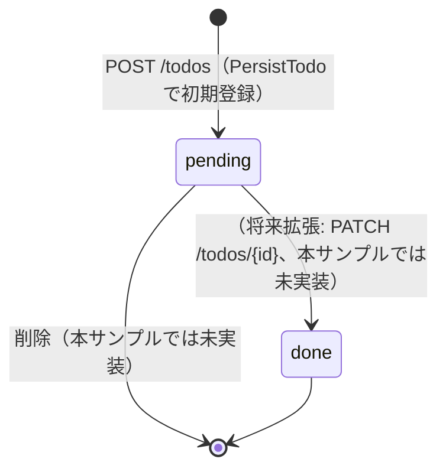
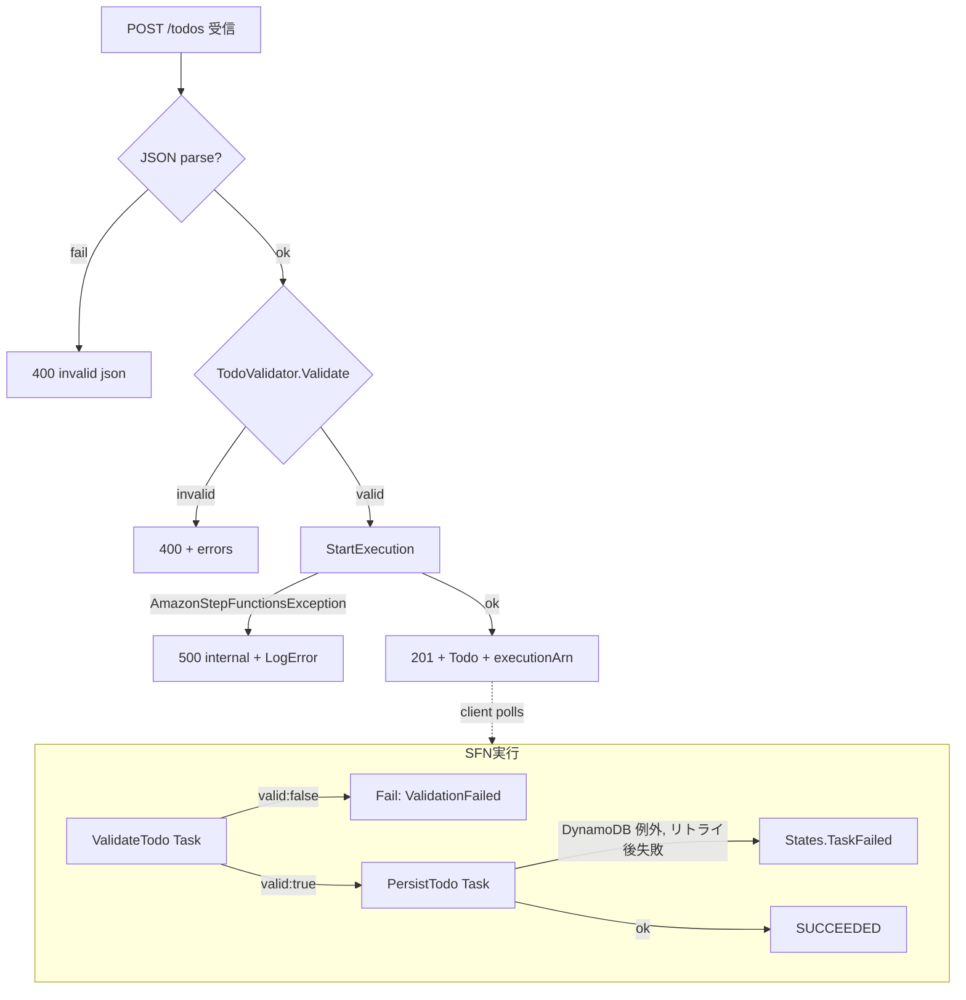
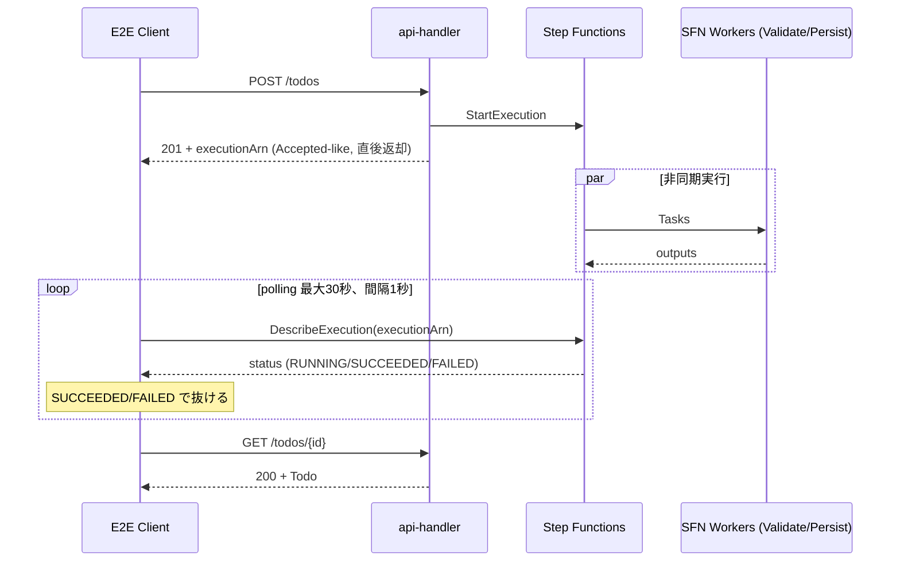
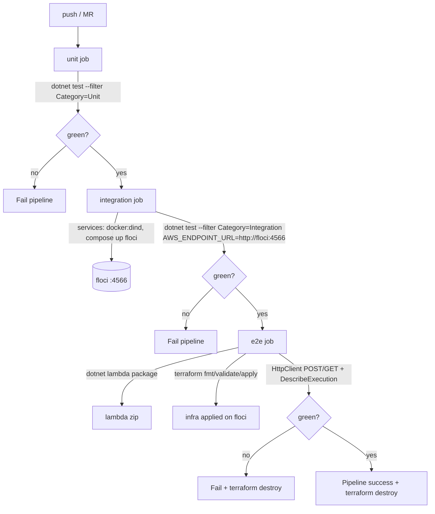

# 処理フロー設計

## 概要

| 項目 | 内容 |
|------|------|
| チケットID | floci-apigateway-csharp-001 |
| タスク名 | API Gateway + Lambda(.NET) + Step Functions サンプルアプリと CI/CD 基盤の構築 |
| 作成日 | 2026-04-25 |

---

## 1. シーケンス図（修正前/修正後対比）

> **前提**: 本リポジトリは新規作成のため「修正前」は **「Todo API は存在しない」** 状態である。
> 比較として「ナイーブな同期実装（案）」を「修正前」相当として並べ、本設計の優位性を明示する。

### 1.1 修正前：Todo API 未実装（または「Step Functions を使わずすべて同期」のナイーブ案）



### 1.2 修正後：本設計（Step Functions オーケストレーション付き）



### 1.3 変更点サマリー

| 項目 | 修正前（ナイーブ案） | 修正後（本設計） | 理由 |
|------|----------------------|------------------|------|
| Step Functions | 不使用 | ValidateTodo → PersistTodo を採用 | requirements「Step Functions を Terraform で定義し Lambda と連携」 |
| バリデーション | API 内同期のみ | API 内同期（fast-fail 400）+ SFN 内 ValidateTodo Task | SFN のチェックフロー検証を兼ね、サンプルとして両方を提示 |
| **id 採番（DR-002）** | API or Validate のどちら | **api-handler に統一**。ValidateTodo は検証のみで id を不変に透過 | POST 即返却 id と DynamoDB 格納 id の一致を保証し、E2E POST→polling→GET を成立させる |
| POST レスポンス | 永続化完了後 201 | StartExecution 直後 201 + executionArn | コールドスタートタイムアウトリスク回避（investigation 06）|
| DynamoDB 書き込み | api-handler 内 | persist-todo Task 内 | SFN のオーケストレーション責務分離 |
| E2E 検証粒度 | POST 結果のみ | POST → SFN SUCCEEDED → GET の3段確認 | acceptance_criteria「SFN 実行 SUCCEEDED」と整合 |

---

## 2. 状態遷移図（Step Functions 実行）



### 2.1 状態定義

| 状態 | 説明 | 遷移条件（IN） | 遷移条件（OUT） |
|------|------|----------------|-----------------|
| Running | 実行開始直後 | `StartExecution` API | ValidateTodo Task 開始 |
| Validate | ValidateTodoHandler 実行中 | StartAt | Task 終了 → CheckValid |
| CheckValid | Choice ステート | Validate Task 完了 | `$.valid` の真偽で分岐 |
| Persist | PersistTodoHandler 実行中 | `$.valid==true` | DynamoDB 書込結果で Succeeded/Failed |
| Succeeded | 正常終了 | Persist 成功 | 終了 |
| Failed | 異常終了 | バリデーション NG / Persist 例外 | 終了 |

### 2.2 Todo `status` の状態遷移（業務状態）



本サンプルでは **`pending` で固定登録のみ**、`done` への遷移 API は実装しない（out_of_scope）。

---

## 3. エラーフロー

### 3.1 エラーハンドリングフロー（POST /todos）



### 3.2 エラー種別と対応

| エラー種別 | 発生条件 | 対応方法 | リトライ |
|------------|----------|----------|----------|
| JSON parse 失敗 | リクエストボディ不正 | 400 即返却 | なし |
| `ValidationException` | TodoValidator.Validate `Valid=false` | 400 + errors 配列を返却 | なし |
| `AmazonStepFunctionsException` | StartExecution 失敗（floci 異常等） | 500 + LogError | なし（クライアント再試行に委ねる） |
| `ValidationFailed` (SFN) | SFN 内 ValidateTodo Task の `valid:false` | SFN 状態 = FAILED、E2E は polling で検知 | なし |
| `States.TaskFailed` (SFN) | PersistTodo Task の例外 | デフォルトリトライ 3 回（ASL retry 設定）、最終的に FAILED | 3 回 |
| DynamoDB `ResourceNotFoundException` | GET でアイテム未発見 | 404 + `not found` | なし |
| 未捕捉 `Exception` | 想定外エラー | 500 + LogError(stack) | なし |

ASL の `Retry` 設定（PersistTodo Task）は **02_interface-api-design §5 の ASL 定義に明記済み**（DR-005 対応）:

```jsonc
"Retry": [
  { "ErrorEquals": ["States.TaskFailed"], "IntervalSeconds": 1, "MaxAttempts": 3, "BackoffRate": 2.0 }
]
```

ValidateTodo Task は **Retry を設定しない**（バリデーション結果はリトライしても変わらないため）。両 Task 共通で `Catch` により失敗時は `Failed` ステートへ遷移する。

---

## 4. 非同期処理フロー（POST /todos の非同期確認）



### 4.1 ジョブ定義（SFN Task）

| ジョブ名 | 処理内容 | タイムアウト | リトライ回数 |
|----------|----------|--------------|--------------|
| `validate-todo` Task | TodoValidator.Validate を呼び、`ValidateTodoOutput` を返す | Lambda timeout 30s（ASL の TimeoutSeconds は明示せずデフォルト） | 0（バリデーション結果はリトライしない） |
| `persist-todo` Task | DynamoDB PutItem を実行 | Lambda timeout 30s | 3（States.TaskFailed） |

---

## 5. 並行処理

本設計では並行処理は使用しない（Step Functions は直列フロー）。
将来的に `Map`/`Parallel` を導入する場合の指針のみ記載：

| 観点 | 方針 |
|------|------|
| 排他制御 | DynamoDB 条件付き書き込み（`attribute_not_exists(id)` を `PutItem` に付与）で `id` の重複を防止可能 |
| 並列度 | サンプルとしては不要 |

### 5.1 排他制御

| リソース | ロック種別 | タイムアウト | デッドロック対策 |
|----------|------------|--------------|------------------|
| `Todos.id` | DynamoDB 条件付き PutItem（`ConditionExpression: "attribute_not_exists(id)"`、本サンプルではオプション） | DynamoDB の単発操作 | 不要（楽観制御） |

---

## 6. CI 実行フロー（GitLab CI ジョブ間の処理フロー）



CI ジョブの責務分離により、`unit` 段階で論理ミスを早期検知し、`integration` で Lambda ハンドラ単位の floci 結合を確認、`e2e` でのみ重い Terraform apply を行う。

---

## 変更履歴

| 日付 | バージョン | 変更内容 | 変更者 |
|------|------------|----------|--------|
| 2026-04-25 | 1.0 | 初版作成 | dev-workflow |
| 2026-04-25 | 1.1 | review-design round1 反映: §1.2 シーケンス図に「Guid.NewGuid() で id 採番（api-handler）」「ValidateTodo は id 不変」を追加（DR-002）、§1.3 サマリーに DR-002 行追加、§3.2 Retry 注記を「ASL §5 に明記済み」に修正（DR-005） | dev-workflow |
