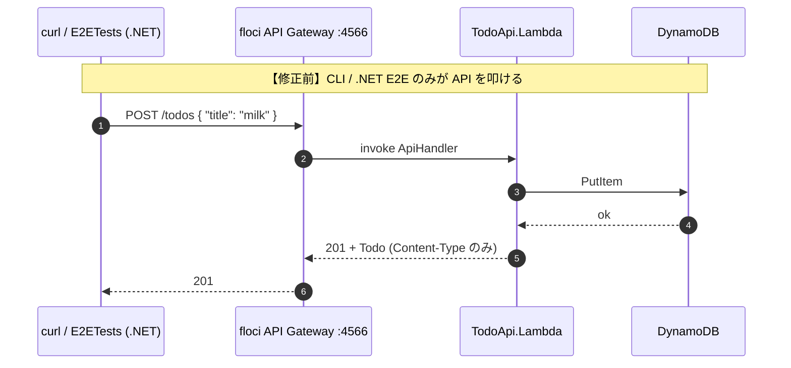
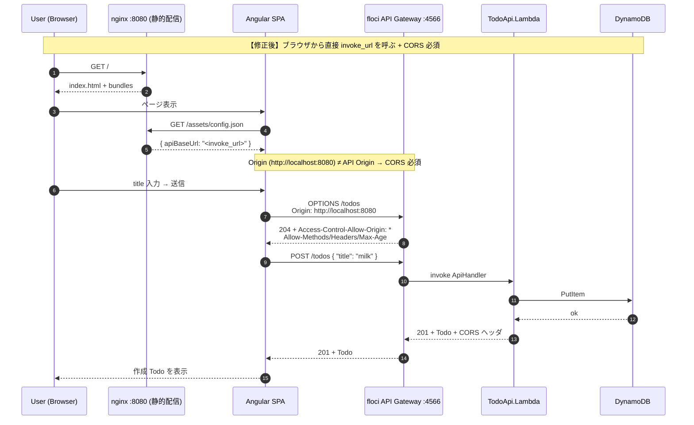
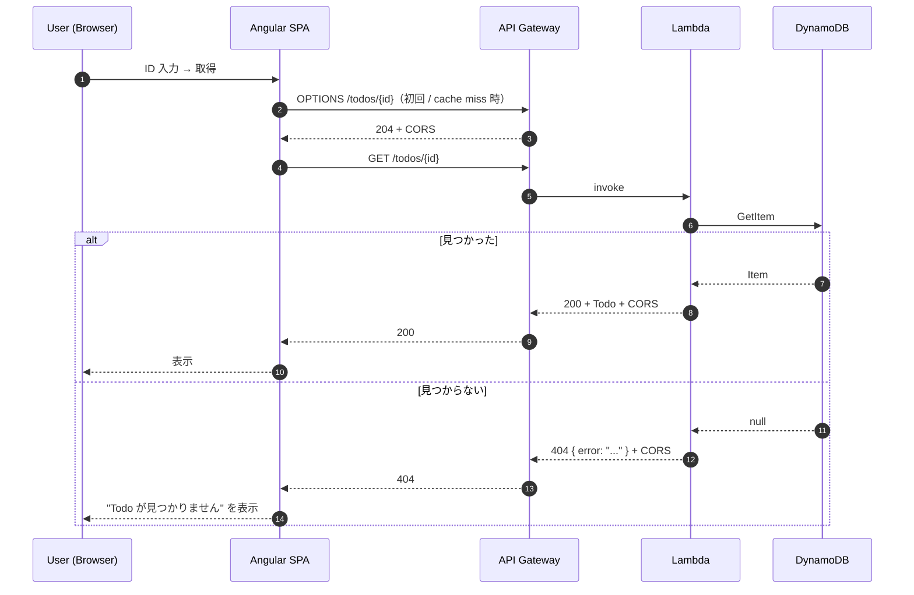
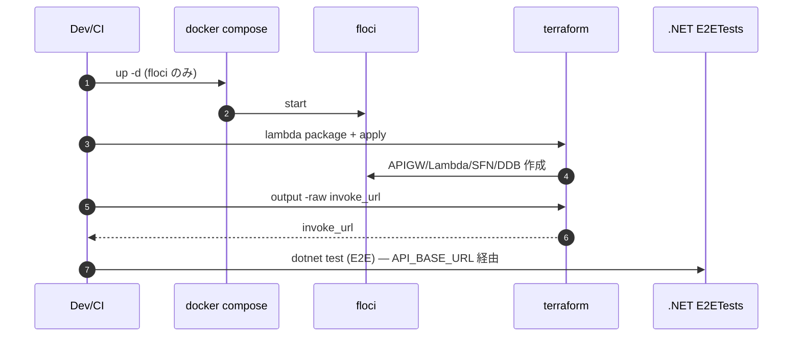
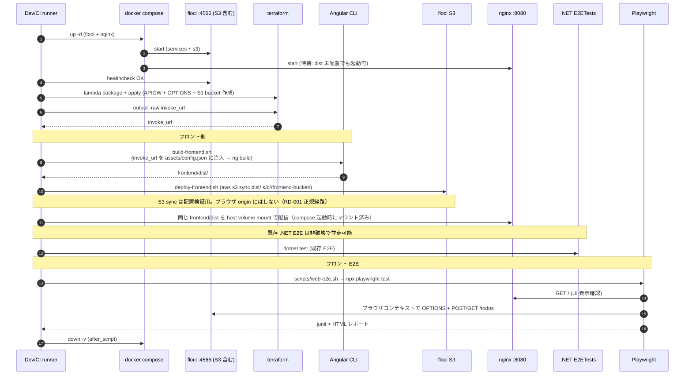
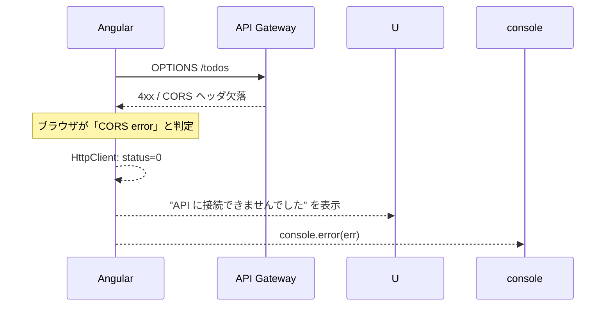
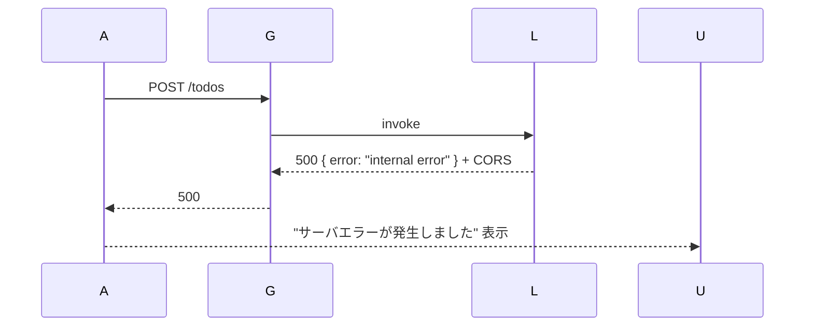
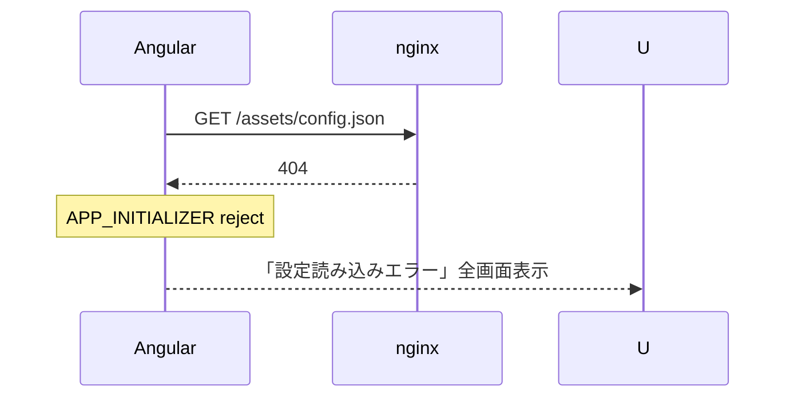
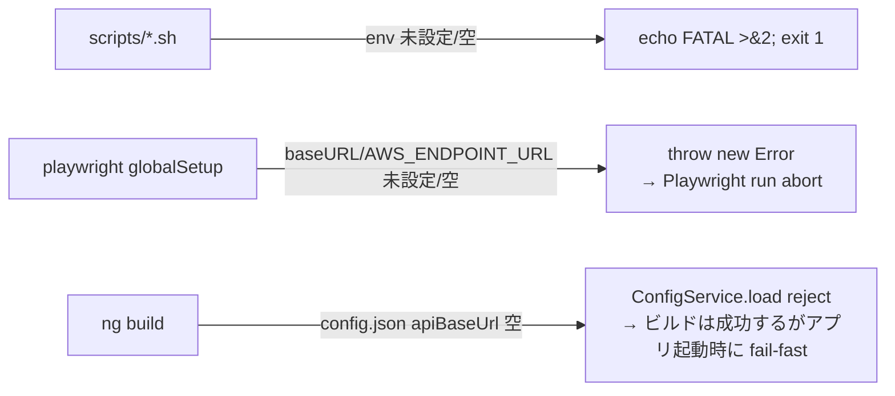
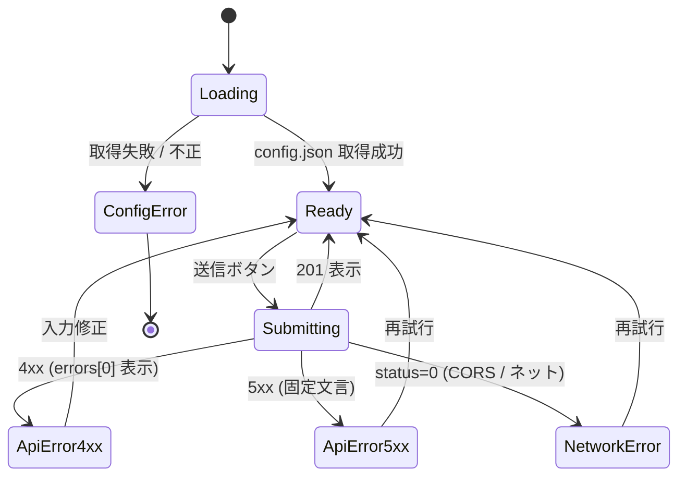

# 処理フロー設計

## 概要

| 項目       | 内容                                                  |
| ---------- | ----------------------------------------------------- |
| チケットID | FRONTEND-001                                          |
| タスク名   | floci-apigateway-csharp に Angular フロントエンド追加 |
| 作成日     | 2026-04-29                                            |

本書では「Todo 作成/取得のユーザフロー」「ローカル/CI E2E パイプライン」「エラー / 非常時フロー」を、**修正前後を対比**する形で示す。

---

## 1. ユーザフロー: Todo 作成

### 1.1 修正前シーケンス（フロントエンド無し）



### 1.2 修正後シーケンス（ブラウザ → API Gateway 直呼び）



### 1.3 変更点サマリー（ユーザフロー）

| 項目              | 修正前               | 修正後                                          | 理由                          |
| ----------------- | -------------------- | ----------------------------------------------- | ----------------------------- |
| 呼び出し主体      | CLI / .NET E2E       | ブラウザ (Angular SPA)                          | UI 層追加                     |
| 配信レイヤー      | 無し                 | nginx 静的配信 (CloudFront 相当)                | UI のホスティング             |
| CORS preflight    | 無し                 | OPTIONS /todos, /todos/{id} を発行              | クロスオリジン HTTP のため    |
| Lambda 応答ヘッダ | Content-Type のみ    | + Access-Control-Allow-Origin 等                | ブラウザ受理                  |
| invoke_url 解決   | env / .NET 設定      | runtime fetch `assets/config.json`              | CI / ローカルで動的化         |

---

## 2. ユーザフロー: Todo 取得（GET /todos/{id}）

### 2.1 修正後シーケンス



> POST 時に取得した preflight キャッシュ（`Access-Control-Max-Age: 600`）が GET にも適用されるため、UI 操作中は OPTIONS が頻発しない。

---

## 3. デプロイ / E2E パイプライン

### 3.1 修正前パイプライン



### 3.2 修正後パイプライン（フロント追加）



### 3.3 配信経路の一意性（RD-001 解消）

配信経路は **ng build → frontend/dist → (S3 sync 検証) + nginx host volume mount → ブラウザ** の **唯一経路** に固定する。S3 互換不足時の nginx 撤去 / S3 直接配信などの fallback 分岐は本タスクでは設けない。

```mermaid
flowchart LR
    NG[ng build] --> DIST[frontend/dist/]
    DIST -->|aws s3 sync (配置検証)| S3[(floci S3: frontend-bucket)]
    DIST -->|host volume mount<br/>:ro| NX[nginx :8080]
    NX -->|GET /| BR[Browser]
```

---

## 4. エラーフロー

### 4.1 CORS preflight 失敗



CI（Playwright）では `E2E-3 CORS 成立アサート` で fail-fast する（`05_test-plan.md` §2.3 参照）。

### 4.2 サーバ 5xx



### 4.3 設定ロード失敗



`apiBaseUrl` が空・スキーム不正でも同様に reject（fail-fast）。

### 4.4 必須 env 未設定（fail-fast 統一、RD-002 解消）

`AWS_ENDPOINT_URL` / `WEB_BASE_URL` / `API_BASE_URL` が未設定または空文字の場合、shell スクリプトと Playwright `globalSetup` の **両方で fail-fast** する。skip 運用は廃止する。



判定ルール:

| 経路                          | 判定                                                  | 失敗時の挙動                          |
| ----------------------------- | ----------------------------------------------------- | ------------------------------------- |
| `scripts/build-frontend.sh`   | `: "${AWS_ENDPOINT_URL:?env required}"` 等で参照      | `set -u` + `${VAR:?}` で exit 1       |
| `scripts/web-e2e.sh`          | `WEB_BASE_URL` / `AWS_ENDPOINT_URL` 必須              | exit 1                                |
| `playwright.config.ts` `globalSetup` | `if (!process.env.WEB_BASE_URL) throw new Error(...)` | Playwright run abort（skip しない）   |
| `playwright.config.ts` `use.baseURL` | `process.env.WEB_BASE_URL` を直接参照（fallback 値を持たない） | 未設定なら globalSetup で abort       |

これにより実 AWS への到達と「skip による品質ゲートのバイパス」を構造的に防ぐ（DR-001）。

---

## 5. 状態遷移（Angular UI）



---

## 6. 非同期処理 / 並列性

- Angular `HttpClient` は Observable ベース。`take(1)` または `firstValueFrom` で完了を待つ。
- Playwright のテストは `playwright.config.ts` の `workers: 1` で逐次実行（CI リソース節約 + floci 競合回避）。
- 既存 Step Functions（ValidateTodo → PersistTodo）は本タスクで変更なし。

---

## 7. 変更点サマリー（処理フロー全体）

| フェーズ           | 修正前                      | 修正後                                                              |
| ------------------ | --------------------------- | ------------------------------------------------------------------- |
| ユーザ操作         | CLI                         | Browser (Angular SPA via nginx)                                     |
| Preflight          | 無し                        | OPTIONS /todos, /todos/{id}                                         |
| 設定解決           | env / .NET 設定             | runtime `assets/config.json`                                        |
| デプロイ           | terraform apply             | + ng build + aws s3 sync + nginx 反映                               |
| E2E                | .NET xUnit (1 系統)         | .NET xUnit (既存) + Playwright (新規・並走可)                        |
| エラー UI          | 無し                        | UI 上に 4xx/5xx/CORS/設定ロード失敗を分けて表示                     |
| ロールバック       | feature ブランチ破棄        | + `frontend/`, compose/nginx, infra OPTIONS+S3, web-* ジョブ revert |
