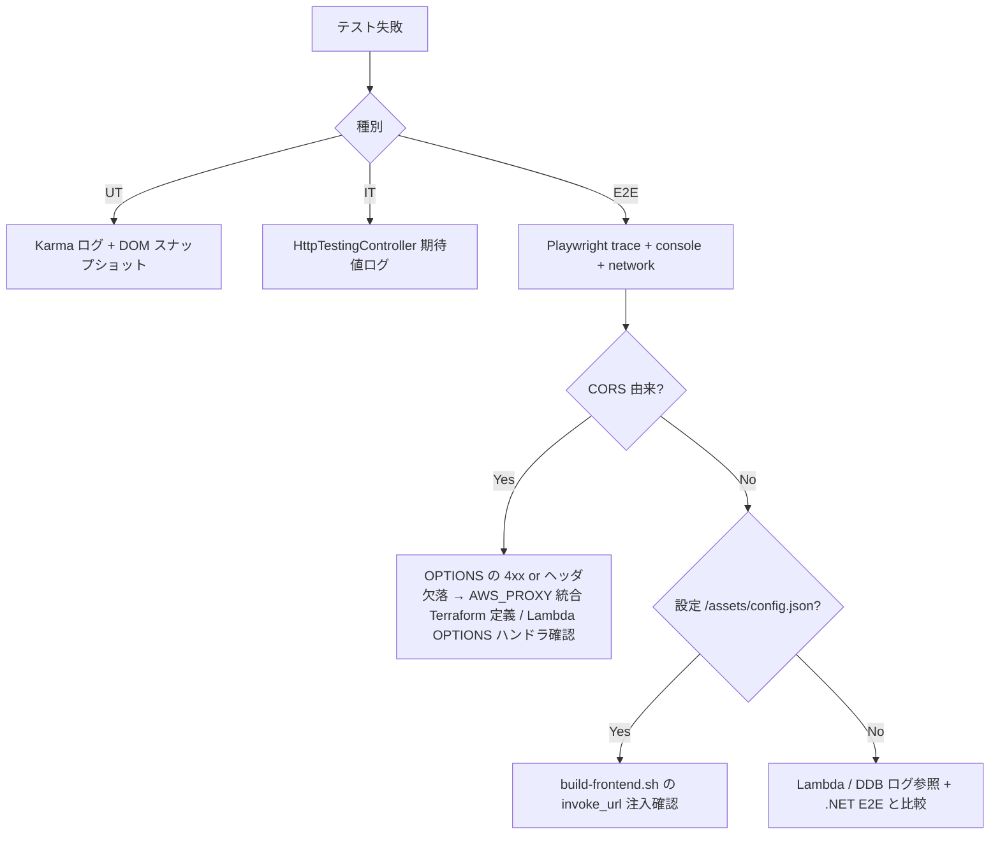

# テスト計画

## 概要

| 項目       | 内容                                                  |
| ---------- | ----------------------------------------------------- |
| チケットID | FRONTEND-001                                          |
| タスク名   | floci-apigateway-csharp に Angular フロントエンド追加 |
| 作成日     | 2026-04-29                                            |

本書は **brainstorming.test_strategy** で確定した範囲（unit / integration / e2e）を全て含み、`acceptance_criteria` と各テスト種別の対応を明示する。

> **事前決定のテスト戦略（再掲）**
> - **unit**: Karma + Jasmine。Angular component/service/pipe。HttpClient はモック。`*.spec.ts` を対象（命名規則）。
> - **integration**: Karma + Jasmine + HttpTestingController。API クライアント、設定読み込み、フォーム→API 呼び出し境界、エラー表示。`*.integration.spec.ts` を対象（命名規則）。
> - **e2e**: Playwright。floci 起動 → terraform apply → invoke_url 取得 → ng build → S3 sync → nginx 起動 → Playwright 実行。API は nginx 経由にせず floci API Gateway を直接呼び出す。

---

## 1. テスト方針

### 1.1 テストスコープ

| 範囲          | 対象                                                                                 | 除外                                                  |
| ------------- | ------------------------------------------------------------------------------------ | ----------------------------------------------------- |
| 単体テスト    | Angular component / service / pipe（HttpClient はモック）                            | Lambda / Terraform / nginx                            |
| 結合テスト    | TodoApiService × HttpTestingController、ConfigService の load、コンポーネント↔サービス境界 | フル browser、外部 floci 起動                         |
| E2Eテスト     | ブラウザ → nginx 静的配信 → API Gateway → Lambda → DDB の通し検証（CORS 含む）       | 認証、本番 AWS、性能ベンチ                            |
| 既存 .NET    | Unit/Integration/E2E（CORS ヘッダ追加に伴う期待値更新を含む）                        | 既存仕様の変更                                        |
| 既存 CI ジョブ | リグレッション確認（`web-*` 追加で既存ジョブが落ちないこと）                         | -                                                     |

### 1.2 テストランナー / レポート

| 種別        | フレームワーク                                      | 実行イメージ (CI)                              | レポート形式                                |
| ----------- | --------------------------------------------------- | ---------------------------------------------- | ------------------------------------------- |
| 単体        | Karma + Jasmine + ChromeHeadlessCI                  | `mcr.microsoft.com/playwright:v1.45.3-jammy`   | `karma-junit-reporter` → `junit.xml` + coverage |
| 結合        | Karma + Jasmine + HttpTestingController             | 同上                                           | 同上                                        |
| E2E         | Playwright (`@playwright/test` 1.45.3)              | 同上 (DinD)                                    | `reporter: [["junit",...], ["html"]]`       |
| 既存 .NET   | xUnit                                               | 既存                                           | `--logger junit` (既存維持)                 |

> **CI image を Playwright 同梱イメージに統一**（RD-003 解消）。`web-unit` / `web-integration` も `mcr.microsoft.com/playwright:v1.45.3-jammy` を使い、Chromium / 必要 OS パッケージ（fonts, libnss3 等）を追加インストール無しで利用する。`web-lint` のみ ESLint / Prettier しか使わないため `node:20.11-bullseye-slim` を使う。バージョンは `02_interface-api-design.md` §7 と一致させ、可変タグ（`latest`, `v1.45.x` 等）は使わない（RD-007）。

### 1.3 unit / integration の分離設計（RD-005 解消）

| 観点                | unit                                              | integration                                                 |
| ------------------- | ------------------------------------------------- | ----------------------------------------------------------- |
| ファイル命名        | `*.spec.ts`（例: `todo-api.service.spec.ts`）     | `*.integration.spec.ts`（例: `todo.flow.integration.spec.ts`） |
| 配置                | `frontend/src/**` の各モジュール隣接              | 同上（同一ディレクトリ、suffix で区別）                     |
| Karma config        | `frontend/karma.conf.js`                          | `frontend/karma.integration.conf.js`（`files` の glob を `*.integration.spec.ts` に絞る） |
| `tsconfig.spec.*`   | `tsconfig.spec.json`（include: `**/*.spec.ts`、`**/*.integration.spec.ts` を exclude） | `tsconfig.spec.integration.json`（include: `**/*.integration.spec.ts`） |
| `angular.json` target | `test`（karmaConfig: `karma.conf.js`、tsConfig: `tsconfig.spec.json`） | `test-integration`（karmaConfig: `karma.integration.conf.js`、tsConfig: `tsconfig.spec.integration.json`） |
| npm scripts         | `npm run test:unit` → `ng test --watch=false --browsers=ChromeHeadlessCI` | `npm run test:integration` → `ng run frontend:test-integration --watch=false --browsers=ChromeHeadlessCI` |
| HttpClient          | `HttpClientTestingModule` でモック化、ネットワーク呼び出しを許さない | `HttpTestingController` で **境界モック**（service↔HttpClient↔mock backend）を再現、コンポーネント↔サービス↔HTTP 境界を検証 |
| 依存サービス        | 全てモック / spy                                  | 実装サービスを使い、HTTP のみモック                         |

`frontend/package.json` `scripts` 例:

```json
{
  "scripts": {
    "lint": "ng lint",
    "test:unit": "ng test --watch=false --browsers=ChromeHeadlessCI",
    "test:integration": "ng run frontend:test-integration --watch=false --browsers=ChromeHeadlessCI",
    "build": "ng build --configuration=production",
    "e2e": "playwright test"
  },
  "engines": {
    "node": "^20.11.0",
    "npm": "^10.0.0"
  }
}
```

CI ジョブ `web-unit` / `web-integration` はそれぞれ上記 npm script を呼ぶ（`02_interface-api-design.md` §7 参照）。

### 1.4 カバレッジ強制（RD-008 解消）

下記閾値を `karma.conf.js` / `karma.integration.conf.js` の `coverageReporter.check.global` に設定し、未達時は Karma が **exit 1** を返して CI ジョブ (`web-unit` / `web-integration`) を fail させる。Lambda 側カバレッジは既存運用を維持し、`JsonHeaders` 変更に伴う期待値更新で破壊しない。

| 項目             | 目標値 | 備考                                                  |
| ---------------- | ------ | ----------------------------------------------------- |
| Angular 行       | 80%    | `coverageReporter.check.global.lines`                 |
| Angular statements | 80% | `coverageReporter.check.global.statements`            |
| Angular 分岐     | 70%    | `coverageReporter.check.global.branches`              |
| Angular 関数     | 90%    | `coverageReporter.check.global.functions`             |
| Lambda（既存）   | 既存維持 | -                                                    |

```javascript
coverageReporter: {
  dir: require('path').join(__dirname, './coverage/unit'),
  subdir: '.',
  reporters: [
    { type: 'html' },
    { type: 'lcovonly' },
    { type: 'text-summary' },
    { type: 'cobertura', file: 'cobertura-coverage.xml' },
  ],
  check: {
    global: {
      statements: 80,
      branches: 70,
      functions: 90,
      lines: 80,
    },
  },
},
```

### 1.5 テスト環境準備状況 (test environment readiness、RD-012 解消)

E2E / integration / unit のいずれかが要求する事前リソースを以下に一覧化する。**実 AWS には絶対に接続しない**ため、AWS は floci のローカルエンドポイント (`http://docker:4566` / `http://localhost:4566`) のみを利用する（DR-001）。

| # | リソース            | バージョン / 取得元                                       | 確認コマンド                                          | 不足時の代替                                              |
|---|---------------------|----------------------------------------------------------|-------------------------------------------------------|-----------------------------------------------------------|
| 1 | Node.js             | 20.11.x LTS（`engines.node ^20.11.0`）                    | `node -v`                                             | `nvm install 20.11` / devcontainer 再ビルド               |
| 2 | npm                 | 10.x（Node 20.11 同梱）                                   | `npm -v`                                              | Node 同梱版で十分                                          |
| 3 | Chromium            | Playwright 同梱版（v1.45.3）                              | `npx playwright install --dry-run chromium`           | `npx playwright install chromium`                          |
| 4 | Playwright browsers | 1.45.3（Chromium のみ）                                   | `ls ~/.cache/ms-playwright/`                          | `npx playwright install --with-deps chromium`              |
| 5 | Docker              | 25.0.x 以降                                                | `docker --version`                                    | devcontainer 起動 / dood 経由                              |
| 6 | Docker Compose v2   | 2.24 以降                                                  | `docker compose version`                              | `apt install docker-compose-plugin`                        |
| 7 | DinD service (CI)   | `docker:25.0.3-dind`                                      | `.gitlab-ci.yml` `services` 宣言で起動                | -                                                         |
| 8 | floci image         | `floci/floci:latest`（既存）                              | `docker pull floci/floci:latest`                      | -                                                         |
| 9 | AWS CLI             | v2 系（floci 接続用、`--endpoint-url` 指定）              | `aws --version`                                       | `apt install awscli` / Playwright image に追加インストール |
|10 | Terraform           | 1.6.6（既存）                                              | `terraform -version`                                  | tfenv で固定                                               |
|11 | .NET SDK            | 8.0.x（既存）                                              | `dotnet --version`                                    | 既存運用                                                   |

readiness チェックは `scripts/check-test-env.sh`（plan で新設）で集約し、ローカル / CI とも E2E 実行前に呼ぶ。チェック失敗時は exit 1 で fail-fast する（RD-002 と整合）。

### 1.6 README 検証対象見出し一覧（RD-010 解消）

`scripts/verify-readme-sections.sh` は `README.md` に以下の見出しが **全て存在すること** を `grep -F` で機械検証し、欠落時は exit 1 を返す。`web-lint` ステージで実行する。

| # | 見出し（`README.md` 内の文字列、完全一致） | 必須 |
|---|---------------------------------------------|------|
| 1 | `## Frontend`                               | ✅   |
| 2 | `### Frontend ローカル起動`                 | ✅   |
| 3 | `### Frontend ローカルテスト`               | ✅   |
| 4 | `### Frontend E2E テスト`                   | ✅   |
| 5 | `### Frontend CI 実行手順`                  | ✅   |
| 6 | `### Frontend 環境変数 (WEB_BASE_URL / AWS_ENDPOINT_URL / API_BASE_URL)` | ✅ |

既存セクション（`## ローカル起動`, `## テスト`, `## CI` 等）も同 script の検証対象に残し、回帰を防ぐ。


## 2. 新規テストケース

### 2.1 単体テスト（Karma + Jasmine）

| No   | テスト対象                | テスト内容                                                                          | 期待結果                                                       | 優先度 |
| ---- | ------------------------- | ----------------------------------------------------------------------------------- | -------------------------------------------------------------- | ------ |
| UT-1 | `ConfigService.load`      | `/assets/config.json` から `apiBaseUrl` を読み取り、`apiBaseUrl` を返す             | `cfg.apiBaseUrl === 'http://...'`                              | 高     |
| UT-2 | `ConfigService.load`      | `apiBaseUrl` 欠落 / 空文字 / `http(s)://` 非該当時に reject                         | Promise reject（fail-fast）                                    | 高     |
| UT-3 | `TodoApiService.create`   | `apiBaseUrl + /todos` に POST、Content-Type ヘッダ                                  | URL/メソッド/ヘッダが期待通り                                  | 高     |
| UT-4 | `TodoApiService.get`      | `apiBaseUrl + /todos/{id}` に GET                                                   | 同上                                                           | 高     |
| UT-5 | `TodoApiService` エラー整形 | 400 `{ errors: [...] }` を `ApiErrorResponse` で再 throw                            | `catchError` で整形済みオブジェクト                            | 中     |
| UT-6 | `TodoApiService` エラー整形 | 500 `{ error: "..." }` を `ApiErrorResponse` で再 throw                             | 同上                                                           | 中     |
| UT-7 | `TodoApiService` ネットワーク | `status === 0`（CORS / オフライン）を区別して再 throw                               | `UiError` 用に network 種別が判別可能                          | 中     |
| UT-8 | `TodoComponent` 表示      | 4xx 時 `errors[0]` を表示                                                            | DOM に該当文言                                                 | 中     |
| UT-9 | `TodoComponent` 表示      | 5xx 時 "サーバエラーが発生しました" を表示                                          | DOM に該当文言                                                 | 中     |
| UT-10 | `TodoComponent` 表示      | network error 時 "API に接続できませんでした" を表示                                | DOM に該当文言                                                 | 中     |

### 2.2 結合テスト（Karma + Jasmine + HttpTestingController）

| No   | テスト対象                                | テスト内容                                                                                              | 期待結果                                                                   | 優先度 |
| ---- | ----------------------------------------- | ------------------------------------------------------------------------------------------------------- | -------------------------------------------------------------------------- | ------ |
| IT-1 | `TodoComponent` ↔ `TodoApiService`        | フォーム入力 → ボタン押下で `POST /todos` が 1 回発行され、201 応答で結果が画面に出る                   | HttpTestingController で 1 リクエスト検出 + DOM 反映                       | 高     |
| IT-2 | `TodoComponent` ↔ `TodoApiService` ↔ Config | `ConfigService.load` 後に `TodoApiService` の URL に `apiBaseUrl` が反映される                          | リクエスト URL が `<apiBaseUrl>/todos`                                     | 高     |
| IT-3 | エラーパス                                | `POST /todos` を 400 `{ errors: ["title is required"] }` で flush                                       | DOM に "title is required" を表示                                          | 中     |
| IT-4 | エラーパス                                | `POST /todos` を 500 で flush                                                                           | "サーバエラーが発生しました" を表示                                        | 中     |
| IT-5 | ネットワーク                              | `POST /todos` を `error(new ProgressEvent('error'))` で flush                                           | "API に接続できませんでした" を表示                                        | 中     |
| IT-6 | ConfigService 異常                        | `/assets/config.json` を 404 で flush                                                                   | アプリ全体が「設定読み込みエラー」状態に遷移                               | 中     |

### 2.3 E2E テスト（Playwright）

| No    | テストシナリオ                       | 手順                                                                                                                                                         | 期待結果                                                                                  | 優先度 |
| ----- | ------------------------------------ | ------------------------------------------------------------------------------------------------------------------------------------------------------------ | ----------------------------------------------------------------------------------------- | ------ |
| E2E-1 | UI から Todo 作成・取得              | 1. `http://localhost:8080/` を開く<br>2. title 入力 → 送信<br>3. 表示された id を控える<br>4. 取得フォームに id 入力 → 取得                                 | 同じ title の Todo が GET 結果として表示される                                            | 高     |
| E2E-2 | nginx 静的配信 / SPA fallback        | `http://localhost:8080/foo/bar` (任意のパス) を直接開く                                                                                                      | 200 + `index.html` が返り、Angular ルータが処理                                           | 高     |
| E2E-3 | **CORS 成立アサート**                | UI から `POST /todos` を実行し、ブラウザに `console.error` が出ない / Network タブ的に preflight 204 + 本リクエスト 201                                      | preflight が 204、本リクエストが 201。Playwright の `page.on('console', ...)` でエラー無 | 高     |
| E2E-4 | 4xx エラー UI 表示                   | title を空で送信                                                                                                                                             | UI にエラー文言（API の `errors[0]`）が表示される                                          | 中     |
| E2E-5 | 5xx エラー UI 表示                   | **(RP2-006)** Playwright の `page.route('**/todos**', route => route.fulfill({ status: 500, contentType: 'application/json', headers: { 'Access-Control-Allow-Origin': '*' }, body: '{"error":"internal error"}' }))` で対象 API レスポンスを 500 にフェイクする方式に統一する。`docker compose stop floci-lambda` 等のコンテナ停止方式は **却下**（floci 全体に影響して他テストを壊す / 復旧手順が flaky / E2E-3 の preflight アサートと競合 / DinD 上で stop が反映されない可能性）。停止方式が残っていないことを `grep -RIn 'docker compose stop' frontend/e2e/` が空であることで担保する | UI に "サーバエラーが発生しました" 表示。**skip は禁止**、`page.route` 設定が反映されない場合は exit 1 で fail-fast（RD-002 / RP-007 / RP2-006） | 中     |
| E2E-6 | 実 AWS 接続防止                      | `AWS_ENDPOINT_URL` 未設定で `scripts/web-e2e.sh` を実行                                                                                                      | shell が即座に **exit 1** を返し（RD-002 の必須 env チェック）、Playwright が起動しないこと。skip / 例外握りつぶし禁止 | 高     |

#### E2E 実行手順（ローカル / CI 共通）

> **(RP2-007 / RP3-001) 唯一の正規手順**: ローカルでも CI でも、外部から直接呼ぶのは下記 **3 行のみ**。
> `wait-floci-healthy.sh` / `deploy-local.sh` / `apply-api-deployment.sh` / `warmup-lambdas.sh` / `build-frontend.sh` / `deploy-frontend.sh` を **本ブロックから直接呼ばないこと**（`scripts/web-e2e.sh` の内部処理として唯一エントリポイント化済み）。

```bash
docker compose -f compose/docker-compose.yml up -d floci nginx
bash scripts/web-e2e.sh
docker compose -f compose/docker-compose.yml down -v
```

##### web-e2e.sh の内部処理（参考・直接呼ぶことは禁止）

`scripts/web-e2e.sh` は内部で以下の順序を実行する。順序保証はスクリプト側に集約され、外部から個別呼び出しすることは **設計上禁止**（二重実行・解釈分岐の原因となるため / RP2-002 / RP3-001）。

| 順序 | 内部呼び出し                       | 目的                                                                                              |
| ---- | ---------------------------------- | ------------------------------------------------------------------------------------------------- |
| 1    | `scripts/check-test-env.sh e2e`    | readiness fail-fast。**`SKIP_ENV_CHECK=1` が設定されている場合はスキップ**（CI 二重チェック回避） |
| 2    | `scripts/wait-floci-healthy.sh`    | floci ヘルスチェック（既存パターン踏襲、RP-011）                                                  |
| 3    | `scripts/deploy-local.sh`          | Lambda パッケージ + Terraform apply（OPTIONS + S3 含む）                                          |
| 4    | `scripts/apply-api-deployment.sh`  | API Gateway デプロイメント反映で invoke_url 確定（RP-008）                                        |
| 5    | `scripts/warmup-lambdas.sh`        | 初回コールドスタート flaky 排除（RP-008）                                                         |
| 6    | `scripts/build-frontend.sh`        | invoke_url を `assets/config.json` に注入 + Angular ビルド                                        |
| 7    | `scripts/deploy-frontend.sh`       | floci S3 へ成果物配置（配置経路検証専用、ブラウザ配信は nginx host volume mount が唯一標準経路）  |
| 8    | `cd frontend && npx playwright test --reporter=junit,html` | Playwright 実行                                                                                   |

> **CI 環境での check-test-env 二重実行回避方針 (RP3-002)**: CI では `before_script` で `bash scripts/check-test-env.sh e2e` を実行し、`script:` 内で `SKIP_ENV_CHECK=1` を export することで `web-e2e.sh` 内部の同チェックを 1 回にまとめる。ローカル実行ではデフォルト未設定のままとし、`web-e2e.sh` 自身が readiness 担保する。

#### Playwright 設定要点 (`frontend/playwright.config.ts`)

```typescript
// requireEnv: 必須 env が未設定/空なら即 throw。fallback 値は持たない（RD-002 / RD2-003）
function requireEnv(name: string): string {
  const v = process.env[name];
  if (!v) throw new Error(`FATAL: required env ${name} is not set`);
  return v;
}

export default defineConfig({
  testDir: './e2e',
  workers: 1,                       // floci 競合回避
  use: {
    baseURL: requireEnv('WEB_BASE_URL'),
    trace: 'retain-on-failure',
  },
  projects: [{ name: 'chromium', use: { ...devices['Desktop Chrome'] } }],
  reporter: [['junit', { outputFile: 'test-results/junit.xml' }], ['html']],
});
```

#### 判定基準

- 全 E2E ケースが pass、`junit.xml` が生成されること
- ブラウザの Console に CORS 由来のエラーが**出ない**こと（E2E-3）
- レポート HTML がアーティファクトとして保管されること

---

## 3. 既存テスト修正

| ファイル / 対象                                          | 修正内容                                                       | 理由                                                  |
| -------------------------------------------------------- | -------------------------------------------------------------- | ----------------------------------------------------- |
| `tests/TodoApi.UnitTests/ApiHandlerRoutingTests.cs` 等   | レスポンスヘッダ期待値に `Access-Control-Allow-Origin: *` 等を追加 | `JsonHeaders` 拡張に伴うリグレッション防止           |
| `tests/TodoApi.IntegrationTests/*`                       | OPTIONS 経路の最低 1 ケース追加（`OPTIONS /todos` → 204 + CORS） | API Gateway OPTIONS の追加検証                        |
| `tests/TodoApi.E2ETests/*`                               | 既存ケースは無修正で pass を確認（CORS ヘッダ付与は後方互換）   | フロント追加でも .NET E2E が壊れないことを保証        |
| `scripts/verify-readme-sections.sh`                      | 検証対象見出しを §1.6 の表（Frontend 6 項目）に拡張し、欠落時 exit 1（RD-010） | README 整合性                                         |
| `.gitlab-ci.yml`                                         | `web-lint / web-unit / web-integration / web-e2e` 追加         | CI でフロントテストを実行                             |

---

## 4. テストデータ設計

| データ                | 値                                                                                       | 用途                                |
| --------------------- | ---------------------------------------------------------------------------------------- | ----------------------------------- |
| 正常 title            | `"buy milk"`                                                                              | UT/IT/E2E の正常系                   |
| バリデーション NG     | `""`（空文字）                                                                            | UT/IT/E2E の 400 系                  |
| 長すぎ title          | `"a".repeat(10000)`                                                                       | （任意）バリデーション境界           |
| 既存 fixture invoke_url | `terraform output -raw invoke_url`                                                       | E2E、CI                              |
| `WEB_BASE_URL` env    | local: `http://localhost:8080` / CI: `http://docker:8080`                                | Playwright `baseURL`                 |

---

## 5. acceptance_criteria 対応表

| acceptance_criteria                                                                                                                                                          | 検証する種別 | 対応テスト ID                                                  |
| ---------------------------------------------------------------------------------------------------------------------------------------------------------------------------- | ------------ | -------------------------------------------------------------- |
| ローカルで Angular フロントエンドを起動し、floci 上の API を叩いて Todo を作成・取得できること                                                                               | E2E          | E2E-1, E2E-3                                                   |
| ローカルで S3 + CloudFront 相当の配信構成を起動し、フロントエンド経由の Todo 作成・取得ができること                                                                          | E2E          | E2E-1, E2E-2 (nginx 静的配信), E2E-3                          |
| Angular の単体テスト（component/service）がローカルと CI で実行され、全て通過すること                                                                                        | 単体         | UT-1〜UT-10（CI: `web-unit`）                                  |
| Angular の結合テスト（HttpClient/API 接続境界など）がローカルと CI で実行され、全て通過すること                                                                              | 結合         | IT-1〜IT-6（CI: `web-integration`）                            |
| Playwright E2E が floci + terraform apply 済み API と S3 + CloudFront 相当フロントエンドに対してローカルと CI で実行され、全て通過すること                                  | E2E          | E2E-1〜E2E-6（CI: `web-e2e`）                                  |
| 既存 .NET 側の lint/unit/integration/e2e ジョブが引き続き成功すること                                                                                                        | 既存         | 既存 .NET CI ジョブ + `06_side-effect-verification.md` の回帰確認 |
| README または同等のドキュメントにローカル起動、テスト、CI 実行方法が記載されていること                                                                                       | ドキュメント | `scripts/verify-readme-sections.sh` 拡張で機械検証              |

---

## 6. テスト実行戦略

| 環境              | 実行コマンド                                                    | 想定所要時間   |
| ----------------- | --------------------------------------------------------------- | -------------- |
| ローカル単体      | `cd frontend && npm test`                                       | < 1 分          |
| ローカル結合      | `cd frontend && npm run test:integration`                       | < 1 分          |
| ローカル E2E      | `scripts/web-e2e.sh`                                            | 5–10 分        |
| CI `web-lint`     | `cd frontend && npm ci && npm run lint`                         | < 2 分          |
| CI `web-unit`     | `cd frontend && npm ci && npm test -- --watch=false ...`        | 2–4 分          |
| CI `web-integration` | 同上の integration spec                                       | 2–4 分          |
| CI `web-e2e`      | floci up → tf apply → ng build → s3 sync → playwright           | 8–15 分         |

> R4 軽減として npm / Playwright / docker layer をキャッシュ（`02_interface-api-design.md` §7 参照）。

---

## 7. 失敗時の切り分けフロー


